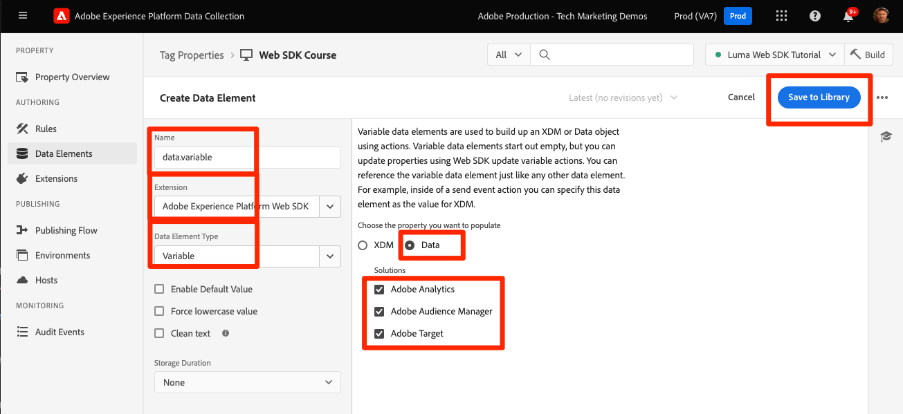

# Création d’éléments de données

Découvrez comment créer des éléments de données dans les balises pour les données de contenu, de commerce et d’identité sur le [Site de démonstration Luma](https://luma.enablementadobe.com/content/luma/us/en.html). Renseignez ensuite les champs de votre schéma XDM avec le type d’élément de données Variable de l’extension SDK Web Adobe Experience Platform .

## Objectifs d&#39;apprentissage

À la fin de cette leçon, vous pouvez :

* Présentation des différentes approches pour mapper une couche de données à XDM
* Création d’éléments de données pour la capture de données
* Mise en correspondance des éléments de données avec un objet XDM


## Conditions préalables

Vous connaissez la couche de données et avez terminé les leçons précédentes du tutoriel :

* [Configurer un schéma XDM](configure-schemas.md)
* [Configuration d’un espace de noms d’identité](configure-identities.md)
* [Configurer un trains de données](configure-datastream.md)
* [Extension SDK Web installée dans la propriété de balise](install-web-sdk.md)


>[!IMPORTANT]
>
>Les données de cette leçon proviennent de la `[!UICONTROL digitalData]` couche de données sur le site Luma. Pour afficher la couche de données, ouvrez votre console de développement et saisissez `[!UICONTROL digitalData]` pour afficher la couche de données complète disponible.


## Méthodes de couche de données

Il existe plusieurs façons de mapper les données de votre couche de données à XDM à l’aide de la fonctionnalité de balises de Adobe Experience Platform. Vous trouverez ci-dessous quelques avantages et inconvénients de trois approches différentes. Si vous le souhaitez, vous pouvez combiner plusieurs approches :

1. Mise en oeuvre de XDM dans la couche de données
1. Mappage à XDM dans les balises
1. Mappage à XDM dans le flux de données

>[!NOTE]
>
>Les exemples de ce tutoriel suivent l’approche Associer à XDM dans les balises .


### Mise en oeuvre de XDM dans la couche de données

Cette approche implique l’utilisation de l’objet XDM entièrement défini comme structure pour votre couche de données. Ensuite, vous mappez l’ensemble de la couche de données à un élément de données d’objet XDM dans des balises. Si votre implémentation n’utilise pas de gestionnaire de balises, cette approche peut s’avérer idéale, car vous pouvez envoyer des données à XDM directement à partir de votre application à l’aide de la méthode [Commande XDM sendEvent](https://experienceleague.adobe.com/en/docs/experience-platform/edge/fundamentals/tracking-events#sending-xdm-data). Si vous utilisez des balises, vous pouvez créer un élément de données de code personnalisé qui capture l’ensemble de la couche de données en tant qu’objet JSON de transfert vers XDM. Ensuite, vous mappez le JSON de transfert au champ d’objet XDM dans l’action Envoyer l’événement.

Vous trouverez ci-dessous un exemple de l’apparence de la couche de données à l’aide du format de couche de données client Adobe :

+++XDM dans l’exemple de couche de données

```JSON
window.adobeDataLayer.push({
"eventType": "web.webPageDetails.pageViews",
"web":{
         "webInteraction":{
            "linkClicks":{
               "id":"",
               "value":""
            },
            "URL":"",
            "name":"",
            "region":"",
            "type":""
         },
         "webPageDetails":{
            "pageViews":{
               "id":"",
               "value":"1"
            },
            "URL":"https://luma.enablementadobe.com/",
            "isErrorPage":"",
            "isHomePage":"",
            "name":"luma:home",
            "server":"enablementadobe.com",
            "siteSection":"home",
            "viewName":""
         },
         "webReferrer":{
            "URL":"",
            "type":""
         }
      }
});
```

+++

Avantages

* Élimine les étapes supplémentaires de remap des variables de couche de données vers XDM
* Le déploiement peut être plus rapide si votre équipe de développement web possède également le comportement numérique de balisage

Inconvénients

* Dépendance totale envers l’équipe de développement et le cycle de développement pour la mise à jour des données vers XDM
* Flexibilité limitée car XDM reçoit la charge utile exacte de la couche de données
* Impossible d’utiliser les fonctionnalités de balises intégrées, telles que la mise au rebut, la persistance, pour les déploiements rapides.
* Plus difficile d’utiliser la couche de données pour les pixels tiers (mais vous souhaiterez peut-être déplacer ces pixels vers [transfert d’événement](setup-event-forwarding.md)!
* Impossible de transformer les données entre la couche de données et XDM

### Mappage de la couche de données dans les balises

Cette approche implique le mappage de variables de couche de données individuelles OU d’objets de couche de données à des éléments de données dans des balises et éventuellement à XDM. Il s’agit de l’approche traditionnelle de l’implémentation à l’aide d’un système de gestion des balises.

#### Avantages

* L’approche la plus flexible qui soit, car vous pouvez contrôler des variables individuelles et transformer des données avant qu’elles ne soient transférées vers XDM.
* Peut utiliser les déclencheurs de balises d’Adobe et la fonctionnalité de mise à l’échelle pour transmettre des données à XDM
* Peut mapper des éléments de données à des pixels tiers côté client

#### Inconvénients

* La reconstruction de la couche de données en tant qu’éléments de données prend du temps.


>[!TIP]
>
> Couche de données Google
> 
> Si votre entreprise utilise déjà des Google Analytics et dispose de l’objet DataLayer Google traditionnel sur votre site web, vous pouvez utiliser la variable [Extension de la couche de données Google](https://experienceleague.adobe.com/en/docs/experience-platform/tags/extensions/client/google-data-layer/overview) dans les balises . Cela vous permet de déployer la technologie Adobe plus rapidement sans avoir à demander l’assistance de votre équipe informatique. Le mappage de la couche de données Google à XDM suit les mêmes étapes que ci-dessus.

### Mappage à XDM dans le flux de données

Cette approche utilise une fonctionnalité intégrée à la configuration de flux de données appelée [Préparation de données pour la collecte de données](https://experienceleague.adobe.com/en/docs/experience-platform/datastreams/data-prep) et ignore le mappage des variables de couche de données sur XDM dans les balises .

#### Avantages

* Flexibilité, car vous pouvez mapper des variables individuelles à XDM
* Capacité à [calculer les nouvelles valeurs](https://experienceleague.adobe.com/en/docs/experience-platform/data-prep/functions) ou [transformation des types de données](https://experienceleague.adobe.com/en/docs/experience-platform/data-prep/data-handling) d’une couche de données avant de passer à XDM ;
* Exploitation d’un [Interface utilisateur du mappage](https://experienceleague.adobe.com/en/docs/experience-platform/datastreams/data-prep#create-mapping) pour mapper des champs de vos données source à XDM avec une interface utilisateur pointer-cliquer

#### Inconvénients

* Impossible d’utiliser des variables de couche de données comme éléments de données pour les pixels tiers côté client, mais peut les utiliser avec le transfert d’événement
* Impossible d’utiliser la fonctionnalité de mise à l’échelle des balises de Adobe Experience Platform
* La complexité de la maintenance augmente lors du mappage de la couche de données dans les balises et dans le flux de données.


>[!IMPORTANT]
>
>Comme nous l’avons vu plus haut, les exemples de ce tutoriel suivent l’approche Associer à XDM dans les balises .

## Créer des éléments de données pour capturer la couche de données

Avant de créer l’objet XDM, créez l’ensemble suivant d’éléments de données pour le [Site de démonstration Luma](https://luma.enablementadobe.com/content/luma/us/en.html){target="_blank"} couche de données :

1. Accédez à **[!UICONTROL Éléments de données]** et sélectionnez **[!UICONTROL Ajouter un élément de données]** (ou **[!UICONTROL Créer un élément de données]** s’il n’existe aucun élément de données existant dans la propriété de balise)

   

1. Nommez l’élément de données `page.pageInfo.pageName`.
1. Utilisez la variable **[!UICONTROL Variable JavaScript]** **[!UICONTROL Type d’élément de données]** pour pointer vers une valeur dans la couche de données de Luma : `digitalData.page.pageInfo.pageName`

1. Cochez les cases correspondant à **[!UICONTROL Forcer la valeur en minuscules]** et **[!UICONTROL Texte clair]** pour normaliser la casse et supprimer les espaces superflus

1. Laisser `None` comme la propriété **[!UICONTROL Durée de stockage]** car cette valeur est différente sur chaque page

1. Sélectionner **[!UICONTROL Enregistrer]**

   

Créez ces éléments de données supplémentaires en procédant comme suit :

* **`page.pageInfo.server`**  mappé à
  `digitalData.page.pageInfo.server`

* **`page.pageInfo.hierarchie1`**  mappé à
  `digitalData.page.pageInfo.hierarchie1`

* **`user.profile.attributes.username`**  mappé à
  `digitalData.user.0.profile.0.attributes.username`

* **`user.profile.attributes.loggedIn`** mappé à
  `digitalData.user.0.profile.0.attributes.loggedIn`

* **`product.productInfo.sku`** mappé à `digitalData.product.0.productInfo.sku`
<!--digitalData.product.0.productInfo.sku
    ```javascript
    var cart = digitalData.product;
    var cartItem;
    cart.forEach(function(item){
    cartItem = item.productInfo.sku;
    });
    return cartItem;
    ```
    -->
* **`product.productInfo.title`** mappé à `digitalData.product.0.productInfo.title`
* **`cart.orderId`** mappé à `digitalData.cart.orderId`
<!--
    ```javascript
    var cart = digitalData.product;
    var cartItem;
    cart.forEach(function(item){
    cartItem = item.productInfo.title;
    });
    return cartItem;
    ```
    -->
* **`product.category`** en utilisant la variable **[!UICONTROL Code personnalisé]** **[!UICONTROL Type d’élément de données]** et le code personnalisé suivant pour analyser l’URL du site pour la catégorie de niveau supérieur :

  ```javascript
  var cat = location.pathname.split(/[/.]+/);
  if (cat[5] == 'products') {
     return (cat[6]);
  } else if (cat[5] != 'html') { 
     return (cat[5]);
  }
  ```

* **`cart.productInfo`** à l’aide du code personnalisé suivant :

  ```javascript
  var cart = digitalData.cart.cartEntries; 
  var cartItem = [];
  cart.forEach(function(item, index, array){
  cartItem.push({
  "SKU": item.sku
  });
  });
  return cartItem; 
  ```

* **`cart.productInfo.purchase`** à l’aide du code personnalisé suivant :

  ```javascript
  var cart = digitalData.cart.cartEntries; 
  var cartItem = [];
  cart.forEach(function(item, index, array){
  var qty = parseInt(item.qty);
  var price = parseInt(item.price);
  cartItem.push({
  "SKU": item.sku,
  "quantity": qty,
  "priceTotal": price
  });
  });
  return cartItem; 
  ```


>[!CAUTION]
>
>La variable [!UICONTROL Variable JavaScript] Le type d’élément de données traite les références aux tableaux comme des points plutôt que des crochets. Par conséquent, le fait de référencer l’élément de données username comme `digitalData.user[0].profile[0].attributes.username` **ne fonctionnera pas**.

## Création d’éléments de données de variable pour XDM et les objets de données

Les éléments de données que vous venez de créer seront utilisés pour créer un objet XDM (pour les applications Platform) et un objet de données (pour Analytics, Target et Audience Manager). Ces objets possèdent leurs propres éléments de données spéciaux appelés **[!UICONTROL Variable]** éléments de données qui sont très faciles à créer.

Pour créer l’élément de données Variable pour XDM, vous l’associez au schéma que vous avez créé dans la variable [Configuration d’un schéma](configure-schemas.md) leçon :

1. Sélectionner **[!UICONTROL Ajouter un élément de données]**
1. Nommer votre élément de données `xdm.variable.content`. Il est recommandé d’ajouter le préfixe &quot;xdm&quot; aux éléments de données spécifiques à XDM pour mieux organiser la propriété de balise.
1. Sélectionnez la variable **[!UICONTROL SDK Web Adobe Experience Platform]** comme la propriété **[!UICONTROL Extension]**
1. Sélectionnez la variable **[!UICONTROL Variable]** comme la propriété **[!UICONTROL Type d’élément de données]**
1. Sélectionner **[!UICONTROL XDM]** comme la propriété **[!UICONTROL property]**
1. Sélectionnez la variable **[!UICONTROL Sandbox]** dans lequel vous avez créé le schéma
1. Sélectionnez les **[!UICONTROL Schéma]**, dans ce cas `Luma Web Event Data`
1. Sélectionner **[!UICONTROL Enregistrer]**

   

Créez ensuite l’élément de données Variable pour votre objet de données :

1. Sélectionner **[!UICONTROL Ajouter un élément de données]**
1. Nommer votre élément de données `data.variable`. Il est recommandé d’ajouter le préfixe &quot;data&quot; aux éléments de données spécifiques à l’objet de données pour mieux organiser la propriété de balise.
1. Sélectionnez la variable **[!UICONTROL SDK Web Adobe Experience Platform]** comme la propriété **[!UICONTROL Extension]**
1. Sélectionnez la variable **[!UICONTROL Variable]** comme la propriété **[!UICONTROL Type d’élément de données]**
1. Sélectionner **[!UICONTROL data]** comme la propriété **[!UICONTROL property]**
1. Sélectionnez les solutions Experience Cloud que vous souhaitez mettre en oeuvre dans le cadre de ce tutoriel.
1. Sélectionner **[!UICONTROL Enregistrer]**

   


A la fin de ces étapes, les éléments de données suivants doivent être créés :

| Éléments de données de l’extension Core | Éléments de données d’extension du SDK Web Platform |
-----------------------------|-------------------------------
| `cart.orderId` | `data.variable` |
| `cart.productInfo` | `xdm.variable.content` |
| `cart.productInfo.purchase` | |
| `page.pageInfo.hierarchie1` | |
| `page.pageInfo.pageName` | |
| `page.pageInfo.server` | |
| `product.category` | |
| `product.productInfo.sku` | |
| `product.productInfo.title` | |
| `user.profile.attributes.loggedIn` | |
| `user.profile.attributes.username` | |

>[!TIP]
>
>Dans le futur [Création de règles de balise](create-tag-rule.md) leçon, vous découvrez comment la fonction **[!UICONTROL Variable]** les éléments de données vous permettent d’empiler plusieurs règles dans des balises à l’aide de la variable **[!UICONTROL Type d’action de mise à jour de variable]**.

Une fois ces éléments de données en place, vous êtes prêt à commencer à envoyer des données à l’Edge Network Platform avec une règle de balises. Mais découvrez tout d’abord comment collecter des identités avec le SDK Web.

[Suivant : ](create-identities.md)

>[!NOTE]
>
>Merci d’avoir consacré du temps à l’apprentissage du SDK Web Adobe Experience Platform. Si vous avez des questions, souhaitez partager des commentaires généraux ou avez des suggestions sur le contenu futur, partagez-les à ce sujet. [Article de discussion de la communauté Experience League](https://experienceleaguecommunities.adobe.com/t5/adobe-experience-platform-data/tutorial-discussion-implement-adobe-experience-cloud-with-web/td-p/444996)
