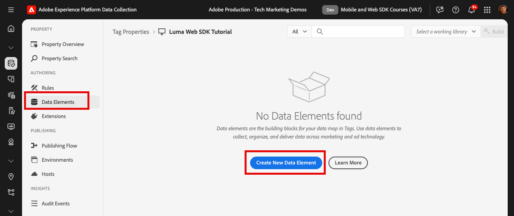
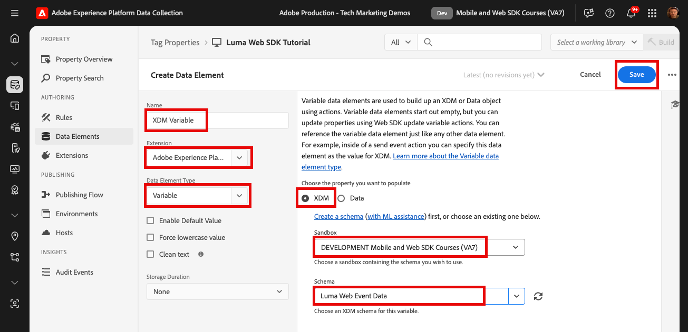

# Création d’éléments de données

Découvrez comment créer des éléments de données dans les balises pour les données de contenu, de commerce et d’identité sur le [site web de démonstration Luma](https://luma.enablementadobe.com). Renseignez ensuite les champs de votre schéma XDM.


## Objectifs d’apprentissage

À la fin de cette leçon, vous êtes capable de :

* Comprendre les différentes approches pour mapper une couche de données à XDM
* Créer des éléments de données pour capturer des données
* Mappage d’éléments de données à un objet XDM


## Conditions préalables

Vous comprenez ce qu’est une couche de données et avez suivi les leçons précédentes du tutoriel :

* [Configuration d’un schéma XDM](configure-schemas.md)
* [Configuration d’un espace de noms d’identité](configure-identities.md)
* [Configurer un trains de données](configure-datastream.md)
* [Extension Web SDK installée dans la propriété de balise](install-web-sdk.md)


>[!IMPORTANT]
>
>Les données de cette leçon proviennent de la couche de données `[!UICONTROL adobeDataLayer]` du site [Luma](https://luma.enablementadobe.com). Pour afficher la couche de données, ouvrez votre Developer Console et saisissez `[!UICONTROL adobeDataLayer]` pour afficher la couche de données complète disponible.


## Approches des couches de données

Il existe plusieurs façons de mapper les données de la couche de données à XDM à l’aide de la fonctionnalité de balises de Adobe Experience Platform. Vous trouverez ci-dessous quelques avantages et inconvénients de trois approches différentes. Il est possible de combiner les approches, si désiré :

1. Implémentation de XDM dans la couche de données
1. Mapper à XDM dans les balises
1. Mapper à XDM dans le flux de données

>[!NOTE]
>
>Les exemples de ce tutoriel suivent l’approche Mapper à XDM dans les balises .


### Implémentation de XDM dans la couche de données

Dans cette approche, les développeurs web implémentent un objet XDM entièrement défini comme structure de la couche de données. Il vous suffit ensuite de mapper l’intégralité de la couche de données à un objet XDM dans les balises. Si votre implémentation n’utilise pas de gestionnaire de balises, cette approche peut être idéale, car vous pouvez envoyer des données à XDM directement à partir de votre application à l’aide de la commande [XDM sendEvent](https://experienceleague.adobe.com/en/docs/experience-platform/edge/fundamentals/tracking-events#sending-xdm-data). Si vous utilisez des balises, vous pouvez créer un élément de données de code personnalisé capturant l’intégralité de la couche de données en tant qu’objet JSON de transmission au XDM. Ensuite, vous mappez le JSON de transmission au champ d’objet XDM dans l’action Envoyer l’événement.

Vous trouverez ci-dessous un exemple d’utilisation de la couche de données client au format Adobe :

+++Exemple de XDM dans la couche de données

```JSON
window.adobeDataLayer.push({
"eventType": "web.webPageDetails.pageViews",
"web":{
         "webInteraction":{
            "linkClicks":{
               "id":"",
               "value":""
            },
            "URL":"",
            "name":"",
            "region":"",
            "type":""
         },
         "webPageDetails":{
            "pageViews":{
               "id":"",
               "value":"1"
            },
            "URL":"https://luma.enablementadobe.com/",
            "isErrorPage":"",
            "isHomePage":"",
            "name":"luma:home",
            "server":"enablementadobe.com",
            "siteSection":"home",
            "viewName":""
         },
         "webReferrer":{
            "URL":"",
            "type":""
         }
      }
});
```

+++

Avantages

* Élimine les étapes supplémentaires à remapper aux variables de couche de données vers XDM
* Le déploiement peut être plus rapide si votre équipe de développement web possède également le balisage du comportement numérique

Inconvénients

* Dépendance complète de l’équipe de développement et du cycle de développement pour la mise à jour des données envoyées à XDM
* Flexibilité limitée, car XDM reçoit la payload exacte de la couche de données
* Impossible d’utiliser les fonctionnalités de balises intégrées, telles que le grattage, la persistance et les fonctionnalités pour les déploiements rapides
* Plus difficile d’utiliser la couche de données pour les pixels tiers (mais vous pouvez souhaiter déplacer ces pixels vers [transfert d’événement](setup-event-forwarding.md))
* Impossible de transformer les données entre la couche de données et XDM

### Mapper à XDM dans les balises

Cette approche implique de mapper des variables de couche de données individuelles à des éléments de données dans les balises et finalement à XDM. Il s’agit de l’approche traditionnelle de mise en œuvre utilisant un système de gestion des balises.

#### Avantages

* L’approche la plus flexible consiste à contrôler des variables individuelles et à transformer des données avant qu’elles ne soient transmises à XDM
* Peut utiliser les déclencheurs de balises Adobe et la fonctionnalité de grattage pour transmettre des données à XDM
* Peut mapper des éléments de données à des pixels tiers côté client

#### Inconvénients

* Reconstruction de la couche de données en tant qu’éléments de données de balises prend du temps


>[!IMPORTANT]
>
>Comme indiqué précédemment, les exemples de ce tutoriel suivent l’approche Mapper à XDM dans les balises .

### Mapper à XDM dans le flux de données

Cette approche utilise la fonctionnalité intégrée à la configuration du flux de données appelée [Préparation des données pour la collecte de données](https://experienceleague.adobe.com/en/docs/experience-platform/datastreams/data-prep) et ignore le mappage des variables de couche de données à XDM dans les balises.

#### Avantages

* Mappage flexible de variables individuelles à XDM dans une interface utilisateur pointer-cliquer
* Possibilité de [calculer de nouvelles valeurs](https://experienceleague.adobe.com/en/docs/experience-platform/data-prep/functions) ou [transformer des types de données](https://experienceleague.adobe.com/en/docs/experience-platform/data-prep/data-handling) à partir d’une couche de données avant son transfert vers XDM

#### Inconvénients

* Impossible d’utiliser des variables de couche de données comme éléments de données pour les pixels tiers côté client, mais peut les utiliser avec le transfert d’événement
* Impossible d’utiliser la fonctionnalité de nettoyage dans les balises
* La complexité de maintenance augmente si la couche de données est mappée à la fois dans les balises et dans le flux de données


>[!TIP]
>
> Couche de données Google
> 
> Si votre organisation utilise déjà Google Analytics et dispose de l’objet DataLayer Google traditionnel sur votre site web, vous pouvez utiliser l’extension [Google Data Layer](https://experienceleague.adobe.com/en/docs/experience-platform/tags/extensions/client/google-data-layer/overview) dans les balises. Vous pouvez ainsi déployer la technologie Adobe plus rapidement sans avoir à demander l’assistance de votre équipe informatique. Le mappage de la couche de données Google à XDM suit les mêmes étapes que ci-dessus.


## Créer des éléments de données pour capturer la couche de données

Avant de renseigner les champs XDM, capturez d’abord les points de données dont vous avez besoin en tant qu’éléments de données de balises :

1. Accédez à **[!UICONTROL Éléments de données]** et sélectionnez **[!UICONTROL Ajouter un élément de données]** (ou **[!UICONTROL Créer un nouvel élément de données]** si la propriété de balise ne contient aucun élément de données existant)

   

1. Nommez l’élément de données `Page Name`.
1. Utilisez la variable **[!UICONTROL JavaScript]** **[!UICONTROL type d’élément de données]** pour pointer vers la valeur dans la couche de données de Luma : `adobeDataLayer.0.page.name`

1. Cochez les cases **[!UICONTROL Forcer les minuscules]** et **[!UICONTROL Nettoyer le texte]** pour uniformiser la casse et supprimer les espaces superflus

1. Laissez `None` comme paramètre **[!UICONTROL Durée de stockage]**, car cette valeur est différente sur chaque page

1. Sélectionnez **[!UICONTROL Enregistrer]**

   

Créez ces éléments de données supplémentaires en suivant les mêmes étapes :

* **`User Id`** mappé à
  `adobeDataLayer.0.user.id`

* **`User Logged In`** mappé à
  `adobeDataLayer.0.user.loggedIn`

* **`Ecommerce Product Id`** mappé à `adobeDataLayer.0.ecommerce.detail.products.0.id`
* **`Ecommerce Product Name`** mappé à `adobeDataLayer.0.ecommerce.detail.products.0.name`
* **`Ecommerce Purchase Id`** mappé à `adobeDataLayer.0.ecommerce.purchase.actionField.id`
* **`Ecommerce Product Category`** à l’aide du **[!UICONTROL Code personnalisé]** **[!UICONTROL Type d’élément de données]** et du code personnalisé suivant :

  ```javascript
  return adobeDataLayer[0].ecommerce.detail.products[0].category+":"+adobeDataLayer[0].ecommerce.detail.products[0].subcategory;
  ```

* **`Ecommerce Cart Products`** à l’aide du code personnalisé suivant :

  ```javascript
  const cartProducts = adobeDataLayer
  .flatMap(evt => Array.isArray(evt?.ecommerce?.cart?.items) ? evt.ecommerce.cart.items : [])
  .filter(item => item && item.id && item.name && item.brand)
  .map(({ id, name, brand }) => ({ id, name, brand }));
  
  return cartProducts;
  ```

* **`Ecommerce Purchase Products`** à l’aide du code personnalisé suivant :

  ```javascript
  const purchaseEvent = adobeDataLayer.find(e => e.event === "purchase");
  
  const currencyCode = purchaseEvent?.ecommerce?.currencyCode ?? "USD";
  
  const purchasedProducts = (purchaseEvent?.ecommerce?.purchase?.products || []).map(p => {
     const unitPrice = parseFloat(String(p.price).replace(/[^0-9.-]/g, "")) || 0;
     const qty = Number(p.quantity) || 0;
  
     return {
     SKU: p.id,                       // id -> SKU
     name: p.name,                    // name -> name
     quantity: qty,                   // quantity -> quantity
     priceTotal: unitPrice * qty,     // price -> priceTotal (unit price × quantity)
     currencyCode                     // "USD" -> currencyCode (from ecommerce.currencyCode)
     };
  });
  
  return(purchasedProducts);
  ```


>[!CAUTION]
>
>Le type d&#39;élément de données [!UICONTROL JavaScript variable] traite les références de tableau comme des points au lieu de crochets. Par conséquent, référencer l&#39;élément de données de nom d&#39;utilisateur comme `adobeDataLayer[0].page.name` **ne fonctionnera pas**.

## Créer des éléments de données variables pour XDM et les objets de données

Les éléments de données que vous venez de créer seront utilisés pour créer un objet XDM (pour les applications Platform) et un objet de données (pour Analytics, Target et Audience Manager). Ces objets possèdent leurs propres éléments de données spéciaux appelés **[!UICONTROL Variable]**, qui sont très faciles à créer.

Pour créer l’élément de données Variable pour XDM, vous devez le lier au schéma que vous avez créé dans la leçon [Configurer un schéma](configure-schemas.md) :

1. Sélectionnez **[!UICONTROL Ajouter un élément de données]**
1. Nommez votre élément de données `XDM Variable`. Il est recommandé de préfixer avec « XDM » les éléments de données spécifiques à XDM pour mieux organiser votre propriété de balise
1. Sélectionnez **[!UICONTROL Adobe Experience Platform Web SDK]** comme **[!UICONTROL extension]**
1. Sélectionnez **[!UICONTROL Variable]** comme **[!UICONTROL Type d’élément de données]**
1. Sélectionnez **[!UICONTROL XDM]** comme **[!UICONTROL propriété]**
1. Sélectionnez le **[!UICONTROL Sandbox]** dans lequel vous avez créé le schéma
1. Sélectionnez le **[!UICONTROL Schéma]** approprié, dans ce cas `Luma Web Event Data`
1. Sélectionnez **[!UICONTROL Enregistrer]**

   

Créez ensuite l’élément de données Variable pour votre objet de données :

1. Sélectionnez **[!UICONTROL Ajouter un élément de données]**
1. Nommez votre élément de données `Data Variable`.
1. Sélectionnez **[!UICONTROL Adobe Experience Platform Web SDK]** comme **[!UICONTROL extension]**
1. Sélectionnez **[!UICONTROL Variable]** comme **[!UICONTROL Type d’élément de données]**
1. Sélectionnez **[!UICONTROL data]** comme **[!UICONTROL propriété]**
1. Sélectionnez les solutions Experience Cloud que vous souhaitez implémenter dans le cadre de ce tutoriel
1. Sélectionnez **[!UICONTROL Enregistrer]**

   


À la fin de ces étapes, les éléments de données suivants doivent être créés :

| Éléments de données d’extension principaux | Éléments De Données De L’Extension Platform Web SDK |
-----------------------------|-------------------------------
| `Ecommerce Cart Products` | `Data Variable` |
| `Ecommerce Product Category` | `XDM Variable` |
| `Ecommerce Product Id` | |
| `Ecommerce Product Name` | |
| `Ecommerce Purchase Id` | |
| `Ecommerce Purchase Products` | |
| `Page Name` | |
| `User Id` | |
| `User Logged In` | |

Une fois ces éléments de données en place, vous êtes prêt à commencer à envoyer des données à Platform Edge Network avec une règle de balises. Mais d’abord, découvrez comment collecter des identités avec Web SDK.

>[!NOTE]
>
>Merci d’avoir investi votre temps dans votre apprentissage de Adobe Experience Platform Web SDK. Si vous avez des questions, souhaitez partager des commentaires généraux ou avez des suggestions sur le contenu futur, veuillez les partager dans ce [article de discussion de la communauté Experience League](https://experienceleaguecommunities.adobe.com/adobe-experience-platform-18/tutorial-discussion-implement-adobe-experience-cloud-with-web-sdk-tutorial-248848)
