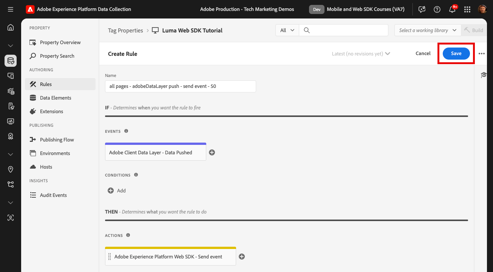

# Création de règles de balises

Découvrez comment envoyer des événements à Adobe Experience Platform Edge Network à l’aide de règles de balises. Une règle de balise est une combinaison d’événements, de conditions et d’actions qui indique à la propriété de balise d’effectuer une opération. Avec Platform Web SDK, les règles sont utilisées pour envoyer des événements à Platform Edge Network avec les données appropriées.

## Objectifs d’apprentissage

À la fin de cette leçon, vous êtes capable de :

* Utiliser une convention de nommage pour la gestion des règles dans les balises
* Envoyer un événement avec des champs XDM à l’aide des actions Mettre à jour la variable et Envoyer l’événement
* Empilement de plusieurs ensembles de champs XDM sur plusieurs règles
* Mappez des éléments de données de tableau individuels ou entiers à l’objet XDM.
* Publication d’une règle de balise dans une bibliothèque de développement

## Conditions préalables

Vous connaissez les balises de la collecte de données et le site de démonstration [Luma](https://luma.enablementadobe.com) et avez terminé les leçons précédentes du tutoriel :

* [Configuration d’un schéma XDM](configure-schemas.md)
* [Configuration d’un espace de noms d’identité](configure-identities.md)
* [Configurer un trains de données](configure-datastream.md)
* [Installer l’extension SDK Web](install-web-sdk.md)
* [Création d’éléments de données](create-data-elements.md)
* [Capturer des identités](create-identities.md)

## Conventions de dénomination

Pour gérer les règles dans les balises, il est recommandé de suivre une convention de dénomination standard. Ce tutoriel utilise une convention de nommage en quatre parties :

* [**location**] - [**event**] - [**purpose**] - [**order**]

où ;

1. **emplacement** est la ou les pages du site sur lesquelles la règle se déclenche
1. **event** est le déclencheur de la règle
1. **objectif** est la principale action effectuée par la règle
1. **order** est l’ordre dans lequel la règle doit se déclencher par rapport aux autres règles partageant le même événement
<!-- minor update -->

## Ajout de l’extension Adobe Client Data Layer (ACDL)

Le site web Luma utilise une couche de données pilotée par les événements appelée couche de données client Adobe (ACDL). Chaque fois qu’un événement de couche de données se produit, il est placé dans le tableau `adobeDataLayer`. Ce tutoriel utilise une extension de balises appelée Couche de données client Adobe pour tirer facilement parti de ces événements afin de créer nos règles.

Pour ajouter l’extension :

1. Accédez à **[!UICONTROL Extensions]**
1. Filtrer sur **[!UICONTROL la couche de données client Adobe]**
1. Sélectionnez **[!UICONTROL Installer]**

   

1. Conserver les paramètres par défaut
1. Sélectionnez **[!UICONTROL Enregistrer]**

>[!NOTE]
>
> Il n’est pas nécessaire d’utiliser la couche de données client Adobe pour implémenter Experience Platform Web SDK. De nombreux autres types d’événements sont généralement utilisés dans les implémentations de balises (bibliothèque chargée, DOM prêt, fenêtre chargée, etc.) pour déclencher des règles.

## Création de règles de balises

Dans les balises, les règles sont utilisées pour exécuter des actions telles que la définition de variables et le déclenchement d’appels réseau dans diverses conditions. L’extension de balises Experience Platform Web SDK comprend deux actions utilisées dans les règles :

* **[!UICONTROL Mettre à jour la variable]** mappe les éléments de données à vos variables XDM ou de données
* **[!UICONTROL Envoyer l’événement]** effectue l’appel réseau pour envoyer des données à Experience Platform Edge Network.

Dans la suite de cette leçon, nous avons :

1. Utilisez l’action **[!UICONTROL Mettre à jour la variable]** pour définir une « configuration globale » des champs XDM.

1. Utilisez à nouveau l’action **[!UICONTROL Mettre à jour la variable]** pour remplacer notre « configuration globale » et ajouter des champs XDM supplémentaires sous certaines conditions (par exemple, en ajoutant des détails de produit sur les pages de produit).

1. Utilisez l’action **[!UICONTROL Envoyer l’événement]** pour envoyer les données à Adobe Experience Platform Edge Network.

Toutes ces règles seront correctement séquencées à l’aide de l’option « [!UICONTROL order] ».

Cette vidéo donne un aperçu du processus :

>[!VIDEO](https://video.tv.adobe.com/v/3454029/?captions=fre_fr&learn=on&enablevpops)

### Champs de configuration globale

Pour créer une règle de balise pour les champs XDM globaux :

1. Ouvrez la propriété de balise que vous utilisez pour ce tutoriel

1. Accédez à **[!UICONTROL Règles]** dans le volet de navigation de gauche

1. Sélectionnez le bouton **[!UICONTROL Créer une règle]**

   

1. Donnez à la règle le nom `all pages - adobeDataLayer push - set global variables - 1`.

1. Dans la section **[!UICONTROL Événements]**, sélectionnez **[!UICONTROL Ajouter]**

   

1. Utilisez l’extension **[!UICONTROL Adobe Client Data Layer]** et sélectionnez **[!UICONTROL Données transmises]** comme **[!UICONTROL Type d’événement]**

1. Sélectionnez la liste déroulante **[!UICONTROL Avancé]** et saisissez `1` comme **[!UICONTROL Commande]**.

   >[!NOTE]
   >
   > Plus le numéro de commande est bas, plus tôt il s’exécute. Par conséquent, nous donnons à notre « configuration globale » un numéro d’ordre faible.

1. Écouter **[!UICONTROL Tous les événements]**
1. Sélectionnez **[!UICONTROL Conserver les modifications]** pour revenir à l’écran principal des règles
   

1. Dans la section **[!UICONTROL Actions]**, sélectionnez **[!UICONTROL Ajouter]**

1. Sélectionnez **[!UICONTROL Adobe Experience Platform Web SDK en tant qu’extension]**&#x200B;**&#x200B;**

1. Sélectionnez **[!UICONTROL Type d’action]**, puis **[!UICONTROL Mettre à jour la variable]**

1. En tant que **[!UICONTROL Élément de données]**, sélectionnez le `XDM Variable` que vous avez créé dans la leçon [Créer des éléments de données](create-data-elements.md)

   

1. Maintenant, spécifiez les champs XDM en les mappant aux valeurs appropriées :

   | Champ XDM | Mapper à |
   |---|---|
   | `eventType` | `Web Webpagedetails Page Views` (commencez à saisir pour voir les valeurs suggérées) |
   | `identityMap` | élément de données `Identity Map` |
   | `web.webPageDetails.name` | élément de données `Page Name` |
   | `web.webPageDetails.pageViews.value` | `1` |

   >[!TIP]
   >
   > Les champs XDM ne sont pas inclus dans la requête réseau si l’élément de données est null. Par conséquent, lorsque l’utilisateur n’est pas authentifié et que l’élément de données `Identity Map` est nul, l’objet `identityMap` n’est pas envoyé. C’est pourquoi nous pouvons le définir en toute sécurité dans notre « configuration globale ».

   >[!TIP]
   >
   > La définition de `web.webPageDetails.pageViews.value` fournit un moyen standard d’indiquer une page vue pour d’autres applications en aval. Il n’est pas nécessaire qu’Adobe Analytics traite un appel réseau comme une page vue.

1. Lorsque vous aurez terminé, votre `XDM Variable` ressemblera à ceci. Notez comment les champs remplis et partiellement remplis sont indiqués par les cercles bleus :
   
1. Sélectionnez **[!UICONTROL Conserver les modifications]** puis **[!UICONTROL Enregistrer]** la règle

### Champs de la page Produit

Commencez à présent à utiliser **[!UICONTROL Mettre à jour la variable]** dans des règles séquencées supplémentaires pour enrichir l’objet XDM avant de l’envoyer à [!UICONTROL Platform Edge Network].

>[!TIP]
>
>L’ordre des règles détermine la règle qui s’exécute en premier lorsqu’un événement est déclenché. Si deux règles ont le même type d’événement, la règle portant le numéro de commande le plus bas s’exécute en premier.
> 

Commencez par effectuer le suivi des consultations de produit sur la page des détails du produit de Luma :

1. Sélectionnez **[!UICONTROL Ajouter une règle]**
1. Nommez-le [!UICONTROL `product detail pages - adobeDataLayer push - set product details variables - 20`]
1. Sélectionnez le symbole  ajouter un nouveau déclencheur
1. Sous **[!UICONTROL Extension]**, sélectionnez **[!UICONTROL Couche de données client Adobe]**
1. Sous **[!UICONTROL Type d’événement]**, sélectionnez **[!UICONTROL Données transmises]**
1. Sélectionnez pour ouvrir **[!UICONTROL Options avancées]**, puis saisissez `20`. Cette valeur d’ordre garantit que la règle s’exécute _après_ la règle des variables globales.
1. Écoute d’un événement **[!UICONTROL spécifique]**
1. Saisissez `productView` comme **[!UICONTROL Événement/Clé pour lequel s’enregistrer]**
1. Sélectionnez **[!UICONTROL Conserver les modifications]**

   

1. Sous **[!UICONTROL Actions]** sélectionnez **[!UICONTROL Ajouter]**
1. Sélectionner l’extension **[!UICONTROL Adobe Experience Platform Web SDK]**
1. Sélectionnez **[!UICONTROL Type d’action]** comme **[!UICONTROL Variable de mise à jour]**
1. Sélectionnez `XDM Variable` comme **[!UICONTROL Élément de données]**
1. Mappez ces champs XDM aux valeurs appropriées :

   | Champ XDM | Mapper à |
   |---|---|
   | `eventType` | `Commerce Product Views` (commencez à saisir pour voir les valeurs suggérées) |
   | `commerce.productViews.value` | `1` |
   | `productListItems.name` | `Ecommerce Product Name` l’élément de données (Sélectionnez **[!UICONTROL Fournir des éléments individuels]** et **[!UICONTROL Ajouter un élément]** en premier ) |
   | `productListItems.sku` | élément de données `Ecommerce Product Id` |

1. Sélectionnez **[!UICONTROL Conserver les modifications]**

1. Sélectionnez **[!UICONTROL Enregistrer]** pour enregistrer la règle

   >[!NOTE]
   >
   >Comme cette règle présente un ordre supérieur, elle remplacera le jeu de `eventType` défini dans la règle « Configuration globale ». `eventType` ne peut contenir qu’une seule valeur et nous vous recommandons de la définir avec l’événement le plus important.

   >[!TIP]
   >
   >La définition de commerce.productViews.value=1 dans XDM mappe automatiquement à l’événement `prodView` dans Analytics

### Champs Panier

Vous pouvez mapper un tableau entier à un objet XDM, à condition que le tableau corresponde au format du schéma XDM. L’élément de données de code personnalisé `Ecommerce Cart Products` vous avez créé précédemment effectue une boucle sur l’objet de couche de données `adobeDataLayer.ecommerce.cart.items` sur le site web de Luma et le traduit au format requis de l’objet `productListItems` du schéma XDM.

Pour illustrer cette situation, reportez-vous à la comparaison ci-dessous de la couche de données de site Luma (à gauche) avec l’élément de données traduit (à droite) :

Comparez l’élément de données à la structure `productListItems` (conseil, il doit correspondre).

>[!NOTE]
>
> Vous ne pourrez pas exécuter `_satellite.getVar('Ecommerce Cart Products')` à ce stade du tutoriel.

>[!IMPORTANT]
>
>Lors du mappage des champs de la couche de données à XDM, assurez-vous que les champs correspondent au type de données du champ XDM. Dans l’exemple ci-dessus, `quantity` et `priceTotal` doivent être des entiers, sinon l’enregistrement ne sera pas ingéré dans Platform.
> 

Maintenant, mappons notre tableau à l’objet XDM :

1. Créez une règle nommée `cart page - adobeDataLayer push - set cart variables - 20`
1. Sélectionnez le symbole  ajouter un nouveau déclencheur
1. Sous **[!UICONTROL Extension]**, sélectionnez **[!UICONTROL Couche de données client Adobe]**
1. Sous **[!UICONTROL Type d’événement]**, sélectionnez **[!UICONTROL Données transmises]**
1. Sélectionnez pour ouvrir **[!UICONTROL Options avancées]**, puis saisissez `20`. Cette valeur d’ordre garantit que la règle s’exécute _après_ la règle des variables globales.
1. Écoute d’un événement **[!UICONTROL spécifique]**
1. Saisissez `cartView` comme **[!UICONTROL Événement/Clé pour lequel s’enregistrer]**
1. Sélectionnez **[!UICONTROL Conserver les modifications]**

   

1. Sous **[!UICONTROL Actions]** sélectionnez **[!UICONTROL Ajouter]**
1. Sélectionner l’extension **[!UICONTROL Adobe Experience Platform Web SDK]**
1. Sélectionnez **[!UICONTROL Type d’action]** comme **[!UICONTROL Variable de mise à jour]**
1. Sélectionnez `XDM Variable` comme **[!UICONTROL Élément de données]**
1. Mappez ces champs XDM aux valeurs appropriées :

   | Champ XDM | Mapper à |
   |---|---|
   | `eventType` | `Commerce Product List (Cart) Views` (commencez à saisir pour voir les valeurs suggérées) |
   | `commerce.productListViews.value` | `1` |
   | `productListItems` | `Ecommerce Cart Products` l’élément de données (sélectionnez **[!UICONTROL Fournir le tableau entier]** en premier ) |

   >[!TIP]
   >
   >La définition de commerce.productListViews.value=1 dans XDM mappe automatiquement à l’événement `scView` dans Analytics

1. Sélectionnez **[!UICONTROL Conserver les modifications]**

1. Sélectionnez **[!UICONTROL Enregistrer]** pour enregistrer la règle

### Champs de confirmation de commande

Créez une autre règle pour les événements d’achat :

1. Créez une règle nommée `order confirmation - adobeDataLayer push - set purchase variables -  20`
1. Sélectionnez le symbole  ajouter un nouveau déclencheur
1. Sous **[!UICONTROL Extension]**, sélectionnez **[!UICONTROL Couche de données client Adobe]**
1. Sous **[!UICONTROL Type d’événement]**, sélectionnez **[!UICONTROL Données transmises]**
1. Sélectionnez pour ouvrir **[!UICONTROL Options avancées]**, puis saisissez `20`. Cette valeur d’ordre garantit que la règle s’exécute _après_ la règle des variables globales.
1. Écoute d’un événement **[!UICONTROL spécifique]**
1. Saisissez `purchase` comme **[!UICONTROL Événement/Clé pour lequel s’enregistrer]**
1. Sélectionnez **[!UICONTROL Conserver les modifications]**
1. Sous **[!UICONTROL Actions]** sélectionnez **[!UICONTROL Ajouter]**
1. Sélectionner l’extension **[!UICONTROL Adobe Experience Platform Web SDK]**
1. Sélectionnez **[!UICONTROL Type d’action]** comme **[!UICONTROL Variable de mise à jour]**
1. Sélectionnez `XDM Variable` comme **[!UICONTROL Élément de données]**
1. Mappez ces champs XDM aux valeurs appropriées :

   | Champ XDM | Mapper à |
   |---|---|
   | `eventType` | `Commerce Purchases` (commencez à saisir pour voir les valeurs suggérées) |
   | `commerce.productListViews.value` | `1` |
   | `commerce.order.purchaseID` | élément de données `Ecommerce Purchase Id` |
   | `commerce.order.currencyCode` | `USD` |
   | `productListItems` | `Ecommerce Cart Products` l’élément de données (sélectionnez **[!UICONTROL Fournir le tableau entier]** en premier ) |

   >[!TIP]
   >
   >La définition de `commerce.productListViews.value` sur `1`, `commerce.order.purchaseID` et `commerce.order.currencyCode` dans XDM mappe automatiquement aux variables `purchase`, `s.purchaseID` et `s.currencyCode` dans Analytics, respectivement.

1. Sélectionnez **[!UICONTROL Conserver les modifications]**
1. Sélectionnez **[!UICONTROL Enregistrer]**

### Règle d’événement d’envoi

Maintenant que vous avez défini les variables, vous pouvez créer la règle pour envoyer l’objet XDM complet à Platform Edge Network avec l’action **[!UICONTROL Envoyer l’événement]**.

1. Créez une règle nommée `all pages - adobeDataLayer push - send event - 50`
1. Sélectionnez le symbole  ajouter un nouveau déclencheur
1. Sous **[!UICONTROL Extension]**, sélectionnez **[!UICONTROL Couche de données client Adobe]**
1. Sous **[!UICONTROL Type d’événement]**, sélectionnez **[!UICONTROL Données transmises]**
1. Sélectionnez pour ouvrir **[!UICONTROL Options avancées]**, saisissez `50` (qui est probablement la valeur par défaut). Cette valeur d’ordre garantit que la règle s’exécute _après_ les règles de définition de variables.
1. Écouter un **[!UICONTROL Tous les événements]**
1. Sélectionnez **[!UICONTROL Conserver les modifications]**
1. Sous **[!UICONTROL Actions]** sélectionnez **[!UICONTROL Ajouter]**
1. Sélectionner l’extension **[!UICONTROL Adobe Experience Platform Web SDK]**
1. Sélectionnez **[!UICONTROL Type d’action]** comme **[!UICONTROL Variable d’événement d’envoi]**

1. Sélectionnez **[!UICONTROL Type d’action]**, **[!UICONTROL Envoyer l’événement]**

1. En tant que **[!UICONTROL XDM]**, sélectionnez l’élément de données `XDM Variable` créé dans la leçon précédente

1. Sélectionnez **[!UICONTROL Conserver les modifications]** pour revenir à l’écran principal des règles

   
1. Sélectionnez **[!UICONTROL Enregistrer]** pour enregistrer la règle

   

Votre propriété doit comporter les règles suivantes :

    

## Publication des règles dans une bibliothèque

Publiez ensuite la règle dans votre environnement de développement afin de vérifier qu’elle fonctionne.

Pour créer une bibliothèque, procédez comme suit :

1. Accédez à **[!UICONTROL Flux de publication]** dans le volet de navigation de gauche

1. Sélectionnez **[!UICONTROL Ajouter une bibliothèque]**

   
1. Pour le **[!UICONTROL Nom]**, saisissez `Luma Web SDK Tutorial`
1. Pour le **[!UICONTROL Environnement]**, sélectionnez `Development`
1. Sélectionnez **[!UICONTROL Ajouter toutes les ressources modifiées]**

   >[!NOTE]
   >
   >    Vous devriez voir tous les composants de balise créés dans les leçons précédentes. L’extension Core contient le JavaScript de base requis par toutes les propriétés de balise web.

1. Sélectionnez **[!UICONTROL Enregistrer et créer pour le développement]**

   

La création de la bibliothèque peut prendre quelques minutes et, lorsqu’elle est terminée, un point vert s’affiche à gauche du nom de la bibliothèque :

Comme vous pouvez le voir dans l’écran [!UICONTROL Flux de publication], le processus de publication ne se limite pas au contenu de ce tutoriel. Ce tutoriel utilise uniquement une bibliothèque dans votre environnement de développement.

Vous êtes maintenant prêt à valider les données de la requête à l’aide d’Adobe Experience Platform Debugger.

>[!NOTE]
>
>Merci d’avoir investi votre temps dans votre apprentissage de Adobe Experience Platform Web SDK. Si vous avez des questions, souhaitez partager des commentaires généraux ou avez des suggestions sur le contenu futur, veuillez les partager dans ce [article de discussion de la communauté Experience League](https://experienceleaguecommunities.adobe.com/adobe-experience-platform-18/tutorial-discussion-implement-adobe-experience-cloud-with-web-sdk-tutorial-248848?profile.language=fr)
