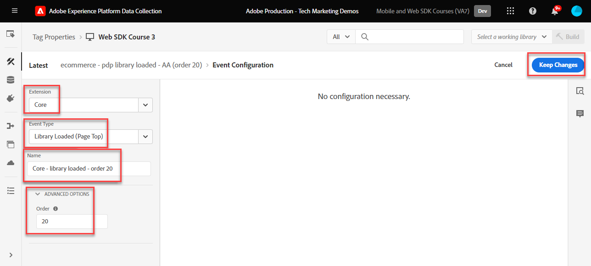

# Création de règles de balises

Découvrez comment envoyer des événements à Adobe Experience Platform Edge Network avec votre objet XDM à l’aide de règles de balises. Une règle de balise est une combinaison d’événements, de conditions et d’actions qui indique à la propriété de balise d’effectuer une opération. Avec Platform Web SDK, les règles sont utilisées pour envoyer des événements à Platform Edge Network avec les données appropriées.

## Objectifs d’apprentissage

À la fin de cette leçon, vous êtes capable de :

* Utiliser une convention de nommage pour la gestion des règles dans les balises
* Envoyer un événement avec des champs XDM à l’aide des actions Mettre à jour la variable et Envoyer l’événement
* Empilement de plusieurs ensembles de champs XDM sur plusieurs règles
* Mappez des éléments de données de tableau individuels ou entiers à l’objet XDM.
* Publication d’une règle de balise dans une bibliothèque de développement

## Conditions préalables

Vous connaissez les balises de la collecte de données et le site de démonstration [Luma](https://luma.enablementadobe.com/content/luma/us/en.html) et avez terminé les leçons précédentes du tutoriel :

* [Configuration d’un schéma XDM](configure-schemas.md)
* [Configuration d’un espace de noms d’identité](configure-identities.md)
* [Configurer un trains de données](configure-datastream.md)
* [Installer l’extension SDK Web](install-web-sdk.md)
* [Création d’éléments de données](create-data-elements.md)
* [Création d’identités](create-identities.md)

## Conventions de dénomination

Pour gérer les règles dans les balises, il est recommandé de suivre une convention de dénomination standard. Ce tutoriel utilise une convention de nommage en cinq parties :

* [**location**] - [**event**] - [**purpose**] - [**order**]

où ;

1. **emplacement** est la ou les pages du site sur lesquelles la règle se déclenche
1. **event** est le déclencheur de la règle
1. **objectif** est la principale action effectuée par la règle
1. **ordre** est l’ordre dans lequel la règle doit se déclencher par rapport aux autres règles
<!-- minor update -->

## Création de règles de balises

Dans les balises, les règles sont utilisées pour exécuter des actions (appels de déclenchement) sous diverses conditions. L’extension de balises de Platform Web SDK comprend deux actions qui sont utilisées dans cette leçon :

* **[!UICONTROL Mettre à jour la variable]** mappe les éléments de données aux propriétés dans un objet XDM
* **[!UICONTROL Envoyer l’événement]** envoie l’objet XDM à Experience Platform Edge Network

Dans la suite de cette leçon, nous avons :

1. Créez une règle avec l’action **[!UICONTROL Mettre à jour la variable]** pour définir une « configuration globale » des champs XDM.

1. Créez des règles supplémentaires avec l’action **[!UICONTROL Mettre à jour la variable]** qui remplacent notre « configuration globale » et contribuent à d’autres champs XDM sous certaines conditions (par exemple, en ajoutant des détails de produit sur les pages de produit).

1. Créez une autre règle avec l’action **[!UICONTROL Envoyer l’événement]** qui enverra l’objet XDM complet à Adobe Experience Platform Edge Network.

Toutes ces règles seront correctement séquencées à l’aide de l’option « [!UICONTROL order] ».

Cette vidéo donne un aperçu du processus :

>[!VIDEO](https://video.tv.adobe.com/v/3427710/?learn=on&enablevpops)

### Champs de configuration globale

Pour créer une règle de balise pour les champs XDM globaux :

1. Ouvrez la propriété de balise que vous utilisez pour ce tutoriel

1. Accédez à **[!UICONTROL Règles]** dans le volet de navigation de gauche

1. Sélectionnez le bouton **[!UICONTROL Créer une règle]**

   

1. Donnez à la règle le nom `all pages - library loaded - set global variables - 1`.

1. Dans la section **[!UICONTROL Événements]**, sélectionnez **[!UICONTROL Ajouter]**

   

1. Utilisez l’extension **[!UICONTROL Core]** et sélectionnez **[!UICONTROL Bibliothèque chargée (haut de page)]** comme **[!UICONTROL Type d’événement]**

1. Sélectionnez la liste déroulante **[!UICONTROL Avancé]** et saisissez `1` comme **[!UICONTROL Commande]**.

   >[!NOTE]
   >
   > Plus le numéro de commande est bas, plus tôt il s’exécute. Par conséquent, nous donnons à notre « configuration globale » un numéro d’ordre faible.

1. Sélectionnez **[!UICONTROL Conserver les modifications]** pour revenir à l’écran principal des règles
   

1. Dans la section **[!UICONTROL Actions]**, sélectionnez **[!UICONTROL Ajouter]**

1. Sélectionnez **[!UICONTROL Adobe Experience Platform Web SDK en tant qu’extension****]**

1. Sélectionnez **[!UICONTROL Type d’action]**, puis **[!UICONTROL Mettre à jour la variable]**

1. En tant que **[!UICONTROL Élément de données]**, sélectionnez le `xdm.variable.content` que vous avez créé dans la leçon [Créer des éléments de données](create-data-elements.md)

   

Mappez maintenant vos [!UICONTROL éléments de données] au [!UICONTROL schéma] utilisé par votre objet XDM. Vous pouvez mapper des propriétés individuelles ou des objets entiers. Dans cet exemple, vous mappez à des propriétés individuelles :

1. Recherchez le champ eventType et sélectionnez-le

1. Saisir la valeur `web.webpagedetails.pageViews`

   >[!TIP]
   >
   > Pour comprendre les valeurs à renseigner dans le champ de `eventType`, vous devez accéder à la page du schéma et sélectionner le champ de `eventType` pour afficher les valeurs suggérées dans le rail de droite. Vous pouvez également saisir une nouvelle valeur, si nécessaire.
   > 

1. Recherchez ensuite l’objet `identityMap` dans le schéma et sélectionnez-le

1. Mapper à l’élément de données `identityMap.loginID`

   

   >[!TIP]
   >
   > Les champs XDM ne sont pas inclus dans la requête réseau si l’élément de données est null. Par conséquent, lorsque l’utilisateur n’est pas authentifié et que l’élément de données `identityMap.loginID` est nul, l’objet `identityMap` n’est pas envoyé. C’est pourquoi nous pouvons le définir dans notre « configuration globale ».

1. Faites défiler jusqu’à atteindre l’objet **`web`**

1. Sélectionner pour l’ouvrir

1. Mappez les éléments de données suivants aux variables XDM `web` correspondantes

   * **`web.webPageDetials.name`** à `%page.pageInfo.pageName%`
   * **`web.webPageDetials.server`** à `%page.pageInfo.server%`
   * **`web.webPageDetials.siteSection`** à `%page.pageInfo.hierarchie1%`

1. Définissez `web.webPageDetials.pageViews.value` sur `1`.

   

   >[!TIP]
   >
   > Bien que ni `eventType` défini sur `web.webpagedetails.pageViews` ni `web.webPageDetails.pageViews.value` ne soient nécessaires pour qu’Adobe Analytics traite une balise en tant que page vue, il est utile de disposer d’une méthode standard pour indiquer une page vue pour d’autres applications en aval.

1. Sélectionnez **[!UICONTROL Conserver les modifications]** puis **[!UICONTROL Enregistrer]** dans l’écran suivant pour terminer la création de la règle

### Champs de la page Produit

Commencez à présent à utiliser **[!UICONTROL Mettre à jour la variable]** dans des règles séquencées supplémentaires pour enrichir l’objet XDM avant de l’envoyer à [!UICONTROL Platform Edge Network].

>[!TIP]
>
>L’ordre des règles détermine la règle qui s’exécute en premier lorsqu’un événement est déclenché. Si deux règles ont le même type d’événement, celle qui a le plus petit nombre s’exécute en premier.
> 

Commencez par effectuer le suivi des consultations de produit sur la page des détails du produit de Luma :

1. Sélectionnez **[!UICONTROL Ajouter une règle]**
1. Nommez-le [!UICONTROL `ecommerce - library loaded - set product details variables - 20`]
1. Sélectionnez le symbole  ajouter un nouveau déclencheur
1. Sous **[!UICONTROL Extension]**, sélectionnez **[!UICONTROL Core]**
1. Sous **[!UICONTROL Type d’événement]**, sélectionnez **[!UICONTROL Bibliothèque chargée (haut de page)]**
1. Sélectionnez pour ouvrir **[!UICONTROL Options avancées]**, puis saisissez `20`. Cette valeur d’ordre garantit que la règle s’exécute _après_ la `all pages - library loaded - set global variables - 1` qui définit la configuration globale.
1. Sélectionnez **[!UICONTROL Conserver les modifications]**

   

1. Sous **[!UICONTROL Conditions]**, sélectionnez pour **[!UICONTROL Ajouter]**
1. Laissez **[!UICONTROL Type logique]** sur **[!UICONTROL Standard]**
1. Laisser **[!UICONTROL Extension]** comme **[!UICONTROL Core]**
1. Sélectionnez **[!UICONTROL Type de condition]** comme **[!UICONTROL Chemin sans chaîne de requête]**
1. À droite, activez le bouton bascule **[!UICONTROL Expression régulière]**
1. Sous **[!UICONTROL chemin égal à]** définissez `/products/`. Pour le site de démonstration Luma, cela garantit que la règle ne se déclenche que sur les pages de produits
1. Sélectionnez **[!UICONTROL Conserver les modifications]**

   

1. Sous **[!UICONTROL Actions]** sélectionnez **[!UICONTROL Ajouter]**
1. Sélectionner l’extension **[!UICONTROL Adobe Experience Platform Web SDK]**
1. Sélectionnez **[!UICONTROL Type d’action]** comme **[!UICONTROL Variable de mise à jour]**
1. Sélectionnez `xdm.variable.content` comme **[!UICONTROL Élément de données]**
1. Faites défiler l’écran jusqu’à l’objet `commerce`
1. Ouvrez l’objet **[!UICONTROL productViews]** et définissez **[!UICONTROL value]** sur `1`

   

   >[!TIP]
   >
   >La définition de commerce.productViews.value=1 dans XDM mappe automatiquement à l’événement `prodView` dans Analytics

1. Faites défiler jusqu’à `eventType` et définissez-le sur `commerce.productViews`

   >[!NOTE]
   >
   >Comme cette règle présente un ordre supérieur, elle remplacera le jeu de `eventType` défini dans la règle « Configuration globale ». `eventType` ne peut contenir qu’une seule valeur et nous vous recommandons de la définir avec l’événement le plus important.

1. Faites défiler jusqu’à et sélectionnez `productListItems` tableau
1. Sélectionnez **[!UICONTROL Fournir des éléments individuels]**
1. Sélectionnez **[!UICONTROL Ajouter un élément]**

   

   >[!CAUTION]
   >
   >Le **`productListItems`** est un type de données `array`. Il s’attend donc à ce que les données soient transmises sous la forme d’une collection d’éléments. En raison de la structure de couche de données du site de démonstration Luma et du fait qu’il n’est possible d’afficher qu’un seul produit à la fois sur le site Luma, vous ajoutez des éléments individuellement. Lors de l’implémentation de sur votre propre site web, en fonction de la structure de votre couche de données, vous pouvez fournir un tableau entier.

1. Sélectionner pour ouvrir **[!UICONTROL Élément 1]**
1. Mapper des **`productListItems.item1.SKU`** à des `%product.productInfo.sku%`

   

1. Sélectionnez **[!UICONTROL Conserver les modifications]**

1. Sélectionnez **[!UICONTROL Enregistrer]** pour enregistrer la règle

### Champs Panier

Vous pouvez mapper un tableau entier à un objet XDM, à condition que le tableau corresponde au format du schéma XDM. L’élément de données de code personnalisé `cart.productInfo` vous avez créé précédemment effectue une boucle sur l’objet de couche de données `digitalData.cart.cartEntries` sur Luma et le traduit au format requis de l’objet `productListItems` du schéma XDM.

Pour illustrer cette situation, reportez-vous à la comparaison ci-dessous de la couche de données de site Luma (à gauche) avec l’élément de données traduit (à droite) :

Comparez l’élément de données à la structure `productListItems` (conseil, il doit correspondre).

>[!IMPORTANT]
>
>Notez la manière dont les variables numériques sont traduites, avec des valeurs de chaîne dans la couche de données telles que `price` et `qty` reformatées en nombres dans l’élément de données. Ces exigences de format sont importantes pour l’intégrité des données dans Platform et sont déterminées lors de l’étape [configurer les schémas](configure-schemas.md). Dans l’exemple, **[!UICONTROL quantity]** utilise le type de données **[!UICONTROL Integer]**.
> 

Maintenant, mappons notre tableau à l’objet XDM :

1. Créez une règle nommée `ecommerce - library loaded - set shopping cart variables - 20`
1. Sélectionnez le symbole  ajouter un nouveau déclencheur
1. Sous **[!UICONTROL Extension]**, sélectionnez **[!UICONTROL Core]**
1. Sous **[!UICONTROL Type d’événement]**, sélectionnez **[!UICONTROL Bibliothèque chargée (haut de page)]**
1. Sélectionnez pour ouvrir **[!UICONTROL Options avancées]**, puis saisissez `20`
1. Sélectionnez **[!UICONTROL Conserver les modifications]**

   

1. Sous **[!UICONTROL Conditions]**, sélectionnez pour **[!UICONTROL Ajouter]**
1. Laissez **[!UICONTROL Type logique]** sur **[!UICONTROL Standard]**
1. Laisser **[!UICONTROL Extensions]** comme **[!UICONTROL Core]**
1. Sélectionnez **[!UICONTROL Type de condition]** comme **[!UICONTROL Chemin sans chaîne de requête]**
1. À droite, **ne pas activer** activez le bouton bascule **[!UICONTROL Expression régulière]**
1. Sous **[!UICONTROL chemin égal à]** définissez `/content/luma/us/en/user/cart.html`. Pour le site de démonstration Luma, cela garantit que la règle ne se déclenche que sur la page du panier
1. Sélectionnez **[!UICONTROL Conserver les modifications]**

   

1. Sous **[!UICONTROL Actions]** sélectionnez **[!UICONTROL Ajouter]**
1. Sélectionner l’extension **[!UICONTROL Adobe Experience Platform Web SDK]**
1. Sélectionnez **[!UICONTROL Type d’action]** comme **[!UICONTROL Variable de mise à jour]**
1. Sélectionnez `xdm.variable.content` comme **[!UICONTROL Élément de données]**
1. Faites défiler l’écran jusqu’à l’objet `commerce` et sélectionnez-le pour l’ouvrir.
1. Ouvrez l’objet **[!UICONTROL productListViews]** et définissez **[!UICONTROL value]** sur `1`

   

   >[!TIP]
   >
   >La définition de commerce.productListViews.value=1 dans XDM mappe automatiquement à l’événement `scView` dans Analytics

1. Sélectionnez `eventType` et définissez sur `commerce.productListViews`

1. Faites défiler jusqu’à et sélectionnez le tableau **[!UICONTROL productListItems]**

1. Sélectionnez **[!UICONTROL Fournir un tableau entier]**

1. Mapper à **`cart.productInfo`** élément de données

1. Sélectionnez **[!UICONTROL Conserver les modifications]**

1. Sélectionnez **[!UICONTROL Enregistrer]** pour enregistrer la règle

Créez deux autres règles pour le passage en caisse et l’achat selon le même modèle avec les différences ci-dessous :

**Nom de la règle** : `ecommerce  - library loaded - set checkout variables - 20`

1. **[!UICONTROL Condition]** : /content/luma/us/en/user/checkout.html
1. Définissez `eventType` sur `commerce.checkouts`.
1. Définissez `commerce.checkout.value` sur `1`.

   >[!TIP]
   >
   >Cela revient à définir `scCheckout` événement dans Analytics

**Nom de la règle** : `ecommerce - library loaded - set purchase variables -  20`

1. **[!UICONTROL Condition]** : /content/luma/us/en/user/checkout/order/thank-you.html
1. Définissez `eventType` sur `commerce.purchases`.
1. Définissez `commerce.purchases.value` sur `1`.

   >[!TIP]
   >
   >Cela revient à définir `purchase` événement dans Analytics

1. `commerce.order.purchaseID` à l’élément de données `cart.orderId`
1. Définissez `commerce.order.currencyCode` sur la valeur codée en dur `USD`

   

   >[!TIP]
   >
   >Cela revient à définir des variables `s.purchaseID` et `s.currencyCode` dans Analytics

1. Faites défiler jusqu’à et sélectionnez le tableau **[!UICONTROL productListItems]**
1. Sélectionnez **[!UICONTROL Fournir un tableau entier]**
1. Mapper à **`cart.productInfo.purchase`** élément de données
1. Sélectionnez **[!UICONTROL Conserver les modifications]**
1. Sélectionnez **[!UICONTROL Enregistrer]**

Lorsque vous avez terminé, vous devriez voir les règles suivantes créées.

### Règle d’événement d’envoi

Maintenant que vous avez défini les variables, vous pouvez créer la règle pour envoyer l’objet XDM complet à Platform Edge Network avec l’action **[!UICONTROL Envoyer l’événement]**.

1. Sur la droite, sélectionnez **[!UICONTROL Ajouter une règle]** pour créer une autre règle

1. Donnez à la règle le nom `all pages - library loaded - send event - 50`.

1. Dans la section **[!UICONTROL Événements]**, sélectionnez **[!UICONTROL Ajouter]**

1. Utilisez l’extension **[!UICONTROL Core]** et sélectionnez `Library Loaded (Page Top)` comme **[!UICONTROL type d’événement]**.

1. Sélectionnez la liste déroulante **[!UICONTROL Avancé]** et saisissez `50` dans **[!UICONTROL Ordre]**. Cela permet de s’assurer que cette règle se déclenche après toutes les autres règles que vous avez configurées (dont le [!UICONTROL Ordre] était `1` ou `20`).

1. Sélectionnez **[!UICONTROL Conserver les modifications]** pour revenir à l’écran principal des règles
   

1. Dans la section **[!UICONTROL Actions]**, sélectionnez **[!UICONTROL Ajouter]**

1. Sélectionnez **[!UICONTROL Adobe Experience Platform Web SDK en tant qu’extension****]**

1. Sélectionnez **[!UICONTROL Type d’action]**, **[!UICONTROL Envoyer l’événement]**

1. En tant que **[!UICONTROL XDM]**, sélectionnez l’élément de données `xdm.variable.content` créé dans la leçon précédente

1. Sélectionnez **[!UICONTROL Conserver les modifications]** pour revenir à l’écran principal des règles

   
1. Sélectionnez **[!UICONTROL Enregistrer]** pour enregistrer la règle

   

## Publication des règles dans une bibliothèque

Publiez ensuite la règle dans votre environnement de développement afin de vérifier qu’elle fonctionne.

Pour créer une bibliothèque, procédez comme suit :

1. Accédez à **[!UICONTROL Flux de publication]** dans le volet de navigation de gauche

1. Sélectionnez **[!UICONTROL Ajouter une bibliothèque]**

   
1. Pour le **[!UICONTROL Nom]**, saisissez `Luma Web SDK Tutorial`
1. Pour le **[!UICONTROL Environnement]**, sélectionnez `Development`
1. Sélectionnez **[!UICONTROL Ajouter toutes les ressources modifiées]**

   >[!NOTE]
   >
   >    Vous devriez voir tous les composants de balise créés dans les leçons précédentes. L’extension Core contient le JavaScript de base requis par toutes les propriétés de balise web.

1. Sélectionnez **[!UICONTROL Enregistrer et créer pour le développement]**

   

La création de la bibliothèque peut prendre quelques minutes et, lorsqu’elle est terminée, un point vert s’affiche à gauche du nom de la bibliothèque :

Comme vous pouvez le voir dans l’écran [!UICONTROL Flux de publication], le processus de publication ne se limite pas au contenu de ce tutoriel. Ce tutoriel utilise uniquement une bibliothèque dans votre environnement de développement.

Vous êtes maintenant prêt à valider les données de la requête à l’aide d’Adobe Experience Platform Debugger.

[Suivant ](validate-with-debugger.md)

>[!NOTE]
>
>Merci d’avoir investi votre temps dans votre apprentissage de Adobe Experience Platform Web SDK. Si vous avez des questions, souhaitez partager des commentaires généraux ou avez des suggestions sur le contenu futur, veuillez les partager dans ce [article de discussion de la communauté Experience League](https://experienceleaguecommunities.adobe.com/t5/adobe-experience-platform-data/tutorial-discussion-implement-adobe-experience-cloud-with-web/td-p/444996)
