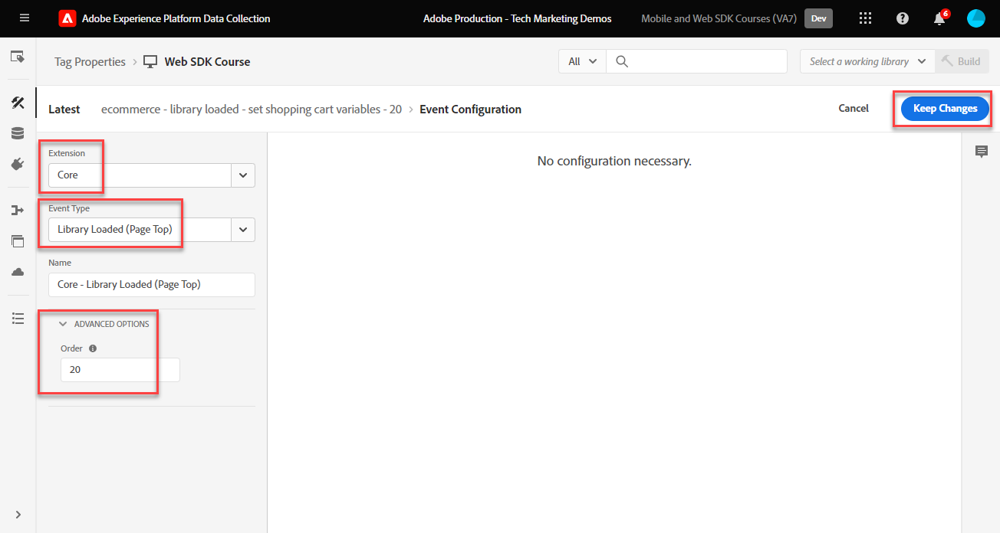

# Création de règles de balise

Découvrez comment envoyer des événements à l’Edge Network Adobe Experience Platform avec votre objet XDM à l’aide de règles de balise. Une règle de balise est une combinaison d’événements, de conditions et d’actions qui indique à la propriété de balise de faire quelque chose. Avec le SDK Web Platform, les règles sont utilisées pour envoyer des événements à l’Edge Network Platform avec les données appropriées.

## Objectifs d&#39;apprentissage

À la fin de cette leçon, vous pouvez :

* Utilisation d’une convention d’affectation de nom pour la gestion des règles dans les balises
* Envoi d’un événement avec des champs XDM à l’aide des actions Mettre à jour la variable et Envoyer un événement
* Empiler plusieurs jeux de champs XDM dans plusieurs règles
* Mappage d’éléments de données de tableau individuels ou entiers à l’objet XDM
* Publier une règle de balise dans une bibliothèque de développement

## Conditions préalables

Vous connaissez bien les balises de collecte de données et la variable [Site de démonstration Luma](https://luma.enablementadobe.com/content/luma/us/en.html) et avoir terminé les leçons précédentes du tutoriel :

* [Configurer un schéma XDM](configure-schemas.md)
* [Configuration d’un espace de noms d’identité](configure-identities.md)
* [Configurer un trains de données](configure-datastream.md)
* [Installer l’extension SDK Web](install-web-sdk.md)
* [Créer des éléments de données](create-data-elements.md)
* [Création d’identités](create-identities.md)

## Conventions de nommage

Pour gérer les règles dans les balises, il est recommandé de respecter une convention d’affectation de nom standard. Ce tutoriel utilise une convention de dénomination en cinq parties :

* [**location**] - [**event**] - [**objectif**] - [**order**]

où ;

1. **location** est la ou les pages du site sur lesquelles la règle se déclenche.
1. **event** est le déclencheur de la règle.
1. **objectif** est l’action principale effectuée par la règle.
1. **order** est l’ordre dans lequel la règle doit se déclencher par rapport aux autres règles.
<!-- minor update -->

## Création de règles de balise

Dans les balises, les règles sont utilisées pour exécuter des actions (appels de déclenchement) sous diverses conditions. L’extension de balises SDK Web Platform comprend deux actions utilisées dans cette leçon :

* **[!UICONTROL Mettre à jour la variable]** mappe des éléments de données aux propriétés dans un objet XDM.
* **[!UICONTROL Envoyer un événement]** envoie l’objet XDM à l’Edge Network Experience Platform ;

Dans le reste de cette leçon, nous :

1. Créez une règle avec la variable **[!UICONTROL Mettre à jour la variable]** pour définir une &quot;configuration globale&quot; des champs XDM.

1. Créez des règles supplémentaires avec la fonction **[!UICONTROL Mettre à jour la variable]** action qui remplace notre &quot;configuration globale&quot; et qui contribue à des champs XDM supplémentaires sous certaines conditions (par exemple, l’ajout de détails de produit sur les pages de produit).

1. Créez une autre règle avec la variable **[!UICONTROL Envoyer un événement]** , qui enverra l’objet XDM complet à Adobe Experience Platform Edge Network.

Toutes ces règles seront séquencées correctement à l’aide de la variable &quot;[!UICONTROL order]&quot;.

Cette vidéo donne un aperçu du processus :

>[!VIDEO](https://video.tv.adobe.com/v/3427710/?learn=on)

### Champs de configuration globaux

Pour créer une règle de balise pour les champs XDM globaux :

1. Ouvrez la propriété de balise que vous utilisez pour ce tutoriel.

1. Accédez à **[!UICONTROL Règles]** dans la navigation de gauche

1. Sélectionnez la variable **[!UICONTROL Créer une règle]** button

   

1. Donnez à la règle le nom `all pages - library loaded - set global variables - 1`.

1. Dans le **[!UICONTROL Événements]** , sélectionnez **[!UICONTROL Ajouter]**

   

1. Utilisez la variable **[!UICONTROL Extension Core]** et sélectionnez **[!UICONTROL Bibliothèque chargée (Haut de page)]** comme la propriété **[!UICONTROL Type d’événement]**

1. Sélectionner **[!UICONTROL Avancé]** menu déroulant et entrée `1` comme la propriété **[!UICONTROL Commande]**

   >[!NOTE]
   >
   > Plus le numéro de commande est bas, plus tôt il s’exécute. Par conséquent, nous donnons à notre &quot;configuration globale&quot; un numéro de commande faible.

1. Sélectionner **[!UICONTROL Conserver les modifications]** pour revenir à l’écran de la règle principale
   

1. Dans le **[!UICONTROL Actions]** , sélectionnez **[!UICONTROL Ajouter]**

1. Comme la variable **[!UICONTROL Extension]**, sélectionnez **[!UICONTROL SDK Web Adobe Experience Platform]**

1. Comme la variable **[!UICONTROL Type d’action]**, sélectionnez **[!UICONTROL Mettre à jour la variable]**

1. Comme la variable **[!UICONTROL Élément de données]**, sélectionnez la variable `xdm.variable.content` que vous avez créé dans la variable [Création d’éléments de données](create-data-elements.md) leçon

   

Maintenant, faites correspondre votre [!UICONTROL éléments de données] à la fonction [!UICONTROL schema] utilisé par votre objet XDM. Vous pouvez mapper des propriétés individuelles ou des objets entiers. Dans cet exemple, vous mappez les propriétés individuelles :

1. Recherchez le champ eventType et sélectionnez-le

1. Saisissez la valeur `web.webpagedetails.pageViews`

   >[!TIP]
   >
   > Pour comprendre les valeurs à renseigner dans la variable `eventType` , vous devez accéder à la page de schéma et sélectionner la variable `eventType` pour afficher les valeurs suggérées sur le rail de droite. Vous pouvez également saisir une nouvelle valeur, si nécessaire.
   > 

1. Recherchez ensuite le `identityMap` dans le schéma et sélectionnez-le.

1. Associer à la variable `identityMap.loginID` élément de données

   

   >[!TIP]
   >
   > Les champs XDM ne seront pas inclus dans la requête réseau si l’élément de données est nul. Par conséquent, lorsque l’utilisateur n’est pas authentifié et que la variable `identityMap.loginID` l’élément de données est nul, la variable `identityMap` ne sera pas envoyé. C&#39;est pourquoi nous pouvons le définir dans notre &quot;configuration globale&quot;.

1. Faites défiler l’écran vers le bas jusqu’à ce que vous atteigniez le **`web`** objet

1. Sélectionner pour l’ouvrir

1. Mappez les éléments de données suivants aux `web` Variables XDM

   * **`web.webPageDetials.name`** vers `%page.pageInfo.pageName%`
   * **`web.webPageDetials.server`** vers `%page.pageInfo.server%`
   * **`web.webPageDetials.siteSection`** vers `%page.pageInfo.hierarchie1%`

1. Définissez `web.webPageDetials.pageViews.value` sur `1`.

   

   >[!TIP]
   >
   > Tant que `eventType` défini sur `web.webpagedetails.pageViews` nor `web.webPageDetails.pageViews.value` Si Adobe Analytics doit traiter une balise en tant que page vue, il est utile d’avoir une méthode standard pour indiquer une page vue pour d’autres applications en aval.

1. Sélectionner **[!UICONTROL Conserver les modifications]** puis **[!UICONTROL Enregistrer]** la règle dans l’écran suivant pour terminer la création de la règle

### Champs de page de produit

Maintenant, commencez à utiliser **[!UICONTROL Mettre à jour la variable]** dans d’autres règles séquencées pour enrichir l’objet XDM avant de l’envoyer à [!UICONTROL Edge Network de plateforme].

>[!TIP]
>
>L’ordre des règles détermine la règle qui s’exécute en premier lorsqu’un événement est déclenché. Si deux règles possèdent le même type d’événement, celle dont le nombre est le plus faible s’exécute en premier.
> 
>

Commencez par effectuer le suivi des consultations de produit sur la page des détails du produit de Luma :

1. Sélectionner **[!UICONTROL Ajouter une règle]**
1. Nommez-le  [!UICONTROL `ecommerce - library loaded - set product details variables - 20`]
1. Sélectionnez la variable  Sous Événement pour ajouter un nouveau déclencheur
1. Sous **[!UICONTROL Extension]**, sélectionnez **[!UICONTROL Core]**
1. Sous **[!UICONTROL Type d’événement]**, sélectionnez **[!UICONTROL Bibliothèque chargée (Haut de page)]**
1. Sélectionner pour ouvrir **[!UICONTROL Options avancées]**, saisissez `20`. Cette valeur de commande permet de s’assurer que la règle s’exécute après la variable `all pages - library loaded - set global variables - 1` qui définit la configuration globale.

   

1. Sous **[!UICONTROL Conditions]**, sélectionnez sur **[!UICONTROL Ajouter]**
1. Laisser **[!UICONTROL Type de logique]** as **[!UICONTROL Normal]**
1. Laisser **[!UICONTROL Extension]** as **[!UICONTROL Core]**
1. Sélectionner **[!UICONTROL Type de condition]** as **[!UICONTROL Chemin sans chaîne de requête]**
1. Sur la droite, activez l’option **[!UICONTROL Regex]** basculer
1. Sous **[!UICONTROL path est égal à]** set `/products/`. Pour le site de démonstration Luma, la règle se déclenche uniquement sur les pages de produits.
1. Sélectionner **[!UICONTROL Conserver les modifications]**

   

1. Sous **[!UICONTROL Actions]** select **[!UICONTROL Ajouter]**
1. Sélectionner **[!UICONTROL SDK Web Adobe Experience Platform]** extension
1. Sélectionner **[!UICONTROL Type d’action]** as **[!UICONTROL Mettre à jour la variable]**
1. Faites défiler l’écran vers le bas jusqu’à `commerce` objet
1. Ouvrez le **[!UICONTROL productViews]** objet et définition **[!UICONTROL value]** to `1`

   

   >[!TIP]
   >
   >La définition de commerce.productViews.value=1 dans XDM correspond automatiquement à la variable `prodView` dans Analytics

1. Faites défiler jusqu’à `eventType` et définissez-le sur `commerce.productViews`

   >[!NOTE]
   >
   >Cette règle ayant un ordre plus élevé, elle remplace la variable `eventType` défini dans la règle &quot;configuration globale&quot;. `eventType` ne peut contenir qu’une seule valeur. Nous vous recommandons de la définir avec l’événement de valeur la plus élevée.

1. Faites défiler l’écran jusqu’à et sélectionnez `productListItems` tableau
1. Sélectionner **[!UICONTROL Fournir des éléments individuels]**
1. Sélectionner **[!UICONTROL Ajouter un élément]**

   

   >[!CAUTION]
   >
   >La variable **`productListItems`** est un `array` type de données afin qu’il s’attende à ce que les données entrent dans une collection d’éléments. En raison de la structure de couche de données du site de démonstration Luma et parce qu’il est possible d’afficher un seul produit à la fois sur le site Luma, vous ajoutez des éléments individuellement. Lors de l’implémentation sur votre propre site web, en fonction de la structure de votre couche de données, vous pouvez fournir un tableau entier.

1. Sélectionner pour ouvrir **[!UICONTROL Élément 1]**
1. Mappez **`productListItems.item1.SKU`** à `%product.productInfo.sku%`.

   

1. Sélectionner **[!UICONTROL Conserver les modifications]**

1. Sélectionner **[!UICONTROL Enregistrer]** pour enregistrer la règle

### Champs du panier

Vous pouvez mapper un tableau entier à un objet XDM, à condition que le tableau corresponde au format du schéma XDM. L’élément de données de code personnalisé `cart.productInfo` vous avez créé des boucles précédentes à l’aide de la fonction `digitalData.cart.cartEntries` objet de couche de données sur Luma et le convertit au format requis de l’objet `productListItems` du schéma XDM.

Pour illustrer cela, reportez-vous à la comparaison ci-dessous de la couche de données du site Luma (à gauche) avec l’élément de données traduit (à droite) :

Comparez l’élément de données à la variable `productListItems` structure (indice, il doit correspondre).

>[!IMPORTANT]
>
>Notez comment les variables numériques sont traduites, avec des valeurs de chaîne dans la couche de données, telles que `price` et `qty` reformaté en nombres dans l’élément de données. Ces exigences de format sont importantes pour l’intégrité des données dans Platform et sont déterminées lors de la [configuration des schémas](configure-schemas.md) étape . Dans l’exemple : **[!UICONTROL quantity]** utilise la variable **[!UICONTROL Entier]** type de données.
> 

Mappons maintenant notre tableau à l’objet XDM :

1. Créez une règle nommée `ecommerce - library loaded - set shopping cart variables - 20`
1. Sélectionnez la variable  Sous Événement pour ajouter un nouveau déclencheur
1. Sous **[!UICONTROL Extension]**, sélectionnez **[!UICONTROL Core]**
1. Sous **[!UICONTROL Type d’événement]**, sélectionnez **[!UICONTROL Bibliothèque chargée (Haut de page)]**
1. Sélectionner pour ouvrir **[!UICONTROL Options avancées]**, saisissez `20`
1. Sélectionner **[!UICONTROL Conserver les modifications]**

   

1. Sous **[!UICONTROL Conditions]**, sélectionnez sur **[!UICONTROL Ajouter]**
1. Laisser **[!UICONTROL Type de logique]** as **[!UICONTROL Normal]**
1. Laisser **[!UICONTROL Extensions]** as **[!UICONTROL Core]**
1. Sélectionner **[!UICONTROL Type de condition]** as **[!UICONTROL Chemin sans chaîne de requête]**
1. À droite, **ne pas** activez la variable **[!UICONTROL Regex]** basculer
1. Sous **[!UICONTROL path est égal à]** set `/content/luma/us/en/user/cart.html`. Pour le site de démonstration Luma, la règle se déclenche uniquement sur la page de panier.
1. Sélectionner **[!UICONTROL Conserver les modifications]**

   

1. Sous **[!UICONTROL Actions]** select **[!UICONTROL Ajouter]**
1. Sélectionner **[!UICONTROL SDK Web Adobe Experience Platform]** extension
1. Sélectionner **[!UICONTROL Type d’action]** as **[!UICONTROL Mettre à jour la variable]**
1. Faites défiler l’écran vers le bas jusqu’à `commerce` et sélectionnez pour l’ouvrir.
1. Ouvrez le **[!UICONTROL productListViews]** objet et définition **[!UICONTROL value]** to `1`

   

   >[!TIP]
   >
   >La définition de commerce.productListViews.value=1 dans XDM correspond automatiquement à la variable `scView` dans Analytics

1. Sélectionner `eventType` et définissez sur `commerce.productListViews`

1. Faites défiler l’écran jusqu’à et sélectionnez **[!UICONTROL productListItems]** tableau

1. Sélectionner **[!UICONTROL Fournir un tableau entier]**

1. Associer à **`cart.productInfo`** élément de données

1. Sélectionner **[!UICONTROL Conserver les modifications]**

1. Sélectionner **[!UICONTROL Enregistrer]** pour enregistrer la règle

Créez deux autres règles pour le passage en caisse et l’achat suivant le même modèle avec les différences suivantes :

**Nom de la règle**: `ecommerce  - library loaded - set checkout variables - 20`

1. **[!UICONTROL Condition]**: /content/luma/us/en/user/checkout.html
1. Définissez `eventType` sur `commerce.checkouts`.
1. Définissez `commerce.checkout.value` sur `1`.

   >[!TIP]
   >
   >Cela équivaut à définir `scCheckout` dans Analytics

**Nom de la règle**: `ecommerce - library loaded - set purchase variables -  20`

1. **[!UICONTROL Condition]**: /content/luma/us/en/user/checkout/order/thank-you.html
1. Définissez `eventType` sur `commerce.purchases`.
1. Définissez `commerce.purchases.value` sur `1`.

   >[!TIP]
   >
   >Cela équivaut à définir `purchase` dans Analytics

1. Définir `commerce.order.purchaseID` à la fonction `cart.orderId` élément de données
1. Définir `commerce.order.currencyCode` à la valeur codée en dur `USD`

   

   >[!TIP]
   >
   >Cela équivaut à définir `s.purchaseID` et `s.currencyCode` dans Analytics

1. Faites défiler l’écran jusqu’à et sélectionnez **[!UICONTROL productListItems]** tableau
1. Sélectionner **[!UICONTROL Fournir un tableau entier]**
1. Associer à **`cart.productInfo.purchase`** élément de données
1. Sélectionnez **[!UICONTROL Enregistrer]**.

Lorsque vous avez terminé, les règles suivantes doivent être créées.

### Envoyer la règle d’événement

Maintenant que vous avez défini les variables, vous pouvez créer la règle pour envoyer l’objet XDM complet à l’Edge Network Platform avec le **[!UICONTROL Envoyer un événement]** action.

1. À droite, sélectionnez **[!UICONTROL Ajouter une règle]** pour créer une autre règle

1. Donnez à la règle le nom `all pages - library loaded - send event - 50`.

1. Dans le **[!UICONTROL Événements]** , sélectionnez **[!UICONTROL Ajouter]**

1. Utilisez la variable **[!UICONTROL Extension Core]** et sélectionnez `Library Loaded (Page Top)` comme la propriété **[!UICONTROL Type d’événement]**

1. Sélectionner **[!UICONTROL Avancé]** menu déroulant et entrée `50` in **[!UICONTROL Commande]**. Cela garantit que la deuxième règle se déclenche après la première règle que vous définissez pour déclencher comme `1`.

1. Sélectionner **[!UICONTROL Conserver les modifications]** pour revenir à l’écran de la règle principale
   

1. Dans le **[!UICONTROL Actions]** , sélectionnez **[!UICONTROL Ajouter]**

1. Comme la variable **[!UICONTROL Extension]**, sélectionnez **[!UICONTROL SDK Web Adobe Experience Platform]**

1. Comme la variable  **[!UICONTROL Type d’action]**, sélectionnez **[!UICONTROL Envoyer un événement]**

1. Comme la variable **[!UICONTROL XDM]**, sélectionnez la variable `xdm.variable.content` élément de données créé dans la leçon précédente

1. Sélectionner **[!UICONTROL Conserver les modifications]** pour revenir à l’écran de la règle principale

   
1. Sélectionner **[!UICONTROL Enregistrer]** pour enregistrer la règle

   

## Publication des règles dans une bibliothèque

Ensuite, publiez la règle dans votre environnement de développement afin que vous puissiez vérifier qu’elle fonctionne.

Pour créer une bibliothèque :

1. Accédez à **[!UICONTROL Flux de publication]** dans la navigation de gauche

1. Sélectionner **[!UICONTROL Ajouter une bibliothèque]**

   
1. Pour le **[!UICONTROL Nom]**, saisissez `Luma Web SDK Tutorial`
1. Pour le **[!UICONTROL Environnement]**, sélectionnez `Development`
1. Sélectionner  **[!UICONTROL Ajouter toutes les ressources modifiées]**

   >[!NOTE]
   >
   >    Vous devriez voir tous les composants de balise créés dans les leçons précédentes. L’extension Core contient le code JavaScript de base requis par toutes les propriétés de balise Web.

1. Sélectionner **[!UICONTROL Enregistrement et création pour le développement]**

   

La création de la bibliothèque peut prendre quelques minutes. Une fois l’opération terminée, un point vert s’affiche à gauche du nom de la bibliothèque :

Comme vous pouvez le voir sur la [!UICONTROL Flux de publication] le processus de publication, qui dépasse le cadre de ce tutoriel, comporte beaucoup d’autres éléments. Ce tutoriel utilise une seule bibliothèque dans votre environnement de développement.

Vous êtes maintenant prêt à valider les données de la requête à l’aide de l’Adobe Experience Platform Debugger .

[Suivant ](validate-with-debugger.md)

>[!NOTE]
>
>Merci d’avoir consacré du temps à l’apprentissage du SDK Web Adobe Experience Platform. Si vous avez des questions, souhaitez partager des commentaires généraux ou avez des suggestions sur le contenu futur, partagez-les à ce sujet. [Article de discussion de la communauté Experience League](https://experienceleaguecommunities.adobe.com/t5/adobe-experience-platform-data/tutorial-discussion-implement-adobe-experience-cloud-with-web/td-p/444996)
