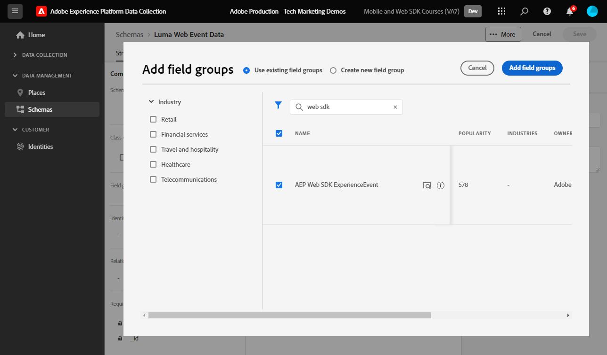

# Création d’un schéma XDM pour les données web

Découvrez comment créer un schéma XDM pour les données web dans l’interface de collecte de données d’Adobe Experience Platform.

Les schémas du modèle de données d’expérience (XDM) sont les blocs de création, les principes et les bonnes pratiques de la collecte de données dans Adobe Experience Platform.

Platform Web SDK utilise votre schéma pour normaliser vos données d’événement web, les envoyer à Platform Edge Network et, finalement, transférer les données à toutes les applications Experience Cloud configurées dans le flux de données. Cette étape est essentielle, car elle définit un modèle de données standard requis pour l’ingestion de données d’expérience client dans Experience Platform et active les services et applications en aval basés sur ces normes.


>[!NOTE]
>
>Un schéma XDM est _non requis_ pour implémenter Adobe Analytics, Adobe Target ou Adobe Audience Manager avec Web SDK (les données peuvent être transmises dans l’objet `data` au lieu de l’objet `xdm`, comme vous le verrez plus loin). Un schéma XDM est requis pour les implémentations les plus performantes des applications natives de Platform telles que Journey Optimizer, Real-Time Customer Data Platform et Customer Journey Analytics. Bien que vous puissiez décider de ne pas utiliser un schéma XDM dans votre propre mise en œuvre, vous devez le faire dans le cadre de ce tutoriel.

## Pourquoi modéliser les données ?

Les entreprises ont leur propre langue pour communiquer sur leur domaine. Les concessionnaires automobiles s&#39;occupent des marques, des modèles et des cylindres. Les compagnies aériennes s&#39;occupent des numéros de vol, de la classe de service et des assignations de sièges. Certains de ces termes sont propres à une entreprise spécifique, d’autres sont partagés entre les secteurs verticaux et d’autres encore sont partagés par presque toutes les entreprises. Pour les termes partagés entre les secteurs verticaux ou même au-delà, vous pouvez commencer à faire des choses puissantes avec vos données en les nommant et en les structurant de manière commune.

Par exemple, de nombreuses entreprises traitent des commandes. Et si, collectivement, ces entreprises décidaient de modéliser une commande de la même manière ? Par exemple, que se passerait-il si le modèle de données était constitué d’un objet avec une propriété `priceTotal` qui représentait le prix total de la commande ? Que se passerait-il si cet objet avait également des propriétés appelées `currencyCode` et `purchaseOrderNumber` ? Peut-être que l’objet de commande contient une propriété nommée `payments` qui serait un tableau d’objets de paiement. Chaque objet représente un paiement pour la commande. Par exemple, un client a peut-être payé une partie de la commande avec une carte cadeau et le reste avec une carte de crédit. Vous pouvez commencer à créer un modèle qui ressemble à ceci :

```json
{
  "order": {
    "priceTotal": 89.50,
    "currencyCode": "EUR",
    "purchaseOrderNumber": "JWN20192388410012",
    "payments": [
      {
        "paymentType": "gift_card",
        "paymentAmount": 50
      },
      {
        "paymentType": "credit_card",
        "paymentAmount": 39.50
      }
    ]
  }
}
```

Si toutes les entreprises traitant des commandes décidaient de modéliser leurs données de commande de manière cohérente pour les termes courants dans le secteur, des choses magiques pourraient commencer à se produire. Les informations pourraient être échangées plus facilement à l’intérieur et à l’extérieur de votre organisation au lieu d’interpréter et de traduire constamment les données (props et evars, quelqu’un d’autre ?). Le machine learning pourrait comprendre plus facilement ce que vos données _signifient_ et fournir des informations exploitables. Les interfaces utilisateur permettant d’extraire des données pertinentes pourraient devenir plus intuitives. Vos données peuvent être intégrées de manière transparente avec les partenaires et les fournisseurs qui suivent la même modélisation.

C’est l’objectif d’Adobe [modèle de données d’expérience](https://business.adobe.com/products/experience-platform/experience-data-model.html). XDM fournit une modélisation prescriptive pour les données courantes dans le secteur, tout en vous permettant d’étendre le modèle en fonction de vos besoins spécifiques. Adobe Experience Platform est construit autour de XDM et, par conséquent, les données envoyées à Experience Platform doivent être dans XDM. Plutôt que de réfléchir à l’endroit et à la manière de transformer vos modèles de données actuels en XDM avant d’envoyer les données à Experience Platform, envisagez d’adopter XDM de manière plus répandue dans votre entreprise afin que la traduction ait rarement besoin de se produire.


>[!NOTE]
>
> À des fins de démonstration, les exercices de cette leçon créent un exemple de schéma pour capturer le contenu consulté et les produits achetés par les clients dans le [site de démonstration Luma](https://newluma.enablementadobe.com). Bien que vous puissiez utiliser ces étapes pour créer un schéma différent pour vos propres besoins, il est recommandé de suivre d’abord la création de l’exemple de schéma pour découvrir les fonctionnalités de l’éditeur de schémas.

Pour en savoir plus sur les schémas XDM, regardez la liste de lecture [Modélisez vos données d’expérience client avec XDM](https://experienceleague.adobe.com/en/playlists/experience-platform-model-your-customer-experience-data-with-xdm) ou consultez la [présentation du système XDM](https://experienceleague.adobe.com/fr/docs/experience-platform/xdm/home).

## Objectifs d’apprentissage

À la fin de cette leçon, vous saurez comment :

* Créer un schéma XDM à partir de l’interface de collecte de données
* Ajouter des groupes de champs à votre schéma XDM
* Création de schémas XDM pour les données d’événement web à l’aide des bonnes pratiques

## Conditions préalables

Tous les approvisionnements et autorisations utilisateur nécessaires pour la collecte de données et Adobe Experience Platform, décrits sur la page [aperçu](overview.md).

## Créer un schéma XDM

Les schémas XDM sont la manière standard de décrire les données dans Experience Platform. Ils permettent à toutes les données conformes aux schémas d’être réutilisées sans conflit au sein d’une organisation et même partagées entre plusieurs organisations. Pour en savoir plus, consultez les [principes de base de la composition de schémas](https://experienceleague.adobe.com/fr/docs/experience-platform/xdm/schema/composition).

Dans cet exercice, vous allez créer un schéma XDM à l’aide des groupes de champs de base recommandés pour capturer les données d’événement web sur le [site de démonstration Luma](https://newluma.enablementadobe.com){target="_blank"} :

1. Ouvrez l’interface [Collecte de données](https://experience.adobe.com/data-collection/){target="_blank"}
1. Vérifiez que vous vous trouvez dans le bon sandbox. Recherchez le sandbox dans le coin supérieur droit

   >[!NOTE]
   >
   >Si vous êtes client d’une application basée sur Platform telle que Real-Time CDP ou Journey Optimizer, nous vous recommandons d’utiliser un sandbox de développement pour ce tutoriel. Si ce n’est pas le cas, utilisez le sandbox **[!UICONTROL Prod]**.

1. Accédez à **[!UICONTROL Schémas]** dans le volet de navigation de gauche
1. Sélectionnez le bouton **[!UICONTROL Créer un schéma]** en haut à droite

   
1. Sélectionnez **[!UICONTROL Manuel]** dans l’écran suivant
1. Sélectionnez **[!UICONTROL Événement d’expérience]** dans l’écran suivant
1. Sélectionnez **[!UICONTROL Suivant]**

   

1. Saisissez le nom de votre schéma sous le champ **[!UICONTROL Nom d’affichage du schéma]**, dans ce cas `Luma Web Event Data`

   >[!TIP]
   >
   >Une convention de nommage courante pour les schémas XDM consiste à nommer le schéma en fonction de la source des données.


1. Sélectionnez **[!UICONTROL Terminer]**

   

## Ajouter des groupes de champs

Comme indiqué précédemment, XDM est le cadre de base qui normalise les données d’expérience client en fournissant des structures et des définitions communes à utiliser dans les services Adobe Experience Platform en aval. En adhérant aux normes XDM, _toutes les données d’expérience client_ peuvent être intégrées dans une représentation commune. Cette approche vous permet d’obtenir des informations précieuses à partir des actions des clients, de définir des audiences de clients par le biais de segments et d’exprimer les attributs du client à des fins de personnalisation à l’aide de données provenant de plusieurs sources. Pour plus d’informations[&#x200B; voir &#x200B;](https://experienceleague.adobe.com/en/docs/experience-platform/xdm/schema/best-practices) Bonnes pratiques pour la modélisation des données .

Lorsque cela est possible, il est recommandé d’utiliser des groupes de champs existants et de respecter un modèle indépendant du produit ainsi que des conventions de dénomination. Pour toutes les données spécifiques à votre organisation qui ne s’intègrent pas dans les groupes de champs prédéfinis ci-dessus, vous pouvez créer un groupe de champs personnalisé. Voir [Création d’un schéma à l’aide de l’éditeur de schémas](https://experienceleague.adobe.com/en/docs/experience-platform/xdm/tutorials/create-schema-ui#create) pour obtenir des instructions plus détaillées sur les schémas personnalisés.

>[!TIP]
> 
>Dans cet exercice, vous ajoutez les groupes de champs prédéfinis recommandés pour la collecte de données web : _&#x200B;**[!UICONTROL AEP Web SDK ExperienceEvent]**&#x200B;_ et _&#x200B;**[!UICONTROL Consumer Experience Event]**&#x200B;_.
>


1. Dans la section **[!UICONTROL Groupes de champs]**, sélectionnez **[!UICONTROL Ajouter]**

   

1. Rechercher des [!UICONTROL `AEP Web SDK ExperienceEvent`]
1. Cochez la case
1. Rechercher des [!UICONTROL `Consumer Experience Event`]
1. Cochez la case
1. Sélectionnez **[!UICONTROL Ajouter des groupes de champs]**

   

Avec les deux groupes de champs, notez que vous avez accès aux paires clé-valeur les plus couramment utilisées, requises pour la collecte de données sur le Web. Le [!UICONTROL nom d’affichage] de chaque champ s’affiche pour les marketeurs dans l’interface du créateur de segments des applications basées sur Platform et vous pouvez modifier le nom d’affichage des champs standard en fonction de vos besoins. Vous pouvez également supprimer les champs que vous ne souhaitez pas. Lorsque vous cliquez sur l’un des noms de groupes de champs, l’interface met en surbrillance les groupements de paires clé-valeur qui lui appartiennent. Dans l’exemple ci-dessous, vous pouvez voir quels champs appartiennent à **[!UICONTROL Événement d’expérience client]**.


Cette leçon n&#39;est qu&#39;un point de départ. Lors de la création de votre propre schéma d’événements web, vous devez explorer et documenter les besoins de votre entreprise. Ce processus est similaire à la création d’un [Document des exigences commerciales](https://experienceleague.adobe.com/en/docs/analytics-learn/tutorials/implementation/implementation-basics/creating-a-business-requirements-document) et d’un [Référence de conception de solution](https://experienceleague.adobe.com/en/docs/analytics-learn/tutorials/implementation/implementation-basics/creating-and-maintaining-an-sdr) pour une implémentation d’Adobe Analytics, mais il doit inclure des exigences pour _tous les destinataires de données en aval_ tels que Platform, Target et les destinations de transfert d’événement.


### Objet identityMap

Un champ spécial est utilisé pour identifier les utilisateurs web, appelé `[!UICONTROL identityMap]`.


Il s’agit d’un objet obligatoire pour toute collecte de données liée au Web, car il héberge l’Experience Cloud ID requis pour identifier les utilisateurs sur le Web. Il s’agit également de la clé pour définir des ID de client internes pour les utilisateurs authentifiés. `[!UICONTROL identityMap]` est abordé plus en détail dans la leçon [Configurer les identités](configure-identities.md). Elle est automatiquement incluse dans tous les schémas à l’aide de la classe **[!UICONTROL XDM ExperienceEvent]**.


>[!IMPORTANT]
>
> Il est possible d’activer **[!UICONTROL Profil]** pour un schéma avant d’enregistrer ce dernier. **Ne pas** activez-la à ce stade. Une fois qu’un schéma est activé pour Profil, il ne peut pas être désactivé ou supprimé sans réinitialiser l’ensemble du sandbox. Les champs ne peuvent pas être supprimés des schémas à ce stade non plus, bien qu’il soit possible de [rendre obsolètes les champs dans l’interface utilisateur](https://experienceleague.adobe.com/en/docs/experience-platform/xdm/tutorials/field-deprecation-ui#deprecate). Il est important de garder ces implications à l’esprit ultérieurement, lorsque vous utiliserez vos propres données dans votre environnement de production.
>
>
>Ce paramètre est abordé plus en détail dans la leçon [Configuration d’Experience Platform](setup-experience-platform.md).
>

Pour suivre cette leçon, sélectionnez **[!UICONTROL Enregistrer]** en haut à droite.


Désormais, vous pouvez référencer ce schéma lorsque vous ajoutez l’extension Web SDK à votre propriété de balise.

>[!NOTE]
>
>Merci d’avoir investi votre temps dans votre apprentissage de Adobe Experience Platform Web SDK. Si vous avez des questions, souhaitez partager des commentaires généraux ou avez des suggestions sur le contenu futur, veuillez les partager dans ce [article de discussion de la communauté Experience League](https://experienceleaguecommunities.adobe.com/adobe-experience-platform-18/tutorial-discussion-implement-adobe-experience-cloud-with-web-sdk-tutorial-248848)
