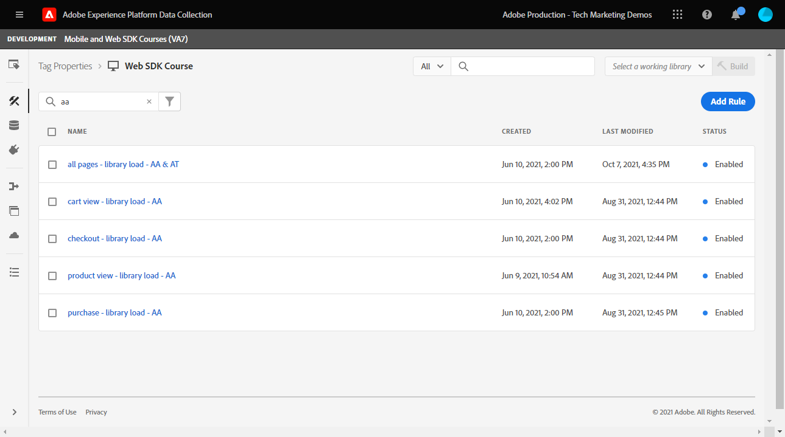

# Configuration d’Adobe Analytics avec le SDK Web de Platform

Découvrez comment configurer Adobe Analytics à l’aide de [SDK Web Experience Platform](https://experienceleague.adobe.com/docs/platform-learn/data-collection/web-sdk/overview.html?lang=fr), créez des règles de balise pour envoyer des données à Adobe Analytics et vérifiez qu’Analytics capture les données comme prévu.

[Adobe Analytics](https://experienceleague.adobe.com/docs/analytics.html?lang=fr) est une application de pointe qui vous permet de comprendre vos clients en tant que personnes et d’orienter votre activité grâce aux renseignements sur vos clients.

## Objectifs d&#39;apprentissage

À la fin de cette leçon, vous saurez comment :

* Configurer un schéma XDM pour Adobe Analytics et comprendre la différence entre les variables XDM mappées automatiquement et manuellement pour Analytics
* Configuration d’un flux de données pour activer Adobe Analytics
* Mappage d’éléments de données de tableau individuels ou entiers à l’objet XDM
* Capture des pages vues dans Adobe Analytics avec l’objet XDM
* Capture des données de commerce électronique avec l’objet XDM pour la chaîne de produit Adobe Analytics
* Les variables Adobe Analytics sont définies avec l’objet XDM à l’aide du débogueur Experience Platform.
* Utilisation de règles de traitement Adobe Analytics pour définir des variables personnalisées
* La validation des données est capturée par Adobe Analytics à l’aide de rapports en temps réel

## Conditions préalables

Vous connaissez les balises, Adobe Analytics et la variable [Site de démonstration Luma](https://luma.enablementadobe.com/content/luma/us/en.html){target="_blank"} fonction de connexion et d’achat.

Vous avez besoin d’au moins un identifiant de suite de rapports de test/développement. Si vous ne disposez pas d’une suite de rapports de test/développement que vous pouvez utiliser pour ce tutoriel, [créez-en une](https://experienceleague.adobe.com/docs/analytics/admin/manage-report-suites/new-report-suite/t-create-a-report-suite.html?lang=fr).

Vous devez avoir suivi toutes les étapes des sections précédentes du tutoriel :

* Configuration initiale
   * [Configurer les autorisations](configure-permissions.md)
   * [Configurer un schéma XDM](configure-schemas.md)
   * [Configuration d’un espace de noms d’identité](configure-identities.md)
   * [Configurer un trains de données](configure-datastream.md)
* Configuration des balises
   * [Installer l’extension SDK Web](install-web-sdk.md)
   * [Créer des éléments de données](create-data-elements.md)
   * [Création d’une règle de balise](create-tag-rule.md)
   * [Validation avec le débogueur Adobe Experience Platform](validate-with-debugger.md)

## Schémas XDM et variables Analytics

Félicitations ! Vous avez déjà configuré un schéma compatible avec Adobe Analytics dans la variable [Configuration d’un schéma](configure-schemas.md) leçon !

La mise en oeuvre du SDK Web Platform doit être aussi indépendante du produit que possible. Pour Adobe Analytics, le mappage des eVars, des props et des événements ne se produit pas lors de la création du schéma, ni pendant la configuration des règles de balise, comme c’est généralement le cas. Au lieu de cela, chaque paire clé-valeur XDM devient une variable de données contextuelles qui correspond à une variable Analytics de l’une des deux façons suivantes :

1. Variables mappées automatiquement à l’aide de champs XDM réservés
1. Variables mappées manuellement à l’aide des règles de traitement Analytics

Pour comprendre quelles variables XDM sont automatiquement mappées à Adobe Analytics, reportez-vous à la section [Variables mappées automatiquement dans Analytics](https://experienceleague.adobe.com/docs/experience-platform/edge/data-collection/adobe-analytics/automatically-mapped-vars.html?lang=en). Toute variable qui n’est pas mappée automatiquement doit être mappée manuellement.

Le schéma créé dans la variable [Configuration d’un schéma](configure-schemas.md) La leçon contient quelques variables mappées automatiquement aux variables Analytics, comme indiqué dans ce tableau :

| XDM vers les variables mappées automatiquement dans Analytics | Variable Adobe Analytics |
|-------|---------|
| `identitymap.ecid.[0].id` | mid |
| `web.webPageDetails.pageViews.value` | un appel s.t() de page vue |
| `web.webPageDetails.name` | s.pageName |
| `web.webPageDetails.server` | s.server |
| `web.webPageDetails.siteSection` | s.channel |
| `commerce.productViews.value` | prodView |
| `commerce.productListViews.value` | scView |
| `commerce.checkouts.value` | scCheckout |
| `commerce.purchases.value` | Achat |
| `commerce.order.currencyCode` | s.currencyCode |
| `commerce.order.purchaseID` | s.purchaseID |
| `productListItems[].SKU` | s.products=;product name;;; (primary - voir la remarque ci-dessous) |
| `productListItems[].name` | s.products=;product name;;; (fallback - voir la remarque ci-dessous) |
| `productListItems[].quantity` | s.products=;;quantité du produit;; |
| `productListItems[].priceTotal` | s.product=;;;prix du produit; |

>[!NOTE]
>
>Les sections individuelles de la chaîne de produit Analytics sont définies par le biais de différentes variables XDM sous la variable `productListItems` .
>Depuis le 18 août 2022, `productListItems[].SKU` est prioritaire pour le mappage au nom du produit dans la variable s.products .
>La valeur définie sur `productListItems[].name` est mappé sur le nom du produit uniquement si `productListItems[].SKU` n’existe pas. Dans le cas contraire, il n’est pas mappé et est disponible dans les données contextuelles.
>Ne définissez pas de chaîne vide ni de valeur nulle sur  `productListItems[].SKU`. Cela a pour effet indésirable de mapper le nom du produit dans la variable s.products .


## Configuration du flux de données

Le SDK Web Platform envoie les données de votre site Web vers Platform Edge Network. Votre flux de données indique ensuite à Platform Edge Network où transférer ces données, dans ce cas, laquelle de vos suites de rapports Adobe Analytics.

1. Accédez à [Collecte de données](https://experience.adobe.com/#/data-collection){target="blank"} interface
1. Dans le volet de navigation de gauche, sélectionnez **[!UICONTROL Datastreams]**
1. Sélectionnez la `Luma Web SDK` datastream

   

1. Sélectionnez **[!UICONTROL Ajouter un service]**
   
1. Sélectionner **[!UICONTROL Adobe Analytics]** comme la propriété **[!UICONTROL Service]**
1. Saisissez le  **[!UICONTROL Identifiant de suite de rapports]** de votre suite de rapports de développement
1. Sélectionnez **[!UICONTROL Enregistrer]**

   

   >[!TIP]
   >
   >Pour ajouter d’autres suites de rapports, sélectionnez **[!UICONTROL Ajouter une suite de rapports]** équivaut au balisage multisuite.

>[!WARNING]
>
>Dans ce tutoriel, vous ne configurez que la suite de rapports Adobe Analytics de développement. Lorsque vous créez des flux de données pour votre propre site web, vous créez des flux de données et des suites de rapports supplémentaires pour vos environnements d’évaluation et de production.


## Création d’éléments de données supplémentaires

Ensuite, capturez les données supplémentaires de la couche de données Luma et envoyez-les à Platform Edge Network. Bien que la leçon porte sur les exigences Adobe Analytics courantes, toutes les données capturées peuvent facilement être envoyées vers d’autres destinations en fonction de votre configuration de flux de données. Par exemple, si vous avez terminé la leçon Adobe Experience Platform, les données supplémentaires que vous capturez dans cette leçon sont également envoyées à Platform.

### Créer des éléments de données de commerce électronique

Lors de la leçon Créer des éléments de données, vous [éléments de données JavaScript créés](create-data-elements.md#create-data-elements-to-capture-the-data-layer) qui a capturé le contenu et les détails de l’identité. Vous allez maintenant créer des éléments de données supplémentaires pour capturer des données de commerce électronique. Parce que la variable [Site de démonstration Luma](https://luma.enablementadobe.com/content/luma/us/en.html){target="_blank"} utilise différentes structures de couche de données pour les pages Détails du produit et les produits du panier. vous devez créer des éléments de données pour chaque scénario. Vous devrez créer des éléments de données de code personnalisé pour obtenir ce dont vous avez besoin de la couche de données Luma, ce qui peut être nécessaire ou non lors de l’implémentation sur votre propre site. Dans ce cas, vous devez passer en revue un tableau d’articles du panier pour obtenir des détails spécifiques sur chaque produit. Utilisez les fragments de code fournis ci-dessous :

1. Ouvrez la propriété de balise que vous utilisez pour le tutoriel.
1. Accédez à **[!UICONTROL Éléments de données]**
1. Sélectionnez **[!UICONTROL Ajouter un élément de données]**
1. Nommez-la **`product.productInfo.sku`**
1. Utilisez la variable **[!UICONTROL Code personnalisé]** **[!UICONTROL Type d’élément de données]**
1. Laissez les cases à cocher pour **[!UICONTROL Forcer la valeur en minuscules]** et **[!UICONTROL Texte clair]** unchecked
1. Laisser `None` comme la propriété **[!UICONTROL Durée de stockage]** car cette valeur est différente sur chaque page
1. Sélectionnez **[!UICONTROL Ouvrir l’éditeur]**

   

1. Copiez-collez le code suivant

   ```javascript
   var cart = digitalData.product;
   var cartItem;
   cart.forEach(function(item){
   cartItem = item.productInfo.sku;
   });
   return cartItem;
   ```

1. Sélectionner **[!UICONTROL Enregistrer]** pour enregistrer le code personnalisé

   

1. Sélectionner **[!UICONTROL Enregistrer]** enregistrement de l’élément de données

Suivez les mêmes étapes pour créer ces éléments de données supplémentaires :

* **`product.productInfo.title`**

  ```javascript
  var cart = digitalData.product;
  var cartItem;
  cart.forEach(function(item){
  cartItem = item.productInfo.title;
  });
  return cartItem;
  ```

* **`cart.productInfo`**

  ```javascript
  var cart = digitalData.cart.cartEntries;
  var cartItem = [];
  cart.forEach(function(item, index, array){
  var qty = parseInt(item.qty);
  var price = parseInt(item.price);
  cartItem.push({
  "SKU": item.sku,
  "name":item.title,
  "quantity":qty,
  "priceTotal":price
  });
  });
  return cartItem;
  ```

Après avoir ajouté ces éléments de données et créé les éléments précédents dans la variable [Création d’éléments de données](create-data-elements.md) Pour la leçon, vous devez disposer des éléments de données suivants :

| Éléments de données |
-----------------------------|
| `cart.orderId` |
| `cart.productInfo` |
| `identityMap.loginID` |
| `page.pageInfo.hierarchie1` |
| `page.pageInfo.pageName` |
| `page.pageInfo.server` |
| `product.productInfo.sku` |
| `product.productInfo.title` |
| `user.profile.attributes.loggedIn` |
| `user.profile.attributes.username` |
| `xdm.content` |

>[!IMPORTANT]
>
>Dans ce tutoriel, vous allez créer un objet XDM différent pour chaque événement. Cela signifie que vous devez remapper les variables qui seraient considérées comme étant &quot;globalement&quot; disponibles pour chaque accès, comme le nom de page et identityMap. Cependant, vous pouvez [Fusionner les objets](https://experienceleague.adobe.com/docs/experience-platform/tags/extensions/adobe/core/overview.html#merged-objects) ou utilisez [Mappage de tableaux](https://exchange.adobe.com/experiencecloud.details.103136.mapping-table.html) pour gérer vos objets XDM plus efficacement en situation réelle. Pour cette leçon, les variables globales sont considérées comme :
>
>* **[!UICONTROL identityMap]** pour capturer l’ID authentifié en fonction de la variable [Créer un élément de données de carte des identités](create-data-elements.md#create-identity-map-data-element) dans la variable [Création d’éléments de données](create-data-elements.md) leçon.
>* **[!UICONTROL web]** pour capturer le contenu conformément aux [objet XDM de contenu](create-data-elements.md#map-content-data-elements-to-XDM-Schema-individually) dans la variable [Création d’éléments de données](create-data-elements.md) leçon sur chaque élément de données ci-dessus.

### Incrémenter les pages vues

Dans la leçon Créer des éléments de données , vous [a créé une `xdm.content` élément de données](create-data-elements.md#map-content-data-elements-to-xdm-schema-individually) pour capturer des dimensions de contenu. Puisque vous envoyez maintenant des données à Adobe Analytics, vous devez également mapper un champ XDM supplémentaire pour indiquer qu’une balise doit être traitée comme une page vue d’Analytics.

1. Ouvrez votre `xdm.content` élément de données
1. Faites défiler la page vers le bas et sélectionnez cette option pour ouvrir jusqu’à `web.webPageDetails`
1. Sélectionnez cette option pour ouvrir le **[!UICONTROL pageViews]** objet
1. Définir **[!UICONTROL value]** to `1`
1. Sélectionnez [!UICONTROL **Enregistrer**]

   

>[!TIP]
>
>Ce champ équivaut à envoyer une **`s.t()`** balise de page vue pour Analytics à l’aide de `AppMeasurement.js`. Pour une balise de clic sur un lien, définissez la variable `webInteraction.linkClicks.value` to `1`


### Définition de la chaîne de produit

Avant de procéder à la mise en correspondance avec la chaîne de produit, il est important de comprendre qu’il existe deux objets principaux dans le schéma XDM utilisés pour capturer des données de commerce électronique ayant des relations spéciales avec Adobe Analytics :

1. La variable `commerce` définit des événements Analytics tels que `prodView`, `scView`, et `purchase`
1. La variable `productListItems` définit des dimensions Analytics telles que `productID`.

Voir [Collecte de données commerciales et de produits](https://experienceleague.adobe.com/docs/experience-platform/edge/data-collection/collect-commerce-data.html?lang=en) pour plus d’informations.

Il est également important de comprendre que vous pouvez **[!UICONTROL fournir des attributs individuels ;]** vers des champs XDM individuels ou **[!UICONTROL fournir un tableau entier ;]** à un objet XDM.


### Mappage d’attributs individuels à un objet XDM

Vous pouvez mapper sur des variables individuelles pour capturer des données sur la page des détails du produit du site de démonstration Luma :

1. Créez un **[!UICONTROL Objet XDM]** **[!UICONTROL Type d’élément de données]** named **`xdm.commerce.prodView`**
1. Sélectionnez le même environnement de test Platform et schéma XDM utilisé dans les leçons précédentes.
1. Ouvrez le **[!UICONTROL commerce]** objet
1. Ouvrez le **[!UICONTROL productViews]** objet et définition **[!UICONTROL value]** to `1`

   

   >[!TIP]
   >
   >Cette étape équivaut à définir `prodView` dans Analytics


1. Faites défiler l’écran jusqu’à et sélectionnez `productListItems` tableau
1. Sélectionner **[!UICONTROL Fournir des éléments individuels]**
1. Sélectionner **[!UICONTROL Ajouter un élément]**

   

   >[!CAUTION]
   >
   >La variable **`productListItems`** est un `array` type de données afin qu’il s’attende à ce que les données entrent dans une collection d’éléments. En raison de la structure de couche de données du site de démonstration Luma et parce qu’il est possible d’afficher un seul produit à la fois sur le site Luma, vous allez ajouter des éléments individuellement. Lors de l’implémentation sur votre propre site web, en fonction de la structure de votre couche de données, vous pouvez fournir un tableau entier.

1. Sélectionner pour ouvrir **[!UICONTROL Élément 1]**
1. Mappage des variables XDM suivantes aux éléments de données

   * **`productListItems.item1.SKU`** vers `%product.productInfo.sku%`
   * **`productListItems.item1.name`** vers `%product.productInfo.title%`

   

   >[!IMPORTANT]
   >
   >Avant d’enregistrer cet objet XDM, veillez à définir les variables &quot;globales&quot; et l’incrémenteur de page vue :
   >

1. Sélectionnez **[!UICONTROL Enregistrer]**

### Mappage d’un tableau entier à un objet XDM

Comme nous l’avons vu précédemment, le site de démonstration Luma utilise une structure de couche de données différente pour les produits du panier. L’élément de données de code personnalisé `cart.productInfo` élément de données que vous avez créé précédemment par le biais des boucles `digitalData.cart.cartEntries` objet de couche de données et le convertit en schéma d’objet XDM requis. Le nouveau format **doit correspondre exactement** le schéma défini par la variable `productListItems` du schéma XDM.

Pour illustrer cela, reportez-vous à la comparaison ci-dessous de la couche de données du site Luma (à gauche) avec l’élément de données traduit (à droite) :


Comparez l’élément de données à la variable `productListItems` structure (indice, il doit correspondre).

>[!IMPORTANT]
>
>Notez comment les variables numériques sont traduites, avec des valeurs de chaîne dans la couche de données, telles que `price` et `qty` reformaté en nombres dans l’élément de données. Ces exigences de format sont importantes pour l’intégrité des données dans Platform et sont déterminées lors de la [configuration des schémas](configure-schemas.md) étape . Dans l’exemple : **[!UICONTROL quantity]** utilise la variable **[!UICONTROL Entier]** type de données.
> 

Revenez à la mise en correspondance de l’objet XDM avec un tableau entier. Créez un élément de données d’objet XDM pour capturer les produits sur la page de panier :

1. Créez un **[!UICONTROL Objet XDM]** **[!UICONTROL Type d’élément de données]** named **`xdm.commerce.cartView`**
1. Sélectionnez le même environnement de test Platform et schéma XDM que celui que vous utilisez pour ce tutoriel.
1. Ouvrez le **[!UICONTROL commerce]** objet
1. Ouvrez le **[!UICONTROL productListViews]** objet et définition `value` to `1`

   >[!TIP]
   >
   >Cette étape équivaut à définir `scView` dans Analytics

1. Faites défiler l’écran jusqu’à et sélectionnez **[!UICONTROL productListItems]** tableau
1. Sélectionner **[!UICONTROL Fournir un tableau entier]**
1. Associer à **`cart.productInfo`** élément de données

   

   >[!IMPORTANT]
   >
   >Avant d’enregistrer cet objet XDM, veillez à définir les variables &quot;globales&quot; et l’incrémenteur de page vue :
   >

1. Sélectionnez **[!UICONTROL Enregistrer]**

Créer un autre **[!UICONTROL Objet XDM]**  **[!UICONTROL Type d’élément de données]** pour les paiements appelés `xdm.commerce.checkout`. Cette fois, la variable **[!UICONTROL commerce.checkouts.value]** to `1`, map **[!UICONTROL productListItems]** to **`cart.productInfo`** comme vous venez de le faire, ajoutez les variables &quot;globales&quot; et le compteur de pages vues.

>[!TIP]
>
>Cette étape équivaut à définir `scCheckout` dans Analytics


Il existe d’autres étapes pour capturer la variable `purchase` event:

1. Créer un autre  **[!UICONTROL Objet XDM]**  **[!UICONTROL Type d’élément de données]** pour les achats appelés `xdm.commerce.purchase`
1. Ouvrir **[!UICONTROL commerce]** objet
1. Ouvrez le **[!UICONTROL order]** objet
1. Carte **[!UICONTROL purchaseID]** à la fonction `cart.orderId` élément de données
1. Définir **[!UICONTROL currencyCode]** à la valeur codée en dur `USD`

   

   >[!TIP]
   >
   >Cela équivaut à définir `s.purcahseID` et `s.currencyCode` dans Analytics

1. Sélectionnez cette option pour ouvrir le `purchases` objet et définition `value` to `1`
   >[!TIP]
   >
   >Cela équivaut à définir `purchase` dans Analytics

   >[!IMPORTANT]
   >
   >Avant d’enregistrer cet objet XDM, veillez à définir les variables &quot;globales&quot; et l’incrémenteur de page vue :
   >

1. Sélectionnez **[!UICONTROL Enregistrer]**

À la fin de ces étapes, vous devez créer les cinq éléments de données d’objet XDM suivants :

| Éléments de données d’objet XDM |
-----------------------------|
| `xdm.commerce.cartView` |
| `xdm.commerce.checkout` |
| `xdm.commerce.prodView` |
| `xdm.commerce.purchase` |
| `xdm.content` |


## Création de règles supplémentaires pour le SDK Web Platform

Avec les multiples éléments de données d’objet XDM créés, vous êtes prêt à définir les balises à l’aide de règles. Dans cet exercice, vous créez des règles individuelles par événement de commerce électronique et utilisez des conditions de sorte que les règles se déclenchent sur les pages appropriées. Commençons par un événement Consultation produit.

1. Dans le volet de navigation de gauche, sélectionnez **[!UICONTROL Règles]** puis sélectionnez **[!UICONTROL Ajouter une règle]**
1. Nommez-la  [!UICONTROL `product view - library load - AA`]
1. Sous **[!UICONTROL Événements]**, sélectionnez **[!UICONTROL Bibliothèque chargée (Haut de page)]**
1. Sous **[!UICONTROL Conditions]**, sélectionnez sur **[!UICONTROL Ajouter]**

   

1. Laisser **[!UICONTROL Type de logique]** as **[!UICONTROL Normal]**
1. Laisser **[!UICONTROL Extensions]** as **[!UICONTROL Core]**
1. Sélectionner **[!UICONTROL Type de condition]** as **[!UICONTROL Chemin sans chaîne de requête]**
1. Sur la droite, activez l’option **[!UICONTROL Regex]** basculer
1. Sous **[!UICONTROL path est égal à]** set `/products/`. Pour le site de démonstration Luma, la règle se déclenche uniquement sur les pages de produits.
1. Sélectionnez **[!UICONTROL Conserver les modifications]**

   

1. Sous **[!UICONTROL Actions]** select **[!UICONTROL Ajouter]**
1. Sélectionner **[!UICONTROL SDK Web Adobe Experience Platform]** extension
1. Sélectionner **[!UICONTROL Type d’action]** as **[!UICONTROL Envoyer un événement]**
1. La variable **[!UICONTROL Type]** comporte une liste déroulante de valeurs parmi lesquelles choisir. Sélectionnez `[!UICONTROL commerce.productViews]`

   >[!TIP]
   >
   >La valeur sélectionnée ici n’a aucun effet sur la façon dont les données sont mappées à Analytics. Toutefois, il est recommandé d’appliquer cette variable de manière réfléchie, car elle est utilisée dans l’interface du créateur de segments de Adobe Experience Platform. La valeur sélectionnée peut être utilisée dans la variable `[!UICONTROL c.a.x.eventtype]` de données contextuelles en aval.

1. Sous **[!UICONTROL Données XDM]**, sélectionnez la variable `[!UICONTROL xdm.commerce.prodView]` Elément de données d’objet XDM
1. Sélectionnez **[!UICONTROL Conserver les modifications]**

   

1. Votre règle doit ressembler à celle ci-dessous. Sélectionnez **[!UICONTROL Enregistrer]**

   


Répétez la même opération pour tous les autres événements de commerce électronique à l’aide des paramètres suivants :

**Nom de la règle**: affichage du panier - chargement de bibliothèque - AA

* **[!UICONTROL Type d’événement]**: bibliothèque chargée (haut de page)
* **[!UICONTROL Condition]**: /content/luma/us/en/user/cart.html
* **Valeur de type sous SDK Web - Action d’envoi**: commerce.productListViews
* **Données XDM pour SDK Web - Envoyer l’action :** `%xdm.commerce.cartView%`

**Nom de la règle**: passage en caisse - chargement de bibliothèque - AA

* **[!UICONTROL Type d’événement]**: bibliothèque chargée (haut de page)
* **[!UICONTROL Condition]** /content/luma/us/en/user/checkout.html
* **Type pour le SDK web - Action d’envoi**: commerce.checkouts
* **Données XDM pour SDK Web - Envoyer l’action :** `%xdm.commerce.checkout%`

**Nom de la règle**: purchase - chargement de bibliothèque - AA

* **[!UICONTROL Type d’événement]**: bibliothèque chargée (haut de page)
* **[!UICONTROL Condition]** /content/luma/us/en/user/checkout/order/thank-you.html
* **Type pour le SDK web - Action d’envoi**: commerce.achats
* **Données XDM pour SDK Web - Envoyer l’action :** `%xdm.commerce.purchase%`

Lorsque vous avez terminé, les règles suivantes doivent être créées.



## Créer votre environnement de développement

Ajoutez vos nouveaux éléments de données et vos nouvelles règles à vos `Luma Web SDK Tutorial` bibliothèque de balises et recréez votre environnement de développement.


## Validation d’Adobe Analytics pour le SDK Web Platform

Dans le [Debugger](validate-with-debugger.md) leçon, vous avez appris à inspecter la balise d’objet XDM côté client avec Platform Debugger et la console de développement du navigateur, ce qui est similaire à la façon dont vous déboguez une `AppMeasurement.js` Mise en oeuvre d’Analytics. Pour valider qu’Analytics capture correctement les données par le biais du SDK Web Platform, vous devez suivre deux étapes pour :

1. Validation de la manière dont les données sont traitées par l’objet XDM sur Platform Edge Network, à l’aide de la fonction Edge Trace du débogueur Experience Platform
1. Validez le traitement des données par Analytics à l’aide des règles de traitement et des rapports en temps réel.

### Utilisation d’Edge Trace

Découvrez comment vérifier qu’Adobe Analytics capture l’ECID, les pages vues, la chaîne de produit et les événements de commerce électronique avec la fonction Edge Trace du débogueur Experience Platform.

### Validation des identifiants Experience Cloud

1. Accédez au [Site de démonstration Luma](https://luma.enablementadobe.com/content/luma/us/en.html){target="_blank"} et utilisez le débogueur Experience Platform pour [basculez la propriété de balise sur le site sur votre propre propriété de développement.](validate-with-debugger.md#use-the-experience-platform-debugger-to-map-to-your-tags-property)

   >[!WARNING]
   >
   >Avant de poursuivre, assurez-vous d’être connecté au site Luma.  Si vous n’êtes pas connecté, le site Luma ne vous permet pas d’extraire.
   >
   > 1. Sur Luma, sélectionnez le bouton de connexion en haut à droite et utilisez les informations d’identification. **u : test@adobe.com p: test** pour vous authentifier
   >
   > 1. Vous serez automatiquement redirigé vers le [Page produit Didi Sport Watch](https://luma.enablementadobe.com/content/luma/us/en/products/gear/watches/didi-sport-watch.html#24-WG02) lors du chargement de la page suivante

1. Pour activer Edge Trace, accédez à Experience Platform Debugger, dans le volet de navigation de gauche, sélectionnez **[!UICONTROL Journaux]**, puis sélectionnez la variable **[!UICONTROL Edge]** et sélectionnez **[!UICONTROL Connexion]**

   

1. Il sera vide pour l’instant.

   

1. Actualisez la variable [Page produit Didi Sport Watch](https://luma.enablementadobe.com/content/luma/us/en/products/gear/watches/didi-sport-watch.html#24-WG02) et vérifiez à nouveau le débogueur Experience Platform, les données doivent passer. La ligne commençant par **[!UICONTROL RSID de mappage automatique Analytics]** est la balise Adobe Analytics
1. Sélectionnez cette option pour ouvrir les deux `[!UICONTROL mappedQueryParams]` Liste déroulante et deuxième liste déroulante pour afficher les variables Analytics

   

   >[!TIP]
   >
   >La deuxième liste déroulante correspond à l’identifiant de suite de rapports Analytics auquel vous envoyez des données. Elle doit correspondre à votre propre suite de rapports, et non à celle de la capture d’écran.

1. Faire défiler vers le bas pour trouver `[!UICONTROL c.a.x.identitymap.ecid.[0].id]`. Il s’agit d’une variable de données contextuelles qui capture ECID.
1. Continuez à faire défiler l’écran vers le bas jusqu’à ce que vous voyiez Analytics `[!UICONTROL mid]` Variable . Les deux identifiants correspondent à l’identifiant Experience Cloud de votre appareil.

   

   >[!NOTE]
   >
   >Puisque vous êtes connecté, prenez quelques instants pour valider l’ID authentifié. `112ca06ed53d3db37e4cea49cc45b71e` pour l’utilisateur **test@adobe.com** est également capturé dans la variable `[!UICONTROL c.a.x.identitymap.lumacrmid.[0].id]`


### Pages vues du contenu

Vous utilisez la même balise pour valider que les pages vues du contenu sont capturées par Analytics.

1. Recherchez `[!UICONTROL c.a.x.web.webpagedetails.pageviews.value]=1`. Cela vous dit que `s.t()` La balise de page vue est envoyée à Analytics
1. Faites défiler l’écran vers le bas pour afficher la `[!UICONTROL gn]` Variable . Il s’agit de la syntaxe dynamique Analytics de la variable `[!UICONTROL s.pageName]` Variable . Il capture le nom de la page à partir de la couche de données.

   

### Chaîne de produit et événements de commerce électronique

Comme vous vous trouvez déjà sur une page de produit, cet exercice continue d’utiliser la même trace Edge pour valider que les données de produit sont capturées par Analytics. Les événements de chaîne de produit et de commerce électronique sont automatiquement associés à des variables XDM dans Analytics. Tant que vous avez mappé sur le `productListItem` Variable XDM pendant [configuration d’un schéma XDM pour Adobe Analytics](setup-analytics.md#configure-an-xdm-schema-for-adobe-analytics), le réseau Platform Edge s’occupe de mapper les données aux variables d’analyse appropriées.

1. Commencez par valider que la variable `Product String` est défini
1. Recherchez `[!UICONTROL c.a.x.productlistitems.][0].[!UICONTROL sku]`. La variable capture la valeur de l’élément de données que vous avez mappée à la variable `productListItems.item1.sku` plus tôt dans cette leçon
1. Faites défiler l’écran vers le bas pour afficher la `[!UICONTROL pl]` Variable . Il s’agit de la syntaxe dynamique de la variable de chaîne de produit Analytics.
1. Les deux valeurs correspondent au nom de produit disponible dans la couche de données.

   

Le suivi Edge traite `commerce` événements légèrement différents `productList` dimensions. Une variable de données contextuelles n’est pas mappée de la même manière que le nom du produit est mappé sur `[!UICONTROL c.a.x.productlistitem.[0].name]` ci-dessus. À la place, le suivi Edge affiche le mappage automatique de l’événement final dans Analytics. `event` Variable . Platform Edge Network mappe ce contenu en conséquence tant que vous mappez à la XDM appropriée. `commerce` Variable while [configuration du schéma pour Adobe Analytics](setup-analytics.md#configure-an-xdm-schema-for-adobe-analytics); dans ce cas, la variable `commerce.productViews.value=1`.

1. De retour dans la fenêtre du débogueur Experience Platform, faites défiler l’écran jusqu’au `[!UICONTROL event]` est définie sur `[!UICONTROL prodView]`

   

Validez le reste des événements de commerce électronique et les chaînes de produits définis pour Analytics.

1. Ajouter [Didi Sport Watch](https://luma.enablementadobe.com/content/luma/us/en/products/gear/watches/didi-sport-watch.html#24-WG02) au panier
1. Accédez au [Page Panier](https://luma.enablementadobe.com/content/luma/us/en/user/cart.html), vérifiez Edge Trace pour `[!UICONTROL events: "scView"]` et la chaîne de produit

   

1. Passez à l’extraction, cochez Edge Trace pour `[!UICONTROL events: "scCheckout"]` et la chaîne de produit

   

1. Remplissez uniquement les **Prénom** et **Nom** champs du formulaire d’expédition et sélectionnez **Continuer**. Sur la page suivante, sélectionnez **Passer commande**
1. Sur la page de confirmation, vérifiez Edge Trace pour

   * Événement d’achat en cours de définition `[!UICONTROL events: "purchase"]`
   * Variable de code de devise en cours de définition `[!UICONTROL cc: "USD"]`
   * Identifiant d’achat défini dans `[!UICONTROL pi]`
   * Chaîne de produit `[!UICONTROL pl]` définition du nom, de la quantité et du prix du produit

   

## Règles de traitement et rapports en temps réel

Maintenant que vous avez validé les balises Analytics avec Edge Trace, vous pouvez également valider que les données sont traitées par Analytics à l’aide des rapports en temps réel. Avant de vérifier les rapports en temps réel, vous devez configurer les règles de traitement pour Analytics. `props` selon les besoins.

### Règles de traitement pour les mappages Analytics personnalisés

Dans cet exercice, vous mappez une variable XDM à une prop afin de pouvoir l’afficher dans les rapports en temps réel. Suivez les mêmes étapes que pour tout mappage personnalisé que vous devez effectuer pour n’importe quel mappage `eVar`, `prop`, `event`ou accessible via les règles de traitement.

1. Dans l’interface utilisateur d’Analytics, accédez à [!UICONTROL Administration] > [!UICONTROL Outils d’administration] > [!UICONTROL Suites de rapports]
1. Sélectionnez la suite de rapports de développement/test que vous utilisez pour le tutoriel > [!UICONTROL Modifier les paramètres] > [!UICONTROL Général] > [!UICONTROL Règles de traitement]

   

1. Création d’une règle pour **[!UICONTROL Remplacer la valeur de]** `[!UICONTROL Product Name (prop1)]` to `a.x.productlistitems.0.name`. N’oubliez pas d’ajouter votre note expliquant pourquoi vous créez la règle et nommez son titre. Sélectionnez **[!UICONTROL Enregistrer]**

   

   >[!IMPORTANT]
   >
   >La première fois que vous mappez à une règle de traitement, l’interface utilisateur ne vous affiche pas les variables de données contextuelles de l’objet XDM. Pour corriger les éléments qui sélectionnent une valeur, cliquez sur Enregistrer pour revenir à la modification. Toutes les variables XDM doivent maintenant apparaître.

1. Accédez à [!UICONTROL Modifier les paramètres] >  [!UICONTROL Temps réel]. Configurez les trois avec les paramètres ci-dessous afin de pouvoir valider les pages vues du contenu, les consultations de produits et les achats.

   

1. Répétez les étapes de validation. Vous devriez constater que les rapports en temps réel renseignent les données en conséquence.

   **Pages vues**
   

   **Consultations produits**
   

   **Achats**
   

1. Dans l’interface utilisateur de Workspace, créez un tableau pour afficher le flux de commerce électronique complet du produit que vous avez acheté.

   

Pour en savoir plus sur le mappage des champs XDM aux variables Analytics, visionnez la vidéo [Mappage des variables du SDK Web dans Adobe Analytics](https://experienceleague.adobe.com/docs/analytics-learn/tutorials/analysis-use-cases/internal-site-search/map-web-sdk-variables-into-adobe-analytics.html).

Félicitations ! C’est la fin de la leçon et vous êtes maintenant prêt à mettre en oeuvre Adobe Analytics avec le SDK Web Platform pour votre propre site web.

[Suivant : ](setup-audience-manager.md)

>[!NOTE]
>
>Merci d’avoir consacré du temps à l’apprentissage du SDK Web Adobe Experience Platform. Si vous avez des questions, souhaitez partager des commentaires généraux ou avez des suggestions sur le contenu futur, partagez-les à ce sujet. [Article de discussion de la communauté Experience League](https://experienceleaguecommunities.adobe.com/t5/adobe-experience-platform-launch/tutorial-discussion-implement-adobe-experience-cloud-with-web/td-p/444996)
