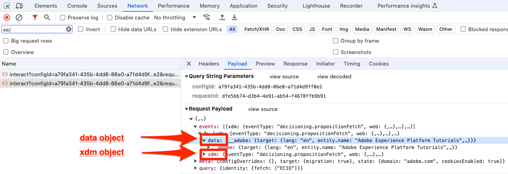

# Configuration d’Adobe Analytics avec Adobe Experience Platform Web SDK

Découvrez comment configurer Adobe Analytics à l’aide de [Adobe Experience Platform Web SDK](https://experienceleague.adobe.com/en/docs/platform-learn/data-collection/web-sdk/overview), créer des règles de balise pour envoyer des données à Adobe Analytics et vérifier qu’Analytics capture les données comme prévu.

[Adobe Analytics](https://experienceleague.adobe.com/fr/docs/analytics) est une application de pointe qui vous permet de comprendre vos clients en tant que personnes et d’orienter votre activité grâce aux renseignements sur vos clients.

## Objectifs d’apprentissage

À la fin de cette leçon, vous saurez comment :

* Configurer un flux de données pour activer Adobe Analytics
* Savoir quels champs XDM standard mappent automatiquement aux variables Analytics
* Définition de variables Analytics dans l’objet de données
* Envoyer des données à une autre suite de rapports en remplaçant le flux de données
* Validation des variables Adobe Analytics à l’aide de Debugger et d’Assurance

## Conditions préalables

Pour suivre cette leçon, vous devez d’abord :

* être familiarisé avec Adobe Analytics et y avoir accès ;

* Disposer d’au moins un identifiant de suite de rapports de test/développement. Si vous ne disposez pas d’une suite de rapports de test/développement que vous pouvez utiliser pour ce tutoriel, [veuillez en créer une](https://experienceleague.adobe.com/en/docs/analytics/admin/admin-tools/manage-report-suites/c-new-report-suite/t-create-a-report-suite).

* Suivez les leçons précédentes des sections Configuration initiale et Configuration des balises de ce tutoriel.

## Configurer le flux de données

Platform Web SDK envoie des données de votre site Web vers Platform Edge Network. Votre flux de données indique ensuite à Platform Edge Network à quelles suites de rapports Adobe Analytics vos données doivent être envoyées.

1. Accédez à l’interface [Collecte de données](https://experience.adobe.com/#/data-collection){target="blank"}
1. Dans le volet de navigation de gauche, sélectionnez **[!UICONTROL Flux de données]**
1. Sélectionnez le flux de données `Luma Web SDK: Development Environment` créé précédemment

   

1. Sélectionnez **[!UICONTROL Ajouter un service]**
   
1. Sélectionnez **[!UICONTROL Adobe Analytics]** comme **[!UICONTROL Service]**
1. Saisissez l’**[!UICONTROL identifiant de suite de rapports]** de votre suite de rapports de développement
1. Sélectionnez **[!UICONTROL Enregistrer]**

   

   >[!TIP]
   >
   >L’ajout de suites de rapports supplémentaires en sélectionnant **[!UICONTROL Ajouter une suite de rapports]** équivaut au balisage multisuite.

>[!WARNING]
>
>Dans ce tutoriel, vous configurez uniquement la suite de rapports Adobe Analytics pour votre environnement de développement. Lorsque vous créez des flux de données pour votre propre site web, vous devez créer des flux de données et des suites de rapports supplémentaires pour vos environnements d’évaluation et de production.

## Définition des variables Analytics

Il existe plusieurs façons de définir des variables Analytics dans une implémentation de Web SDK :

1. Mappage automatique des champs XDM aux variables Analytics (automatique).
1. Définissez des champs dans l’objet `data` (recommandé).
1. Mapper des champs XDM aux variables Analytics dans les règles de traitement Analytics (n’est plus recommandé).
1. Mappez aux variables Analytics directement dans le schéma XDM (cela n’est plus recommandé).

Depuis mai 2024, il n’est plus nécessaire de créer un schéma XDM pour implémenter Adobe Analytics avec Platform Web SDK. L’objet `data` (et l’élément de données `data.variable` que vous avez créé dans la leçon [Créer des éléments de données](create-data-elements.md)) peut être utilisé pour définir toutes les variables Analytics personnalisées. La définition de ces variables dans l’objet de données sera familière aux clients Analytics existants, sera plus efficace que l’utilisation de l’interface des règles de traitement et évitera que des données inutiles n’occupent de l’espace dans les profils clients en temps réel (important si vous disposez de Real-Time Customer Data Platform ou de Journey Optimizer).

### Champs mappés automatiquement

De nombreux champs XDM sont automatiquement mappés à des variables Analytics. Pour obtenir la liste la plus récente des mappages, reportez-vous à la section [Mappage des variables Analytics dans Adobe Experience Edge](https://experienceleague.adobe.com/en/docs/experience-platform/edge/data-collection/adobe-analytics/automatically-mapped-vars).

Cela se produit si _même si vous n’avez pas défini de schéma personnalisé_. Experience Platform Web SDK collecte automatiquement certaines données et les envoie vers Platform Edge Network sous forme de champs XDM. Par exemple, Web SDK lit l’URL de la page active et l’envoie en tant que `web.webPageDetails.URL` de champ XDM. Ce champ est transféré vers Adobe Analytics et renseigne automatiquement les rapports URL de la page dans Adobe Analytics.

Si vous implémentez Web SDK pour Adobe Analytics avec un schéma XDM, comme vous l’avez fait dans ce tutoriel, certains des champs XDM que vous avez mis en œuvre de manière personnalisée sont automatiquement mappés aux variables Analytics, comme indiqué dans ce tableau :

| Variables mappées automatiquement de XDM à Analytics | Variable Adobe Analytics |
|-------|---------|
| `identitymap.ecid.[0].id` | mid |
| `web.webPageDetails.name` | s.pageName |
| `commerce.productViews.value` | prodView |
| `commerce.productListViews.value` | scView |
| `commerce.purchases.value` | Achat |
| `commerce.order.currencyCode` | s.currencyCode |
| `commerce.order.purchaseID` | s.purchaseID |
| `productListItems[].SKU` | s.products=;nom du produit;;;; (principal - voir la remarque ci-dessous) |
| `productListItems[].name` | s.products=;nom du produit;;;; (secours - voir la remarque ci-dessous) |
| `productListItems[].quantity` | s.products=;;quantité de produit;;; |
| `productListItems[].priceTotal` | s.product=;;prix du produit;; |

Les sections individuelles de la chaîne de produit Analytics sont définies par le biais de différentes variables XDM sous l’objet `productListItems` .

>[!NOTE]
>
>Depuis le 18 août 2022, `productListItems[].SKU` a la priorité pour le mappage au nom du produit dans la variable s.products.
>La valeur définie sur `productListItems[].name` n’est mappée au nom du produit que si `productListItems[].SKU` n’existe pas. Sinon, elle n’est pas mappée et est disponible dans les données contextuelles.
>Ne définissez pas une chaîne vide ou une valeur nulle sur `productListItems[].SKU`. Cela a pour effet indésirable de mapper au nom du produit dans la variable s.products.

### Définition de variables dans l’objet de données

Mais qu’en est-il des eVars, des props et des événements ? La définition de variables dans l’objet `data` est la méthode recommandée pour définir ces variables Analytics avec Web SDK. La définition de variables dans l’objet de données peut également remplacer n’importe laquelle des variables mappées automatiquement.

Tout d&#39;abord, quel est l&#39;objet `data` ? Dans n’importe quel événement Web SDK, vous pouvez envoyer deux objets avec des données personnalisées, l’objet `xdm` et l’objet `data`. Les deux sont envoyés à Platform Edge Network, mais seul l’objet `xdm` est envoyé au jeu de données Experience Platform. Les propriétés de l’objet `data` peuvent être mappées sur l’Edge à des champs `xdm` à l’aide de la fonctionnalité Préparation des données pour la collecte de données , mais ne sont pas envoyées à Experience Platform. Cela en fait un moyen idéal d’envoyer des données à des applications comme Analytics, qui ne sont pas créées en mode natif sur Experience Platform.

Voici les deux objets d’un appel Web SDK générique :

Adobe Analytics est configuré pour rechercher toutes les propriétés dans l’objet `data.__adobe.analytics` et les utiliser pour les variables Analytics.

Voyons comment ça fonctionne. Définissons `eVar1` et `prop1` avec le nom de notre page et voyons comment la valeur mappée par XDM peut être remplacée

1. Ouvrez la règle de balise `all pages - adobeDataLayer push - set global variables - 1`
1. Ajoutez une nouvelle **[!UICONTROL Action]**
1. Sélectionner l’extension **[!UICONTROL Adobe Experience Platform Web SDK]**
1. Sélectionnez **[!UICONTROL Type d’action]** comme **[!UICONTROL Variable de mise à jour]**
1. Sélectionnez `Data Variable` comme **[!UICONTROL Élément de données]**
1. Sélectionnez l’objet **[!UICONTROL analytics]**
1. Définir `eVar1` comme élément de données `Page Name`
1. Définir `prop1` copier la valeur de `eVar1`
1. Pour démontrer comment l’objet `data` remplace les valeurs mappées par XDM, dans la section **[!UICONTROL Propriété supplémentaire]** définissez le Nom de la page en tant que valeur statique `test`
1. Sélectionnez **[!UICONTROL Conserver les modifications]**
1. Sélectionnez **[!UICONTROL Enregistrer]**

Désormais, nous devons inclure l’objet de données dans notre règle d’événement d’envoi.

1. Ouvrez la règle de balise `all pages - adobeDataLayer push - send event - 50`
1. Ouvrez l’action **[!UICONTROL Envoyer l’événement]**
1. Sélectionnez `Data Variable` comme **[!UICONTROL Données]**
1. Sélectionnez **[!UICONTROL Conserver les modifications]**
1. Sélectionnez **[!UICONTROL Enregistrer]**

## Envoyer les données vers une autre suite de rapports

Vous pouvez modifier la suite de rapports Adobe Analytics utilisée lorsque des visiteurs se trouvent sur certaines pages. Cela nécessite une configuration à la fois dans le flux de données et dans une règle.

### Configurer le flux de données pour un remplacement de suite de rapports

Pour configurer le paramètre de remplacement de la suite de rapports Adobe Analytics dans le flux de données :

1. Ouvrir le flux de données
1. Modifiez la configuration **[!UICONTROL Adobe Analytics]** en ouvrant le menu  puis en sélectionnant **[!UICONTROL Modifier]**

   

1. Sélectionnez **[!UICONTROL Options avancées]** pour ouvrir **[!UICONTROL Remplacements de suites de rapports]**

1. Sélectionnez les suites de rapports à remplacer. Dans ce cas, `Web SDK Course Dev` et `Web SDK Course Stg`

1. Sélectionnez **[!UICONTROL Enregistrer]**

   

### Configuration d’une règle pour le remplacement d’une suite de rapports

Créons une règle pour envoyer un appel de page vue supplémentaire à une autre suite de rapports. Utilisez la fonction de remplacement du flux de données pour modifier la suite de rapports d’une page à l’aide de l’action **[!UICONTROL Envoyer l’événement]**.

1. Créez une règle, nommez-la `homepage - adobeDataLayer push - AA report suite override - 51`

1. Sélectionnez le signe plus sous **[!UICONTROL Événement]** pour ajouter un nouveau déclencheur

1. Sous **[!UICONTROL Extension]**, sélectionnez **[!UICONTROL Couche de données client Adobe]**

1. Sous **[!UICONTROL Type d’événement]**, sélectionnez **[!UICONTROL Données transmises]**

1. Sélectionnez pour ouvrir **[!UICONTROL Options avancées]**, puis saisissez `51`. Cela garantit que la règle s’exécute après la `all pages - adobeDataLayer push - send event - 50` qui définit le XDM de base avec le type d’action **[!UICONTROL Mettre à jour la variable]**.
1. Sélectionnez **[!UICONTROL Conserver les modifications]**

   

1. Sous **[!UICONTROL Conditions]**, sélectionnez pour **[!UICONTROL Ajouter]**

1. Laissez **[!UICONTROL Type logique]** sur **[!UICONTROL Standard]**

1. Laisser **[!UICONTROL Extensions]** comme **[!UICONTROL Core]**

1. Sélectionnez **[!UICONTROL Type de condition]** comme **[!UICONTROL Chemin sans chaîne de requête]**

1. À droite, laissez le bouton bascule **[!UICONTROL Expression régulière]** désactivé

1. Sous **[!UICONTROL chemin est égal à]** définissez `/` `OR` `/index.html`. Pour le site de démonstration Luma, cela garantit que la règle ne se déclenche que sur la page d’accueil

1. Sélectionnez **[!UICONTROL Conserver les modifications]**

   

1. Sous **[!UICONTROL Actions]** sélectionnez **[!UICONTROL Ajouter]**

1. Sélectionnez **[!UICONTROL Adobe Experience Platform Web SDK en tant qu’extension]**&#x200B;**&#x200B;**

1. Sélectionnez **[!UICONTROL Type d’action]**, **[!UICONTROL Envoyer l’événement]**

1. En tant que **[!UICONTROL données XDM]**, sélectionnez l’élément de données `XDM Variable` que vous avez créé dans la leçon [Créer des éléments de données](create-data-elements.md)

1. En tant que **[!UICONTROL Données]**, sélectionnez l’élément de données `Data Variable` que vous avez créé dans la leçon [Créer des éléments de données](create-data-elements.md)

   

1. Faites défiler l’écran jusqu’à la section **[!UICONTROL Remplacements des configurations de flux de données]**

1. Laissez l’onglet **[!UICONTROL Développement]** sélectionné.

   >[!TIP]
   >
   >    Cet onglet détermine dans quel environnement de balises le remplacement a lieu. Pour cet exercice, vous spécifiez uniquement l’environnement de développement, mais lorsque vous déployez ceci en production, pensez à le faire également dans l’environnement **[!UICONTROL de production]**.

1. Sélectionnez la **[!UICONTROL Sandbox]** que vous utilisez pour le tutoriel
1. Sélectionnez le **[!UICONTROL Flux de données]**, dans ce cas `Luma Web SDK: Development Environment`

1. Sous **[!UICONTROL Suites de rapports]**, sélectionnez le site de rapports à remplacer. Dans ce cas, `tmd-websdk-course-stg`.

1. Sélectionnez **[!UICONTROL Conserver les modifications]**

1. Et **[!UICONTROL Enregistrer]** votre règle

   

## Création de votre environnement de développement

Ajoutez les règles mises à jour à votre bibliothèque de balises `Luma Web SDK Tutorial` et recréez votre environnement de développement.

Félicitations ! L’étape suivante consiste à valider votre implémentation d’Adobe Analytics via Experience Platform Web SDK.

## Validation d’Adobe Analytics avec Debugger

Découvrez comment vérifier qu’Adobe Analytics capture l’ECID, les pages vues, la chaîne de produit et les événements d’e-commerce avec la fonctionnalité Edge Trace du débogueur Experience Platform.

Dans la leçon [Debugger](validate-with-debugger.md), vous avez appris à inspecter la requête XDM côté client avec Platform Debugger et la console de développement du navigateur, ce qui est similaire à la manière dont vous déboguez une implémentation d’`AppMeasurement.js` Analytics. Vous avez également appris à valider les requêtes côté serveur de Platform Edge Network envoyées aux applications Adobe et à afficher une payload entièrement traitée à l’aide d’Assurance.

Pour vérifier qu’Analytics capture correctement des données via Experience Platform Web SDK, vous devez effectuer deux étapes supplémentaires pour :

1. Validez le traitement des données par l’objet XDM sur la plateforme Edge Network à l’aide de la fonctionnalité Edge Trace d’Experience Platform Debugger
1. Valider le traitement complet des données par Analytics à l’aide d’Adobe Experience Platform Assurance

### Validation de l’Experience Cloud ID

1. Accédez au site de démonstration [Luma](https://newluma.enablementadobe.com){target="_blank"}
1. Sélectionnez le bouton de connexion en haut à droite, puis utilisez les informations d’identification u : test@test.com p : test pour l’authentification
1. Ouvrez Experience Platform Debugger et [basculez la propriété de balise sur le site vers votre propre propriété de développement](validate-with-debugger.md#use-the-experience-platform-debugger-to-map-to-your-tags-property)

1. Pour activer Edge Trace, accédez à Experience Platform Debugger, dans le volet de navigation de gauche, sélectionnez **[!UICONTROL Journaux]**, puis sélectionnez l’onglet **[!UICONTROL Edge]** et sélectionnez **[!UICONTROL Se connecter]**

   

1. Il sera vide pour l&#39;instant

   

1. Actualisez la page Luma et vérifiez à nouveau Experience Platform Debugger. Les données devraient passer. La ligne commençant par **[!UICONTROL Mappage automatique Analytics]** correspond à la balise Adobe Analytics
1. Sélectionnez cette option pour ouvrir les deux `[!UICONTROL mappedQueryParams]` déroulantes suivantes afin d’afficher les variables Analytics :

   

   >[!TIP]
   >
   >La deuxième liste déroulante correspond à l’identifiant de suite de rapports Analytics à laquelle vous envoyez des données. Elle doit correspondre à votre propre suite de rapports, et non à celle de la capture d’écran.

1. Faites défiler la page vers le bas pour trouver des `[!UICONTROL c.a.x.identitymap.ecid.[0].id]`. C’est une variable de données contextuelles qui capture l’ECID
1. Continuez de faire défiler la page vers le bas jusqu’à afficher la variable Analytics `[!UICONTROL mid]` . Les deux ID correspondent à l’ID Experience Cloud de votre appareil.
1. Sur le site Luma :

   

   >[!NOTE]
   >
   >Puisque vous êtes connecté, prenez le temps de valider l’ID authentifié `f660ab912ec121d1b1e928a0bb4bc61b` pour l’utilisateur **`test@test.com`** est également capturé dans le `[!UICONTROL c.a.x.identitymap.lumacrmid.[0].id]`

### Validation du remplacement de la suite de rapports

Vous avez configuré ci-dessus un remplacement de flux de données pour la page d’accueil [Luma](https://newluma.enablementadobe.com).  Pour valider cette configuration

1. Recherchez une ligne avec **[!UICONTROL Configuration du flux de données après l’application du remplacement]**. Vous trouverez ici la suite de rapports principale et la ou les suites de rapports supplémentaires qui ont été configurées pour les remplacements de la suite de rapports.

   

1. Faites défiler jusqu’à la ligne commençant par **[!UICONTROL Mappage automatique Analytics]** et vérifiez que la `[!UICONTROL reportSuiteIds]` affiche la suite de rapports que vous avez spécifiée dans vos configurations de remplacement

   

### Validation des pages vues du contenu

Accédez à une page produit telle que la [page produit Livingston All-purpose Tight](https://newluma.enablementadobe.com/product.html?id=LLMP09).  Vérifiez que les pages vues du contenu sont capturées par Analytics.

1. Cherchez des `[!UICONTROL c.a.x.web.webpagedetails.pageviews.value]=1`.
1. Faites défiler la page vers le bas pour afficher la variable `[!UICONTROL gn]` . Il s’agit de la syntaxe dynamique Analytics de la variable `[!UICONTROL s.pageName]`. Il capture le nom de la page à partir de la couche de données.

   >[!NOTE]
   >
   > La valeur `gn` peut être `test` si vous avez remplacé l’objet `xdm` par l’objet `data` dans l’exercice précédent.

   

### Validation des chaînes de produit et des événements e-commerce

Puisque vous êtes déjà sur une page de produit, cet exercice continue d’utiliser la même Edge Trace pour valider les données de produit capturées par Analytics. La chaîne de produit et les événements d’e-commerce sont automatiquement associés à des variables XDM dans Analytics. Tant que vous avez mappé la variable XDM `productListItem` appropriée lors de la [configuration d’un schéma XDM pour Adobe Analytics](setup-analytics.md#configure-an-xdm-schema-for-adobe-analytics), Platform Edge Network s’occupe du mappage des données aux variables d’analyse appropriées.

**Vérifiez d’abord que le `Product String` est défini**

1. Cherchez des `[!UICONTROL c.a.x.productlistitems.][0].[!UICONTROL sku]`. La variable capture la valeur de l’élément de données que vous avez mappée au `productListItems.item1.sku` plus tôt dans cette leçon
1. Cherchez également des `[!UICONTROL c.a.x.productlistitems.][0].[!UICONTROL _experience.analytics.customdimensions.evars.evar1]`. La variable capture la valeur de l’élément de données que vous avez mappé à `productListItems.item1._experience.analytics.customdimensions.evars.evar1`
1. Faites défiler la page vers le bas pour afficher la variable `[!UICONTROL pl]` . Il s’agit de la syntaxe dynamique de la variable de chaîne de produit Analytics
1. Notez que le nom du produit de la couche de données est mappé à la fois au paramètre `[!UICONTROL c.a.x.productlistitems.][0].[!UICONTROL sku]` et `[!UICONTROL product]` de la chaîne products.  En outre, le titre du produit de la couche de données est mappé à l’evar1 de marchandisage dans la chaîne de produits.

   

   Edge Trace traite les événements `commerce` de manière légèrement différente des dimensions `productList`. Vous ne voyez pas une variable de données contextuelles mappée de la même manière que vous voyez le nom de produit mappé à la `[!UICONTROL c.a.x.productlistitem.[0].name]` ci-dessus. Au lieu de cela, Edge Trace affiche le mappage automatique de l’événement final dans la variable `event` Analytics. Platform Edge Network le mappe en conséquence, à condition que vous le mappez à la variable de `commerce` XDM appropriée lors de la [configuration du schéma pour Adobe Analytics](setup-analytics.md#configure-an-xdm-schema-for-adobe-analytics) ; dans ce cas, le `commerce.productViews.value=1`.

1. De retour dans la fenêtre Experience Platform Debugger, faites défiler l’écran jusqu’à la variable `[!UICONTROL events]` , définie sur `[!UICONTROL prodView]`

1. Notez également que `[!UICONTROL c.a.x.eventType]` est défini sur `commerce.productViews` puisque vous êtes sur une page produit.

   >[!TIP]
   >
   > La règle `product detail pages - adobeDataLayer push - set product details variables - 20` remplace la valeur de `eventType` définie par la règle `all pages - adobeDataLayer push - set global variables - 1`, car elle est définie pour se déclencher plus tard dans la séquence

   

**Validez le reste des événements d’e-commerce et des chaînes de produit définis pour Analytics**

1. Ajouter [Marco Lightweight Active Hoodie](https://newluma.enablementadobe.com/product.html?id=LLMH13) au panier
1. Accédez à la [Page du panier](https://newluma.enablementadobe.com/cart.html), puis vérifiez Edge Trace pour

   * `eventType` défini sur `commerce.productListViews`
   * `[!UICONTROL events: "scView"]`, et
   * la chaîne de produit est définie

   

1. Passer en caisse, vérifier Edge Trace pour

   * `eventType` défini sur `commerce.checkouts`
   * `[!UICONTROL events: "scCheckout"]`, et
   * la chaîne de produit est définie

   

1. Renseignez uniquement les champs **Prénom** et **Nom** du formulaire d’expédition et sélectionnez **Continuer**. Sur la page suivante, sélectionnez **Passer une commande**
1. Sur la page de confirmation, vérifiez Edge Trace pour

   * `eventType` défini sur `commerce.purchases`
   * Événement d’achat défini `[!UICONTROL events: "purchase"]`
   * Variable de code de devise définie `[!UICONTROL cc: "USD"]`
   * ID d’achat défini dans `[!UICONTROL pi]`
   * Chaîne de produit `[!UICONTROL pl]` définissant le nom, la quantité et le prix du produit

   

## Validation d’Adobe Analytics à l’aide d’Assurance

Adobe Experience Platform Assurance vous permet de contrôler, de tester, de simuler et de valider la manière dont vous collectez les données ou dont les expériences sont accomplies sur votre site web et votre application mobile.

Dans l’exercice précédent, vous avez validé qu’Adobe Analytics capture l’ECID, les pages vues, la chaîne de produit et les événements d’e-commerce avec la fonctionnalité Edge Trace du débogueur Experience Platform.  Vous validez ensuite ces mêmes événements à l’aide d’Adobe Experience Platform Assurance, une autre interface permettant d’accéder aux mêmes données dans Edge Trace.

Comme vous l’avez appris dans la leçon [Assurance](validate-with-assurance.md), il existe plusieurs façons de lancer une session Assurance. Comme Adobe Experience Platform Debugger est déjà ouvert avec une session Edge Trace lancée à partir du dernier exercice, nous vous recommandons d’accéder à Assurance par le biais du débogueur :

Dans la **[!UICONTROL « Tutoriel Web SDK 3 »]** session Assurance , saisissez **[!UICONTROL « hitdebugger »]** dans la barre de recherche Événements pour filtrer les résultats selon les données post-traitées Adobe Analytics.

### Validation de l’Experience Cloud ID

Pour vérifier qu’Adobe Analytics capture l’ECID, sélectionnez une balise et ouvrez la payload.  Le fournisseur de cette balise doit être **[!UICONTROL com.adobe.analytics.hitdebugger]**

Faites ensuite défiler jusqu’à **[!UICONTROL mcvisId]** pour vérifier que l’ECID est correctement capturé

### Validation des pages vues du contenu

À l’aide de la même balise, vérifiez que les pages vues de contenu sont mappées à la variable Adobe Analytics appropriée.
Faites défiler jusqu’à **[!UICONTROL pageName]** pour vérifier que le `Page Name` est correctement capturé :

    >[!NOTE]
    >
    > La valeur « pageName » peut être « test » si vous avez remplacé l’objet « xdm » par l’objet « data » dans l’exercice précédent.
    
    

### Validation des chaînes de produit et des événements e-commerce

En suivant les mêmes cas d’utilisation de validation utilisés lors de la validation avec le débogueur Experience Platform ci-dessus, continuez à utiliser la même balise pour valider le `Ecommerce Events` et le `Product String`.

1. Recherchez la payload où les **[!UICONTROL événements]** contiennent des `prodView`
   
1. Faites défiler jusqu’à **[!UICONTROL product-string]** pour valider la `Product String`.
   * Notez les `Product SKU` et les `Merchandizing eVar1`.
1. Faites défiler l’écran vers le bas et vérifiez que `prop1`, que vous avez configuré à l’aide des règles de traitement dans la section précédente, contient les `Product SKU`\
   

Continuez à valider votre mise en œuvre en examinant le panier et les événements d’achat.

1. Recherchez la payload où les **[!UICONTROL événements]** contiennent des `scView` et validez la chaîne de produit.
   
1. Recherchez la payload où les **[!UICONTROL événements]** contiennent des `purchase`
   
1. Lors de la validation de l’événement `purchase`, notez que le `Product String` doit contenir les `Product SKU`, `Product Quantity` et `Product Total Price`.
1. En outre, pour les `purchase`, vérifiez que les `purchase-id` et/ou les `purchaseId` sont définis

Félicitations ! Tu l&#39;as fait ! La leçon est terminée. Vous êtes maintenant prêt à mettre en œuvre Adobe Analytics avec Platform Web SDK pour votre propre site web.

>[!TIP]
>
> Après avoir terminé cette leçon, nous vous recommandons de désactiver la règle `homepage - adobeDataLayer push - AA report suite override - 51`.

>[!NOTE]
>
>Merci d’avoir investi votre temps dans votre apprentissage de Adobe Experience Platform Web SDK. Si vous avez des questions, souhaitez partager des commentaires généraux ou avez des suggestions sur le contenu futur, veuillez les partager dans ce [article de discussion de la communauté Experience League](https://experienceleaguecommunities.adobe.com/adobe-experience-platform-18/tutorial-discussion-implement-adobe-experience-cloud-with-web-sdk-tutorial-248848)
