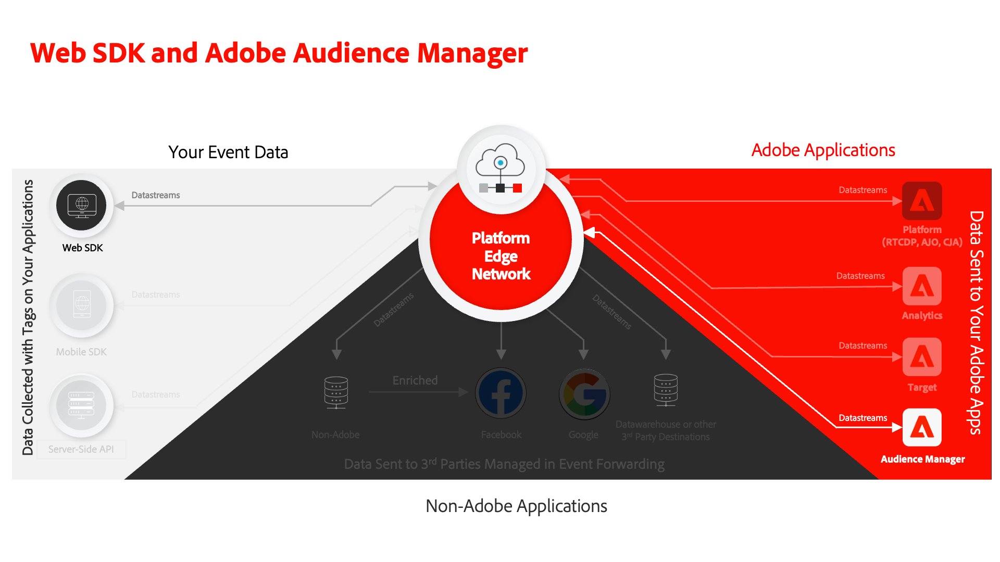

# Configuration d’Audience Manager avec Platform Web SDK

Découvrez comment configurer Adobe Audience Manager à l’aide du SDK web Adobe Experience Platform et valider l’implémentation à l’aide d’une destination de cookie.

[Adobe Audience Manager](https://experienceleague.adobe.com/en/docs/audience-manager) est la solution de Adobe Experience Cloud qui fournit tout ce qui est nécessaire pour collecter des informations commerciales pertinentes sur les visiteurs du site, créer des segments commercialisables et diffuser des publicités et du contenu ciblés à la bonne audience.

>[!WARNING]
>
> Le site web Luma utilisé dans ce tutoriel devrait être remplacé au cours de la semaine du 16 février 2026. Le travail effectué dans le cadre de ce tutoriel peut ne pas s’appliquer au nouveau site web.

## Objectifs d’apprentissage

À la fin de cette leçon, vous saurez comment :

* Configurer un flux de données pour activer Audience Manager
* Activation d’une destination de cookie dans Audience Manager
* Validez la mise en œuvre d’Audience Manager en confirmant la qualification des audiences avec Adobe Experience Platform Debugger.

## Conditions préalables

Pour suivre cette leçon, vous devez d’abord :

* Suivez les leçons précédentes des sections Configuration initiale et Configuration des balises de ce tutoriel.
* disposer d’un accès à Adobe Audience Manager et des autorisations appropriées pour créer, lire et écrire des caractéristiques, des segments et des destinations ; Pour plus d’informations, consultez la section [Contrôle d’accès en fonction du rôle Audience Manager](https://experienceleague.adobe.com/en/docs/audience-manager-learn/tutorials/setup-and-admin/user-management/setting-permissions-with-role-based-access-control).

## Configurer le flux de données

La mise en œuvre d’Audience Manager à l’aide du SDK web de Platform diffère de la mise en œuvre à l’aide du [transfert côté serveur (SSF)](https://experienceleague.adobe.com/en/docs/analytics/admin/admin-tools/manage-report-suites/edit-report-suite/report-suite-general/server-side-forwarding/ssf). Le transfert côté serveur transmet les données de requête Adobe Analytics à Audience Manager. Une implémentation de Platform Web SDK transmet à Audience Manager les données XDM envoyées à Platform Edge Network. Audience Manager est activé dans le flux de données :

1. Accédez à l’interface [Collecte de données](https://experience.adobe.com/#/data-collection){target="blank"}
1. Dans le volet de navigation de gauche, sélectionnez **[!UICONTROL Flux de données]**
1. Sélectionnez le flux de données `Luma Web SDK: Development Environment` créé précédemment

   

1. Sélectionnez **[!UICONTROL Ajouter un service]**
   
1. Sélectionnez **[!UICONTROL Adobe Audience Manager]** comme **[!UICONTROL Service]**
1. Vérifiez que **[!UICONTROL Destinations de cookie activées]** et **[!UICONTROL Destinations d’URL activées]** sont sélectionnées
1. Sélectionnez **[!UICONTROL Enregistrer]**
   

## Créer une source de données

Créez ensuite un [Source de données](https://experienceleague.adobe.com/en/docs/audience-manager/user-guide/features/data-sources/datasources-list-and-settings), un outil fondamental pour organiser les données dans Audience Manager :

1. Accéder à l’interface [Audience Manager](https://experience.adobe.com/#/audience-manager/)
1. Sélectionnez **[!UICONTROL Données d’audience]** dans la barre de navigation supérieure.
1. Sélectionnez le **[!UICONTROL Sources de données]** dans le menu déroulant
1. Sélectionnez le bouton **[!UICONTROL Ajouter]** en haut de la page Sources de données

   

1. Donnez un nom et une description conviviaux au Source de données. Pour la configuration initiale, vous pouvez nommer cette `Platform Web SDK tutorial`.
1. Définissez **[!UICONTROL ID Type]** sur **[!UICONTROL Cookie]**
1. Dans la section **[!UICONTROL Contrôles d’exportation de données]**, sélectionnez **[!UICONTROL Aucune restriction]**

   

1. **[!UICONTROL Enregistrer]** le Source de données

## Création d’une caractéristique

Une fois la Source de données enregistrée, configurez une [caractéristique](https://experienceleague.adobe.com/en/docs/audience-manager/user-guide/features/traits/traits-overview). Les caractéristiques sont une combinaison d’un ou de plusieurs signaux dans Audience Manager. Créez une caractéristique pour les visiteurs de la page d’accueil.

>[!NOTE]
>
>Toutes les données XDM sont envoyées à Audience Manager si elles sont activées dans le flux de données. Toutefois, les données peuvent prendre 24 heures avant d&#39;être disponibles dans le rapport Signaux inutilisés . Créez des caractéristiques explicites pour les données XDM que vous souhaitez utiliser immédiatement dans Audience Manager, comme décrit dans cet exercice.

1. Sélectionnez **[!UICONTROL Données d’audience]** > **[!UICONTROL Caractéristiques]**
1. Sélectionnez **[!UICONTROL Ajouter]** > **[!UICONTROL Basée sur des règles]** caractéristique

   

1. Donnez à votre caractéristique un nom et une description conviviaux, `Luma homepage view`
1. Sélectionnez la **[!UICONTROL Source de données]** que vous avez créée dans la section précédente.
1. **[!UICONTROL Sélectionnez un dossier]** dans lequel enregistrer votre caractéristique dans le volet de droite. Vous pouvez créer un dossier en **sélectionnant l’icône +** en regard d’un dossier parent existant. Vous pouvez nommer ce nouveau dossier `Platform Web SDK tutorial`.
1. Développez le signe d’insertion **[!UICONTROL Expression de caractéristique]** et sélectionnez **[!UICONTROL Générateur d’expression]** Vous devez fournir une paire clé-valeur qui indique une visite sur la page d’accueil.
1. Ouvrez la [page d’accueil Luma](https://luma.enablementadobe.com/content/luma/us/en.html) (mappée à votre propriété de balise) et l’**Adobe Experience Platform Debugger**, puis actualisez la page.
1. Examinez les demandes du réseau et les détails de l’événement pour le SDK web de Platform afin de trouver la valeur de clé et de nom pour la page d’accueil.
   
1. Revenez au Générateur d’expression dans l’interface utilisateur d’Audience Manager et saisissez la clé **`web.webPageDetails.name`** et la valeur de **`content:luma:us:en`**. Cette étape permet de déclencher une caractéristique à chaque chargement de la page d’accueil.
1. **[!UICONTROL Enregistrer]** la caractéristique

## Création d’un segment

Les étapes suivantes consistent à créer un **segment** et à affecter votre caractéristique nouvellement définie à ce segment.

1. Sélectionnez **[!UICONTROL Données d’audience]** dans le volet de navigation supérieur, puis sélectionnez **[!UICONTROL Segments]**
1. Sélectionnez **[!UICONTROL Ajouter]** en haut à gauche de la page pour ouvrir le créateur de segments
1. Donnez à votre segment un nom et une description conviviaux, par exemple `Platform Web SDK - Homepage visitors`
1. **[!UICONTROL Sélectionnez un dossier]** dans lequel votre segment est enregistré dans le volet de droite. Vous pouvez créer un dossier en **sélectionnant l’icône +** en regard d’un dossier parent existant. Vous pouvez nommer ce nouveau dossier `Platform Web SDK tutorial`.
1. Ajoutez un code d’intégration, qui dans ce cas est un ensemble aléatoire de nombres.
1. Dans la section **[!UICONTROL Source de données]**, sélectionnez **[!UICONTROL Audience Manager]** et la source de données que vous avez créée précédemment
1. Développez la section **[!UICONTROL Caractéristiques]** et recherchez la caractéristique que vous avez créée
1. Sélectionnez **[!UICONTROL Ajouter une caractéristique]**.
1. Sélectionnez **[!UICONTROL Enregistrer]** au bas de la page

   

   

## Créer une destination

Créez ensuite une **destination basée sur les cookies** à l’aide du **Créateur de destinations**. Le Créateur de destinations vous permet de créer et de gérer des destinations de cookie, d’URL et de serveur à serveur.

1. Ouvrez le Créateur de destinations en sélectionnant **[!UICONTROL Destinations]** dans le menu **Données d’audience** dans la barre de navigation supérieure
1. Sélectionnez **[!UICONTROL Créer une destination]**
1. Saisissez un nom et une description, `Platform Web SDK tutorial`
1. Dans le champ **[!UICONTROL Catégorie]**, sélectionnez **[!UICONTROL Personnalisé]**
1. Sélectionnez **[!UICONTROL Type]**, **[!UICONTROL Cookie]**

   

1. Ouvrez la section **[!UICONTROL Configuration]** pour saisir les détails de la destination des cookies
1. Donnez un nom convivial à votre cookie, `platform_web_sdk_tutorial`
1. En tant que **[!UICONTROL Domaine des cookies]**, ajoutez le domaine du site sur lequel vous envisagez l’intégration pour le tutoriel qui permet de saisir le domaine Luma, `luma.enablementadobe.com`
1. Sélectionnez l’option **[!UICONTROL Publier les données dans]**, **[!UICONTROL Uniquement les domaines sélectionnés]**
1. Sélectionnez votre domaine s’il n’est pas déjà ajouté
1. Sélectionnez **[!UICONTROL Format de données]**, **[!UICONTROL Clé unique]** et attribuez une clé à votre cookie. Pour ce tutoriel, utilisez `segment` comme valeur de clé.
1. Enfin, sélectionnez **[!UICONTROL Enregistrer]** pour enregistrer les détails de la configuration de destination.

   

<!--
   

   
-->

1. Dans la section **[!UICONTROL Mappages de segments]**, utilisez la fonction **[!UICONTROL Rechercher et ajouter des segments]** pour rechercher le `Platform Web SDK - Homepage visitors` créé précédemment et sélectionnez **[!UICONTROL Ajouter]**.

1. Une fois que vous avez ajouté votre segment, un pop-up s’ouvre où vous devez fournir une valeur attendue pour votre cookie. Pour cet exercice, saisissez la valeur « hpvisitor ».

1. Sélectionnez **[!UICONTROL Enregistrer]**

1. Sélectionnez **[!UICONTROL Terminé]**
   

La période de mappage des segments nécessite quelques heures pour être activée. Une fois l’opération terminée, vous pouvez actualiser l’interface d’Audience Manager et vérifier que la liste **Segments mappés** a été mise à jour.

## Validation du segment

Quelques heures après la création initiale du segment, vous pouvez vérifier qu’il fonctionne correctement.

Tout d’abord, confirmez que vous pouvez être qualifié pour le segment

1. Ouvrez la page d’accueil du site de démonstration [Luma](https://luma.enablementadobe.com/content/luma/us/en.html) avec celle-ci mappée à votre propriété de balise pour être admissible pour votre segment nouvellement créé.
1. Ouvrez l’onglet **Outils de développement** > **Réseau** de votre navigateur
1. Filtrez la requête Platform Web SDK à l’aide de `interact` comme filtre de texte.
1. Sélectionnez un appel et ouvrez l’onglet **Aperçu** pour afficher les détails de la réponse
1. Développez la **payload** pour afficher les détails attendus du cookie, tels que précédemment configurés dans Audience Manager. Dans cet exemple, vous verrez le nom de cookie attendu `platform_web_sdk_tutorial`.

   

1. Ouvrez l’onglet **Application** et ouvrez **Cookies** dans le menu **Stockage**.
1. Sélectionnez le domaine **`https://luma.enablementadobe.com`** et vérifiez que votre cookie est correctement écrit dans la liste

   

Enfin, vous devez ouvrir le segment dans l’interface d’Audience Manager et vous assurer que la **Populations de segments** a été incrémentée :

Maintenant que vous avez terminé cette leçon, vous devriez être en mesure de voir comment le SDK web de Platform transmet les données à Audience Manager et peut définir un cookie propriétaire spécifique au segment avec une destination de cookie.

>[!NOTE]
>
>Merci d’avoir investi votre temps dans votre apprentissage de Adobe Experience Platform Web SDK. Si vous avez des questions, souhaitez partager des commentaires généraux ou avez des suggestions sur le contenu futur, veuillez les partager dans ce [article de discussion de la communauté Experience League](https://experienceleaguecommunities.adobe.com/t5/adobe-experience-platform-data/tutorial-discussion-implement-adobe-experience-cloud-with-web/td-p/444996)
