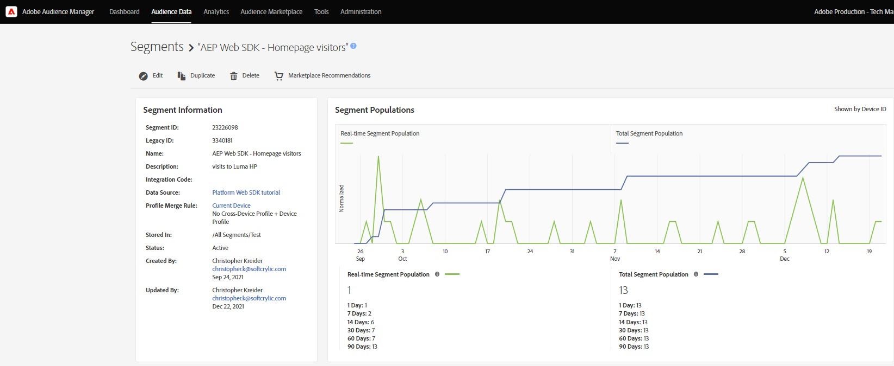

# Configuration de l’Audience Manager avec le SDK Web Platform

Découvrez comment configurer Adobe Audience Manager à l’aide du SDK Web Platform et valider l’implémentation à l’aide d’une destination de cookie.

[Adobe Audience Manager](https://experienceleague.adobe.com/docs/audience-manager.html) est la solution Adobe Experience Cloud qui fournit tout ce qui est nécessaire pour collecter des informations commercialement pertinentes sur les visiteurs du site, créer des segments commercialisables et diffuser des publicités et du contenu ciblés à la bonne audience.

## Objectifs d&#39;apprentissage

À la fin de cette leçon, vous saurez comment :

* Configuration d’un flux de données pour activer l’Audience Manager
* Activation d’une destination de cookie dans Audience Manager
* Validation de la mise en oeuvre de l’Audience Manager en confirmant la qualification de l’audience avec Adobe Experience Platform Debugger

## Conditions préalables

Pour terminer cette leçon, vous devez d’abord :

* Suivez les leçons des sections Configuration initiale et Configuration des balises de ce tutoriel.
* Avoir accès à Adobe Audience Manager et aux autorisations appropriées pour créer, lire et écrire des caractéristiques, des segments et des destinations. Pour plus d’informations, veuillez consulter [Contrôle d’accès en fonction du rôle de l’Audience Manager](https://experienceleague.adobe.com/docs/audience-manager-learn/tutorials/setup-and-admin/user-management/setting-permissions-with-role-based-access-control.html?lang=en).

## Configuration du flux de données

L’implémentation de l’Audience Manager à l’aide du SDK Web de Platform diffère de l’implémentation à l’aide de [transfert côté serveur (SSF)](https://experienceleague.adobe.com/docs/analytics/admin/admin-tools/server-side-forwarding/ssf.html?lang=fr). Le transfert côté serveur transmet les données de demande Adobe Analytics à Audience Manager. Une mise en oeuvre du SDK Web Platform transmet les données XDM envoyées à Platform Edge Network pour Audience Manager. L’Audience Manager est activée dans le flux de données :

1. Accédez à [Collecte de données](https://experience.adobe.com/#/data-collection)Interface de {target=&quot;blank&quot;}
1. Dans le volet de navigation de gauche, sélectionnez **[!UICONTROL Datastreams]**
1. Sélectionnez la `Luma Web SDK` datastream

   

1. Sélectionnez **[!UICONTROL Ajouter un service]**

   
1. Sélectionner **[!UICONTROL Adobe Audience Manager]** comme la propriété **[!UICONTROL Service]**
1. Confirmez que **[!UICONTROL Destinations de cookie activées]** et **[!UICONTROL Destinations d’URL activées]** sont sélectionnées
1. Sélectionnez **[!UICONTROL Enregistrer]**

   

## Création d’une source de données

Créez ensuite un [Source de données](https://experienceleague.adobe.com/docs/audience-manager/user-guide/features/data-sources/datasources-list-and-settings.html?lang=en), un outil fondamental pour organiser les données au sein de l’Audience Manager :

1. Accédez au [Audience Manager](https://experience.adobe.com/#/audience-manager/) interface
1. Sélectionner **[!UICONTROL Données d’audience]** à partir de la navigation supérieure ;
1. Sélectionnez la **[!UICONTROL Sources de données]** dans le menu déroulant
1. Sélectionnez la **[!UICONTROL Ajouter]** dans la partie supérieure de la page Sources de données.

   

1. Attribuez un nom et une description conviviaux à la source de données. Pour la configuration initiale, vous pouvez nommer ceci :`Platform Web SDK tutorial`.
1. Définir **[!UICONTROL Type d’ID]** to **[!UICONTROL Cookie]**
1. Dans le **[!UICONTROL Contrôles des exportations de données]** , sélectionnez **[!UICONTROL Aucune restriction]**

   

1. **[!UICONTROL Enregistrer]** la source de données

## Création d’une caractéristique

Une fois la source de données enregistrée, configurez une [trait](https://experienceleague.adobe.com/docs/audience-manager/user-guide/features/traits/traits-overview.html?lang=en). Les caractéristiques sont une combinaison d’un ou de plusieurs signaux en Audience Manager. Créez une caractéristique pour les visiteurs de la page d’accueil.

>[!NOTE]
>
>Toutes les données XDM sont envoyées à l’Audience Manager si elles sont activées dans le flux de données. Toutefois, les données peuvent prendre 24 heures jusqu’à ce qu’elles soient disponibles dans le rapport Signaux non utilisés. Créez des caractéristiques explicites pour les données XDM que vous souhaitez utiliser immédiatement en Audience Manager, comme décrit dans cet exercice.

1. Sélectionner **[!UICONTROL Données d’audience]** >  **[!UICONTROL Caractéristiques]**
1. Sélectionner **[!UICONTROL Ajouter]** >  **[!UICONTROL Basé sur des règles]** trait

   

1. Donnez un nom et une description conviviaux à votre caractéristique, `Luma homepage view`
1. Sélectionnez la **[!UICONTROL Source de données]** vous avez créé dans la section précédente.
1. **[!UICONTROL Sélection d’un dossier]** dans lequel enregistrer votre caractéristique dans le volet de droite. Vous pouvez créer un dossier par **en sélectionnant l’icône +** en regard d’un dossier parent existant. Vous pouvez nommer ce nouveau dossier. `Platform Web SDK tutorial`.
1. Développez l’objet **[!UICONTROL Expression de caractéristique]** accent circonflexe et sélectionnez **[!UICONTROL Générateur d’expression]** Vous devez fournir une paire de valeurs de clé qui signifie une visite de page d’accueil.
1. Ouvrez le [Page d’accueil Luma](https://luma.enablementadobe.com/content/luma/us/en.html) (mappé à la propriété tag) et la variable **Débogueur du SDK Web Platform** et actualisez la page.
1. Consultez les requêtes réseau et les détails de l’événement pour le SDK Web Platform afin de trouver la clé et la valeur de nom de la page d’accueil.
   
1. Revenez au Générateur d’expression dans l’interface utilisateur d’Audience Manager et saisissez la touche **`web.webPageDetails.name`** et la valeur de **`content:luma:us:en`**. Cette étape vous permet de déclencher une caractéristique chaque fois que vous chargez la page d’accueil.
1. **[!UICONTROL Enregistrer]** la caractéristique.

## Création d’un segment

L’étape suivante consiste à créer une **segment** et affectez votre caractéristique nouvellement définie à ce segment.

1. Sélectionner **[!UICONTROL Données d’audience]** dans le volet de navigation supérieur, puis sélectionnez **[!UICONTROL Segments]**
1. Sélectionner **[!UICONTROL Ajouter]** en haut à gauche de la page pour ouvrir le créateur de segments.
1. Attribuez un nom et une description conviviaux à votre segment, tels que `Platform Web SDK - Homepage visitors`
1. **[!UICONTROL Sélection d’un dossier]** où votre segment sera enregistré dans le volet de droite. Vous pouvez créer un dossier par **en sélectionnant l’icône +** en regard d’un dossier parent existant. Vous pouvez nommer ce nouveau dossier. `Platform Web SDK tutorial`.
1. Ajoutez un code d’intégration, qui dans ce cas est un jeu aléatoire de nombres. 1. Dans le **[!UICONTROL Source de données]** , sélectionnez **[!UICONTROL Audience Manager]** et la source de données que vous avez créée précédemment.
1. Développez l’objet **[!UICONTROL Caractéristiques]** et recherchez la caractéristique que vous avez créée.
1. Sélectionner **[!UICONTROL Ajouter une caractéristique]**.
1. Sélectionner **[!UICONTROL Enregistrer]** au bas de la page

   

   

## Création d’une destination

Créez ensuite un **Destination basée sur les cookies** en utilisant la variable **Créateur de destinations**. Le créateur de destinations vous permet de créer et de gérer des destinations de cookie, d’URL et de serveur à serveur.

1. Ouvrez le créateur de destinations en sélectionnant **[!UICONTROL Destinations]** dans le **Données d’audience** dans le volet de navigation supérieur.
1. Sélectionner **[!UICONTROL Création d’une destination]**
1. Entrez un nom et une description, `Platform Web SDK tutorial`
1. Comme la variable **[!UICONTROL Catégorie]**, sélectionnez **[!UICONTROL Personnalisé]**
1. Comme la variable **[!UICONTROL Type]**, sélectionnez **[!UICONTROL Cookie]**

   

1. Ouvrez le **[!UICONTROL Configuration]** pour saisir les détails sur votre destination de cookie.
1. Attribuez un nom convivial à votre cookie, `platform_web_sdk_tutorial`
1. Comme la variable **[!UICONTROL Domaine du cookie]**, ajoutez le domaine du site sur lequel vous prévoyez l’intégration, pour que le tutoriel renseigne le domaine Luma, `luma.enablementadobe.com`
1. Comme la variable **[!UICONTROL Publier les données sur]** option, sélectionnez **[!UICONTROL Uniquement les domaines sélectionnés]**
1. Sélectionnez votre domaine s’il n’a pas déjà été ajouté
1. Comme la variable **[!UICONTROL Format des données]**, sélectionnez **[!UICONTROL Clé unique]** et donnez une clé à votre cookie. Pour ce tutoriel, utilisez `segment` comme valeur clé.
1. Enfin, sélectionnez **[!UICONTROL Enregistrer]** pour enregistrer les détails de configuration de destination.

   

<!--
   

   
-->

1. Dans le **[!UICONTROL Mappages de segments]** , utilisez la fonction **[!UICONTROL Recherche et ajout de segments]** pour rechercher la fonctionnalité créée précédemment `Platform Web SDK - Homepage visitors` et sélectionnez **[!UICONTROL Ajouter]**.

1. Une fois que vous avez ajouté votre segment, une fenêtre contextuelle s’ouvre dans laquelle vous devez fournir une valeur attendue pour votre cookie. Pour cet exercice, saisissez la valeur &quot;hpvisitor&quot;.

1. Sélectionnez **[!UICONTROL Enregistrer]**

1. Sélectionnez **[!UICONTROL Terminé]**

   

La période de mappage des segments nécessite quelques heures pour être activée. Une fois l’opération terminée, vous pouvez actualiser l’interface d’Audience Manager et voir que la variable **Segments mappés** mise à jour de la liste.

## Validation du segment

Quelques heures après la création initiale du segment, vous pouvez vérifier qu’il fonctionne correctement.

Tout d’abord, vérifiez que vous pouvez être admissible pour le segment.

1. Ouvrez le [Page d’accueil du site de démonstration Luma](https://luma.enablementadobe.com/content/luma/us/en.html) avec elle mappée à votre propriété de balise pour que le segment que vous venez de créer soit admissible.
1. Ouvrez le de votre navigateur **outils de développement**  > **Réseau** tab
1. Filtrez vers la requête SDK Web Platform à l’aide de `interact` comme filtre de texte
1. Sélectionnez un appel et ouvrez le **Aperçu** pour afficher les détails de la réponse.
1. Développez l’objet **payload** pour afficher les détails attendus du cookie, tels que configurés précédemment dans Audience Manager. Dans cet exemple, le nom du cookie attendu s’affiche. `platform_web_sdk_tutorial`.

   

1. Ouvrez le **Application** et ouvrez **Cookies** de la **Stockage** .
1. Sélectionnez la **`https://luma.enablementadobe.com`** et vérifiez que le cookie est correctement écrit dans la liste.

   

Enfin, vous devez ouvrir le segment dans l’interface d’Audience Manager et vous assurer que la variable **Populations de segments** a incrémenté :

Maintenant que vous avez terminé cette leçon, vous devriez être en mesure de voir comment le SDK Web Platform transmet les données à l’Audience Manager et peut définir un cookie propriétaire spécifique au segment avec une destination de cookie.

[Suivant : ](setup-target.md)

>[!NOTE]
>
>Merci d’avoir consacré du temps à l’apprentissage du SDK Web Adobe Experience Platform. Si vous avez des questions, souhaitez partager des commentaires généraux ou avez des suggestions sur le contenu futur, partagez-les à ce sujet. [Article de discussion de la communauté Experience League](https://experienceleaguecommunities.adobe.com/t5/adobe-experience-platform-launch/tutorial-discussion-implement-adobe-experience-cloud-with-web/td-p/444996)
