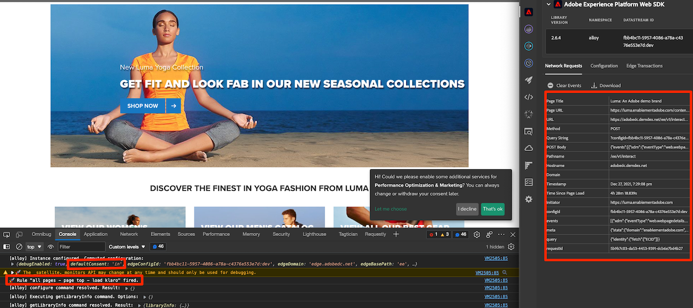
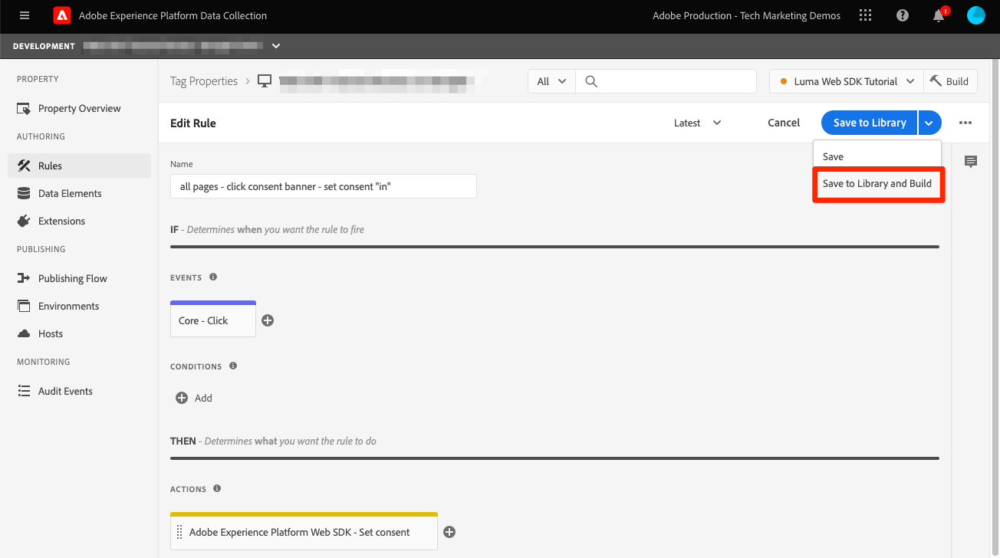

# Configuration du consentement avec le SDK Web de Platform

Découvrez comment configurer les paramètres de confidentialité de l’extension de balise SDK Web Experience Platform. Définissez le consentement en fonction de l’interaction du visiteur avec une bannière d’une plateforme de gestion du consentement (CMP).

>[!NOTE]
> 
>À des fins de démonstration, ce tutoriel utilise [Klaro](https://heyklaro.com/){target="_blank"} comme CMP. Nous vous invitons à suivre l’exemple de Klaro ou de la CMP que vous utilisez avec votre site web.


## Objectifs d&#39;apprentissage

À la fin de cette leçon, vous pouvez :

* Chargement d’une CMP à l’aide de balises
* Configuration des paramètres de confidentialité dans l’extension de balise SDK Web Experience Platform
* Définition du consentement pour le SDK Web Experience Platform en fonction de l’action du visiteur

## Conditions préalables

Vous devez connaître les balises et les étapes de création de règles, d’éléments de données, de création de bibliothèques dans des environnements et de basculement de bibliothèques de balises à l’aide du débogueur Experience Platform.

Avant de commencer à configurer les paramètres de confidentialité et à créer les règles pour définir le consentement, assurez-vous d’avoir injecté le script de votre plateforme de gestion du consentement sur le site web et de fonctionner correctement. Une CMP peut être chargée directement dans le code source à l’aide des développeurs de site ou par le biais de balises elles-mêmes. Cette leçon illustre cette dernière approche.
>[!NOTE]
> 
>1. Une plateforme de gestion du consentement (ou CMP) est utilisée par les organisations pour documenter et gérer légalement les choix de consentement d’un visiteur avant de collecter, partager ou vendre des données de visiteur provenant de sources en ligne telles que des sites web et des applications.
>
>2. L’approche recommandée pour l’injection d’une CMP se fait directement par le biais du code source avant le script du gestionnaire de balises.

### Configurer Klaro

Avant de passer aux configurations de balise, découvrez la plateforme de gestion du consentement utilisée dans ce tutoriel Klaro.

1. Visite [Klaro](https://heyklaro.com/) et configurez un compte.
1. Accédez à **Gestionnaire de confidentialité** et créez une instance en fonction des instructions.
1. Utilisez la variable **Code d’intégration** pour injecter Klaro dans votre propriété de balise (les instructions se trouvent dans l’exercice suivant).
1. Ignorer **Analyse** , car il détectera la propriété de balise qui est codée en dur sur le site web de démonstration de Luma et non celle que vous avez créée pour ce tutoriel.
1. Ajoutez un service appelé `aep web sdk` et basculez sur **État par défaut du service**. Lorsque cette option est activée, la valeur de consentement par défaut est `true`, sinon il est `false`. Cette configuration s’avère pratique lorsque vous souhaitez déterminer l’état du consentement par défaut (avant le consentement du visiteur) pour votre application web. Par exemple :
   * Pour le CCPA, le consentement par défaut est généralement défini sur `true`. Vous allez référencer ce scénario comme **Accord préalable implicite** tout au long de ce tutoriel
   * Pour le RGPD, le consentement par défaut est généralement défini sur `false`. Vous allez référencer ce scénario comme **Désinscription implicite** tout au long de ce tutoriel.

<!--
    This consent value can be verified by returning the JavaScript object ```klaro.getManager().consents``` in the browser's developer console.
-->
    >[!REMARQUE]
    >
    >En règle générale, les étapes mentionnées ci-dessus sont effectuées et prises en charge par l’équipe ou la personne responsable de la gestion de la CMP, telle que OneTrust ou TrustArc.

## Injection d’une CMP

>[!WARNING]
>
>La bonne pratique pour mettre en oeuvre une plateforme de gestion du consentement consiste généralement à charger la CMP. _before_ chargement de votre gestionnaire de balises. Pour faciliter ce tutoriel, vous allez charger la CMP _avec_ gestionnaire de balises. Cette leçon est conçue pour vous montrer comment utiliser les fonctionnalités de consentement dans le SDK Web de Platform et ne doit pas être utilisée comme guide pour configurer correctement Klaro ou toute autre CMP.


Maintenant, une fois les configurations de Klaro terminées, créez une règle de balise avec les configurations suivantes :

* [!UICONTROL Nom] : `all pages - library load - Klaro`
* [!UICONTROL Événement]: [!UICONTROL Bibliothèque chargée (Haut de page)] avec [!UICONTROL Options avancées] > [!UICONTROL Commande] défini sur 1
* [!UICONTROL Action]: [!UICONTROL Code personnalisé], [!UICONTROL Langue]: HTML pour charger le script de CMP.


Le bloc de code personnalisé doit ressembler à ce qui suit :


Maintenant enregistrez cette règle et créez-la dans votre bibliothèque de développement. validez l’affichage de la bannière de consentement en passant de la bibliothèque de balises du site Luma à la vôtre. Une bannière de CMP doit s’afficher sur le site web comme ci-dessous. Et pour vérifier l’autorisation de consentement du visiteur actuel, vous pouvez utiliser le fragment de code suivant sur la console du navigateur.

```javascript
    klaro.getManager().consents 
```


Pour passer en mode de débogage, cochez la case suivante dans le débogueur Adobe Experience Platform.


En outre, vous devrez peut-être effacer vos cookies et stockage local plusieurs fois pendant que vous passerez par ce tutoriel, car la valeur de consentement du visiteur y est stockée. Vous pouvez simplement le faire comme suit :


## Scénarios de consentement

Les lois sur la protection des données (RGPD, CCPA, etc.) jouent un rôle essentiel dans la conception de la mise en oeuvre du consentement. Dans cette leçon, vous explorez la manière dont un visiteur peut interagir avec la bannière de consentement sous deux actes de confidentialité les plus importants.


### Scénario 1 : Opt-in appliqué

L’inclusion signifie que l’entreprise n’a pas besoin d’obtenir le consentement du visiteur (ou de l’&quot;inclusion&quot;) avant de collecter ses données. Par conséquent, tous les visiteurs du site web sont traités comme inscrits par défaut. Cependant, le visiteur peut s’exclure en rejetant les cookies par le biais de la bannière de consentement. Ce cas pratique est similaire à la CCPA.

Vous allez maintenant configurer et mettre en oeuvre le consentement pour ce scénario :

1. Dans le **[!UICONTROL Privacy]** de l’extension de balise SDK Web Experience Platform, assurez-vous que la variable  **[!UICONTROL Consentement par défaut]** est défini sur **[!UICONTROL Dans]** :


   

   >[!NOTE]
   > 
   >Pour une solution dynamique, sélectionnez l’option &quot;Fournir un élément de données&quot; et transmettez un élément de données qui renvoie la valeur de ```klaro.getManager().consents```
   >
   >Cette option est utilisée si la CMP est injectée dans le code source. *before* le code incorporé de balise afin que le consentement par défaut soit disponible avant que l’extension SDK Web Experience Platform ne commence à se charger. Dans notre exemple, nous ne pouvons pas utiliser cette option, car la CMP est chargée avec des balises et non avant des balises.


2. Enregistrer et créer cette modification dans votre bibliothèque de balises
3. Chargement de votre bibliothèque de balises sur le site de démonstration Luma
4. Activez le débogage des balises sur le site Luma et rechargez la page. Dans la console de développement de votre navigateur, vous devriez constater que defaultConsent est égal à **[!UICONTROL Dans]**
5. Avec cette configuration, l’extension SDK Web Experience Platform continue à effectuer des requêtes réseau, sauf si un visiteur décide de rejeter les cookies et de se désabonner :

   


Si un visiteur décide de s’exclure (rejetez les cookies de suivi), vous devez modifier le consentement en **[!UICONTROL Out]**. Modifiez le paramètre de consentement en procédant comme suit :

<!--
1. Create a data element to store the consent value of the visitor. Let's call it `klaro consent value`. Use the code snippet to create a custom code type data element:
    
    ```javascript
    return klaro.getManager().consents["aep web sdk"]
    ```

    


1. Create another custom code data element, `consent confirmed`, with the following snippet which returns ```true``` only after a visitor confirms consent:

    
    ```javascript
    return klaro.getManager().confirmed
    ```

    
-->

1. Créer une règle qui se déclenche lorsque le visiteur clique **Je décline**.  Nommez cette règle en tant que : `all pages - click consent banner - set consent "out"`

1. Comme la variable **[!UICONTROL Événement]**, utilisez **[!UICONTROL Cliquez sur]** on **[!UICONTROL Éléments correspondant au sélecteur CSS]** `#klaro .cn-decline`

   

1. Maintenant, utilisez le SDK Web Experience Platform, [!UICONTROL Définition du consentement] [!UICONTROL type d&#39;action] pour définir le consentement sur &quot;out&quot; :

   

1. Sélectionner **[!UICONTROL Enregistrer dans la bibliothèque et créer]**:

   

Désormais, lorsqu’un visiteur se désinscrit, la règle configurée de la manière ci-dessus se déclenche et définit le consentement du SDK Web comme **[!UICONTROL Out]**.

Validez en vous rendant sur le site de démonstration Luma, rejetez les cookies et vérifiez qu’aucune demande de SDK Web ne se déclenche après exclusion.

### Scénario 2 : exclusion appliquée


Le droit d’opposition appliqué signifie que les visiteurs doivent être traités comme ayant fait l’objet d’un droit d’opposition par défaut et que les cookies ne doivent pas être définis. Les demandes du SDK Web ne doivent pas se déclencher, sauf si les visiteurs décident de s’inscrire manuellement en acceptant les cookies par le biais de la bannière de consentement. Vous devrez peut-être traiter un tel cas d’utilisation dans la région de l’Union européenne où le RGPD s’applique.

Voici comment configurer la configuration d’un scénario d’exclusion implicite :

1. À Klaro, basculez **État par défaut du service** dans votre `aep web sdk` et enregistrez la configuration mise à jour.

1. Dans **[!UICONTROL Privacy]** section de l’extension SDK Web Experience Platform, définissez le consentement par défaut sur **[!UICONTROL Out]** ou **[!UICONTROL En attente]** selon les besoins.

   

1. **Enregistrer** la configuration mise à jour dans votre bibliothèque de balises et recréez-la.

   Avec cette configuration, le SDK Web Experience Platform s’assure qu’aucune demande ne se déclenche à moins que l’autorisation de consentement ne soit modifiée en **[!UICONTROL Dans]**. Cela peut se produire si un visiteur accepte manuellement les cookies en s’inscrivant.

1. Dans Debugger, assurez-vous que le site Luma est mappé sur votre propriété de balise et que la journalisation de la console des balises est activée.
1. Utilisez la console de développement de votre navigateur pour **Effacer les données du site** in **Application** > **Stockage**

1. Chargez à nouveau le site Luma. Vous devriez constater que `defaultConsent` est défini sur **[!UICONTROL Out]** et aucune demande de SDK Web n’a été effectuée

   

Si un visiteur décide de s’inscrire (accepter les cookies de suivi), vous devez modifier le consentement et le définir sur **[!UICONTROL Dans]**. Pour ce faire, procédez comme suit avec une règle :

1. Créer une règle qui se déclenche lorsque le visiteur clique **C&#39;est ok.**.  Nommez cette règle en tant que : `all pages - click consent banner - set consent "in"`

1. Comme la variable **[!UICONTROL Événement]**, utilisez **[!UICONTROL Cliquez sur]** on **[!UICONTROL Éléments correspondant au sélecteur CSS]** `#klaro .cm-btn-success`

   

1. Ajouter une action à l’aide du SDK Web Experience Platform [!UICONTROL Extension], **[!UICONTROL Type d’action]** de **[!UICONTROL Définition du consentement]**, **[!UICONTROL Consentement général]** as **[!UICONTROL Dans]**.

   

   Une chose à noter ici est que ceci [!UICONTROL Définition du consentement] l&#39;action sera la première demande qui va établir l&#39;identité. C’est pourquoi il peut être important de synchroniser les identités lors de la première requête elle-même. La carte des identités peut être ajoutée à [!UICONTROL Définition du consentement] en transmettant un élément de données de type identité.

1. Sélectionner **[!UICONTROL Enregistrer dans la bibliothèque et créer]**:

   

1. **[!UICONTROL Enregistrer]** la règle dans votre bibliothèque et recréez-la.

Une fois cette règle en place, la collecte des événements doit commencer lorsqu’un visiteur s’inscrit.


Pour plus d’informations sur le consentement dans le SDK Web, voir [Prise en charge des préférences de consentement du client](https://experienceleague.adobe.com/docs/experience-platform/edge/consent/supporting-consent.html?lang=en).


Pour plus d’informations sur la variable [!UICONTROL Définition du consentement] action, voir [Définition du consentement](https://experienceleague.adobe.com/docs/experience-platform/edge/extension/action-types.html?lang=en#set-consent).

[Suivant : ](setup-event-forwarding.md)

>[!NOTE]
>
>Merci d’avoir consacré du temps à l’apprentissage du SDK Web Adobe Experience Platform. Si vous avez des questions, souhaitez partager des commentaires généraux ou avez des suggestions sur le contenu futur, partagez-les à ce sujet. [Article de discussion de la communauté Experience League](https://experienceleaguecommunities.adobe.com/t5/adobe-experience-platform-launch/tutorial-discussion-implement-adobe-experience-cloud-with-web/td-p/444996)
