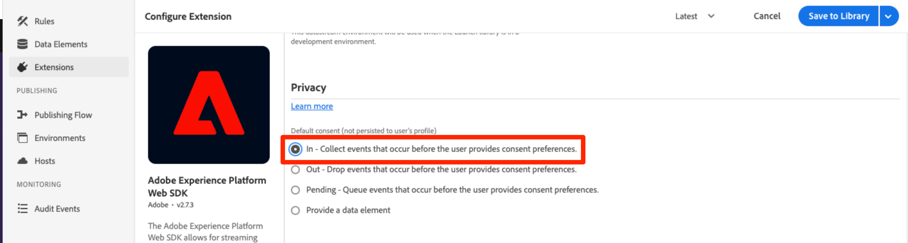

# Configurer le consentement avec Platform Web SDK

Découvrez comment configurer les paramètres de confidentialité de l’extension de balise Adobe Experience Platform Web SDK. Définissez le consentement en fonction de l’interaction du visiteur avec une bannière d’une plateforme de gestion du consentement (CMP).


>[!NOTE]
> 
>À des fins de démonstration, ce tutoriel utilise [Klaro](https://klaro.org/) comme CMP. Nous vous invitons à suivre le processus en utilisant Klaro ou le CMP que vous utilisez avec votre site Web.


## Objectifs d’apprentissage

À la fin de cette leçon, vous êtes capable de :

* Charger une CMP à l’aide de balises
* Configuration des paramètres de confidentialité dans l’extension de balises Experience Platform Web SDK
* Définition du consentement pour Experience Platform Web SDK en fonction de l’action du visiteur ou de la visiteuse

## Conditions préalables

Vous devez vous familiariser avec les balises et les étapes de création de règles et d’éléments de données, de création de bibliothèques dans des environnements et de changement de bibliothèques de balises à l’aide du débogueur Experience Platform.

Avant de commencer à configurer les paramètres de confidentialité et à créer les règles pour définir le consentement, assurez-vous d’avoir injecté le script de la plateforme de gestion du consentement sur le site web et de savoir s’il fonctionne correctement. Une CMP peut être chargée directement dans le code source à l’aide des développeurs de site ou chargée via les balises elles-mêmes. Cette leçon illustre la dernière approche.

>[!NOTE]
> 
>1. Une plateforme de gestion du consentement (CMP) est utilisée par les organisations pour documenter et gérer légalement les choix de consentement d’un visiteur avant de collecter, de partager ou de vendre des données de visiteur à partir de sources en ligne telles que des sites web et des applications.
>
>2. L’approche recommandée pour injecter une CMP consiste à utiliser directement le code source avant le script du gestionnaire de balises.

### Configuration de Klaro

Avant de passer aux configurations des balises, découvrez la plateforme de gestion du consentement utilisée dans ce tutoriel Klaro.

1. Visitez [Klaro](https://klaro.org/) et créez un compte.
1. Accédez à **Privacy Manager** et créez une instance en fonction des instructions.
1. Utilisez le **Code d’intégration** pour injecter Klaro dans la propriété de balise (les instructions se trouvent dans l’exercice suivant).
1. Ignorez la section **Numérisation**, car elle détecte la propriété de balise codée en dur sur le site web de démonstration de Luma, et non pas celle que vous avez créée pour ce tutoriel.
1. Ajoutez un service appelé `aep-web-sdk` et activez/désactivez l’option **État par défaut du service**. Lorsque cette option est activée, la valeur de consentement par défaut est `true`, sinon elle est `false`. Cette configuration est pratique lorsque vous souhaitez décider de l’état de consentement par défaut (avant le consentement du visiteur) de votre application web. Par exemple :
   * Pour le CCPA, le consentement par défaut est généralement défini sur `true`. Tout au long de ce tutoriel, vous allez faire référence à ce scénario en tant qu **accord préalable implicite**
   * Pour le RGPD, le consentement par défaut est généralement défini sur `false`. Tout au long de ce tutoriel, vous allez faire référence à ce scénario sous le nom **Désinscription implicite**.
1. Activation de la configuration
<!--
    This consent value can be verified by returning the JavaScript object ```klaro.getManager().consents``` in the browser's developer console.
-->
    >[!REMARQUE]
    >
    >En règle générale, les étapes mentionnées ci-dessus sont effectuées et prises en charge par l’équipe ou la personne responsable de la gestion du CMP, comme OneTrust ou TrustArc.

## Injection d’une CMP

>[!WARNING]
>
>La bonne pratique pour mettre en œuvre une plateforme de gestion du consentement consiste généralement à charger le CMP _avant_ votre gestionnaire de balises. Pour réaliser ce tutoriel plus facilement, vous allez charger le CMP _avec_ le gestionnaire de balises. Cette leçon est conçue pour vous montrer comment utiliser les fonctionnalités de consentement dans Platform Web SDK et ne doit pas être utilisée comme guide pour configurer correctement Klaro ou tout autre CMP.


Maintenant, une fois les configurations de Klaro terminées, créez des règles de balise avec les configurations suivantes :

* [!UICONTROL Nom] : `all pages - library load - Klaro`
* [!UICONTROL Événement] : [!UICONTROL Bibliothèque chargée (haut de page)] avec [!UICONTROL Options avancées] > [!UICONTROL Commande] défini sur 1
* [!UICONTROL Action] : [!UICONTROL Code personnalisé], [!UICONTROL Langue] : HTML pour charger le script CMP.


Le bloc de code personnalisé doit ressembler à ce qui suit :


Enregistrez et créez maintenant cette règle dans votre bibliothèque de développement. Vérifiez que la bannière de consentement s’affiche en commutant la bibliothèque de balises du site Luma vers la vôtre. Vous devriez voir une bannière CMP sur le site Web comme ci-dessous. Et pour vérifier l’autorisation de consentement du visiteur actuel, vous pouvez utiliser le fragment de code suivant sur la console du navigateur.

```javascript
    klaro.getManager().consents 
```


Pour passer en mode débogage, utilisez la case à cocher suivante dans le débogueur Adobe Experience Platform.


En outre, il se peut que vous deviez effacer plusieurs fois vos cookies et votre stockage local lors de ce tutoriel, car la valeur de consentement du visiteur y est stockée. Vous pouvez simplement le faire comme suit :


## Scénarios de consentement

Les lois sur la confidentialité telles que le RGPD, le CCPA et d’autres jouent un rôle essentiel dans la manière dont vous concevez la mise en œuvre du consentement. Dans cette leçon, vous découvrirez comment un visiteur peut interagir avec la bannière de consentement sous deux lois principales en matière de confidentialité.


### Scénario 1 : Opt-in implicite

L’opt-in implicite signifie que l’entreprise n’a pas besoin d’obtenir le consentement du visiteur (ou l’« opt-in ») avant de collecter ses données et, par conséquent, tous les visiteurs et visiteuses du site web sont traités comme opt-in par défaut. Cependant, le visiteur peut se désinscrire en rejetant les cookies par le biais de la bannière de consentement. Ce cas d’utilisation est similaire à celui du CCPA.

Vous allez maintenant configurer et implémenter le consentement pour ce scénario :

1. Dans la section **[!UICONTROL Consentement]** de l’extension de balise Experience Platform Web SDK, assurez-vous que le paramètre **[!UICONTROL Consentement par défaut]** est défini sur **[!UICONTROL In]** :


   

   >[!NOTE]
   > 
   >Pour une solution dynamique, sélectionnez l’option « Fournir un élément de données » et transmettez un élément de données qui renvoie la valeur de ```klaro.getManager().consents```
   >
   >Cette option est utilisée si le CMP est injecté dans le code source *avant* le code incorporé de balise, de sorte que le consentement par défaut soit disponible avant le démarrage du chargement de l’extension Experience Platform Web SDK. Dans notre exemple, nous ne pouvons pas utiliser cette option, car le CMP est chargé avec des balises et non avant les balises.


2. Enregistrez et créez cette modification dans votre bibliothèque de balises
3. Chargez votre bibliothèque de balises sur le site de démonstration de Luma.
4. Activez le débogage des balises sur le site Luma et rechargez la page. Dans la Developer Console de votre navigateur, defaultConsent doit être égal à **[!UICONTROL In]**
5. Avec cette configuration, l’extension Experience Platform Web SDK effectue des requêtes réseau à Platform Edge Network jusqu’à ce qu’un visiteur décide de refuser les cookies et de se désinscrire :

   


Si un visiteur décide de se désinscrire (rejette les cookies de suivi), vous devez modifier le consentement en **[!UICONTROL Refuser]**. Modifiez le paramètre de consentement en procédant comme suit :

<!--
1. Create a data element to store the consent value of the visitor. Let's call it `klaro consent value`. Use the code snippet to create a custom code type data element:
    
    ```javascript
    return klaro.getManager().consents["aep web sdk"]
    ```

    


1. Create another custom code data element, `consent confirmed`, with the following snippet which returns ```true``` only after a visitor confirms consent:

    
    ```javascript
    return klaro.getManager().confirmed
    ```

    
-->

1. Créez une règle qui se déclenche lorsque le visiteur clique sur **Je refuse**.  Nommez cette règle comme suit : `all pages - click consent banner - set consent "out"`

1. Comme **[!UICONTROL Événement]**, utilisez **[!UICONTROL Clic]** sur **[!UICONTROL Éléments correspondant au sélecteur CSS]** `#klaro .cn-decline`

   

1. En tant que **[!UICONTROL Action]**, utilisez l’extension Experience Platform Web SDK, [!UICONTROL Définir le consentement] [!UICONTROL type d’action] pour définir le consentement comme « out » :

   

1. Enregistrer et recréer votre bibliothèque


Désormais, lorsqu’un visiteur se désinscrit, la règle configurée de la manière ci-dessus se déclenche et définit le consentement de SDK Web comme **[!UICONTROL Désinscrit]**.

Effectuez une validation en vous rendant sur le site de démonstration de Luma, rejetez les cookies et confirmez qu’aucune requête de SDK web ne se déclenche après la désinscription.

### Scénario 2 : Opt-out implicite


L’exclusion implicite signifie que les visiteurs doivent être traités comme des utilisateurs exclus par défaut et que les cookies ne doivent pas être définis. Les requêtes de Web SDK ne doivent pas se déclencher, sauf si les visiteurs et visiteuses décident de s’inscrire manuellement en acceptant les cookies par le biais de la bannière de consentement. Vous devrez peut-être gérer un tel cas d’utilisation dans la région de l’Union européenne où le RGPD s’applique.

Voici comment paramétrer la configuration d&#39;un scénario d&#39;opt-out implicite :

1. Dans Klaro, désactivez le **État par défaut du service** dans votre service `aep-web-sdk` et enregistrez la configuration mise à jour.

1. Dans la section **[!UICONTROL Consentement]** de l’extension Experience Platform Web SDK, définissez le consentement par défaut sur **[!UICONTROL Expiré]** ou **[!UICONTROL En attente]** selon les besoins.

1. **Enregistrez** la configuration mise à jour dans votre bibliothèque de balises et recréez-la.

   


   Avec cette configuration, Experience Platform Web SDK s’assure qu’aucune requête ne se déclenche à moins que l’autorisation de consentement ne soit modifiée en **[!UICONTROL In]**. Cela peut se produire si un visiteur accepte manuellement les cookies en optant pour cette option.

1. Dans Debugger, assurez-vous que le site Luma est mappé à votre propriété de balise et que la journalisation de la console Balises est activée.
1. Utilisez la console de développement de votre navigateur pour **Effacer les données du site** dans **Application** > **Stockage**.

1. Rechargez le site Luma. Vous devriez voir que `defaultConsent` est défini sur **[!UICONTROL Out]** et qu’aucune demande de SDK web n’a été effectuée

   

Si un visiteur décide de s’inscrire (accepte les cookies de suivi), vous devez modifier le consentement et le définir sur **[!UICONTROL In]**. Voici comment procéder avec une règle :

1. Créez une règle qui se déclenche lorsque le visiteur clique sur **Tout va bien**.  Nommez cette règle comme suit : `all pages - click consent banner - set consent "in"`

1. Comme **[!UICONTROL Événement]**, utilisez **[!UICONTROL Clic]** sur **[!UICONTROL Éléments correspondant au sélecteur CSS]** `#klaro .cm-btn-success`

   

1. Ajoutez une action utilisant l’extension Experience Platform Web SDK [!UICONTROL extension], **[!UICONTROL type d’action]** de **[!UICONTROL définir le consentement]**, **[!UICONTROL consentement général]** en tant que **[!UICONTROL in]**.

   

   Une chose à noter ici est que cette action [!UICONTROL Définir le consentement] sera la première demande qui sera envoyée et qui établira l&#39;identité. Pour cette raison, il peut être important de synchroniser les identités sur la première requête elle-même. Le mappage d’identités peut être ajouté à l’action [!UICONTROL Définir le consentement] en transmettant un élément de données de type identité.

1. **[!UICONTROL Enregistrez]** la règle dans votre bibliothèque et recréez-la.

Une fois cette règle en place, la collecte des événements doit commencer lorsqu’un visiteur opt-in.


Pour plus d’informations sur le consentement dans Web SDK, voir [Prise en charge des préférences de consentement des clients](https://experienceleague.adobe.com/en/docs/experience-platform/edge/consent/supporting-consent).

>[!TIP]
>
> Après avoir terminé cette leçon, nous vous recommandons de désactiver les trois nouvelles règles.


Pour plus d’informations sur l’action [!UICONTROL Définir le consentement], voir [Définir le consentement](https://experienceleague.adobe.com/en/docs/experience-platform/tags/extensions/client/web-sdk/action-types#set-consent).

>[!NOTE]
>
>Merci d’avoir investi votre temps dans votre apprentissage de Adobe Experience Platform Web SDK. Si vous avez des questions, souhaitez partager des commentaires généraux ou avez des suggestions sur le contenu futur, veuillez les partager dans ce [article de discussion de la communauté Experience League](https://experienceleaguecommunities.adobe.com/adobe-experience-platform-18/tutorial-discussion-implement-adobe-experience-cloud-with-web-sdk-tutorial-248848)
