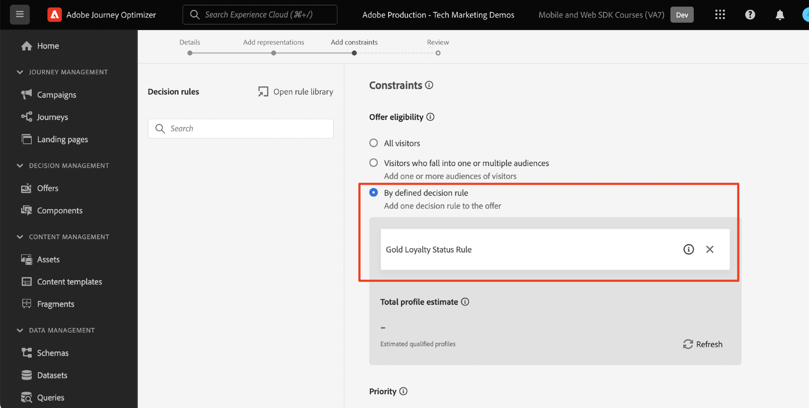

# Configuration de la gestion des décisions avec le SDK Web de Platform

Découvrez comment mettre en oeuvre la fonctionnalité de gestion des décisions Adobe Journey Optimizer à l’aide du SDK Web Platform. Ce guide couvre les conditions préalables fondamentales de la gestion des décisions, les étapes détaillées pour la configuration et une présentation approfondie d’un cas d’utilisation centré sur l’état de fidélité.

En suivant ce tutoriel, les utilisateurs de Journey Optimizer sont équipés pour utiliser les fonctionnalités de gestion de la décision, ce qui améliore la personnalisation et la pertinence de leurs interactions client.


## Objectifs d’apprentissage

À la fin de cette leçon, vous pouvez :

* Maîtrisez les concepts de base de la gestion de la décision dans Adobe Journey Optimizer et son intégration au SDK Web de Adobe Experience Platform.

* Découvrez le processus détaillé de configuration du SDK Web pour Offer Decisioning, assurant une intégration transparente avec Journey Optimizer.

* Explorez un cas d’utilisation détaillé axé sur les offres d’état de fidélité, en obtenant des informations sur la création et la gestion efficaces des offres, des décisions et des emplacements.

* Familiarisez-vous avec les termes essentiels et leurs implications dans le cadre de la gestion de la décision.

* Comprenez l’importance des règles de décision, des qualificateurs de collecte et des offres de secours pour diffuser l’offre appropriée à l’utilisateur approprié.

* Découvrez des rubriques avancées telles que les simulations et la collecte de données d’événement personnalisé, ce qui vous permet de tester, valider et améliorer vos mécanismes de diffusion d’offres.

## Conditions préalables

Pour terminer les leçons de cette section, vous devez d’abord :

* Assurez-vous que votre entreprise a accès à Adobe Journey Optimizer Ultimate (Journey Optimizer et Offer Decisioning) ou à Adobe Experience Platform et au module complémentaire Offer Decisioning.

* Suivez toutes les leçons pour la configuration initiale du SDK Web de Platform.

* Activez votre organisation pour la prise de décision Edge.

* Découvrez comment configurer un emplacement et instancier les ID d’emplacement et d’activité dans votre JSON de portée de décision.

## Limites

Les offres basées sur un événement ne sont actuellement pas prises en charge dans Adobe Journey Optimizer. Si vous créez une règle de décision basée sur un événement, vous ne pouvez pas l’appliquer dans une offre.

## Octroi de l’accès à la gestion des décisions

Pour accorder l’accès à la fonctionnalité de gestion des décisions, vous devez créer un **profil de produit** et attribuer les autorisations correspondantes à vos utilisateurs. [Pour en savoir plus sur la gestion des utilisateurs et des autorisations Journey Optimizer, consultez cette section](https://experienceleague.adobe.com/en/docs/journey-optimizer/using/access-control/privacy/high-low-permissions#decisions-permissions).

## Configuration du flux de données

Offer Decisioning doit être activé dans la configuration **datastream** avant que toute activité de gestion de décision ne puisse être fournie par le SDK Web Platform.

Pour configurer l’Offer decisioning dans le flux de données :

1. Accédez à l’interface [Collecte de données](https://experience.adobe.com/#/data-collection) .

1. Dans le volet de navigation de gauche, sélectionnez **Datastreams**.

1. Sélectionnez le flux de données SDK Web Luma créé précédemment.

   

1. Sélectionnez **Edit** dans le **Adobe Experience Platform Service**.

   

1. Cochez la case **Offer decisioning** .

   

1. Sélectionnez **Enregistrer**.

Cela permet de s’assurer que les événements entrants pour Journey Optimizer sont correctement gérés par **Adobe Experience Platform Edge**.

## Configuration du SDK pour la gestion de la décision

La gestion des décisions nécessite des étapes SDK supplémentaires, selon le type de mise en oeuvre du SDK Web. Deux options sont disponibles pour configurer le SDK pour la gestion de la décision.

* Installation autonome du SDK
   1. Configurez l’action `sendEvent` avec votre `decisionScopes`.

      ```javascript
      alloy("sendEvent", {
         ...
         "decisionScopes": [
            "[DECISION SCOPE 1]",
            "[DECISION SCOPE 2]"
         ]
      })
      ```

* Installation des balises SDK
   1. Accédez à l’interface Collecte de données .

   1. Dans le volet de navigation de gauche, sélectionnez **Balises**.

      

   1. Sélectionnez la **propriété de balise**.

   1. Créez vos **Règles**.
      * Ajoutez un SDK Web Platform **Send Event action** et ajoutez les `decisionScopes` appropriés à la configuration de cette action.

   1. Créez et publiez une **bibliothèque** contenant toutes les **règles**, les **éléments de données** et les **extensions** que vous avez configurées.

## Terminologie

Tout d’abord, vous devez comprendre la terminologie utilisée dans l’interface de gestion des décisions.

* **Limitation** : contrainte déterminant la fréquence d’affichage d’une offre. Deux types :
   * Limites totales : nombre maximal de fois où une offre peut être affichée dans l’audience cible.
   * Limite de profil : la fréquence à laquelle une offre peut être présentée à un utilisateur spécifique.
* **Collections** : sous-ensembles d’offres regroupés par conditions spécifiques définies par un marketeur, par exemple, catégorie d’offres.
* **Décision** : logique qui détermine le choix d’une offre.
* **Règle de décision** : contraintes sur les offres pour déterminer l’éligibilité d’un utilisateur.
* **Offre éligible** : offre qui correspond aux contraintes prédéfinies et qui peut être présentée à un utilisateur.
* **Gestion de la décision** : système de conception et de distribution d’offres personnalisées à l’aide d’une logique commerciale et de règles de décision.
* **Offres de secours** : offre par défaut affichée lorsqu’un utilisateur ne remplit aucune condition pour une offre dans une collection.
* **Offre** : message marketing avec des règles d’éligibilité potentielles déterminant ses visionneuses.
* **Bibliothèque d’offres** : un référentiel central gère les offres, les décisions et les règles associées.
* **Offres personnalisées** : messages marketing personnalisés sur mesure basés sur des contraintes d’éligibilité.
* **Emplacements** : paramètre ou scénario dans lequel une offre est affichée pour un utilisateur.
* **Priorité** : mesure de classement pour les offres qui prennent en compte diverses contraintes comme l’éligibilité et la limitation.
* **Représentations** : informations spécifiques au canal, par exemple, emplacement ou langue, qui guident l’affichage d’une offre.

## Présentation du cas d’utilisation - Loyalty Rewards

Dans cette leçon, vous implémentez un exemple de cas d’utilisation Loyalty Rewards pour comprendre la gestion des décisions à l’aide du SDK Web.

Ce cas d’utilisation vous permet de mieux comprendre comment Journey Optimizer peut vous aider à proposer la meilleure offre à vos clients, en utilisant la bibliothèque d’offres centralisée et le moteur de décision de la gestion des décisions.

>[!NOTE]
>
> Comme ce tutoriel est destiné aux implémentateurs, il est intéressant de noter que cette leçon implique un travail d’interface substantiel dans Journey Optimizer. Bien que ces tâches d’interface soient généralement gérées par les marketeurs, il peut s’avérer utile pour les implémenteurs d’obtenir des informations sur le processus, même s’ils ne sont pas responsables de la création de campagnes de gestion de décision à long terme.

## Composants

Avant de commencer à créer les offres, vous devez définir plusieurs composants prérequis.

### Création d’un emplacement pour les offres de fidélité

**Emplacements** sont des conteneurs utilisés pour présenter les offres. Dans cet exemple, vous créez un emplacement en haut du site Luma.

La liste des emplacements est accessible dans le menu **Composants**. Des filtres sont disponibles pour vous aider à récupérer des emplacements en fonction d&#39;un canal ou d&#39;un contenu spécifique.


Pour créer l’emplacement, procédez comme suit :

1. Cliquez sur **Créer un emplacement**.

   

1. Définissez les propriétés de l&#39;emplacement :
   * **Nom** : nom de l&#39;emplacement. Appelons l’exemple d’emplacement *&#39;Homepage Banner&#39;*.
   * **Type de canal** : canal pour lequel l’emplacement est utilisé. Utilisons *&#39;Web&#39;*, car les offres s’affichent sur le site web de Luma.
   * **Type de contenu** : type de contenu que l’emplacement est autorisé à afficher : texte, HTML, lien d’image ou JSON. Vous pouvez utiliser *&#39;HTML&#39;* pour l&#39;offre.
   * **Description** : description de l’emplacement (facultatif).

   

1. Cliquez sur **Enregistrer**.
1. Une fois l’emplacement créé, il s’affiche dans la liste des emplacements.
1. Sélectionnez la ligne contenant votre nouvel emplacement et notez l’identifiant de référencement, car cela peut s’avérer nécessaire pour la configuration dans votre champ de décision.

   

### Règles de décision relatives à l’état de fidélité

**Les règles de décision** spécifient les conditions dans lesquelles les offres sont présentées. Dans cet exemple, vous créez des règles de décision pour proposer différentes offres en fonction de l’état de fidélité d’un utilisateur.

La liste des règles de décision est accessible dans le menu **Composants**.

Pour créer des règles de décision, procédez comme suit :

1. Accédez à l’onglet **Rules** et cliquez sur **Créer une règle**.

   

1. Nommons la première règle &quot;*Gold Loyalty Status Rule*&quot;. Vous pouvez utiliser des champs XDM pour définir la règle. Le **créateur de segments** de Adobe Experience Platform est une interface intuitive que vous pouvez utiliser pour créer des conditions de règle.

   

1. Cliquez sur **Enregistrer** pour confirmer la condition de la règle.
1. La &quot;*Gold Loyalty Status Rule*&quot; nouvellement enregistrée s’affichera dans la **liste des règles**. Sélectionnez-la pour afficher ses propriétés.

   

1. Créez maintenant les conditions de règle d’offre de fidélité restantes pour le cas d’utilisation.


### Qualificateurs de collection

**Les qualificateurs de collection** vous permettent d’organiser et de rechercher facilement des offres dans la bibliothèque d’offres. Dans cet exemple, vous ajoutez des qualificateurs de collection aux offres Loyalty Rewards afin d’améliorer l’organisation des offres.

La liste des qualificateurs de collection est accessible dans le menu **Components** .

Pour créer le qualificateur de collection Loyalty Rewards, procédez comme suit :

1. Accédez à l’onglet **Qualificateurs de collection** et cliquez sur **Créer un qualificateur de collection**.

   

1. Nommons le qualificateur de collection &#39;*Loyalty Rewards*&#39;

   

1. Le nouveau qualificateur de collection doit maintenant s’afficher dans l’onglet **Qualificateur de collection**

## Offres

Il est maintenant temps de créer les offres Loyalty Rewards.

La liste des offres est accessible dans le menu **Offres**.


### Création d’offres pour différents niveaux de fidélité

Commencez par créer des offres personnalisées pour les différents niveaux de fidélité de Luma.

Pour créer la première **offre**, procédez comme suit :

1. Cliquez sur **Créer une offre**, puis sélectionnez **Offre personnalisée**.

1. Nommons la première offre &quot;*Loyalty Level - Gold*&quot;. Vous devez spécifier une date et une heure de début/fin pour cette offre. Vous devez également associer le **qualificateur de collection** &#39;*Loyalty Rewards*&#39; à l’offre, ce qui vous permet de mieux vous organiser dans la **bibliothèque des offres**. Ensuite, cliquez sur **Suivant**.

   

1. Vous devez maintenant ajouter **représentations** pour définir l’emplacement d’affichage de l’offre. Sélectionnez le **canal web**. Sélectionnez également la &quot;*bannière de page d’accueil*&quot; **emplacement** que vous avez précédemment configurée. Le **placement** sélectionné est de type HTML. Vous pouvez donc ajouter du contenu HTML, JSON ou TEXTE directement à l’éditeur pour créer l’offre à l’aide du bouton radio **Personnalisé** .

   

1. Modifiez le contenu de l&#39;offre directement à l&#39;aide de l&#39;**Éditeur d&#39;expression**. N’oubliez pas que vous pouvez ajouter du contenu HTML, JSON ou TEXTE à cet emplacement. Assurez-vous de sélectionner le **mode** correct en bas de l’éditeur, en fonction de votre type de contenu. Vous pouvez également appuyer sur **validate** pour vous assurer qu’il n’y a aucune erreur.

   

1. Vous pouvez également utiliser l’éditeur d’expression pour récupérer les attributs stockés dans Adobe Experience Platform. Ajoutons le prénom d’un profil au contenu de l’offre afin de mieux personnaliser les membres du programme de fidélité au niveau 1:1.

   

1. Ajoutez des contraintes afin d’afficher uniquement l’offre aux profils qui remplissent les critères pour la &quot;*Règle d’état de fidélité Gold*&quot;.

   

1. Une fois que vous avez terminé de revoir votre offre, cliquez sur **Terminer**. Sélectionnez **Enregistrer et approuver**.

Créez maintenant le reste des offres pour les différents niveaux de fidélité Luma.

### Offres de secours

Vous souhaitez toujours proposer une offre aux visiteurs non fidèles de Luma sur le site Luma. Pour ce faire, vous pouvez configurer une **offre de secours** pour la campagne.

Pour créer l’offre de secours, procédez comme suit :

1. Cliquez sur **Créer une offre**, puis sélectionnez **Offre de secours**.
   <!--
      
   -->
1. Nommons l’offre de secours &#39;*Non-Luma Loyalty*&#39;. Vous pouvez également associer le **qualificateur de collection**, &#39;*Loyalty Rewards*&#39; créé précédemment à l’offre de secours pour faciliter l’organisation des offres.
   <!--
      
   -->
1. Ajoutez le contenu de l’offre de secours à l’ **Éditeur d’expression**. N’oubliez pas que vous pouvez ajouter du contenu HTML, JSON ou TEXTE à cet emplacement. Assurez-vous de sélectionner le **mode** correct en bas de l’éditeur, en fonction de votre type de contenu. Vous pouvez également appuyer sur **validate** pour vous assurer qu’il n’y a aucune erreur.
   <!--
      
   -->
1. Si tout est configuré correctement, appuyez sur **Terminer** puis sur **Enregistrer et approuver**.
<!--
   
-->

## Décisions

**Les décisions** sont des conteneurs pour les offres qui sélectionnent la meilleure offre disponible pour un client, selon la cible.

La liste des décisions est disponible dans l&#39;onglet **Décisions** du menu **Offres**.
<!--
   
-->

### Création d’une décision pour les offres de fidélité

Créons une décision pour le cas d’utilisation Loyalty Rewards de Luma.

Pour créer la décision, procédez comme suit :

1. Cliquez sur **Créer une décision**.
   <!--
      
   -->
1. Appelons la décision &quot;Offres de fidélité Luma de décembre *&quot;.* Les offres doivent durer un mois. Indiquez-les ici.
   <!--
      
   -->
1. Maintenant, vous devez définir les **portées de décision**. Sélectionnez tout d’abord un emplacement. Vous pouvez utiliser la &quot;*bannière de page d’accueil*&quot; créée précédemment.
   <!--
      
   -->
1. Vous devez ensuite ajouter **critères d’évaluation** pour la portée de la décision. Cliquez sur **Ajouter** et sélectionnez la ** collection &quot;*Loyalty Rewards*&quot; créée précédemment, qui contient toutes les offres de fidélité à prendre en compte.
   <!--
      
   -->
1. Dans la collection &#39;*Loyalty Rewards*&#39;, vous pouvez utiliser le champ d’éligibilité pour restreindre la diffusion de l’offre à un sous-ensemble de visiteurs Luma. Cependant, dans ce cas pratique, vous souhaitez que chaque visiteur reçoive l’une des offres. Souvenez-vous que vous avez configuré une **offre de secours** pour tous les visiteurs non fidèles. Définissez l’éligibilité sur &quot;Aucun&quot;.
   <!--
      
   -->
1. Vous pouvez également utiliser le champ **méthode de classement** pour sélectionner la meilleure offre pour chaque visiteur Luma, si plusieurs offres sont éligibles pour la combinaison utilisateur/emplacement. Pour ce cas d’utilisation, vous pouvez utiliser la méthode **Priorité de l’offre** qui utilise les valeurs définies dans les offres pour proposer la meilleure offre.
   <!--
      
   -->
1. Ajoutez maintenant l’ **offre de secours** à la décision. N’oubliez pas que l’offre de secours est l’offre par défaut qui s’affiche pour les visiteurs Luma s’ils ne font partie d’aucune des audiences de fidélité Luma. Sélectionnez &quot;*Non-Luma Loyalty*&quot; dans la liste des offres de secours disponibles pour l’emplacement &quot;*Homepage Banner*&quot;.
   <!--
      
   -->
1. Avant d’activer la décision, examinons la portée de la décision, l’offre de secours, prévisualisons les offres disponibles et évaluons les profils qualifiés. Une fois que tout semble correct, vous pouvez cliquer sur **Terminer** et **Enregistrer et activer**.
<!--
   
-->

## Simulation

En règle générale, vous devez valider la logique de prise de décision de fidélité de Luma pour vous assurer que les offres correctes sont diffusées aux audiences de fidélité appropriées. Vous pouvez effectuer cette validation à l’aide des **profils de test**. Il est également conseillé de tester les modifications apportées aux offres via des profils de test avant de mettre en production de nouvelles versions d’offres.

Pour lancer le test, sélectionnez l’onglet **Simulations** dans le menu **Offres** .

### Test des offres de fidélité

1. Sélectionnez un profil de test à utiliser pour la simulation. Cliquez sur **Gérer le profil**. [Pour créer ou désigner un nouveau profil de test pour le test des offres, suivez ce guide](https://experienceleague.adobe.com/en/docs/journeys/using/building-journeys/about-journey-building/creating-test-profiles#create-test-profiles-csv).
   <!--
      
   -->
1. Ajoutez un ou plusieurs profils de test à la simulation et enregistrez votre sélection. Pour les tests de cas d’utilisation, vous devez vous assurer que vous disposez de profils de test configurés pour chaque audience de récompenses de fidélité Luma.
   <!--
      
   -->
1. Sélectionnez la portée de décision à tester. Sélectionnez **Ajouter une portée de décision**.
   <!--
      
   -->
1. Sélectionnez l’emplacement &quot;*Bannière de page d’accueil*&quot; créé précédemment.
   <!--
      
   -->
1. Les décisions disponibles s’affichent, sélectionnez la décision &#39;*Décembre Luma Loyalty Offers*&#39; créée précédemment, puis cliquez sur **Ajouter**.
   <!--
      
   -->
1. Une fois que vous avez sélectionné un profil de test, cliquez sur **Afficher les résultats**. La meilleure offre disponible s’affiche pour le profil de test sélectionné pour la décision &#39;*Décembre Luma Loyalty Offers*&#39;.
   <!--
      
   -->
1. Sélectionnez un autre profil de test et cliquez sur **Afficher les résultats**. Idéalement, vous devriez voir une offre simulée différente, correspondant au niveau de fidélité du profil de test.

## Validation de la gestion des décisions à l’aide d’Adobe Experience Platform Debugger

L’extension **Adobe Experience Platform Debugger**, disponible pour Chrome et Firefox, analyse vos pages web pour identifier les problèmes liés à l’implémentation des solutions Adobe Experience Cloud.

Vous pouvez utiliser le débogueur sur le site Luma pour valider la logique de prise de décision en production. Cette validation est une bonne pratique une fois que le cas d’utilisation Loyalty Rewards est opérationnel, pour s’assurer que tout est correctement configuré.

[Découvrez comment configurer le débogueur dans votre navigateur à l’aide du guide ici](https://experienceleague.adobe.com/en/docs/platform-learn/data-collection/debugger/overview).

Pour commencer la validation à l’aide du débogueur :

1. Accédez à la page web Luma avec l’emplacement de l’offre.
   <!--
      
   -->
1. Sur la page web, ouvrez le **débogueur Adobe Experience Platform**.
   <!--
      
   -->
1. Accédez à **Summary**. Vérifiez que l’ **ID de flux de données** correspond au **flux de données** de la **collecte de données d’Adobe** pour laquelle vous avez activé l’Offer decisioning.
   <!--
      
   -->
1. Sous **Solutions**, accédez au **SDK Web Experience Platform**.
   <!--
      
   -->
1. Dans l’onglet **Configuration**, activez l’option **Activer le débogage**. Cela permet la journalisation de la session dans une session **Adobe Experience Platform Assurance**.
   <!--
      
   -->
1. Vous pouvez ensuite vous connecter au site avec divers comptes de fidélité Luma et utiliser le débogueur pour valider les requêtes envoyées au **réseau Adobe Experience Platform Edge**. Toutes ces requêtes doivent être capturées dans **Assurance** pour le suivi des logs.
<!--
   
-->

[Suivant : ](setup-consent.md)

>[!NOTE]
>
>Merci d’avoir consacré du temps à l’apprentissage du SDK Web Adobe Experience Platform. Si vous avez des questions, souhaitez partager des commentaires généraux ou avez des suggestions sur le contenu à venir, partagez-les sur cet [post de discussion de la communauté Experience League](https://experienceleaguecommunities.adobe.com/t5/adobe-experience-platform-data/tutorial-discussion-implement-adobe-experience-cloud-with-web/td-p/444996)
