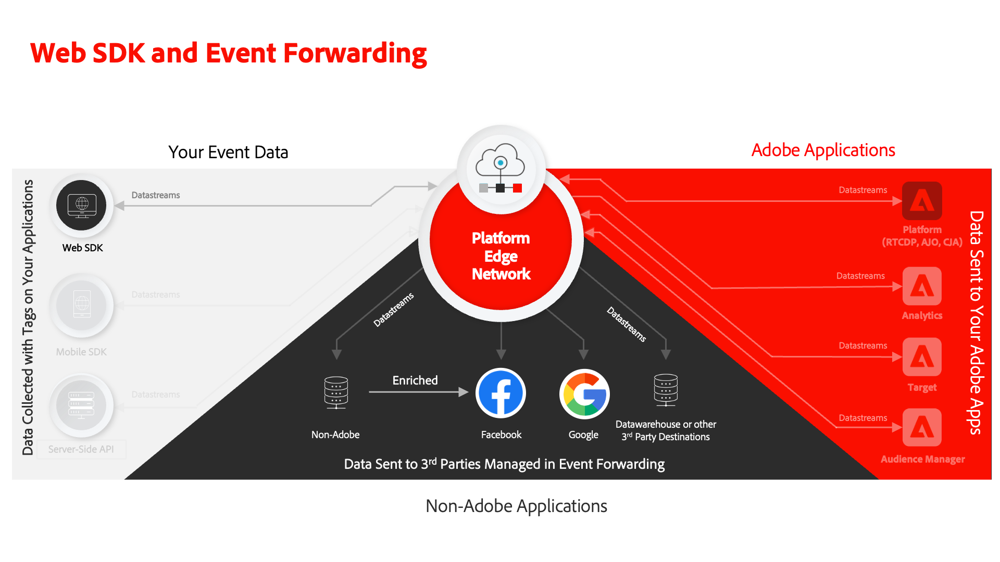
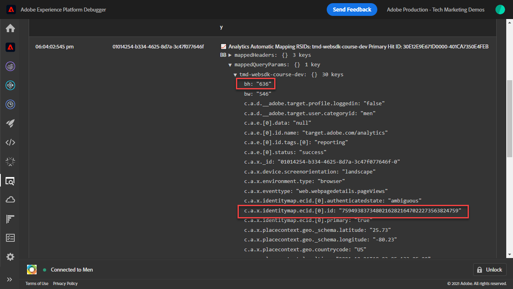
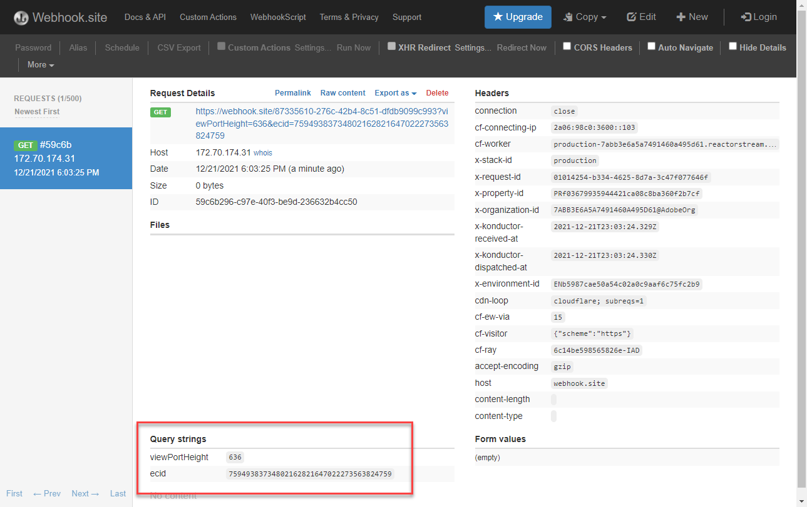

# Configuration d’une propriété de transfert d’événement

Découvrez comment utiliser la propriété de transfert d’événement à l’aide des données Experience Platform du SDK Web.

Le transfert d’événement est un nouveau type de propriété disponible dans la collecte de données. Le transfert d’événements vous permet d’envoyer des données à des fournisseurs tiers non Adobes directement à partir de l’Edge Network Adobe Experience Platform au lieu du navigateur côté client traditionnel. Découvrez les avantages du transfert d’événement dans la section [Présentation du transfert d’événement](https://experienceleague.adobe.com/en/docs/experience-platform/tags/event-forwarding/overview).

Pour utiliser le transfert d’événement dans Adobe Experience Platform, les données doivent d’abord être envoyées à Adobe Experience Platform Edge Network à l’aide d’une ou de plusieurs des trois options suivantes :

* [SDK web Adobe Experience Platform](overview.md)
* [ SDK Mobile Adobe Experience Platform](https://developer.adobe.com/client-sdks/documentation/)
  <!--* [Server-to-Server API](https://experienceleague.adobe.com/en/docs/audience-manager/user-guide/api-and-sdk-code/dcs/dcs-apis/dcs-s2s)-->

>[!NOTE]
>Le SDK Web Platform et le SDK Mobile Platform ne nécessitent pas de déploiement par le biais de balises. Toutefois, il est recommandé d’utiliser des balises pour déployer ces SDK.

Après avoir suivi les leçons précédentes de ce tutoriel, vous devriez envoyer des données à Platform Edge Network à l’aide du SDK Web. Une fois que les données se trouvent dans l’Edge Network Platform, vous pouvez activer le transfert d’événement et utiliser une propriété de transfert d’événement pour envoyer des données à des solutions non-Adobes.

## Objectifs d&#39;apprentissage

À la fin de cette leçon, vous serez en mesure de :

* Création d’une propriété de transfert d’événement
* Associer une propriété de transfert d’événement à un flux de données SDK Web Platform
* Comprendre les différences entre les éléments de données et les règles de propriété de balise et les éléments de données et les règles de propriété de transfert d’événement
* Création d’un élément de données de transfert d’événement
* Configuration d’une règle de transfert d’événement
* Validation de l’envoi de données par une propriété de transfert d’événement

## Conditions préalables

* Une licence logicielle qui inclut le transfert d’événement. Le transfert d’événement est une fonctionnalité payante de la collecte de données. Pour plus d’informations, contactez votre équipe de compte d’Adobe.
* Transfert d’événement activé dans votre organisation Experience Cloud.
* Autorisation de l’utilisateur pour le transfert d’événement. (Dans [Admin Console](https://adminconsole.adobe.com/), sous le produit Adobe Experience Platform Launch, éléments d’autorisation pour[!UICONTROL Plateformes] > [!UICONTROL Edge] et tout [!UICONTROL Droits de propriété]). Une fois accordée, vous devriez voir [!UICONTROL Transfert d’événement] dans le volet de navigation de gauche de l’interface Collecte de données :
  

* SDK Web ou mobile Adobe Experience Platform configuré pour envoyer des données à l’Edge Network. Vous devez avoir terminé les leçons suivantes de ce tutoriel :

   * Configuration initiale

      * [Configurer un schéma XDM](configure-schemas.md)
      * [Configuration d’un espace de noms d’identité](configure-identities.md)
      * [Configurer un trains de données](configure-datastream.md)

   * Configuration des balises

      * [Installer l’extension SDK Web](install-web-sdk.md)
      * [Créer des éléments de données](create-data-elements.md)
      * [Création d’identités](create-identities.md)
      * [Création de règles de balise](create-tag-rule.md)
      * [Validation avec le débogueur Adobe Experience Platform](validate-with-debugger.md)

## Création d’une propriété de transfert d’événement

Commencez par créer une propriété de transfert d’événement :

1. Ouvrez le [Interface de collecte de données](https://experience.adobe.com/#/data-collection)
1. Sélectionner **[!UICONTROL Transfert d’événement]** à partir du volet de navigation de gauche
1. Sélectionnez **[!UICONTROL Nouvelle propriété]**.
   

1. Attribuez un nom à la propriété. Dans ce cas `Server-Side - Web SDK Course`

1. Sélectionnez **[!UICONTROL Enregistrer]**.
   

## Configuration du flux de données

Pour que le transfert d’événement utilise les données que vous envoyez au réseau Edge, vous devez lier la propriété de transfert d’événement nouvellement créée au même flux de données que celui utilisé pour envoyer des données aux solutions Adobe.

Pour configurer Target dans le flux de données :

1. Accédez à [Collecte de données](https://experience.adobe.com/#/data-collection){target="blank"} interface
1. Dans le volet de navigation de gauche, sélectionnez **[!UICONTROL Datastreams]**
1. Sélectionnez la `Luma Web SDK: Development Environment` datastream

   

1. Sélectionnez **[!UICONTROL Ajouter un service]**.
   
1. Sélectionner **[!UICONTROL Transfert d’événement]** comme la propriété **[!UICONTROL Service]**

1. Sous , **[!UICONTROL ID de propriété]** , sélectionnez le nom que vous avez donné à votre propriété de transfert d’événement, dans ce cas `Server-Side - Web SDK Course`

1. Sous , **[!UICONTROL Identifiant d’environnement]** , sélectionnez l’environnement de balise auquel vous liez l’environnement de transfert d’événement, dans ce cas `Development`

   >[!TIP]
   >
   >    Pour envoyer des données à un environnement de transfert d’événement en dehors de l’organisation Adobe, sélectionnez **[!UICONTROL Saisie manuelle des identifiants]** et collez-les dans un ID. L’identifiant est fourni lorsque vous créez une propriété de transfert d’événement.

1. Sélectionnez **[!UICONTROL Enregistrer]**.

   

Répétez ces étapes pour les flux de données d’évaluation et de production lorsque vous êtes prêt à promouvoir vos modifications par le biais du flux de publication.

## Transfert de données de l’Edge Network Platform vers une solution non Adobe

Dans cet exercice, vous apprendrez à configurer un élément de données de transfert d’événement, à configurer une règle de transfert d’événement et à valider à l’aide d’un outil tiers appelé [Webhook.site](https://webhook.site/).

>[!NOTE]
>
>Un webhook est un moyen d’intégrer différents systèmes en temps semi-réel. [Webhook.site](https://webhook.site/) est un outil tiers qui vous permet d’inspecter, de tester et d’automatiser facilement (à l’aide du générateur d’actions personnalisées visuel ou de WebhookScript) toute requête HTTP ou tout courrier électronique entrant.

>[!IMPORTANT]
>
>Vous devez avoir déjà créé et mappé des éléments de données à un objet XDM, ainsi que configuré des règles de balise et créé ces modifications dans une bibliothèque dans un environnement de balise pour continuer. Dans le cas contraire, reportez-vous à la section **Configuration des balises** dans la section [conditions préalables](setup-event-forwarding.md#prerequisites) . Ces étapes garantissent que les données sont envoyées à l’Edge Network Platform. Vous pouvez ensuite configurer une propriété de transfert d’événement pour transférer des données vers une solution non-Adobe.

### Création d’un élément de données de transfert d’événement

L’objet XDM que vous avez précédemment configuré à l’aide de l’extension de balise SDK Web Platform devient la source de données pour les éléments de données dans une propriété de transfert d’événement. Vous utilisez les mêmes données que celles que vous avez déjà configurées dans la propriété de balise comme source de données pour le transfert d’événement.

>[!IMPORTANT]
>
>Il existe une différence de syntaxe clé lors du référencement des champs XDM dans le transfert d’événement par rapport à d’autres contextes. Pour référencer des données dans une propriété de transfert d’événement, le chemin d’accès de l’élément de données doit inclure la variable `arc.event` préfixe :
>
> * `arc` désigne Adobe Response Context.
> * Par exemple : `arc.event.xdm.web.webPageDetails.URL`
>
>Si ce chemin dʼaccès nʼest pas spécifié correctement, les données ne sont pas collectées.

Au cours de cet exercice, vous allez transférer la hauteur de la fenêtre d’affichage du navigateur et l’identifiant Experience Cloud de l’objet XDM vers un webhook. Le chemin d’accès au champ XDM est déterminé par le schéma XDM créé lors de la [Configurer un schéma XDM](configure-schemas.md) leçon.

>[!TIP]
>
>Vous pouvez également trouver le chemin d’accès de l’objet XDM en utilisant les outils réseau de votre navigateur web, en filtrant pour `/ee` requêtes, ouverture de la balise [!UICONTROL **Payload**] et descendre vers la variable que vous recherchez. Cliquez avec le bouton droit de la souris et sélectionnez &quot;Copier le chemin de la propriété&quot;. Voici un exemple pour la hauteur de la fenêtre d’affichage du navigateur :
> 

1. Accédez au **[!UICONTROL Transfert d’événement]** la propriété que vous venez de créer

1. Dans le volet de navigation de gauche, sélectionnez **[!UICONTROL Éléments de données]**

1. Sélectionnez pour **[!UICONTROL Créer un élément de données]**

   

1. **[!UICONTROL Nom]** l’élément de données `environment.browserDetails.viewportHeight`

1. Sous **[!UICONTROL Extension]**, laissez `CORE`

1. Sous **[!UICONTROL Type d’élément de données]**, sélectionnez `Path`

1. Saisissez le chemin d’accès de l’objet XDM contenant la hauteur de la fenêtre d’affichage du navigateur. `arc.event.xdm.environment.browserDetails.viewportHeight`

1. Sélectionnez **[!UICONTROL Enregistrer]**.

   

1. Création d’un autre élément de données

1. **[!UICONTROL Nom]** it `ecid`

1. Sous **[!UICONTROL Extension]**, laissez `CORE`

1. Sous **[!UICONTROL Type d’élément de données]**, sélectionnez `Path`

1. Saisissez le chemin d’accès à l’objet XDM contenant l’identifiant Experience Cloud. `arc.event.xdm.identityMap.ECID.0.id`

1. Sélectionnez **[!UICONTROL Enregistrer]**.

   

   >[!CAUTION]
   >
   > Veillez à inclure la variable `arc.event.` dans le chemin. Veillez également à respecter la casse exacte en tant que nom du champ d’objet XDM : l’espace de noms ECID doit être en majuscules.

   >[!TIP]
   >
   >Lorsque vous utilisez votre propre site web, vous pouvez trouver le chemin d’accès de l’objet XDM avec les outils réseau de votre navigateur web, en filtrant pour `/ee` requêtes, ouverture de la balise [!UICONTROL **Payload**] et descendre vers la variable que vous recherchez. Cliquez avec le bouton droit de la souris et sélectionnez &quot;Copier le chemin de la propriété&quot;. Voici un exemple pour la hauteur de la fenêtre d’affichage du navigateur :
   > 

### Installation de l’extension Adobe Cloud Connector

Pour envoyer des données à des emplacements tiers, vous devez d’abord installer le [!UICONTROL Connecteur Adobe Cloud] extension .

1. Sélectionner **[!UICONTROL Extensions]** dans la navigation de gauche

1. Sélectionnez la variable **[!UICONTROL Catalogue]** tab

1. Recherchez le **[!UICONTROL Connecteur Adobe Cloud]**, sélectionnez **[!UICONTROL Installer]**

   

Aucune configuration d’extension n’est nécessaire. Avec cette extension, vous pouvez désormais transférer des données vers une solution autre qu’Adobe !

### Création d’une règle de transfert d’événement

Il existe quelques différences principales entre la configuration des règles dans une propriété de balise et une règle dans une propriété de transfert d’événement :

* **[!UICONTROL Événements] &amp; [!UICONTROL Conditions]**:

   * **Balises**: toutes les règles sont déclenchées par un événement qui doit être spécifié dans la règle, par exemple : `Library Loaded - Page Top`. Les conditions sont facultatives.
   * **Transfert d’événement**: on suppose que chaque événement envoyé à l’Edge Network Platform est un déclencheur pour transférer des données. Par conséquent, il n’existe pas de [!UICONTROL Événements] qui doit être sélectionné dans les règles de transfert d’événement. Pour gérer les événements qui déclenchent une règle de transfert d’événement, vous devez configurer des conditions.

* **Jeton d’élément de données**:

   * **Balises**: les noms des éléments de données sont segmentés en unités lexicales avec un `%` au début et à la fin du nom de l’élément de données lorsqu’il est utilisé dans une règle. Par exemple : `%viewportHeight%`.

   * **Transfert d’événement**: les noms des éléments de données sont segmentés en unités lexicales avec `{{` au début et `}}` à la fin du nom de l’élément de données lorsqu’il est utilisé dans une règle. Par exemple : `{{viewportHeight}}`.

* **Séquence d’actions de règle**:

   * La section Actions d’une règle de transfert d’événement est toujours exécutée de manière séquentielle. Assurez-vous que l’ordre des actions est correct lorsque vous enregistrez une règle. Cette séquence d’exécution ne peut pas être exécutée de manière asynchrone, à la différence des balises.

<!--
  * **Tags**: Rule actions can easily be reordered using drag-and-drop functionality.
  * **Event forwarding**: Rule actions are always executed sequentially. Make sure the order of actions is correct when you save a rule.
-->

Pour configurer une règle de transfert de données vers votre webhook, vous devez d’abord obtenir votre webhook personnel :

1. Accédez à [Webhook.site](https://webhook.site)

1. Rechercher **Votre URL unique**, vous l’utiliserez comme requête d’URL dans votre règle de transfert d’événement.

1. Sélectionner **[!UICONTROL Copier dans le presse-papiers]**

1. Laissez cette fenêtre ouverte, car vous pourrez valider les données de transfert d’événement en temps réel capturées par Webhook.

   

1. Revenir **[!UICONTROL Collecte de données]** > **[!UICONTROL Transfert d’événement]** > **[!UICONTROL Règles]** à partir du volet de navigation de gauche

1. Sélectionner **[!UICONTROL Créer une règle]**

   

1. Nommez-le `all events - ad cloud connector - webhook`

1. Ajout d’une action

1. Sous **[!UICONTROL Extension]**, sélectionnez **[!UICONTROL Connecteur Adobe Cloud]**

1. Sous **[!UICONTROL Type d’action]**, sélectionnez **[!UICONTROL Appel de récupération]**

1. Collez l’URL de webhook dans **[!UICONTROL URL]** field

   

1. Sous **[Paramètres de requête]**, vous ajouterez les deux éléments de données que vous avez créés précédemment.

1. Sur le **[!UICONTROL Clé]** type de colonne dans `viewPortHeight`. Sur le **[!UICONTROL Valeur]** , saisissez la variable `{{environment.browserDetails.viewportHeight}}` élément de données en le saisissant ou en le sélectionnant à partir de l’icône du sélecteur d’élément de données

1. Sélectionner [!UICONTROL **+ Ajouter un autre**] pour ajouter un autre paramètre de requête

1. Sur le **[!UICONTROL Clé]** type de colonne dans `ecid`. Dans la colonne Valeur , saisissez la valeur `{{ecid}}` élément de données

1. Sélectionner **[!UICONTROL Conserver les modifications]**

   

1. Votre règle doit ressembler à ci-dessous.

1. Sélectionnez **[!UICONTROL Enregistrer]**.

   

### Création et création de la bibliothèque

Créez une bibliothèque et générez toutes les modifications dans votre environnement de développement de transfert d’événement comme vous le feriez normalement dans une propriété de balise.

>[!NOTE]
>
>Si vous n’avez pas lié les propriétés d’évaluation et de transfert d’événement de production à votre flux de données, vous verrez l’environnement de développement comme la seule option vers laquelle créer une bibliothèque.

## Validation de la règle de transfert d’événement

Vous pouvez maintenant valider votre propriété de transfert d’événement à l’aide de Platform Debugger et de Webhook.site :

1. Suivez les étapes pour [changer la bibliothèque de balises](validate-with-debugger.md#use-the-experience-platform-debugger-to-map-to-your-tag-property) sur le [Site de démonstration Luma](https://luma.enablementadobe.com/content/luma/us/en/men.html) à la propriété de balise du SDK Web à laquelle vous avez mappé votre propriété de transfert d’événement dans le flux de données.

1. Avant de recharger la page, ouvrez Debugger dans l’Experience Platform **[!UICONTROL Journaux]** à partir du volet de navigation de gauche

1. Sélectionnez la variable **[!UICONTROL Edge]** , puis sélectionnez **[!UICONTROL Connexion]** pour afficher les demandes de l’Edge Network Platform

   

1. Recharger la page

1. D’autres requêtes s’affichent, vous donnant ainsi une vue d’ensemble des requêtes côté serveur envoyées par l’Edge Network Platform à WebHook.

1. La demande sur laquelle se concentrer la validation est celle qui montre l’URL entièrement construite envoyée par le réseau Edge.

   

1. Notez les paramètres de chaîne de requête viewPortHeight et ecid

   

1. Ils correspondent aux données affichées dans l’objet XDM.

   

1. Enfin, validez les correspondances de données dans [Webhook.site](https://webhook.site) également en affichant votre fenêtre Webhook ouverte.

   

Félicitations ! Vous avez configuré le transfert d’événement !

[Suivant : ](conclusion.md)

>[!NOTE]
>
>Merci d’avoir consacré du temps à l’apprentissage du SDK Web Adobe Experience Platform. Si vous avez des questions, souhaitez partager des commentaires généraux ou avez des suggestions sur le contenu futur, partagez-les à ce sujet. [Article de discussion de la communauté Experience League](https://experienceleaguecommunities.adobe.com/t5/adobe-experience-platform-launch/tutorial-discussion-implement-adobe-experience-cloud-with-web/td-p/444996)
