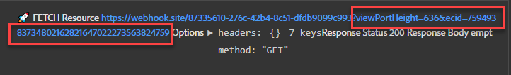

# Configurer le transfert d’événement avec les données de Platform Web SDK

Découvrez comment utiliser le transfert d’événement avec les données du SDK web d’Adobe Experience Platform.

Le transfert d’événement est un nouveau type de propriété disponible dans la collecte de données. Le transfert d’événement vous permet d’envoyer des données à des fournisseurs tiers non Adobe directement depuis Adobe Experience Platform Edge Network au lieu du navigateur côté client traditionnel. Pour en savoir plus sur les avantages du transfert d’événement, consultez la [présentation du transfert d’événement](https://experienceleague.adobe.com/fr/docs/experience-platform/tags/event-forwarding/overview).

>[!WARNING]
>
> Le site web Luma utilisé dans ce tutoriel devrait être remplacé au cours de la semaine du 16 février 2026. Le travail effectué dans le cadre de ce tutoriel peut ne pas s’appliquer au nouveau site web.

Pour utiliser le transfert d’événement dans Adobe Experience Platform, les données doivent d’abord être envoyées à Adobe Experience Platform Edge Network à l’aide d’une ou de plusieurs des trois options suivantes :

* [SDK web Adobe Experience Platform](overview.md)
* [&#x200B; SDK Mobile Adobe Experience Platform](https://developer.adobe.com/client-sdks/home/)
  <!--* [Server-to-Server API](https://experienceleague.adobe.com/fr/docs/audience-manager/user-guide/api-and-sdk-code/dcs/dcs-apis/dcs-s2s)-->

>[!NOTE]
>Platform Web SDK et Platform Mobile SDK ne nécessitent pas de déploiement par le biais de balises. Toutefois, il est recommandé d’utiliser des balises pour déployer ces SDK.

Après avoir suivi les leçons précédentes de ce tutoriel, vous devez envoyer des données à Platform Edge Network à l’aide de Web SDK. Une fois que les données se trouvent dans Platform Edge Network, vous pouvez activer le transfert d’événement et utiliser une propriété de transfert d’événement pour envoyer des données à des solutions non Adobe.

## Objectifs d’apprentissage

À la fin de cette leçon, vous serez en mesure de :

* Création d’une propriété de transfert d’événement
* Lier une propriété de transfert d’événement à un flux de données Platform Web SDK
* Comprenez les différences entre les éléments de données et les règles de propriété de balise et les éléments de données et les règles de propriété de transfert d’événement
* Créer un élément de données de transfert d’événement
* Configuration d’une règle de transfert d’événement
* Validez une propriété de transfert d’événement qui envoie correctement des données.

## Conditions préalables

* Une licence logicielle qui inclut le transfert d’événement. Le transfert d’événement est une fonctionnalité payante de la collecte de données. Pour plus d’informations, contactez l’équipe chargée de votre compte Adobe.
* Le transfert d’événement est activé dans votre organisation Experience Cloud.
* Autorisation utilisateur pour le transfert d’événement. (Dans [Admin Console](https://adminconsole.adobe.com/), sous le produit Adobe Experience Platform Launch, les éléments d’autorisation pour[!UICONTROL Plateformes] > [!UICONTROL Edge] et tous les [!UICONTROL Droits de propriété]). Une fois accordé, vous devriez voir [!UICONTROL Transfert d’événement] dans le volet de navigation de gauche de l’interface de collecte de données :
  

* Adobe Experience Platform Web ou Mobile SDK est configuré pour envoyer des données à Edge Network. Vous devez avoir terminé les leçons suivantes de ce tutoriel :

   * Configuration initiale

      * [Configuration d’un schéma XDM](configure-schemas.md)
      * [Configuration d’un espace de noms d’identité](configure-identities.md)
      * [Configurer un trains de données](configure-datastream.md)

   * Configuration des balises

      * [Installer l’extension SDK Web](install-web-sdk.md)
      * [Création d’éléments de données](create-data-elements.md)
      * [Création d’identités](create-identities.md)
      * [Création de règles de balises](create-tag-rule.md)
      * [Validation à l’aide du débogueur Adobe Experience Platform](validate-with-debugger.md)

## Création d’une propriété de transfert d’événement

Commencez par créer une propriété de transfert d’événement :

1. Ouvrez l’interface [Collecte de données](https://experience.adobe.com/#/data-collection)
1. Sélectionnez **[!UICONTROL Transfert d’événement]** dans le volet de navigation de gauche
1. Sélectionnez **[!UICONTROL Nouvelle propriété]**.
   

1. Nommez la propriété . Dans ce cas, `Server-Side - Web SDK Course`

1. Sélectionnez **[!UICONTROL Enregistrer]**.
   

## Configurer le flux de données

Pour que le transfert d’événement utilise les données que vous envoyez à Platform Edge Network, vous devez lier la propriété de transfert d’événement nouvellement créée au même flux de données que celui utilisé pour envoyer les données aux solutions Adobe.

Pour configurer Target dans le flux de données :

1. Accédez à l’interface [Collecte de données](https://experience.adobe.com/#/data-collection){target="blank"}
1. Dans le volet de navigation de gauche, sélectionnez **[!UICONTROL Flux de données]**
1. Sélectionnez le flux de données `Luma Web SDK: Development Environment` créé précédemment

   

1. Sélectionnez **[!UICONTROL Ajouter un service]**
   
1. Sélectionnez **[!UICONTROL Transfert d’événement]** comme **[!UICONTROL Service]**

1. Dans la liste déroulante **[!UICONTROL ID de propriété]**, sélectionnez le nom que vous avez donné à votre propriété de transfert d’événement, dans ce cas `Server-Side - Web SDK Course`

1. Dans la liste déroulante **[!UICONTROL Identifiant d’environnement]**, sélectionnez l’environnement de balises auquel vous liez l’environnement de transfert d’événement, dans ce cas `Development`

   >[!TIP]
   >
   >    Pour envoyer des données à un environnement de transfert d’événement en dehors de l’organisation Adobe, sélectionnez **[!UICONTROL Saisie manuelle des identifiants]** et collez un identifiant. L’identifiant est fourni lorsque vous créez une propriété de transfert d’événement.

1. Sélectionnez **[!UICONTROL Enregistrer]**.

   

Répétez ces étapes pour les flux de données d’évaluation et de production lorsque vous êtes prêt à promouvoir vos modifications via le flux de publication.

## Transférer des données de Platform Edge Network vers une solution non Adobe

Dans cet exercice, vous apprendrez à configurer un élément de données de transfert d’événement, une règle de transfert d’événement et la validation à l’aide d’un outil tiers appelé [Webhook.site](https://webhook.site/).

>[!NOTE]
>
>Un webhook permet d’intégrer différents systèmes en temps semi-réel. [Webhook.site](https://webhook.site/) est un outil tiers qui vous permet d’inspecter, de tester et d’automatiser facilement (avec le créateur visuel d’actions personnalisées ou WebhookScript) toute requête HTTP ou tout e-mail entrant.

>[!IMPORTANT]
>
>Pour continuer, vous devez avoir déjà créé et mappé des éléments de données à un objet XDM, ainsi que configuré des règles de balise et créé ces modifications dans une bibliothèque dans un environnement de balises. Si ce n’est pas le cas, reportez-vous aux étapes **Configuration des balises** de la section [Conditions préalables](setup-event-forwarding.md#prerequisites). Ces étapes permettent de s’assurer que les données sont envoyées à Platform Edge Network. De là, vous pouvez configurer une propriété de transfert d’événement pour transférer les données vers une solution non Adobe.

### Créer un élément de données de transfert d’événement

L’objet XDM que vous avez précédemment configuré à l’aide de l’extension de balise Platform Web SDK devient la source de données des éléments de données dans une propriété de transfert d’événements. Vous utilisez les mêmes données que celles déjà configurées dans la propriété de balise en tant que source de données pour le transfert d’événement.

>[!IMPORTANT]
>
>Il existe une différence de syntaxe clé lors du référencement de champs XDM dans le transfert d’événement par rapport à d’autres contextes. Pour référencer des données dans une propriété de transfert d’événements, le chemin d’accès à l’élément de données doit inclure le préfixe `arc.event` :
>
> * `arc` désigne Adobe Response Context.
> * Par exemple : `arc.event.xdm.web.webPageDetails.URL`
>
>Si ce chemin dʼaccès nʼest pas spécifié correctement, les données ne sont pas collectées.

Dans cet exercice, vous allez transférer la hauteur de la fenêtre d’affichage du navigateur et l’identifiant Experience Cloud de l’objet XDM vers un webhook. Le chemin d’accès au champ XDM est déterminé par le schéma XDM créé lors de la leçon [Configurer un schéma XDM](configure-schemas.md).

>[!TIP]
>
>Vous pouvez également trouver le chemin d’accès de l’objet XDM à l’aide des outils réseau de votre navigateur web, en filtrant les requêtes `/ee`, en ouvrant la balise [!UICONTROL **Payload**] et en analysant en profondeur la variable que vous recherchez. Cliquez ensuite avec le bouton droit de la souris et sélectionnez « Copier le chemin de la propriété ». Voici un exemple pour la Hauteur de la fenêtre d’affichage du navigateur :
> 

1. Accédez à la propriété **[!UICONTROL Transfert d’événement]** que vous avez récemment créée

1. Dans le volet de navigation de gauche, sélectionnez **[!UICONTROL Éléments de données]**

1. Sélectionner pour **[!UICONTROL Créer un élément de données]**

   

1. **[!UICONTROL Nom]** l’élément de données `environment.browserDetails.viewportHeight`

1. Sous **[!UICONTROL Extension]**, laissez `CORE`

1. Sous **[!UICONTROL Type d’élément de données]**, sélectionnez `Path`

1. Saisissez le chemin d’accès de l’objet XDM contenant la `arc.event.xdm.environment.browserDetails.viewportHeight` Hauteur de la fenêtre d’affichage du navigateur .

1. Sélectionnez **[!UICONTROL Enregistrer]**

   

1. Créer un autre élément de données

1. **[!UICONTROL Nom]** il `ecid`

1. Sous **[!UICONTROL Extension]**, laissez `CORE`

1. Sous **[!UICONTROL Type d’élément de données]**, sélectionnez `Path`

1. Saisissez le chemin d’accès de l’objet XDM contenant l’Experience Cloud ID `arc.event.xdm.identityMap.ECID.0.id`

1. Sélectionnez **[!UICONTROL Enregistrer]**

   

   >[!CAUTION]
   >
   > Veillez à inclure le préfixe `arc.event.` dans le chemin d’accès. Veillez également à suivre la casse exacte comme nom de champ d’objet XDM ; l’espace de noms ECID doit être en majuscules.

   >[!TIP]
   >
   >Lorsque vous utilisez votre propre site web, vous pouvez trouver le chemin d’accès à l’objet XDM avec les outils de réseau de votre navigateur web, filtrer les requêtes de `/ee`, ouvrir la balise [!UICONTROL **Payload**] et analyser en profondeur la variable que vous recherchez. Cliquez ensuite avec le bouton droit de la souris et sélectionnez « Copier le chemin de la propriété ». Voici un exemple pour la Hauteur de la fenêtre d’affichage du navigateur :
   > 

### Installation de l’extension Adobe Cloud Connector

Pour envoyer des données à des emplacements tiers, vous allez d’abord installer l’extension [!UICONTROL Adobe Cloud Connector].

1. Sélectionnez **[!UICONTROL Extensions]** dans le volet de navigation de gauche

1. Sélectionnez l’onglet **[!UICONTROL Catalogue]**

1. Recherchez **[!UICONTROL Adobe Cloud Connector]**, puis sélectionnez **[!UICONTROL Installer]**

   

Aucune configuration d’extension n’est nécessaire. Avec cette extension, vous pouvez désormais transférer des données vers une solution non Adobe.

### Création d’une règle de transfert d’événement

Il existe quelques différences principales entre la configuration des règles dans une propriété de balise et une règle dans une propriété de transfert d’événement :

* **[!UICONTROL Événements] et [!UICONTROL Conditions]** :

   * **Balises** : toutes les règles sont déclenchées par un événement qui doit être spécifié dans la règle, par exemple `Library Loaded - Page Top`. Les conditions sont facultatives.
   * **Transfert d’événement** : on suppose que chaque événement envoyé à Platform Edge Network est un déclencheur pour transférer des données. Par conséquent, aucun [!UICONTROL événement] ne doit être sélectionné dans les règles de transfert d’événements. Pour gérer les événements qui déclenchent une règle de transfert d’événement, vous devez configurer des conditions.

* **segmentation en unités lexicales des éléments de données** :

   * **Balises** : les noms d’éléments de données sont segmentés en unités lexicales avec un `%` au début et à la fin du nom de l’élément de données lorsqu’ils sont utilisés dans une règle. Par exemple : `%viewportHeight%`.

   * **Transfert d’événement** : les noms des éléments de données sont segmentés en unités lexicales avec des `{{` au début et des `}}` à la fin du nom de l’élément de données lorsqu’ils sont utilisés dans une règle. Par exemple : `{{viewportHeight}}`.

* **Séquence des actions de règle** :

   * La section Actions d’une règle de transfert d’événements est toujours exécutée de manière séquentielle. Assurez-vous que l’ordre des actions est correct lorsque vous enregistrez une règle. Cette séquence d’exécution ne peut pas être exécutée de manière asynchrone, à la différence des balises.

<!--
  * **Tags**: Rule actions can easily be reordered using drag-and-drop functionality.
  * **Event forwarding**: Rule actions are always executed sequentially. Make sure the order of actions is correct when you save a rule.
-->

Pour configurer une règle afin de transférer des données vers votre webhook, vous devez d’abord obtenir votre webhook personnel :

1. Accédez à [Webhook.site](https://webhook.site)

1. Recherchez **Votre URL unique**, vous l’utilisez comme requête d’URL dans votre règle de transfert d’événement

1. Sélectionnez **[!UICONTROL Copier dans le presse-papiers]**

1. Laissez cette fenêtre ouverte, car vous pourrez valider les données de transfert d’événement en temps réel capturées par Webhook

   

1. Revenez **[!UICONTROL Collecte de données]** > **[!UICONTROL Transfert d’événement]** > **[!UICONTROL Règles]** dans le volet de navigation de gauche

1. Sélectionnez **[!UICONTROL Créer une règle]**

   

1. Nommez-le `all events - ad cloud connector - webhook`

1. Ajouter une action

1. Sous **[!UICONTROL Extension]**, sélectionnez **[!UICONTROL Adobe Cloud Connector]**

1. Sous **[!UICONTROL Type d’action]**, sélectionnez **[!UICONTROL Effectuer l’appel de récupération]**

1. Collez votre URL Webhook dans le champ **[!UICONTROL URL]**

   

1. Sous **[Paramètres de requête]**, vous ajoutez les deux éléments de données que vous avez créés précédemment.

1. Sur la colonne **[!UICONTROL Clé]**, saisissez dans `viewPortHeight`. Dans la colonne **[!UICONTROL Valeur]**, saisissez l’élément de données `{{environment.browserDetails.viewportHeight}}` en le saisissant ou en le sélectionnant dans l’icône du sélecteur d’éléments de données

1. Sélectionnez [!UICONTROL **+ Ajouter autre**] pour ajouter un autre paramètre de requête

1. Sur la colonne **[!UICONTROL Clé]**, saisissez dans `ecid`. Dans la colonne Valeur , saisissez l’élément de données `{{ecid}}`

1. Sélectionnez **[!UICONTROL Conserver les modifications]**

   

1. Votre règle doit se présenter comme suit :

1. Sélectionnez **[!UICONTROL Enregistrer]**

   

### Création et génération de la bibliothèque

Créez une bibliothèque et apportez toutes les modifications à votre environnement de développement de transfert d’événement comme vous le feriez normalement dans une propriété de balise.

>[!NOTE]
>
>Si vous n’avez pas lié les propriétés de transfert d’événement d’évaluation et de production à votre flux de données, vous verrez l’environnement de développement comme la seule option vers laquelle créer une bibliothèque.

## Valider la règle de transfert d’événement

Vous pouvez désormais valider votre propriété de transfert d’événement à l’aide de Platform Debugger et de Webhook.site :

1. Suivez les étapes pour [basculer la bibliothèque de balises](validate-with-debugger.md#use-the-experience-platform-debugger-to-map-to-your-tag-property) sur le [site de démonstration Luma](https://luma.enablementadobe.com/content/luma/us/en/men.html) vers la propriété de balise Web SDK à laquelle vous avez mappé votre propriété de transfert d’événement dans le flux de données.

1. Avant de recharger la page, ouvrez **[!UICONTROL Logs]** dans le volet de navigation de gauche du débogueur Experience Platform

1. Sélectionnez l’onglet **[!UICONTROL Edge]** puis sélectionnez **[!UICONTROL Se connecter]** pour afficher les requêtes Platform Edge Network

   

1. Recharger la page

1. D’autres requêtes s’affichent, ce qui vous donne une visibilité sur les requêtes côté serveur envoyées à WebHook par Platform Edge Network

1. La requête sur laquelle cibler la validation est celle qui affiche l’URL entièrement construite envoyée par le réseau Edge

   

1. Notez les paramètres de chaîne de requête viewPortHeight et ecid

   

1. Elles correspondent aux données affichées dans l’objet XDM

   

1. Enfin, validez les correspondances de données dans [Webhook.site](https://webhook.site) en affichant votre fenêtre Webhook ouverte

   

Félicitations ! Vous avez configuré le transfert d’événement.

>[!NOTE]
>
>Merci d’avoir investi votre temps dans votre apprentissage de Adobe Experience Platform Web SDK. Si vous avez des questions, souhaitez partager des commentaires généraux ou avez des suggestions sur le contenu futur, veuillez les partager dans ce [article de discussion de la communauté Experience League](https://experienceleaguecommunities.adobe.com/t5/adobe-experience-platform-data/tutorial-discussion-implement-adobe-experience-cloud-with-web/td-p/444996?profile.language=fr)
