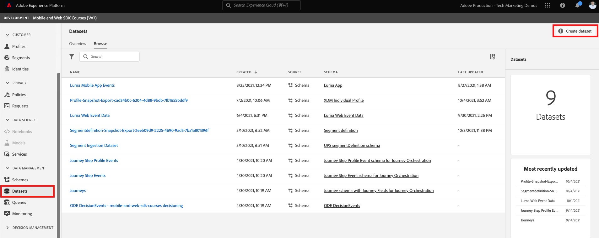
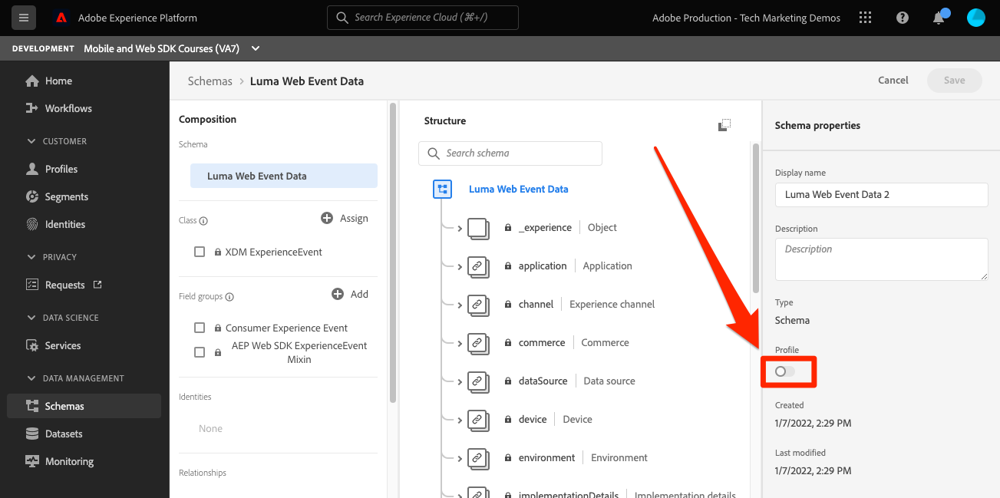
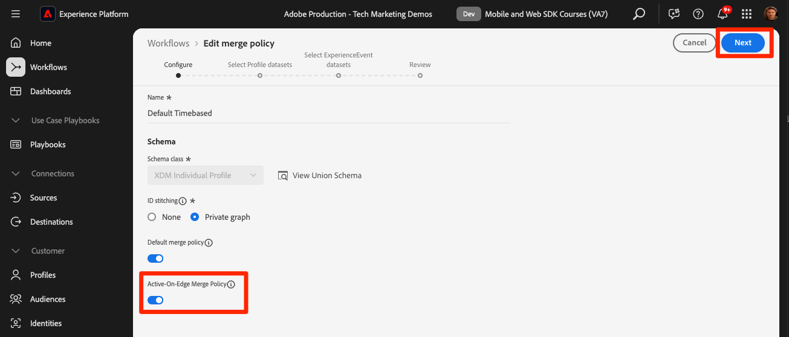

# Diffusion de données vers Experience Platform avec Web SDK

Découvrez comment diffuser en continu des données web vers Adobe Experience Platform à l’aide du SDK web de Platform.

Experience Platform est la colonne dorsale de toutes les nouvelles applications Experience Cloud, telles qu’Adobe Real-Time Customer Data Platform, Adobe Customer Journey Analytics et Adobe Journey Optimizer. Ces applications sont conçues pour utiliser Platform Web SDK comme méthode optimale de collecte de données web.

>[!WARNING]
>
> Le site web Luma utilisé dans ce tutoriel devrait être remplacé au cours de la semaine du 16 février 2026. Le travail effectué dans le cadre de ce tutoriel peut ne pas s’appliquer au nouveau site web.

Experience Platform utilise le même schéma XDM que vous avez créé précédemment pour capturer les données d’événement du site web Luma. Lorsque ces données sont envoyées à Platform Edge Network, la configuration du flux de données peut les transférer vers Experience Platform.

## Objectifs d’apprentissage

À la fin de cette leçon, vous saurez comment :

* Création d’un jeu de données dans Adobe Experience Platform
* Configurer le flux de données pour envoyer des données Web SDK à Adobe Experience Platform
* Activer les données web en flux continu pour le profil client en temps réel
* Vérifiez que les données ont atterri à la fois dans le jeu de données Platform et dans le profil client en temps réel
* Ingérer des exemples de données de programme de fidélité dans Platform
* Créer une audience Platform simple

## Conditions préalables

Pour suivre cette leçon, vous devez d’abord :

* avoir accès à une application Adobe Experience Platform telle que Real-Time Customer Data Platform, Journey Optimizer ou Customer Journey Analytics ;
* Suivez les leçons précédentes des sections Configuration initiale et Configuration des balises de ce tutoriel.

>[!NOTE]
>
>Si vous ne disposez d’aucune application Platform, vous pouvez ignorer cette leçon ou lire la suite.

## Créer un jeu de données

Toutes les données correctement ingérées par Adobe Experience Platform sont conservées sous forme de jeux de données dans le lac de données. Un [jeu de données](https://experienceleague.adobe.com/fr/docs/experience-platform/catalog/datasets/overview) est une structure de stockage et de gestion pour une collection de données, généralement un tableau qui contient un schéma (colonnes) et des champs (lignes). Les jeux de données contiennent également des métadonnées qui décrivent divers aspects des données stockées.

Configurez un jeu de données pour vos données d’événement web Luma :

1. Accédez à l’interface [Experience Platform](https://experience.adobe.com/platform/) ou [Journey Optimizer](https://experience.adobe.com/journey-optimizer/)
1. Confirmez que vous vous trouvez dans le sandbox de développement que vous utilisez pour ce tutoriel
1. Ouvrez **[!UICONTROL Gestion des données > Jeux de données]** dans le volet de navigation de gauche
1. Sélectionnez **[!UICONTROL Créer un jeu de données]**

   

1. Sélectionnez l’option **[!UICONTROL Créer un jeu de données à partir d’un schéma]**

   

1. Sélectionnez le schéma de `Luma Web Event Data` créé dans la [leçon précédente](configure-schemas.md) puis sélectionnez **[!UICONTROL Suivant]**

   

1. Fournissez un **[!UICONTROL Nom]** et un **[!UICONTROL Description]** facultatif pour le jeu de données. Pour cet exercice, utilisez `Luma Web Event Data`, puis sélectionnez **[!UICONTROL Terminer]**

   

Un jeu de données est maintenant configuré pour commencer à collecter des données à partir de votre implémentation de Platform Web SDK.

## Configurer le flux de données

Vous pouvez maintenant configurer votre [!UICONTROL flux de données] pour envoyer des données à [!UICONTROL Adobe Experience Platform]. Le flux de données est le lien entre la propriété de balise, la plateforme Edge Network et le jeu de données Experience Platform.

1. Ouvrez l’interface [&#x200B; Collecte de données &#x200B;](https://experience.adobe.com/#/data-collection){target="blank"}
1. Sélectionnez **[!UICONTROL Flux de données]** dans le volet de navigation de gauche
1. Ouvrez le flux de données que vous avez créé dans la leçon [Configurer un flux de données](configure-datastream.md) , `Luma Web SDK`

   

1. Sélectionnez **[!UICONTROL Ajouter un service]**
   
1. Sélectionnez **[!UICONTROL Adobe Experience Platform]** comme **[!UICONTROL Service]**
1. Sélectionnez `Luma Web Event Data` comme **[!UICONTROL Jeu de données d’événement]**

1. Sélectionnez **[!UICONTROL Enregistrer]**.

   

Lorsque vous générez du trafic sur le [site de démonstration Luma](https://luma.enablementadobe.com/content/luma/us/en.html) mappé à votre propriété de balise, les données renseignent le jeu de données dans Experience Platform.

## Validation du jeu de données

Cette étape est essentielle pour s’assurer que les données ont bien atterri dans le jeu de données. La validation des données envoyées au jeu de données comporte deux aspects.

* Validation à l’aide du débogueur Experience Platform 
* Validation à l’aide de [!UICONTROL Aperçu du jeu de données]
* Validation à l’aide de [!UICONTROL Query Service]

### Experience Platform Debugger

Ces étapes sont plus ou moins identiques à celles de la leçon [Debugger](validate-with-debugger.md). Cependant, comme les données ne seront envoyées à Platform qu’après l’avoir activées dans le flux de données, vous devez générer d’autres données d’exemple :

1. Ouvrez le site de démonstration [Luma](https://luma.enablementadobe.com/content/luma/us/en.html) et sélectionnez l’icône de l’extension [!UICONTROL Experience Platform Debugger]

1. Configurez le débogueur pour mapper la propriété de balise à *votre* environnement de développement, comme décrit dans la leçon [Valider avec le débogueur](validate-with-debugger.md)

   

1. Connectez-vous au site Luma à l’aide des informations d’identification suivantes : `test@test.com`/`test`

1. Revenez à la [page d’accueil de Luma](https://luma.enablementadobe.com/content/luma/us/en.html).

1. Dans les balises réseau Platform Web SDK affichées par le débogueur, sélectionnez la ligne « événements » pour développer les détails dans un pop-up

   

1. Recherchez le « identityMap » dans le pop-up. Ici, vous devriez voir lumaCrmId avec trois clés authenticatedState, id et primary
   

Désormais, les données doivent être renseignées dans le jeu de données `Luma Web Event Data` et prêtes pour la validation « Aperçu du jeu de données ».

### Prévisualiser le jeu de données

Pour confirmer que les données ont atterri dans le lac de données de Platform, une option rapide consiste à utiliser la fonctionnalité **[!UICONTROL Aperçu du jeu de données]**. Les données de Web SDK sont microbatchées dans le lac de données et actualisées dans l’interface de Platform de manière périodique. L’affichage des données générées peut prendre entre 10 et 15 minutes.

1. Dans l’interface [Experience Platform](https://experience.adobe.com/platform/), sélectionnez **[!UICONTROL Gestion des données > Jeux de données]** dans le volet de navigation de gauche pour ouvrir le tableau de bord **[!UICONTROL Jeux de données]**.

   Le tableau de bord répertorie tous les jeux de données disponibles pour votre organisation. Des détails s’affichent pour chaque jeu de données répertorié, notamment son nom, le schéma auquel le jeu de données adhère et l’état de l’exécution d’ingestion la plus récente.

1. Sélectionnez votre jeu de données `Luma Web Event Data` pour ouvrir son écran **[!UICONTROL Activité du jeu de données]**.

   

   L’écran d’activité comprend un graphique qui permet de visualiser le taux de messages consommés ainsi qu’une liste des lots réussis et en échec.

1. Dans l’écran **[!UICONTROL Activité du jeu de données]**, sélectionnez **[!UICONTROL Prévisualiser le jeu de données]** près du coin supérieur droit de l’écran pour prévisualiser jusqu’à 100 lignes de données. Si le jeu de données est vide, le lien de prévisualisation est désactivé.

   

   Dans la fenêtre de prévisualisation, l’affichage hiérarchique du schéma pour le jeu de données s’affiche sur la droite.

   

### Interroger les données

1. Dans l’interface [Experience Platform](https://experience.adobe.com/platform/), sélectionnez **[!UICONTROL Gestion des données > Requêtes]** dans le volet de navigation de gauche pour afficher l’écran **[!UICONTROL Requêtes]**.
1. Sélectionnez **[!UICONTROL Créer une requête]**
1. Tout d’abord, exécutez une requête pour afficher tous les noms des tables du lac de données. Saisissez `SHOW TABLES` dans le requêteur, puis cliquez sur l’icône de lecture pour exécuter la requête.
1. Dans les résultats, remarquez que le nom de la table ressemble à `luma_web_event_data`
1. Interrogez maintenant la table avec une requête simple référençant votre table (notez que, par défaut, la requête sera limitée à 100 résultats) : `SELECT * FROM "luma_web_event_data"`
1. Après quelques instants, vous devriez voir des exemples d’enregistrements de vos données web.

>[!ERROR]
>
>Si vous obtenez l’erreur « Table non configurée », vérifiez à nouveau le nom de la table. Il se peut également que le micro-lot de données n&#39;ait pas encore atterri dans le lac de données. Réessayez dans 10 à 15 minutes.

>[!INFO]
>
>  Pour plus d’informations sur le service de requête de Adobe Experience Platform, consultez [Exploration des données](https://experienceleague.adobe.com/en/docs/platform-learn/tutorials/queries/explore-data) dans la section Tutoriels sur Platform.

## Activez le jeu de données et le schéma pour le profil client en temps réel

Pour les clients Real-Time Customer Data Platform et Journey Optimizer, l’étape suivante consiste à activer le jeu de données et le schéma pour le profil client en temps réel. La diffusion de données en continu à partir de Web SDK est l’une des nombreuses sources de données qui entrent dans Platform. Vous souhaitez associer vos données web à d’autres sources de données pour créer des profils client à 360 degrés. Pour en savoir plus sur le profil client en temps réel, regardez cette courte vidéo :

>[!VIDEO](https://video.tv.adobe.com/v/27251?learn=on&captions=eng)

>[!CAUTION]
>
>Lorsque vous travaillez avec votre propre site web et vos propres données, nous vous recommandons une validation plus robuste des données avant leur activation pour le profil client en temps réel.

**Pour activer le jeu de données, procédez comme suit**

1. Ouvrez le jeu de données que vous avez créé `Luma Web Event Data`

1. Sélectionnez le bouton bascule **[!UICONTROL Profile]** pour l’activer

   

1. Confirmez que vous souhaitez **[!UICONTROL Activer]** le jeu de données

   

**Pour activer le schéma :**

1. Ouvrez le schéma que vous avez créé, `Luma Web Event Data`

1. Sélectionnez le bouton bascule **[!UICONTROL Profile]** pour l’activer

   

1. Sélectionnez **[!UICONTROL Les données de ce schéma contiendront une identité principale dans le champ identityMap.]**

   >[!IMPORTANT]
   >
   >    Les identités de Principal sont requises dans chaque enregistrement envoyé au profil client en temps réel. En règle générale, les champs d’identité sont libellés dans le schéma. Toutefois, lors de l’utilisation de mappages d’identité, les champs d’identité ne sont pas visibles dans le schéma. Cette boîte de dialogue permet de confirmer que vous avez une identité principale en tête et que vous la spécifierez dans un mappage d’identités lors de l’envoi de vos données. Comme vous le savez, Web SDK utilise un mappage d’identités avec l’Experience Cloud Id (ECID) comme identité principale par défaut et un identifiant authentifié comme identité principale, le cas échéant.

1. Sélectionnez **[!UICONTROL Activer]**

   

1. Sélectionnez **[!UICONTROL Enregistrer]** pour enregistrer le schéma mis à jour

Désormais, le schéma est également activé pour le profil.

>[!IMPORTANT]
>
>    Une fois qu’un schéma est activé pour Profil, il ne peut pas être désactivé ou supprimé sans réinitialiser ou supprimer l’ensemble du sandbox. En outre, les champs ne peuvent pas être supprimés du schéma après ce point.
>
>   
> Lorsque vous utilisez vos propres données, nous vous recommandons d’effectuer les opérations dans l’ordre suivant :
> 
> * Tout d’abord, ingérez des données dans vos jeux de données.
> * Résolvez les problèmes qui se produisent pendant le processus d’ingestion des données (par exemple, les problèmes de validation des données ou de mappage).
> * Activez vos jeux de données et schémas pour Profil
> * Réingérez les données, si nécessaire

### Validation d’un profil

Vous pouvez rechercher un profil client dans l’interface de Platform (ou de Journey Optimizer) pour confirmer que les données ont bien atterri dans le profil client en temps réel. Comme leur nom l’indique, les profils sont renseignés en temps réel. Il n’y a donc pas de retard comme c’était le cas pour la validation des données dans le jeu de données.

Vous devez d’abord générer plus de données d’exemple. Répétez les étapes décrites précédemment dans cette leçon pour vous connecter au site web Luma lorsqu’il est mappé à votre propriété de balise. Inspectez la requête Platform Web SDK pour vous assurer qu’elle envoie les données avec le `lumaCRMId`.

1. Dans l’interface [Experience Platform](https://experience.adobe.com/platform/), sélectionnez **[!UICONTROL Client]** > **[!UICONTROL Profils]** dans le volet de navigation de gauche

1. Comme espace de noms d’identité **[!UICONTROL Identity]** utilisez `lumaCRMId`
1. Copiez et collez la valeur de la `lumaCRMId` transmise dans l’appel que vous avez inspecté dans le débogueur Experience Platform, dans ce cas `b642b4217b34b1e8d3bd915fc65c4452`.

   

1. S’il existe une valeur valide dans le profil pour `lumaCRMId`, un identifiant de profil est renseigné dans la console :

   

1. Pour afficher l’intégralité du **[!UICONTROL Profil client]** pour chaque identifiant, sélectionnez le **[!UICONTROL Identifiant de profil]** dans la fenêtre principale.

   >[!NOTE]
   >
   >Notez que vous pouvez sélectionner le lien hypertexte de l’ID de profil ou, si vous sélectionnez la ligne, un menu de droite s’ouvre et vous pouvez sélectionner le lien hypertexte de l’ID de profil
   > 

   Vous pouvez y voir toutes les identités liées au `lumaCRMId`, telles que le `ECID`.

   

Vous avez maintenant activé Platform Web SDK pour Experience Platform (et Real-Time CDP ! Et Journey Optimizer ! Et Customer Journey Analytics !).

## Création d’une audience évaluée par Edge

Il est recommandé de terminer cet exercice pour les clients de Real-Time Customer Data Platform et de Journey Optimizer.

Lorsque des données Web SDK sont ingérées dans Adobe Experience Platform, elles peuvent être enrichies par d’autres sources de données que vous avez ingérées dans Platform. Par exemple, lorsqu’un utilisateur se connecte au site Luma, un graphique d’identités est créé dans Experience Platform et tous les autres jeux de données activés pour le profil peuvent éventuellement être réunis pour créer des profils clients en temps réel. Pour voir cela en action, vous allez rapidement créer un autre jeu de données dans Adobe Experience Platform avec des exemples de données de fidélité afin de pouvoir utiliser les profils clients en temps réel avec Real-Time Customer Data Platform et Journey Optimizer. Vous allez ensuite créer une audience basée sur ces données.

### Création d’un schéma de fidélité et ingestion de données d’exemple

Puisque vous avez déjà fait des exercices similaires, les instructions seront brèves.

Créez le schéma de fidélité :

1. Créer un schéma
1. Choisissez **[!UICONTROL Profil individuel]** comme [!UICONTROL &#x200B; classe de base]
1. Nommez le schéma `Luma Loyalty Schema`
1. Ajoutez le groupe de champs [!UICONTROL &#x200B; Détails de fidélité &#x200B;]
1. Ajoutez le groupe de champs [!UICONTROL &#x200B; Détails démographiques &#x200B;]
1. Sélectionnez le champ `Person ID` et marquez-le comme [!UICONTROL Identité] et [!UICONTROL Identité de Principal &#x200B;] à l’aide du `Luma CRM Id` [!UICONTROL Espace de noms d’identité].
1. Activez le schéma pour [!UICONTROL Profil]. Si vous ne trouvez pas le bouton Profile , essayez de cliquer sur le nom du schéma en haut à gauche.
1. Enregistrer le schéma

   

Pour créer le jeu de données et ingérer les données d’exemple :

1. Créer un nouveau jeu de données à partir du `Luma Loyalty Schema`
1. Nommez le jeu de données `Luma Loyalty Dataset`
1. Activez le jeu de données pour [!UICONTROL Profil]
1. Téléchargez l’exemple de fichier [luma-loyalty-forWeb.json](assets/luma-loyalty-forWeb.json)
1. Faites glisser le fichier dans votre jeu de données
1. Confirmer que les données ont bien été ingérées

   

### Définition d’une politique de fusion Active-on-Edge

Toutes les audiences sont créées avec une politique de fusion. Les politiques de fusion créent différentes « vues » d’un profil, peuvent contenir un sous-ensemble de jeux de données et prescrire un ordre de priorité lorsque différents jeux de données contribuent aux mêmes attributs de profil. Pour être évaluée sur le serveur Edge, une audience doit utiliser une politique de fusion avec le paramètre **[!UICONTROL Politique de fusion Active-On-Edge]**.

>[!IMPORTANT]
>
>Une seule politique de fusion par sandbox peut avoir le paramètre **[!UICONTROL Politique de fusion Active-On-Edge]**

1. Ouvrez l’interface d’Experience Platform ou de Journey Optimizer et assurez-vous que vous vous trouvez dans l’environnement de développement utilisé pour le tutoriel.
1. Accédez à la page **[!UICONTROL Client]** > **[!UICONTROL Profils]** > **[!UICONTROL Politiques de fusion]**
1. Ouvrez la **[!UICONTROL Politique de fusion par défaut]** (probablement nommée `Default Timebased`).
   
1. Activez le paramètre **[!UICONTROL Politique de fusion Active-On-Edge]**
1. Sélectionnez **[!UICONTROL Suivant]**

   
1. Continuez à sélectionner **[!UICONTROL Suivant]** pour passer aux autres étapes du workflow et sélectionnez **[!UICONTROL Terminer]** pour enregistrer vos paramètres
   

Vous pouvez maintenant créer des audiences qui seront évaluées sur Edge.

### Créer une audience

Les audiences regroupent les profils autour de caractéristiques communes. Créez une audience simple que vous pouvez utiliser dans Real-Time CDP ou Journey Optimizer :

1. Dans l’interface Experience Platform ou Journey Optimizer, accédez à **[!UICONTROL Client]** > **[!UICONTROL Audiences]** dans le volet de navigation de gauche
1. Sélectionnez **[!UICONTROL Créer une audience]**
1. Sélectionnez **[!UICONTROL Créer une règle]**
1. Sélectionnez **[!UICONTROL Créer]**

   

1. Sélectionnez **[!UICONTROL Attributs]**
1. Recherchez le champ **[!UICONTROL Fidélité]** > **[!UICONTROL Niveau]** et faites-le glisser sur la section **[!UICONTROL Attributs]**
1. Définir l’audience en tant qu’utilisateurs dont le `tier` est `gold`
1. Nommez l’audience `Luma Loyalty Rewards – Gold Status`
1. Sélectionnez **[!UICONTROL Edge]** comme méthode **[!UICONTROL Évaluation]**
1. Sélectionnez **[!UICONTROL Enregistrer]**

   

>[!NOTE]
>
> Comme nous avons défini la politique de fusion par défaut **[!UICONTROL Active-On-Edge Merge Policy]** l’audience que vous avez créée est automatiquement associée à cette politique de fusion.

Comme il s’agit d’une audience très simple, nous pouvons utiliser la méthode d’évaluation Edge. Les audiences Edge sont évaluées sur le serveur Edge. Ainsi, dans la même requête que celle envoyée par Web SDK à Platform Edge Network, nous pouvons évaluer la définition de l’audience et confirmer immédiatement si l’utilisateur sera qualifié.

>[!NOTE]
>
>Merci d’avoir investi votre temps dans votre apprentissage de Adobe Experience Platform Web SDK. Si vous avez des questions, souhaitez partager des commentaires généraux ou avez des suggestions sur le contenu futur, veuillez les partager dans ce [article de discussion de la communauté Experience League](https://experienceleaguecommunities.adobe.com/t5/adobe-experience-platform-data/tutorial-discussion-implement-adobe-experience-cloud-with-web/td-p/444996)
