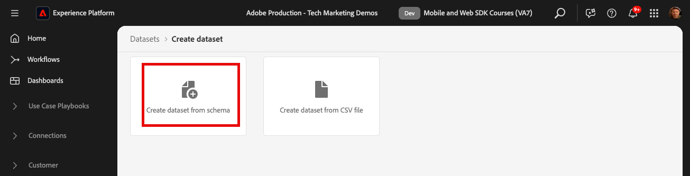

# Diffusion de données vers Experience Platform avec Web SDK

Découvrez comment diffuser en continu des données web vers Adobe Experience Platform à l’aide du SDK web de Platform.

Experience Platform est la colonne dorsale de toutes les nouvelles applications Experience Cloud, telles qu’Adobe Real-Time Customer Data Platform, Adobe Customer Journey Analytics et Adobe Journey Optimizer. Ces applications sont conçues pour utiliser Platform Web SDK comme méthode optimale de collecte de données web.

Experience Platform utilise le même schéma XDM que vous avez créé précédemment pour capturer les données d’événement du site web Luma. Lorsque ces données sont envoyées à Platform Edge Network, la configuration du flux de données peut les transférer vers Experience Platform.

## Objectifs d’apprentissage

À la fin de cette leçon, vous saurez comment :

* Création d’un jeu de données dans Adobe Experience Platform
* Configurer le flux de données pour envoyer des données Web SDK à Adobe Experience Platform
* Activer les données web en flux continu pour le profil client en temps réel
* Vérifiez que les données ont atterri à la fois dans le jeu de données Platform et dans le profil client en temps réel
* Ingérer des exemples de données de programme de fidélité dans Platform
* Créer une audience Platform simple

## Conditions préalables

Pour suivre cette leçon, vous devez d’abord :

* avoir accès à une application Adobe Experience Platform telle que Real-Time Customer Data Platform, Journey Optimizer ou Customer Journey Analytics ;
* Suivez les leçons précédentes des sections Configuration initiale et Configuration des balises de ce tutoriel.

>[!NOTE]
>
>Si vous ne disposez d’aucune application Platform, vous pouvez ignorer cette leçon ou lire la suite.

## Créer un jeu de données

Toutes les données correctement ingérées par Adobe Experience Platform sont conservées sous forme de jeux de données dans le lac de données. Un [jeu de données](https://experienceleague.adobe.com/fr/docs/experience-platform/catalog/datasets/overview) est une structure de stockage et de gestion pour une collection de données, généralement un tableau qui contient un schéma (colonnes) et des champs (lignes). Les jeux de données contiennent également des métadonnées qui décrivent divers aspects des données stockées.

Configurez un jeu de données pour vos données d’événement web Luma :

1. Accédez à l’interface [Experience Platform](https://experience.adobe.com/platform/) ou [Journey Optimizer](https://experience.adobe.com/journey-optimizer/)
1. Confirmez que vous vous trouvez dans le sandbox de développement que vous utilisez pour ce tutoriel
1. Ouvrez **[!UICONTROL Gestion des données > Jeux de données]** dans le volet de navigation de gauche
1. Sélectionnez **[!UICONTROL Créer un jeu de données]**

   

1. Sélectionnez l’option **[!UICONTROL Créer un jeu de données à partir d’un schéma]**

   

1. Sélectionnez le schéma de `Luma Web Event Data` créé dans la [leçon précédente](configure-schemas.md) puis sélectionnez **[!UICONTROL Suivant]**

   

1. Fournissez un **[!UICONTROL Nom]** et un **[!UICONTROL Description]** facultatif pour le jeu de données. Pour cet exercice, utilisez `Luma Web Event Data`, puis sélectionnez **[!UICONTROL Terminer]**

   

Un jeu de données est maintenant configuré pour commencer à collecter des données à partir de votre implémentation de Platform Web SDK.

## Configurer le flux de données

Vous pouvez maintenant configurer votre [!UICONTROL flux de données] pour envoyer des données à [!UICONTROL Adobe Experience Platform]. Le flux de données est le lien entre la propriété de balise, la plateforme Edge Network et le jeu de données Experience Platform.

1. Ouvrez l’interface [&#x200B; Collecte de données &#x200B;](https://experience.adobe.com/#/data-collection){target="blank"}
1. Sélectionnez **[!UICONTROL Flux de données]** dans le volet de navigation de gauche
1. Ouvrez le flux de données que vous avez créé dans la leçon [Configurer un flux de données](configure-datastream.md) , `Luma Web SDK: Development Environment`

   

1. Sélectionnez **[!UICONTROL Ajouter un service]**
   
1. Sélectionnez **[!UICONTROL Adobe Experience Platform]** comme **[!UICONTROL Service]**
1. Sélectionnez **[!UICONTROL Activé]**
1. Sélectionnez `Luma Web Event Data` comme **[!UICONTROL Jeu de données d’événement]**

1. Sélectionnez **[!UICONTROL Enregistrer]**

   

Lorsque vous générez du trafic sur le site web de démonstration [Luma](https://luma.enablementadobe.com) mappé à votre propriété de balise, les données renseignent le jeu de données dans Experience Platform.

## Validation du jeu de données

Cette étape est essentielle pour s’assurer que les données ont bien atterri dans le jeu de données. Il existe plusieurs façons de valider le chemin des données envoyées au jeu de données.

* Validation à l’aide du débogueur Experience Platform 
* Validation à l’aide de [!UICONTROL Experience Platform Assurance]
* Validation à l’aide de [!UICONTROL Aperçu du jeu de données]
* Validation à l’aide de [!UICONTROL Query Service]

### Debugger

Ces étapes sont plus ou moins identiques à celles de la leçon [Debugger](validate-with-debugger.md). Cependant, comme les données ne seront envoyées à Platform qu’après l’avoir activées dans le flux de données, vous devez générer d’autres données d’exemple :

1. Ouvrez le site web de démonstration [Luma](https://luma.enablementadobe.com) et sélectionnez l’icône de l’extension [!UICONTROL Experience Platform Debugger]

1. Configurez le débogueur pour mapper la propriété de balise à *votre* environnement de développement, comme décrit dans la leçon [Valider avec le débogueur](validate-with-debugger.md)

   

1. Parcourez le site web. Afficher certains produits et en ajouter à votre panier

1. Dans Debugger, ouvrez la ligne « événements » pour rechercher certaines de vos variables XDM

Vous avez validé que les données ont quitté le navigateur et ont été envoyées au flux de données.

### Assurance

Puisque nous avons maintenant activé un service dans le flux de données, nous pouvons en voir davantage dans Assurance :

1. Ouverture ou démarrage d’une nouvelle session Assurance
1. Ouvrez l’événement **[!UICONTROL datastream]**
1. Vous pouvez y afficher la configuration du service Platform, y compris l’identifiant du flux de données que vous avez créé précédemment dans cette leçon.

   

1. Ouvrez l’événement **[!UICONTROL generic]** appartenant au fournisseur **[!UICONTROL com.adobe.streaming.validation]**. Cela indique que la requête a été envoyée au jeu de données avec les données XDM associées

   

Vous avez validé que la requête a été reçue par Platform Edge Network et transférée au jeu de données Platform.

### Prévisualiser le jeu de données

Maintenant, regardons en fait dans le jeu de données ! Une option rapide consiste à utiliser la fonctionnalité **[!UICONTROL Aperçu du jeu de données]**. Les données de Web SDK sont microbatchées dans le lac de données et actualisées dans l’interface de Platform de manière périodique. L’affichage des données générées peut prendre entre 10 et 15 minutes.

1. Dans l’interface [Experience Platform](https://experience.adobe.com/platform/), sélectionnez **[!UICONTROL Gestion des données > Jeux de données]** dans le volet de navigation de gauche pour ouvrir le tableau de bord **[!UICONTROL Jeux de données]**.

   Le tableau de bord répertorie tous les jeux de données disponibles pour votre organisation. Des détails s’affichent pour chaque jeu de données répertorié, notamment son nom, le schéma auquel le jeu de données adhère et l’état de l’exécution d’ingestion la plus récente.

1. Sélectionnez votre jeu de données `Luma Web Event Data` pour ouvrir son écran **[!UICONTROL Activité du jeu de données]**.

   

   L’écran d’activité comprend un graphique qui permet de visualiser le taux de messages consommés ainsi qu’une liste des lots réussis et en échec.
1. Puisqu’il s’agit d’un nouveau jeu de données, si vous voyez ne serait-ce qu’un lot avec des enregistrements ingérés, c’est un signe positif :

1. Dans l’écran **[!UICONTROL Activité du jeu de données]**, sélectionnez **[!UICONTROL Prévisualiser le jeu de données]** près du coin supérieur droit de l’écran pour prévisualiser jusqu’à 100 lignes de données. Si le jeu de données est vide, le lien de prévisualisation est désactivé.

   

1. Une requête s’exécute pour extraire 100 lignes récentes de données de votre jeu de données. Vous pouvez explorer des champs XDM individuels, tels que web.webPageDetails.name :

   

### Interroger les données

Vous pouvez également exécuter des requêtes personnalisées sur les données pour valider l’ingestion des données :

1. Dans l’interface [Experience Platform](https://experience.adobe.com/platform/), sélectionnez **[!UICONTROL Gestion des données > Requêtes]** dans le volet de navigation de gauche pour afficher l’écran **[!UICONTROL Requêtes]**.
1. Sélectionnez **[!UICONTROL Créer une requête]**
1. Tout d’abord, exécutez une requête pour afficher tous les noms des tables du lac de données. Saisissez `SHOW TABLES` dans le requêteur, puis cliquez sur l’icône de lecture pour exécuter la requête.
1. Dans les résultats, remarquez comment le nom de la table est `luma_web_event_data`
1. Interrogez maintenant la table avec une requête simple référençant votre table (notez que, par défaut, la requête sera limitée à 100 résultats) : `SELECT * FROM "luma_web_event_data"`
1. Après quelques instants, vous devriez voir des exemples d’enregistrements de vos données web.

   

>[!ERROR]
>
>Si vous obtenez l’erreur « Table non configurée », vérifiez à nouveau le nom de la table. Il se peut également que le micro-lot de données n&#39;ait pas encore atterri dans le lac de données. Réessayez dans 10 à 15 minutes.

>[!INFO]
>
>  Query Service est un outil très puissant pour les ingénieurs et les analystes de données. Pour plus d’informations sur le service de requête de Adobe Experience Platform, consultez [Exploration des données](https://experienceleague.adobe.com/fr/docs/platform-learn/tutorials/queries/explore-data) dans la section Tutoriels sur Platform.

>[!NOTE]
>
>Merci d’avoir investi votre temps dans votre apprentissage de Adobe Experience Platform Web SDK. Si vous avez des questions, souhaitez partager des commentaires généraux ou avez des suggestions sur le contenu futur, veuillez les partager dans ce [article de discussion de la communauté Experience League](https://experienceleaguecommunities.adobe.com/adobe-experience-platform-18/tutorial-discussion-implement-adobe-experience-cloud-with-web-sdk-tutorial-248848?profile.language=fr)
