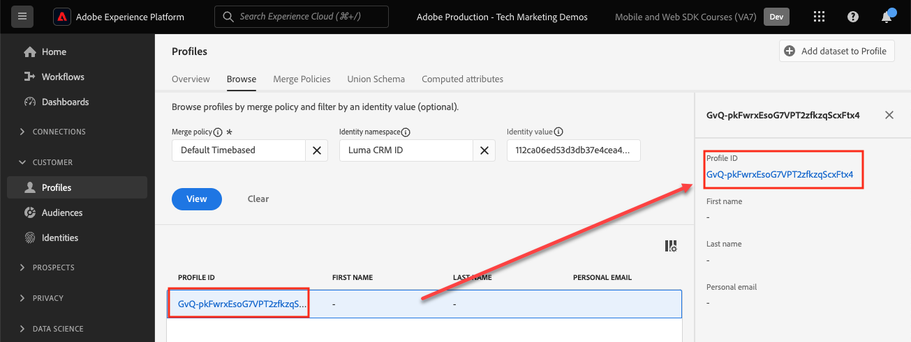

# Diffusion en continu de données vers un Experience Platform avec le SDK Web

Découvrez comment diffuser en continu des données web vers Adobe Experience Platform à l’aide du SDK Web Platform.

Experience Platform est la colonne vertébrale de toutes les nouvelles applications Experience Cloud, telles qu’Adobe Real-time Customer Data Platform, Adobe Customer Journey Analytics et Adobe Journey Optimizer. Ces applications sont conçues pour utiliser le SDK Web Platform comme méthode optimale de collecte de données web.

Experience Platform utilise le même schéma XDM que celui que vous avez créé précédemment pour capturer des données d’événement à partir du site web de Luma. Lorsque ces données sont envoyées à l’Edge Network Platform, la configuration du flux de données peut les transférer à l’Experience Platform.

## Objectifs d&#39;apprentissage

À la fin de cette leçon, vous saurez comment :

* Création d’un jeu de données dans Adobe Experience Platform
* Configuration du flux de données pour envoyer des données du SDK Web à Adobe Experience Platform
* Activation de la diffusion en continu de données web pour Real-time Customer Profile
* Validez les données renvoyées à la fois dans le jeu de données Platform et dans Real-Time Customer Profile.

## Conditions préalables

Pour terminer cette leçon, vous devez d’abord :

* Avoir accès à une application Adobe Experience Platform telle que Real-time Customer Data Platform, Journey Optimizer ou Customer Journey Analytics
* Suivez les leçons des sections Configuration initiale et Configuration des balises de ce tutoriel.

## Créer un jeu de données

Toutes les données correctement ingérées dans Adobe Experience Platform sont conservées sous la forme de jeux de données dans le lac de données. A [dataset](https://experienceleague.adobe.com/docs/experience-platform/catalog/datasets/overview.html?lang=en) est une structure de stockage et de gestion pour une collecte de données, généralement un tableau, qui contient un schéma (des colonnes) et des champs (des lignes). Les jeux de données contiennent également des métadonnées qui décrivent divers aspects des données stockées.

Configurez un jeu de données pour vos données d’événement web Luma :

1. Accédez au [Interface Experience Platform](https://experience.adobe.com/platform/)
1. Vérifiez que vous vous trouvez dans l’environnement de test de développement que vous utilisez pour ce tutoriel.
1. Ouvrir **[!UICONTROL Gestion des données > Jeux de données]** à partir du volet de navigation de gauche
1. Sélectionner **[!UICONTROL Création d’un jeu de données]**

   

1. Sélectionnez la variable **[!UICONTROL Création d’un jeu de données à partir d’un schéma]** option

   

1. Sélectionnez la variable `Luma Web Event Data` schéma créé dans la [leçon précédente](configure-schemas.md) puis sélectionnez **[!UICONTROL Suivant]**

   

1. Fournissez une **[!UICONTROL Nom]** et facultatif **[!UICONTROL Description]** pour le jeu de données. Pour cet exercice, utilisez `Luma Web Event Data`, puis sélectionnez **[!UICONTROL Terminer]**

   

Un jeu de données est maintenant configuré pour commencer à collecter des données à partir de l’implémentation de votre SDK Web Platform.

## Configuration du flux de données

Vous pouvez maintenant configurer votre [!UICONTROL datastream] pour envoyer des données à [!UICONTROL Adobe Experience Platform]. Le flux de données est le lien entre votre propriété de balise, l’Edge Network Platform et le jeu de données Experience Platform.

1. Ouvrez le [Collecte de données](https://experience.adobe.com/#/data-collection){target="blank"} interface
1. Sélectionner **[!UICONTROL Datastreams]** à partir du volet de navigation de gauche
1. Ouvrez le flux de données que vous avez créé dans le [Configuration d’un flux de données](configure-datastream.md) leçon, `Luma Web SDK`

   

1. Sélectionnez **[!UICONTROL Ajouter un service]**.
   
1. Sélectionner **[!UICONTROL Adobe Experience Platform]** comme la propriété **[!UICONTROL Service]**
1. Sélectionner `Luma Web Event Data` comme la propriété **[!UICONTROL Jeu de données d’événement]**

1. Sélectionnez **[!UICONTROL Enregistrer]**.

   

Lorsque vous générez du trafic sur le [Site de démonstration Luma](https://luma.enablementadobe.com/content/luma/us/en.html) mappées à la propriété de balise, les données renseignent le jeu de données dans Experience Platform.

## Validation du jeu de données

Cette étape est essentielle pour s’assurer que les données ont atterri dans le jeu de données. La validation des données envoyées au jeu de données comporte deux aspects.

* Validation à l’aide de [!UICONTROL Débogueur Experience Platform]
* Validation à l’aide de [!UICONTROL Aperçu du jeu de données]
* Validation à l’aide de [!UICONTROL Query Service]

### Experience Platform Debugger

Ces étapes sont plus ou moins identiques à celles que vous avez effectuées dans la variable [Leçon pour Debugger](validate-with-debugger.md). Cependant, comme les données ne seront envoyées à Platform qu’après l’avoir activée dans la structure de données, vous devez générer d’autres exemples de données :

1. Ouvrez le [Site de démonstration Luma](https://luma.enablementadobe.com/content/luma/us/en.html) et sélectionnez la variable [!UICONTROL Débogueur Experience Platform] icône d’extension

1. Configurez Debugger pour associer la propriété de balise à *your* Environnement de développement, comme décrit dans la section [Validation avec Debugger](validate-with-debugger.md) leçon

   

1. Connectez-vous au site Luma à l’aide des informations d’identification suivantes : `test@adobe.com`/`test`

1. Revenez à la [page d’accueil de Luma](https://luma.enablementadobe.com/content/luma/us/en.html).

1. Dans les balises réseau du SDK Web Platform affichées par le débogueur, sélectionnez la ligne &quot;events&quot; pour développer les détails dans une fenêtre contextuelle.

   

1. Recherchez &quot;identityMap&quot; dans la fenêtre contextuelle. Vous devriez y voir lumaCrmId avec trois clés de authenticatedState, id et primary
   

Désormais, les données doivent être renseignées dans la variable `Luma Web Event Data` jeu de données et prêt pour la validation &quot;Aperçu du jeu de données&quot;.

### Aperçu du jeu de données

Pour confirmer que les données ont atterri dans le lac de données de Platform, une option rapide consiste à utiliser la variable **[!UICONTROL Prévisualisation d’un jeu de données]** fonction . Les données du SDK Web sont micro-traitées par lots dans le lac de données et actualisées périodiquement dans l’interface de Platform. Il peut s’écouler entre 10 et 15 minutes avant que les données générées ne s’affichent.

1. Dans le [Experience Platform](https://experience.adobe.com/platform/) interface, sélectionnez **[!UICONTROL Gestion des données > Jeux de données]** dans le volet de navigation de gauche pour ouvrir la **[!UICONTROL Jeux de données]** tableau de bord.

   Le tableau de bord répertorie tous les jeux de données disponibles pour votre organisation. Des détails s’affichent pour chaque jeu de données répertorié, notamment son nom, le schéma auquel le jeu de données adhère et l’état de l’exécution d’ingestion la plus récente.

1. Sélectionnez votre `Luma Web Event Data` jeu de données pour ouvrir son **[!UICONTROL Activité du jeu de données]** écran.

   

   L’écran des activités comprend un graphique qui présente le taux de messages en cours de consommation ainsi qu’une liste des lots réussis et en échec.

1. Dans la **[!UICONTROL Activité du jeu de données]** écran, sélectionnez **[!UICONTROL Prévisualisation d’un jeu de données]** près du coin supérieur droit de votre écran pour prévisualiser jusqu’à 100 lignes de données. Si le jeu de données est vide, le lien de prévisualisation est désactivé.

   

   Dans la fenêtre de prévisualisation, l’affichage hiérarchique du schéma pour le jeu de données s’affiche sur la droite.

   

>[!INFO]
>
>Le service de requête Adobe Experience Platform est une méthode plus robuste pour valider les données dans le lac, mais ne répond pas au cadre de ce tutoriel. Pour plus d’informations, voir [Explorer les données](https://experienceleague.adobe.com/docs/platform-learn/tutorials/queries/explore-data.html?lang=fr) dans la section Tutoriels Platform .

## Activation du jeu de données et du schéma pour Real-time Customer Profile

L’étape suivante consiste à activer le jeu de données et le schéma pour Real-Time Customer Profile. La diffusion en continu de données à partir du SDK Web est l’une des nombreuses sources de données qui se connecte à Platform et vous souhaitez joindre vos données web à d’autres sources de données pour créer des profils clients à 360 degrés. Pour en savoir plus sur Real-time Customer Profile, regardez cette courte vidéo :

>[!VIDEO](https://video.tv.adobe.com/v/27251?learn=on&captions=eng)

>[!CAUTION]
>
>Lorsque vous utilisez votre propre site web et vos propres données, nous vous recommandons de valider les données de manière plus robuste avant de les activer pour Real-time Customer Profile.

**Pour activer le jeu de données :**

1. Ouvrez le jeu de données que vous avez créé, `Luma Web Event Data`

1. Sélectionnez la variable **[!UICONTROL Basculement du profil]** pour l’activer

   

1. Confirmez que vous souhaitez **[!UICONTROL Activer]** le jeu de données

   

**Pour activer le schéma :**

1. Ouvrez le schéma que vous avez créé, `Luma Web Event Data`

1. Sélectionnez la variable **[!UICONTROL Basculement du profil]** pour l’activer

   

1. Sélectionner **[!UICONTROL Les données de ce schéma contiendront une identité principale dans le champ identityMap .]**

   >[!IMPORTANT]
   >
   >    Les identités de Principal sont requises dans chaque enregistrement envoyé à Real-time Customer Profile. En règle générale, les champs d’identité sont étiquetés dans le schéma. Toutefois, lors de l’utilisation des mappages d’identité, les champs d’identité ne sont pas visibles dans le schéma. Cette boîte de dialogue vous permet de confirmer que vous avez en tête une identité principale et que vous la spécifiez dans une carte d’identité lors de l’envoi de vos données. Comme vous le savez, le SDK Web utilise une carte d’identité et l’identifiant Experience Cloud (ECID) est l’identité principale par défaut.

1. Sélectionner **[!UICONTROL Activer]**

   

1. Sélectionner **[!UICONTROL Enregistrer]** pour enregistrer le schéma mis à jour

Désormais, le schéma est également activé pour profile.

>[!IMPORTANT]
>
>    Une fois qu’un schéma est activé pour Profile, il ne peut pas être désactivé ni supprimé. De plus, les champs ne peuvent plus être supprimés du schéma après ce point. Il est important de tenir compte de ces implications ultérieurement lorsque vous travaillez avec vos propres données dans votre environnement de production. Vous devriez utiliser un environnement de test de développement dans ce tutoriel, qui peut être supprimé à tout moment.
>
>   
> Lorsque vous utilisez vos propres données, nous vous recommandons de procéder dans l’ordre suivant :
> 
> * Tout d’abord, ingérez des données dans vos jeux de données.
> * Résolvez tous les problèmes qui se produisent pendant le processus d’ingestion des données (par exemple, les problèmes de validation des données ou de mappage).
> * Activation des jeux de données et des schémas pour Profile
> * Réingérer les données, le cas échéant

### Validation d’un profil

Vous pouvez rechercher un profil client dans l’interface de Platform (ou de Journey Optimizer) pour confirmer que les données ont atterri dans Real-time Customer Profile. Comme son nom l’indique, les profils sont renseignés en temps réel. Il n’y a donc aucun délai comme lors de la validation des données dans le jeu de données.

Vous devez tout d’abord générer davantage de données d’exemple. Répétez les étapes précédentes de cette leçon pour vous connecter au site web Luma lorsqu’il est mappé à votre propriété de balise. Inspect de la demande du SDK Web Platform pour s’assurer qu’il envoie des données avec la variable `lumaCRMId`.

1. Dans le [Experience Platform](https://experience.adobe.com/platform/) interface, sélectionnez **[!UICONTROL Profils]** dans la navigation de gauche

1. Comme la variable **[!UICONTROL Espace de noms d’identité]** use `lumaCRMId`
1. Copiez et collez la valeur de la variable `lumaCRMId` transmis dans l’appel que vous avez inspecté dans le débogueur Experience Platform, dans ce cas `112ca06ed53d3db37e4cea49cc45b71e`.

   

1. S’il existe une valeur valide dans le profil pour `lumaCRMId`, un identifiant de profil est renseigné dans la console :

   

1. Pour afficher le **[!UICONTROL Profil client]** pour chaque ID, sélectionnez la variable **[!UICONTROL Identifiant de profil]** dans la fenêtre principale.

   >[!NOTE]
   >
   >Notez que vous pouvez sélectionner l’hyperlien de l’identifiant de profil ou, si vous sélectionnez la ligne, un menu de droite s’ouvre, dans lequel vous pouvez sélectionner le lien hypertexte Identifiant de profil.
   > 

   Vous pouvez y voir toutes les identités liées à la variable `lumaCRMId`, par exemple : `ECID`.

   

Vous avez maintenant activé le SDK Web Platform pour Experience Platform (et Real-Time CDP). Et Journey Optimizer !) !

[Suivant : ](setup-analytics.md)

>[!NOTE]
>
>Merci d’avoir consacré du temps à l’apprentissage du SDK Web Adobe Experience Platform. Si vous avez des questions, souhaitez partager des commentaires généraux ou avez des suggestions sur le contenu futur, partagez-les à ce sujet. [Article de discussion de la communauté Experience League](https://experienceleaguecommunities.adobe.com/t5/adobe-experience-platform-launch/tutorial-discussion-implement-adobe-experience-cloud-with-web/td-p/444996)
