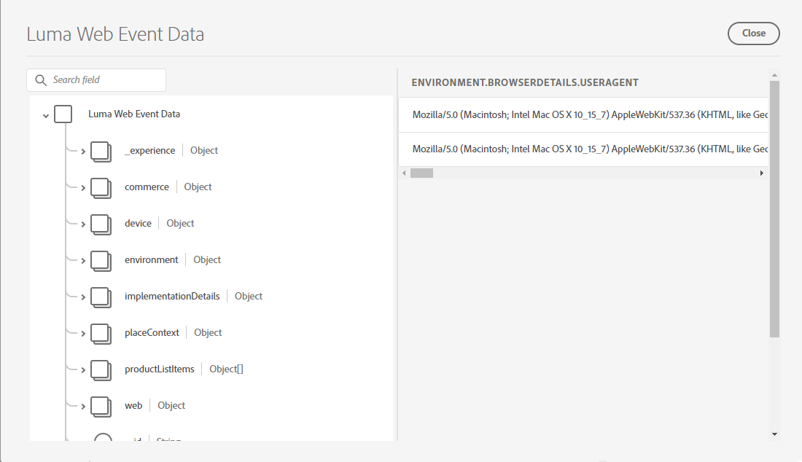

# Diffusion en continu de données vers un Experience Platform avec le SDK Web

Découvrez comment diffuser en continu des données web vers Adobe Experience Platform à l’aide du SDK web de Platform.

Experience Platform est la colonne vertébrale de toutes les nouvelles applications Experience Cloud, telles qu’Adobe Real-Time Customer Data Platform, Adobe Customer Journey Analytics et Adobe Journey Optimizer. Ces applications sont conçues pour utiliser le SDK Web Platform comme méthode optimale de collecte de données web.

Experience Platform utilise le même schéma XDM que celui que vous avez créé précédemment pour capturer des données d’événement à partir du site web de Luma. Lorsque ces données sont envoyées à l’Edge Network Platform, la configuration du flux de données peut les transférer à l’Experience Platform.

## Objectifs d&#39;apprentissage

À la fin de cette leçon, vous saurez comment :

* Création d’un jeu de données dans Adobe Experience Platform
* Configuration du flux de données pour envoyer des données du SDK Web à Adobe Experience Platform
* Activation de la diffusion en continu de données web pour Real-time Customer Profile
* Validez les données renvoyées à la fois dans le jeu de données Platform et dans Real-Time Customer Profile.
* Ingestion d’exemples de données de programme de fidélité dans Platform
* Création d’une audience Platform simple

## Conditions préalables

Pour terminer cette leçon, vous devez d’abord :

* Avoir accès à une application Adobe Experience Platform telle que Real-Time Customer Data Platform, Journey Optimizer ou Customer Journey Analytics
* Suivez les leçons des sections Configuration initiale et Configuration des balises de ce tutoriel.

>[!NOTE]
>
>Si vous ne disposez d’aucune application Platform, vous pouvez ignorer cette leçon ou la lire.

## Créer un jeu de données

Toutes les données correctement ingérées dans Adobe Experience Platform sont conservées sous la forme de jeux de données dans le lac de données. Un [jeu de données](https://experienceleague.adobe.com/fr/docs/experience-platform/catalog/datasets/overview) est une structure de stockage et de gestion pour une collecte de données, généralement une table qui contient un schéma (des colonnes) et des champs (des lignes). Les jeux de données contiennent également des métadonnées qui décrivent divers aspects des données stockées.

Configurez un jeu de données pour vos données d’événement web Luma :

1. Accédez à l’interface [Experience Platform](https://experience.adobe.com/platform/) ou [Journey Optimizer](https://experience.adobe.com/journey-optimizer/)
1. Vérifiez que vous vous trouvez dans l’environnement de test de développement que vous utilisez pour ce tutoriel.
1. Ouvrez **[!UICONTROL Data Management > Jeux de données]** dans le volet de navigation de gauche.
1. Sélectionnez **[!UICONTROL Créer un jeu de données]**

   

1. Sélectionnez l’option **[!UICONTROL Créer un jeu de données à partir du schéma]** .

   

1. Sélectionnez le schéma `Luma Web Event Data` créé dans la [leçon précédente](configure-schemas.md), puis sélectionnez **[!UICONTROL Suivant]**

   

1. Fournissez un **[!UICONTROL nom]** et une **[!UICONTROL description]** facultative pour le jeu de données. Pour cet exercice, utilisez `Luma Web Event Data`, puis sélectionnez **[!UICONTROL Terminer]**

   

Un jeu de données est maintenant configuré pour commencer à collecter des données à partir de l’implémentation de votre SDK Web Platform.

## Configuration du flux de données

Vous pouvez maintenant configurer votre [!UICONTROL datastream] pour envoyer des données à [!UICONTROL Adobe Experience Platform]. Le flux de données est le lien entre votre propriété de balise, l’Edge Network Platform et le jeu de données Experience Platform.

1. Ouvrez l’interface [Collecte de données](https://experience.adobe.com/#/data-collection){target="blank"}
1. Sélectionnez **[!UICONTROL Datastreams]** dans la navigation de gauche.
1. Ouvrez le flux de données que vous avez créé dans la leçon [Configurer un flux de données](configure-datastream.md), `Luma Web SDK`

   

1. Sélectionnez **[!UICONTROL Ajouter un service]**
   
1. Sélectionnez **[!UICONTROL Adobe Experience Platform]** comme **[!UICONTROL Service]**
1. Sélectionnez `Luma Web Event Data` comme **[!UICONTROL jeu de données d’événement]**

1. Sélectionnez **[!UICONTROL Enregistrer]**.

   

Lorsque vous générez du trafic sur le [site de démonstration Luma](https://luma.enablementadobe.com/content/luma/us/en.html) mappé à votre propriété de balise, les données renseignent le jeu de données dans Experience Platform !

## Validation du jeu de données

Cette étape est essentielle pour s’assurer que les données ont atterri dans le jeu de données. La validation des données envoyées au jeu de données comporte deux aspects.

* Validation à l’aide de [!UICONTROL Experience Platform Debugger]
* Validation à l’aide de [!UICONTROL Preview Dataset]
* Validez à l’aide de [!UICONTROL Query Service]

### Experience Platform Debugger

Ces étapes sont plus ou moins les mêmes que celles de la [leçon Debugger](validate-with-debugger.md). Cependant, comme les données ne seront envoyées à Platform qu’après l’avoir activée dans la structure de données, vous devez générer d’autres exemples de données :

1. Ouvrez le [site de démonstration Luma](https://luma.enablementadobe.com/content/luma/us/en.html) et sélectionnez l’icône de l’extension [!UICONTROL Experience Platform Debugger]

1. Configurez le débogueur pour mapper la propriété de balise à l’environnement de développement *votre*, comme décrit dans la leçon [Valider avec le débogueur](validate-with-debugger.md) .

   

1. Connectez-vous au site Luma à l’aide des informations d’identification suivantes : `test@adobe.com`/`test`

1. Revenez à la [page d’accueil de Luma](https://luma.enablementadobe.com/content/luma/us/en.html).

1. Dans les balises réseau du SDK Web Platform affichées par le débogueur, sélectionnez la ligne &quot;events&quot; pour développer les détails dans une fenêtre contextuelle.

   

1. Recherchez &quot;identityMap&quot; dans la fenêtre contextuelle. Vous devriez y voir lumaCrmId avec trois clés de authenticatedState, id et primary
   

Désormais, les données doivent être renseignées dans le jeu de données `Luma Web Event Data` et prêtes à être validées par &quot;Aperçu du jeu de données&quot;.

### Aperçu du jeu de données

Pour confirmer que les données ont atterri dans le lac de données de Platform, une option rapide consiste à utiliser la fonction **[!UICONTROL Prévisualiser le jeu de données]** . Les données du SDK Web sont micro-traitées par lots dans le lac de données et actualisées périodiquement dans l’interface de Platform. Il peut s’écouler entre 10 et 15 minutes avant que les données générées ne s’affichent.

1. Dans l’interface [Experience Platform](https://experience.adobe.com/platform/), sélectionnez **[!UICONTROL Data Management > Jeux de données]** dans le volet de navigation de gauche pour ouvrir le tableau de bord **[!UICONTROL Jeux de données]**.

   Le tableau de bord répertorie tous les jeux de données disponibles pour votre organisation. Des détails s’affichent pour chaque jeu de données répertorié, notamment son nom, le schéma auquel le jeu de données adhère et l’état de l’exécution d’ingestion la plus récente.

1. Sélectionnez votre jeu de données `Luma Web Event Data` pour ouvrir son écran **[!UICONTROL Activité du jeu de données]**.

   

   L’écran des activités comprend un graphique qui présente le taux de messages en cours de consommation ainsi qu’une liste des lots réussis et en échec.

1. Dans l’écran **[!UICONTROL Activité du jeu de données]**, sélectionnez **[!UICONTROL Prévisualiser le jeu de données]** près du coin supérieur droit de votre écran pour prévisualiser jusqu’à 100 lignes de données. Si le jeu de données est vide, le lien de prévisualisation est désactivé.

   

   Dans la fenêtre de prévisualisation, l’affichage hiérarchique du schéma pour le jeu de données s’affiche sur la droite.

   

### Interrogation des données

1. Dans l’interface [Experience Platform](https://experience.adobe.com/platform/), sélectionnez **[!UICONTROL Data Management > Queroes]** dans le volet de navigation de gauche pour ouvrir l’écran **[!UICONTROL Queries]**.
1. Sélectionnez **[!UICONTROL Créer une requête]**
1. Commencez par exécuter une requête pour afficher tous les noms des tables du lac de données. Saisissez `SHOW TABLES` dans l’éditeur de requêtes et cliquez sur l’icône de lecture pour exécuter la requête.
1. Dans les résultats, remarquez que le nom de la table ressemble à `luma_web_event_data`.
1. Maintenant, interrogez la table avec une requête simple référençant votre table (notez que par défaut la requête sera limitée à 100 résultats) : `SELECT * FROM "luma_web_event_data"`
1. Après quelques instants, vous devriez voir des exemples d’enregistrements de vos données web.

>[!ERROR]
>
>Si vous obtenez une erreur &quot;Table non configurée&quot;, vérifiez deux fois le nom de votre table. Il se pourrait aussi que le micro-lot de données n&#39;ait pas encore atterri dans le lac de données. Réessayez dans 10 à 15 minutes.

>[!INFO]
>
>  Pour plus d’informations sur le service de requête Adobe Experience Platform, voir [Explorer les données](https://experienceleague.adobe.com/fr/docs/platform-learn/tutorials/queries/explore-data) dans la section des tutoriels Platform.

## Activation du jeu de données et du schéma pour Real-time Customer Profile

Pour les clients de Real-Time Customer Data Platform et Journey Optimizer, l’étape suivante consiste à activer le jeu de données et le schéma pour Real-time Customer Profile. La diffusion en continu de données à partir du SDK Web est l’une des nombreuses sources de données qui se connecte à Platform et vous souhaitez joindre vos données web à d’autres sources de données pour créer des profils clients à 360 degrés. Pour en savoir plus sur Real-time Customer Profile, regardez cette courte vidéo :

>[!VIDEO](https://video.tv.adobe.com/v/31639?learn=on&captions=fre_fr)

>[!CAUTION]
>
>Lorsque vous utilisez votre propre site web et vos propres données, nous vous recommandons de valider les données de manière plus robuste avant de les activer pour Real-time Customer Profile.

**Pour activer le jeu de données :**

1. Ouvrez le jeu de données que vous avez créé, `Luma Web Event Data`

1. Sélectionnez le **[!UICONTROL basculement de profil]** pour l’activer.

   

1. Confirmez que vous souhaitez **[!UICONTROL activer]** le jeu de données

   

**Pour activer le schéma :**

1. Ouvrez le schéma que vous avez créé, `Luma Web Event Data`

1. Sélectionnez le **[!UICONTROL basculement de profil]** pour l’activer.

   

1. Sélectionnez **[!UICONTROL Les données de ce schéma contiendront une identité principale dans le champ identityMap.]**

   >[!IMPORTANT]
   >
   >    Les identités de Principal sont requises dans chaque enregistrement envoyé à Real-time Customer Profile. En règle générale, les champs d’identité sont étiquetés dans le schéma. Toutefois, lors de l’utilisation des mappages d’identité, les champs d’identité ne sont pas visibles dans le schéma. Cette boîte de dialogue vous permet de confirmer que vous avez en tête une identité principale et que vous la spécifiez dans une carte d’identité lors de l’envoi de vos données. Comme vous le savez, le SDK Web utilise une carte d’identité avec l’identifiant Experience Cloud (ECID) comme identité principale par défaut et un identifiant authentifié comme identité principale, le cas échéant.

1. Sélectionnez **[!UICONTROL Activer]**

   

1. Sélectionnez **[!UICONTROL Enregistrer]** pour enregistrer le schéma mis à jour.

Désormais, le schéma est également activé pour profile.

>[!IMPORTANT]
>
>    Une fois qu’un schéma est activé pour Profile, il ne peut pas être désactivé ou supprimé sans réinitialiser ou supprimer l’ensemble de l’environnement de test. De plus, les champs ne peuvent plus être supprimés du schéma après ce point.
>
>   
> Lorsque vous utilisez vos propres données, nous vous recommandons de procéder dans l’ordre suivant :
> 
> * Tout d’abord, ingérez des données dans vos jeux de données.
> * Résolvez tous les problèmes qui se produisent pendant le processus d’ingestion des données (par exemple, les problèmes de validation des données ou de mappage).
> * Activation des jeux de données et des schémas pour Profile
> * Réingérer les données, le cas échéant

### Validation d’un profil

Vous pouvez rechercher un profil client dans l’interface de Platform (ou de Journey Optimizer) pour confirmer que les données ont atterri dans Real-time Customer Profile. Comme son nom l’indique, les profils sont renseignés en temps réel. Il n’y a donc aucun délai comme lors de la validation des données dans le jeu de données.

Vous devez tout d’abord générer davantage de données d’exemple. Répétez les étapes précédentes de cette leçon pour vous connecter au site web Luma lorsqu’il est mappé à votre propriété de balise. Inspect de la demande du SDK Web Platform pour s’assurer qu’il envoie des données avec le `lumaCRMId`.

1. Dans l’interface [Experience Platform](https://experience.adobe.com/platform/), sélectionnez **[!UICONTROL Client]** > **[!UICONTROL Profils]** dans le volet de navigation de gauche.

1. En tant que **[!UICONTROL espace de noms d’identité]**, utilisez `lumaCRMId`
1. Copiez et collez la valeur de `lumaCRMId` transmise dans l’appel que vous avez inspecté dans le débogueur Experience Platform, dans ce cas `112ca06ed53d3db37e4cea49cc45b71e`.

   

1. S’il existe une valeur valide dans le profil pour `lumaCRMId`, un identifiant de profil est renseigné dans la console :

   

1. Pour afficher le **[!UICONTROL profil client]** complet pour chaque ID, sélectionnez l’ **[!UICONTROL ID de profil]** dans la fenêtre principale.

   >[!NOTE]
   >
   >Notez que vous pouvez sélectionner l’hyperlien de l’identifiant de profil ou, si vous sélectionnez la ligne, un menu de droite s’ouvre, dans lequel vous pouvez sélectionner le lien hypertexte Identifiant de profil.
   > 

   Ici, vous pouvez voir toutes les identités liées à `lumaCRMId`, telles que `ECID`.

   

Vous avez maintenant activé le SDK Web Platform pour Experience Platform (et Real-Time CDP). Et Journey Optimizer ! Et Customer Journey Analytics !).

### Création d’un schéma de fidélité et ingestion de données d’exemple

La fin de cet exercice est attendue pour les clients de Real-Time Customer Data Platform et Journey Optimizer.

Lorsque les données du SDK Web sont ingérées dans Adobe Experience Platform, elles peuvent être enrichies par d’autres sources de données que vous avez ingérées dans Platform. Par exemple, lorsqu’un utilisateur se connecte au site Luma, un graphique d’identités est créé dans Experience Platform et tous les autres jeux de données activés pour les profils peuvent potentiellement être unis pour créer des profils client en temps réel. Pour voir cela en action, créez rapidement un autre jeu de données dans Adobe Experience Platform avec des exemples de données de fidélité afin que vous puissiez utiliser des profils client en temps réel avec Real-Time Customer Data Platform et Journey Optimizer. Puisque vous avez déjà effectué des exercices similaires, les instructions seront brèves.

Créez le schéma de fidélité :

1. Créer un schéma
1. Choisissez **[!UICONTROL Individual Profile]** comme [!UICONTROL base class]
1. Nommez le schéma `Luma Loyalty Schema`.
1. Ajoutez le groupe de champs [!UICONTROL Loyalty Details]
1. Ajoutez le groupe de champs [!UICONTROL Détails démographiques]
1. Sélectionnez le champ `Person ID` et marquez-le comme [!UICONTROL Identité] et [!UICONTROL Identité de Principal] à l’aide de l’ `Luma CRM Id` [!UICONTROL espace de noms d’identité].
1. Activez le schéma pour [!UICONTROL Profile]. Si vous ne trouvez pas le bouton bascule Profil , essayez de cliquer sur le nom du schéma en haut à gauche.
1. Enregistrement du schéma

   

Pour créer le jeu de données et ingérer les exemples de données :

1. Créez un nouveau jeu de données à partir de `Luma Loyalty Schema`
1. Nommez le jeu de données `Luma Loyalty Dataset`.
1. Activez le jeu de données pour [!UICONTROL Profile]
1. Téléchargez le fichier d&#39;exemple [luma-loyalty-forWeb.json](assets/luma-loyalty-forWeb.json)
1. Glissez-déposez le fichier dans votre jeu de données
1. Confirmer que les données ont bien été ingérées

   

### Créer une audience

Les audiences regroupent les profils autour de caractéristiques communes. Créez une audience rapide que vous pouvez utiliser dans votre campagne web :

1. Dans l’interface de l’Experience Platform ou de Journey Optimizer, accédez à **[!UICONTROL Client]** > **[!UICONTROL Audiences]** dans le volet de navigation de gauche.
1. Sélectionnez **[!UICONTROL Créer une audience]**
1. Sélectionnez **[!UICONTROL Build rule]**
1. Sélectionnez **[!UICONTROL Créer]**

   

1. Sélectionnez **[!UICONTROL Attributs]**
1. Recherchez le champ **[!UICONTROL Loyalty]** > **[!UICONTROL Niveau]** et faites-le glisser sur la section **[!UICONTROL Attributs]** .
1. Définissez l’audience comme les utilisateurs dont `tier` est `gold`
1. Nommez l&#39;audience `Luma Loyalty Rewards – Gold Status`
1. Sélectionnez **[!UICONTROL Edge]** comme **[!UICONTROL méthode d’évaluation]**
1. Sélectionnez **[!UICONTROL Save]**

   

Comme il s’agit d’une audience très simple, nous pouvons utiliser la méthode d’évaluation d’Edge. Edge évalue les audiences sur le serveur Edge. Par conséquent, dans la même requête envoyée par le SDK Web à l’Edge Network Platform, nous pouvons évaluer la définition de l’audience et confirmer immédiatement si l’utilisateur est admissible.

[Suivant : ](setup-analytics.md)

>[!NOTE]
>
>Merci d’avoir consacré du temps à l’apprentissage du SDK Web Adobe Experience Platform. Si vous avez des questions, souhaitez partager des commentaires généraux ou avez des suggestions sur le contenu à venir, partagez-les sur cet [post de discussion de la communauté Experience League](https://experienceleaguecommunities.adobe.com/t5/adobe-experience-platform-data/tutorial-discussion-implement-adobe-experience-cloud-with-web/td-p/444996?profile.language=fr)
