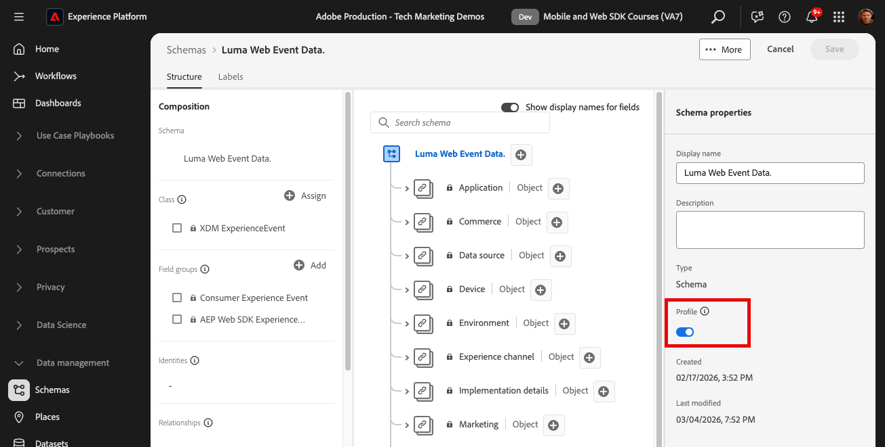
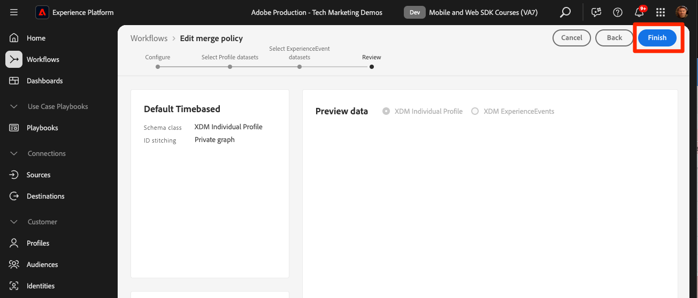

# Profils client en temps réel et segmentation d’Edge

## Activez le jeu de données et le schéma pour le profil client en temps réel

Pour les clients Real-Time Customer Data Platform et Journey Optimizer, l’étape suivante consiste à activer le jeu de données et le schéma pour le profil client en temps réel. La diffusion de données en continu à partir de Web SDK est l’une des nombreuses sources de données qui entrent dans Platform. Vous souhaitez associer vos données web à d’autres sources de données pour créer des profils client à 360 degrés. Pour en savoir plus sur le profil client en temps réel, regardez cette courte vidéo :

>[!VIDEO](https://video.tv.adobe.com/v/27251?learn=on&captions=eng)

>[!CAUTION]
>
>Lorsque vous travaillez avec votre propre site web et vos propres données, nous vous recommandons une validation plus robuste des données avant leur activation pour le profil client en temps réel.

### Activer le schéma

Pour activer le schéma pour le profil :

1. Ouvrez le schéma que vous avez créé, `Luma Web Event Data`

1. Sélectionnez le bouton bascule **[!UICONTROL Profile]** pour l’activer

   

1. Sélectionnez **[!UICONTROL Les données de ce schéma contiendront une identité principale dans le champ identityMap.]**

1. Sélectionnez **[!UICONTROL Activer]**

   

   >[!IMPORTANT]
   >
   >    Les identités de Principal sont requises dans chaque enregistrement envoyé au profil client en temps réel. Chaque enregistrement devient un « fragment de profil » et les identités principales sont les clés pour rechercher ces fragments.
   > 
   > Avec certains types de données, les champs d’identité sont libellés dans le schéma. Toutefois, avec les données d’événement capturées par les SDK Experience Platform, les mappages d’identité sont typiques et les champs d’identité ne sont pas visibles dans le schéma.
   >
   > Cette boîte de dialogue permet de confirmer que vous avez une identité principale en tête et que vous la spécifierez dans un mappage d’identités lors de l’envoi de vos données, que vous la configurerez avec des règles de liaison de graphiques d’identités, ou les deux. Nous vous recommandons de faire les deux.
   >
   > Comme vous le savez, notre implémentation de Luma utilise un mappage d’identités avec l’identifiant lumaCrmId authentifié comme identité principale lorsqu’il est disponible, sinon il utilisera l’identifiant Experience Cloud par défaut (ECID).

1. Sélectionnez **[!UICONTROL Enregistrer]** pour enregistrer le schéma mis à jour

Le schéma est maintenant activé pour le profil.

### Activer le jeu de données

Pour activer le jeu de données :

1. Ouvrez le jeu de données que vous avez créé `Luma Web Event Data`

1. Sélectionnez le bouton bascule **[!UICONTROL Profile]** pour l’activer

   

1. Confirmez que vous souhaitez **[!UICONTROL Activer]** le jeu de données

>[!IMPORTANT]
>
>  Une fois qu’un schéma est activé pour Profil et que les données sont ingérées dans le jeu de données, il ne peut pas être désactivé ou supprimé sans réinitialiser ou supprimer l’ensemble du sandbox. En outre, les champs qui ont reçu des données ne peuvent pas être supprimés du schéma après ce point.
>
>   
> Lorsque vous utilisez vos propres données, nous vous recommandons d’effectuer les opérations dans l’ordre suivant :
> 
> * Tout d’abord, ingérez des données dans vos jeux de données.
> * Résolvez les problèmes qui se produisent pendant le processus d’ingestion des données (par exemple, les problèmes de validation des données ou de mappage).
> * Activez vos jeux de données et schémas pour Profil
> * Réingérez les données, si nécessaire

### Validation d’un profil

Vous pouvez rechercher un profil client dans l’interface de Platform (ou de Journey Optimizer) pour confirmer que les données ont bien atterri dans le profil client en temps réel. Comme leur nom l’indique, les profils sont renseignés en temps réel. Il n’y a donc pas de retard comme c’était le cas pour la validation des données dans le jeu de données.

Tout d’abord, vous devez générer d’autres données d’exemple dans votre jeu de données activé pour le profil :

1. Ouvrez le site web de démonstration [Luma](https://luma.enablementadobe.com) et sélectionnez l’icône de l’extension [!UICONTROL Experience Platform Debugger]

1. Configurez le débogueur pour mapper la propriété de balise à *votre* environnement de développement, comme décrit dans la leçon [Valider avec le débogueur](validate-with-debugger.md)

   

1. Parcourez le site web. Affichez certains produits et ajoutez-en à votre panier.

1. Connectez-vous au site Luma à l’aide des informations d’identification `test@test.com`/`test` (si vous recevez un message « E-mail ou mot de passe non valide », créez un compte avec ces informations d’identification)

1. Ouvrez la ligne « événements » pour rechercher certaines de vos variables XDM
1. Recherchez le « identityMap » dans le pop-up. Ici, vous devriez voir lumaCrmId avec trois clés authenticatedState, id et primary. Notez comment la valeur lumaCrmId pour ce login est `f660ab912ec121d1b1e928a0bb4bc61b`.

   

Maintenant, nous allons chercher notre profil dans Experience Platform :

1. Dans l’interface [Experience Platform](https://experience.adobe.com/platform/), sélectionnez **[!UICONTROL Client]** > **[!UICONTROL Profils]** dans le volet de navigation de gauche

1. Comme espace de noms d’identité **[!UICONTROL Identity]** utilisez `Luma CRM ID`
1. Copiez et collez la valeur de la `lumaCrmId` transmise dans l’appel que vous avez inspecté dans le débogueur Experience Platform, dans ce cas `f660ab912ec121d1b1e928a0bb4bc61b`

1. S’il existe une valeur valide dans le profil pour `lumaCRMId`, un identifiant de profil est renseigné dans la console

1. Pour afficher l’intégralité du **[!UICONTROL Profil client]** sélectionnez **[!UICONTROL Afficher]** :

   

1. Tout d’abord, vous verrez un résumé du profil. Il n’y a pas encore grand-chose dans ce profil, mais voici les identités liées dans le profil, le `lumaCRMId` et le `ECID` :

   

1. À ce stade, la plupart des données de profil disponibles sont les données d’événement de l’activité web. Sélectionnez **[!UICONTROL Événements]** pour afficher les données de parcours de navigation :

   

## Éviter la réduction du profil

Examinons maintenant une situation que vous ne souhaitez jamais voir se produire dans votre propre mise en œuvre : les graphiques s’effondrent.

### Comprendre le problème

Tout d’abord, nous allons générer d’autres données d’exemple afin de voir le problème :

1. Sans supprimer de cookies ni d’objets localStorage, ouvrez le site web de démonstration [Luma](https://luma.enablementadobe.com) et sélectionnez l’icône de l’extension [!UICONTROL Experience Platform Debugger]

1. Configurez le débogueur pour mapper la propriété de balise à *votre* environnement de développement, comme décrit dans la leçon [Valider avec le débogueur](validate-with-debugger.md)

   

1. J’espère que vous êtes toujours connecté au site Luma à l’aide des informations d’identification `test@test.com`/`test`. Si ce n’est pas le cas, reconnectez-vous.

1. Parcourez le site web. Affichez certains produits et ajoutez-en à votre panier.

1. Déconnectez-vous.

1. Connectez-vous à nouveau en créant un compte en tant qu’utilisateur différent (`spouse@test.com/test`). Ce que nous essayons de faire, c’est de répliquer un scénario « appareil partagé », où deux utilisateurs partagent le même navigateur web, s’authentifient sur le même site web et partagent la même valeur `ECID`.
1. Vérifiez dans Debugger que vous disposez d’un lumaCrmId différent, `98d73957f59c67617611d56ba7e8dbaa` par `spouse@test.com/test`.

   

1. Afficher certains produits supplémentaires

Recherchez à nouveau le profil :

1. Recherchez à nouveau `Luma CRM ID` est égal `f660ab912ec121d1b1e928a0bb4bc61b`
1. Notez que le profil est désormais lié à deux identifiants CRM de Luma différents

1. Sélectionnez **[!UICONTROL Afficher le graphique d’identités]**

   

1. Le graphique d’identité permet de visualiser ce profil dans lequel, en raison du partage de l’appareil, deux valeurs `lumaCrmId` sont reliées par une valeur `ECID` commune.

   

Cela peut représenter un gros problème pour une implémentation d’Experience Platform. Non seulement les données d’événement des deux utilisateurs sont reliées dans un seul profil, mais d’autres types de données ingérées dans Platform à l’aide de ces valeurs de `lumaCrmId` seront également fusionnés.

### Corrigez-le avec les règles de liaison des graphiques d’identités.

Pour résoudre de manière préventive le problème de réduction du graphique, utilisez la fonctionnalité de règles de liaison des graphiques d’identités dans Adobe Experience Platform avant d’activer votre implémentation de Web SDK.

>[!WARNING]
>
> Ces étapes sont généralement configurées par un architecte de données qui gère l’ensemble de la mise en œuvre de Platform. Cette fonctionnalité ne se limite pas à ce qui est présenté ici et de nombreux scénarios complexes doivent d’abord être simulés avec soin.
>
> Suivez uniquement ces étapes si vous suivez ce tutoriel dans un sandbox de développement dédié qui peut être supprimé une fois que vous avez terminé ce tutoriel. Ces modifications apportées au sandbox ne peuvent pas être annulées. Pour en savoir plus, consultez le [tutoriels sur les règles de liaison des graphiques d’identités](https://experienceleague.adobe.com/fr/docs/platform-learn/tutorials/identities/graph-linking-rules/overview).

Pour activer les règles de liaison des graphiques d’identités :

1. Dans n’importe quel écran Identités, ouvrez **[!UICONTROL Paramètres]** :

   

1. Vérifiez les avertissements dans la boîte de dialogue modale et sélectionnez **[!UICONTROL Continuer]**
1. Faites glisser le `Luma CRM ID` afin qu’il s’agisse de l’espace de noms prioritaire le plus élevé de la liste
1. Vérifiez le paramètre **[!UICONTROL Unique par graphique]** pour la `Luma CRM ID`
1. Sélectionnez **[!UICONTROL Suivant]**
   
1. Vérifiez la boîte de dialogue modale et **[!UICONTROL Confirmer]**.
1. Sélectionnez **[!UICONTROL Suivant]** pour ignorer l’étape de simulation

   >[!WARNING]
   >
   > Encore une fois, ne terminez pas ce workflow pour activer ces paramètres d’identité si vous ne travaillez pas dans votre propre sandbox de développement dédié.

1. Saisissez le nom du sandbox et sélectionnez **[!UICONTROL Confirmer]**

   

Revenez sur le site dans 24 heures, connectez-vous de nouveau en tant que `test@test.com` ou `spouse@test.com` et vérifiez si vos profils ont été séparés.

## Création d’une audience évaluée par Edge

Il est recommandé de terminer cet exercice pour les clients de Real-Time Customer Data Platform et de Journey Optimizer.

Lorsque des données Web SDK sont ingérées dans Adobe Experience Platform, elles peuvent être enrichies par d’autres sources de données que vous avez ingérées dans Platform. Par exemple, lorsqu’un utilisateur se connecte au site Luma, un graphique d’identités est créé dans Experience Platform et tous les autres jeux de données activés pour le profil peuvent éventuellement être réunis pour créer des profils clients en temps réel. Pour voir cela en action, vous allez rapidement créer un autre jeu de données dans Adobe Experience Platform avec des exemples de données de fidélité afin de pouvoir utiliser les profils clients en temps réel avec Real-Time Customer Data Platform et Journey Optimizer. Vous allez ensuite créer une audience basée sur ces données.

### Création d’un schéma de fidélité et ingestion de données d’exemple

Puisque vous avez déjà fait des exercices similaires, les instructions seront brèves.

Créez le schéma de fidélité :

1. Créer un schéma
1. Choisissez **[!UICONTROL Profil individuel]** comme [!UICONTROL  classe de base]
1. Nommez le schéma `Luma Loyalty Schema`
1. Ajoutez le groupe de champs [!UICONTROL  Détails de fidélité ]
1. Ajoutez le groupe de champs [!UICONTROL  Détails démographiques ]
1. Sélectionnez le champ `Person ID` et marquez-le comme [!UICONTROL Identité] et [!UICONTROL Identité de Principal ] à l’aide du `Luma CRM Id` [!UICONTROL Espace de noms d’identité].
1. Activez le schéma pour [!UICONTROL Profil]. Si vous ne trouvez pas le bouton Profile , essayez de cliquer sur le nom du schéma en haut à gauche.
1. Enregistrer le schéma

   

Pour créer le jeu de données et ingérer les données d’exemple :

1. Créer un nouveau jeu de données à partir du `Luma Loyalty Schema`
1. Nommez le jeu de données `Luma Loyalty Dataset`
1. Activez le jeu de données pour [!UICONTROL Profil]
1. Téléchargez l’exemple de fichier [luma-loyalty-forWeb.json](assets/luma-loyalty-forWeb.json)
1. Faites glisser le fichier dans votre jeu de données
1. Confirmer que les données ont bien été ingérées

   

### Définition d’une politique de fusion Active-on-Edge

Toutes les audiences sont créées avec une politique de fusion. Les politiques de fusion créent différentes « vues » d’un profil, peuvent contenir un sous-ensemble de jeux de données et prescrire un ordre de priorité lorsque différents jeux de données contribuent aux mêmes attributs de profil. Pour être évaluée sur le serveur Edge, une audience doit utiliser une politique de fusion avec le paramètre **[!UICONTROL Politique de fusion Active-On-Edge]**.

>[!IMPORTANT]
>
>Une seule politique de fusion par sandbox peut avoir le paramètre **[!UICONTROL Politique de fusion Active-On-Edge]**

1. Ouvrez l’interface d’Experience Platform ou de Journey Optimizer et assurez-vous que vous vous trouvez dans l’environnement de développement utilisé pour le tutoriel.
1. Accédez à la page **[!UICONTROL Client]** > **[!UICONTROL Profils]** > **[!UICONTROL Politiques de fusion]**
1. Ouvrez la **[!UICONTROL Politique de fusion par défaut]** (probablement nommée `Default Timebased`).
   
1. Activez le paramètre **[!UICONTROL Politique de fusion Active-On-Edge]**
1. Sélectionnez **[!UICONTROL Suivant]**

   
1. Continuez à sélectionner **[!UICONTROL Suivant]** pour passer aux autres étapes du workflow et sélectionnez **[!UICONTROL Terminer]** pour enregistrer vos paramètres
   

Vous pouvez maintenant créer des audiences qui seront évaluées sur Edge.

### Créer une audience

Les audiences regroupent les profils autour de caractéristiques communes. Créez une audience simple que vous pouvez utiliser dans Real-Time CDP ou Journey Optimizer :

1. Dans l’interface Experience Platform ou Journey Optimizer, accédez à **[!UICONTROL Client]** > **[!UICONTROL Audiences]** dans le volet de navigation de gauche
1. Sélectionnez **[!UICONTROL Créer une audience]**
1. Sélectionnez **[!UICONTROL Créer une règle]**
1. Sélectionnez **[!UICONTROL Créer]**

   

1. Sélectionnez **[!UICONTROL Attributs]**
1. Recherchez le champ **[!UICONTROL Fidélité]** > **[!UICONTROL Niveau]** et faites-le glisser sur la section **[!UICONTROL Attributs]**
1. Définir l’audience en tant qu’utilisateurs dont le `tier` est `gold`
1. Nommez l’audience `Luma Loyalty Rewards – Gold Status`
1. Sélectionnez **[!UICONTROL Edge]** comme méthode **[!UICONTROL Évaluation]**
1. Sélectionnez **[!UICONTROL Enregistrer]**

   

>[!NOTE]
>
> Comme nous avons défini la politique de fusion par défaut **[!UICONTROL Active-On-Edge Merge Policy]** l’audience que vous avez créée est automatiquement associée à cette politique de fusion.

Comme il s’agit d’une audience très simple, nous pouvons utiliser la méthode d’évaluation Edge. Les audiences Edge sont évaluées sur le serveur Edge. Ainsi, dans la même requête que celle envoyée par Web SDK à Platform Edge Network, nous pouvons évaluer la définition de l’audience et confirmer immédiatement si l’utilisateur sera qualifié.

>[!NOTE]
>
>Merci d’avoir investi votre temps dans votre apprentissage de Adobe Experience Platform Web SDK. Si vous avez des questions, souhaitez partager des commentaires généraux ou avez des suggestions sur le contenu futur, veuillez les partager dans ce [article de discussion de la communauté Experience League](https://experienceleaguecommunities.adobe.com/adobe-experience-platform-18/tutorial-discussion-implement-adobe-experience-cloud-with-web-sdk-tutorial-248848)
