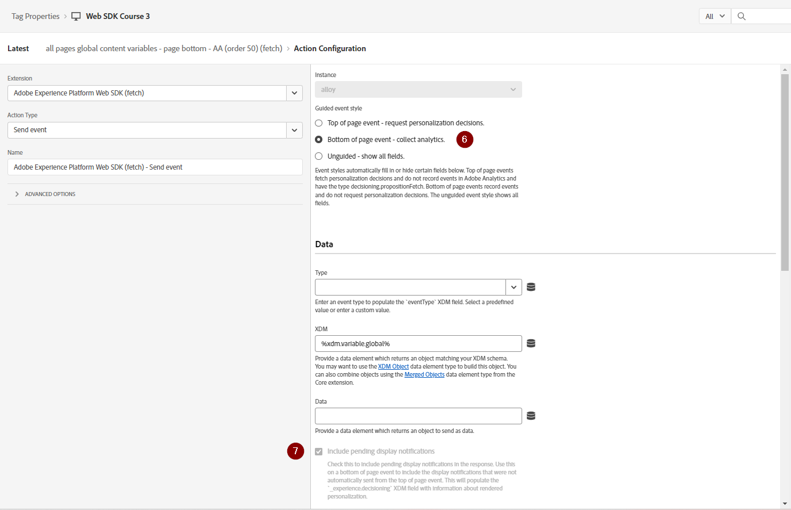

# Configuration d’Adobe Target avec le SDK Web de Platform

Découvrez comment implémenter Adobe Target à l’aide du SDK web d’Adobe Experience Platform. Découvrez comment diffuser des expériences et comment transmettre des paramètres supplémentaires à Target.

[Adobe Target](https://experienceleague.adobe.com/fr/docs/target/using/target-home) est l’application Adobe Experience Cloud qui fournit tout ce dont vous avez besoin pour personnaliser l’expérience de vos clients afin de maximiser les recettes de vos sites web et mobiles, de vos applications et d’autres canaux numériques.


## Objectifs d&#39;apprentissage

À la fin de cette leçon, vous pouvez effectuer les opérations suivantes avec une mise en oeuvre SDK Web de Target :

* Ajouter le fragment de code de masquage préalable pour empêcher le scintillement
* Configuration d’un flux de données pour activer la fonctionnalité Target
* Rendu des activités du compositeur d’expérience visuelle
* Activités de rendu de compositeur de formulaire
* Transmission de données XDM à Target et compréhension du mappage aux paramètres Target
* Transmission de données personnalisées à Target, telles que des paramètres de profil et d’entité
* valider une mise en œuvre de Target.
* Séparation des requêtes de personnalisation des requêtes d’analyse

>[!TIP]
>
>Consultez notre tutoriel [Migration de Target d’at.js 2.x vers le SDK Web Platform](/help/tutorial-migrate-target-websdk/introduction.md) pour obtenir un guide détaillé sur la migration de votre implémentation at.js existante.


## Conditions préalables

Pour terminer les leçons de cette section, vous devez d’abord :

* Suivez toutes les leçons relatives à la configuration initiale du SDK Web de Platform, y compris la configuration des éléments de données et des règles.
* Vérifiez que vous disposez d’un [rôle d’éditeur ou d’approbateur](https://experienceleague.adobe.com/fr/docs/target/using/administer/manage-users/enterprise/properties-overview#section_8C425E43E5DD4111BBFC734A2B7ABC80) dans Adobe Target.
* Installez l’ [extension d’assistance du compositeur d’expérience visuelle](https://experienceleague.adobe.com/fr/docs/target/using/experiences/vec/troubleshoot-composer/vec-helper-browser-extension) si vous utilisez le navigateur Google Chrome.
* Découvrez comment configurer des activités dans Target. Si vous avez besoin d’une actualisation, les tutoriels et guides suivants sont utiles pour cette leçon :
   * [Utilisation de l’extension d’assistance du compositeur d’expérience visuelle (VEC)](https://experienceleague.adobe.com/fr/docs/target/using/experiences/vec/troubleshoot-composer/vec-helper-browser-extension)
   * [Utilisation du Compositeur d’expérience visuelle](https://experienceleague.adobe.com/fr/docs/target-learn/tutorials/experiences/use-the-visual-experience-composer)
   * [Utilisation du compositeur d’expérience d’après les formulaires](https://experienceleague.adobe.com/fr/docs/target-learn/tutorials/experiences/use-the-form-based-experience-composer)
   * [Créer des activités de ciblage d’expérience](https://experienceleague.adobe.com/fr/docs/target-learn/tutorials/activities/create-experience-targeting-activities)

## Ajout de la gestion des scintillements

Avant de commencer, déterminez si une solution de gestion du scintillement supplémentaire est nécessaire en fonction de la manière dont la bibliothèque de balises est chargée.

>[!NOTE]
>
>Ce tutoriel utilise le [site web Luma](https://luma.enablementadobe.com/content/luma/us/en.html){target=_blank}, qui dispose d’une mise en oeuvre asynchrone des balises et d’une atténuation du scintillement en place. Cette section sert de référence pour comprendre comment la limitation du scintillement fonctionne avec le SDK Web Platform.


### Mise en oeuvre asynchrone

Lorsqu’une bibliothèque de balises se charge de manière asynchrone, le rendu de la page peut se terminer avant que Target ne remplace le contenu par défaut par du contenu personnalisé. Ce comportement peut entraîner un &quot;scintillement&quot;, où le contenu par défaut s’affiche brièvement avant d’être remplacé par le contenu personnalisé. Si vous souhaitez éviter ce scintillement, Adobe recommande d’ajouter un fragment de code de masquage préalable spécial juste avant le code incorporé de balise asynchrone.

Ce fragment est déjà présent sur le site Luma, mais regardons de plus près pour comprendre ce que fait ce code :

```html
<script>
  !function(e,a,n,t){var i=e.head;if(i){
  if (a) return;
  var o=e.createElement("style");
  o.id="alloy-prehiding",o.innerText=n,i.appendChild(o),setTimeout(function(){o.parentNode&&o.parentNode.removeChild(o)},t)}}
  (document, document.location.href.indexOf("adobe_authoring_enabled") !== -1, ".personalization-container { opacity: 0 !important }", 3000);
</script>
```

Le fragment de code de masquage préalable crée une balise de style dans l’en-tête de la page avec la définition CSS de votre choix. Cette balise de style est supprimée lorsqu’une réponse de Target est reçue ou que le délai d’expiration est atteint.

Le comportement de masquage préalable est contrôlé par deux configurations à la fin du fragment de code.

* `body { opacity: 0 !important }` spécifie la définition CSS à utiliser pour le masquage préalable jusqu’au chargement de Target. Par défaut, la page entière est masquée. Vous pouvez mettre à jour cette définition avec les sélecteurs que vous souhaitez pré-masquer, ainsi que la manière dont vous souhaitez les masquer. Vous pouvez inclure plusieurs définitions, car cette valeur est simplement insérée dans la balise de style de masquage préalable. Si vous disposez d’un élément de conteneur facilement identifiable encapsulant le contenu sous votre navigation, vous pouvez utiliser ce paramètre pour limiter le masquage préalable à cet élément de conteneur.
* `3000` spécifie le délai d’expiration en millisecondes du masquage préalable. Si aucune réponse de Target n’est reçue avant le délai d’expiration, la balise de style de masquage préalable est supprimée. Il devrait être rare d’atteindre ce délai.

>[!NOTE]
>
>Le fragment de code de prémasquage du SDK Web Platform est légèrement différent de celui utilisé avec la bibliothèque at.js de Target. Veillez à utiliser le fragment de code correct pour le SDK Web Platform, car il utilise un autre ID de style `alloy-prehiding`. Si le fragment de code de prémasquage d’at.js est utilisé, il se peut qu’il ne fonctionne pas correctement.

Le fragment de code de masquage préalable est également disponible dans les balises :

1. Accédez à la section **[!UICONTROL Extensions]** des balises.
1. Sélectionnez **[!UICONTROL Configurer]** pour l’extension SDK Web Adobe Experience Platform
1. Sélectionnez le bouton **[!UICONTROL Copier le fragment de code de pré-masquage dans le Presse-papiers]** .

   

   >[!NOTE]
   >
   >Le fragment de code de prémasquage par défaut copié à partir de l’extension SDK Web Platform peut inclure une définition CSS qui n’existe pas sur votre site, telle que `.personalization-container { opacity: 0 !important }`. Veillez à vérifier et à modifier le fragment de code de pré-masquage approprié pour votre site.

### Mise en oeuvre synchrone

Adobe recommande de mettre en oeuvre les balises de manière asynchrone, comme illustré sur le site Luma. Cependant, si la bibliothèque de balises est chargée de manière synchrone, le fragment de code de masquage préalable n’est pas obligatoire. Au lieu de cela, le style de pré-masquage est spécifié dans les paramètres de l’extension du SDK Web Platform.

Le style de prémasquage pour les implémentations synchrones peut être configuré comme suit :

1. Accédez à la section **[!UICONTROL Extensions]** des balises.
1. Sélectionnez le bouton **[!UICONTROL Configurer]** pour l’extension SDK Web Platform.
1. Sélectionnez le bouton **[!UICONTROL Editer le style de pré-masquage]**

   

1. Modifiez la page CSS pour inclure les sélecteurs et les méthodes de masquage que vous souhaitez utiliser, par exemple : `body { opacity: 0 !important }` si vous souhaitez pré-masquer tout le corps de la page.
1. Enregistrer vos modifications et créer une bibliothèque

>[!NOTE]
>
>Le paramètre de style de prémasquage est destiné uniquement à être utilisé pour les implémentations synchrones. Ce style doit être vide ou commenté si vous utilisez une mise en oeuvre asynchrone des balises.

Pour en savoir plus sur la façon dont le SDK Web Platform peut gérer le scintillement, consultez la section du guide : [gestion du scintillement pour les expériences personnalisées](https://experienceleague.adobe.com/fr/docs/experience-platform/edge/personalization/manage-flicker).


## Configuration du flux de données

Target doit être activé dans la configuration du flux de données pour que les activités Target puissent être diffusées par le SDK Web Platform.

Pour configurer Target dans le flux de données :

1. Accédez à l’interface [Collecte de données](https://experience.adobe.com/#/data-collection){target="blank"}
1. Dans le volet de navigation de gauche, sélectionnez **[!UICONTROL Datastreams]**
1. Sélectionnez le flux de données `Luma Web SDK: Development Environment` créé précédemment.

   

1. Sélectionnez **[!UICONTROL Ajouter un service]**
   
1. Sélectionnez **[!UICONTROL Adobe Target]** comme **[!UICONTROL Service]**
1. Si vous le souhaitez, renseignez les détails facultatifs de votre mise en oeuvre Target, en suivant les instructions ci-dessous.
1. Sélectionnez **[!UICONTROL Save]**

   

### Jeton de propriété

Les clients Target Premium ont la possibilité de gérer les autorisations d’utilisateur avec des propriétés. Les propriétés de Target vous permettent de définir des limites autour de l’emplacement où les utilisateurs peuvent exécuter des activités Target. Pour plus d’informations, reportez-vous à la section [Autorisations d’entreprise](https://experienceleague.adobe.com/fr/docs/target/using/administer/manage-users/enterprise/properties-overview) de la documentation de Target.

Pour configurer ou rechercher des jetons de propriété, accédez à **Adobe Target** > **[!UICONTROL Administration]** > **[!UICONTROL Propriétés]**. L’icône `</>` affiche le code de mise en oeuvre. La valeur `at_property` est le jeton de propriété que vous utiliseriez dans votre flux de données.


<a id="advanced-pto"></a>

Un seul jeton de propriété peut être spécifié par flux de données, mais les remplacements de jetons de propriété vous permettent de spécifier d’autres jetons de propriété pour remplacer le jeton de propriété principal défini dans le flux de données. Une mise à jour de l’action `sendEvent` est également nécessaire pour remplacer le flux de données.


### Identifiant de l’environnement Target

[Les environnements](https://experienceleague.adobe.com/fr/docs/target/using/administer/environments) de Target vous aident à gérer votre mise en oeuvre à toutes les étapes du développement. Ce paramètre facultatif spécifie l’environnement Target que vous allez utiliser avec chaque flux de données.

Adobe recommande de définir différemment l’identifiant de l’environnement cible pour chacun de vos flux de données de développement, d’évaluation et de production afin de garder les choses simples. Vous pouvez également organiser vos environnements dans l’interface de Target à l’aide de la fonction [hosts](https://experienceleague.adobe.com/fr/docs/target/using/administer/hosts) .

Pour configurer ou rechercher des ID d’environnement, accédez à **Adobe Target** > **[!UICONTROL Administration]** > **[!UICONTROL Environnements]**.


>[!NOTE]
>
>Si aucun identifiant d’environnement cible n’est spécifié, l’environnement cible de production est utilisé.

### Espace de noms d’ID tiers de Target

Ce paramètre facultatif vous permet de spécifier le symbole d’identité à utiliser pour l’identifiant tiers Target. Target prend uniquement en charge la synchronisation des profils sur un seul symbole d’identité ou espace de noms. Pour plus d’informations, reportez-vous à la section [Synchronisation des profils en temps réel pour mbox3rdPartyId](https://experienceleague.adobe.com/fr/docs/target/using/audiences/visitor-profiles/3rd-party-id) du guide Target.

Les symboles d’identité se trouvent dans la liste des identités sous **Collecte de données** > **[!UICONTROL Client]** > **[!UICONTROL Identités]**.


Pour les besoins de ce tutoriel utilisant le site Luma, utilisez le symbole d’identité `lumaCrmId` configuré lors de la leçon sur les [identités](configure-identities.md).


## Rendu des décisions de personnalisation visuelle

Les décisions de personnalisation visuelle se rapportent aux expériences créées dans le compositeur d’expérience visuelle Adobe Target. Tout d’abord, vous devez comprendre la terminologie utilisée dans les interfaces de Target et de balises :

* **Activité** : ensemble d’expériences ciblées sur une ou plusieurs audiences. Par exemple, un simple test A/B peut être une activité avec deux expériences.
* **Expérience** : ensemble d’actions ciblées sur un ou plusieurs emplacements ou portées de décision.
* **Étendue de décision** : emplacement où une expérience Target est diffusée. Les portées de décision sont équivalentes à des &quot;mbox&quot; si vous connaissez l’utilisation d’anciennes versions de Target.
* **Décision Personalization** : une action que le serveur détermine doit être appliquée. Ces décisions peuvent être basées sur les critères d’audience et la hiérarchisation des activités Target.
* **Proposition** : résultat des décisions prises par le serveur, qui sont fournies dans la réponse du SDK Web Platform. Par exemple, la permutation d’une image de bannière est une proposition.

### Mettre à jour l&#39;action [!UICONTROL Send event]

Les décisions de personnalisation visuelle issues de Target sont diffusées par le SDK Web de Platform, si Target est activé dans le flux de données. Cependant, _ils ne sont pas rendus automatiquement_. Vous devez mettre à jour l’action [!UICONTROL Send event] pour activer le rendu automatique.

1. Dans l’interface [Collecte de données](https://experience.adobe.com/#/data-collection){target="blank"}, ouvrez la propriété de balise que vous utilisez pour ce tutoriel.
1. Ouvrez la règle `all pages - library loaded - send event - 50`
1. Sélectionnez l’action `Adobe Experience Platform Web SDK - Send event`
1. Activez **[!UICONTROL Rendre les décisions de personnalisation visuelle]** avec la case à cocher.

   

<!--
1. In the **[!UICONTROL Datastream configuration overrides**] the **[!UICONTROL Target Property Token]** can be overridden either as a static value or with a data element. Only property tokens defined in the [**Advanced Property Token Overrides**](#advanced-pto) section in **Datastream Configuration** will return results.
   
   
   -->

1. Enregistrez vos modifications, puis créez-les dans votre bibliothèque.

Le paramètre de rendu des décisions de personnalisation visuelle oblige le SDK Web de Platform à appliquer automatiquement toutes les modifications spécifiées à l’aide du compositeur d’expérience visuelle de Target ou de la &quot;mbox globale&quot;.

>[!NOTE]
>
>En règle générale, le paramètre [!UICONTROL Render Visual personalization Decisions] ne doit être activé que pour une seule action Envoyer l’événement par chargement de page complet. Si ce paramètre est activé pour plusieurs actions Envoyer l’événement , les demandes de rendu suivantes sont ignorées.

Si vous préférez effectuer vous-même le rendu ou agir sur ces décisions à l’aide d’un code personnalisé, vous pouvez laisser le paramètre [!UICONTROL Render Visual personalization Decisions] désactivé. Le SDK Web Platform est flexible et offre cette fonctionnalité pour vous donner un contrôle total. Pour plus d’informations sur le [rendu manuel du contenu personnalisé](https://experienceleague.adobe.com/fr/docs/experience-platform/edge/personalization/rendering-personalization-content), reportez-vous au guide.


### Configuration d’une activité Target avec le compositeur d’expérience visuelle

Maintenant que la partie de mise en oeuvre de base est terminée, créez une activité de ciblage d’expérience (XT) dans Target pour vérifier que tout fonctionne correctement. Si vous avez besoin d’aide, reportez-vous au tutoriel Target pour [créer des activités de ciblage d’expérience](https://experienceleague.adobe.com/fr/docs/target-learn/tutorials/activities/create-experience-targeting-activities).

>[!NOTE]
>
>Si vous utilisez Google Chrome comme navigateur, l’ [ extension d’assistance du compositeur d’expérience visuelle (VEC) ](https://experienceleague.adobe.com/fr/docs/target/using/experiences/vec/troubleshoot-composer/vec-helper-browser-extension) est nécessaire pour charger le site correctement en vue de le modifier dans le VEC.

1. Accès à l’interface d’Adobe Target
1. Créez une activité de ciblage d’expérience (XT) à l’aide de la page d’accueil Luma pour l’URL d’activité.

   

1. Modifiez la page, par exemple, modifiez le texte sur la bannière principale de la page d’accueil.  Lorsque vous avez terminé, sélectionnez **[!UICONTROL Enregistrer]** puis **[!UICONTROL Suivant]**.

   

1. Mettez à jour le nom de l’événement, puis sélectionnez **[!UICONTROL Suivant]**.

   

1. Choisissez Adobe Analytics comme source de création de rapports avec la suite de rapports appropriée et la mesure Commandes comme objectif.

   

   >[!NOTE]
   >
   >Si vous n’utilisez pas Adobe Analytics, sélectionnez Target comme source des rapports et choisissez une autre mesure telle que **Engagement > Pages vues** à la place. Une mesure d’objectif est requise pour enregistrer et prévisualiser l’activité.

1. Enregistrement de l’activité
1. Si vos modifications vous conviennent, vous pouvez activer votre activité. Sinon, si vous souhaitez prévisualiser l’expérience sans l’activer, vous pouvez copier l’ [URL d’aperçu QA](https://experienceleague.adobe.com/fr/docs/target/using/activities/activity-qa/activity-qa).
1. Chargez la page d’accueil de Luma et vos modifications devraient être appliquées.
1. Au bout de quelques heures, vous devriez être en mesure d’afficher les données d’activité et les conversions de Target dans Adobe Analytics. Reportez-vous au Guide de Target pour obtenir des informations détaillées sur la création de rapports [Analytics for Target (A4T)](https://experienceleague.adobe.com/fr/docs/target/using/integrate/a4t/reporting).


### Validation avec Debugger

Si vous configurez une activité, le contenu doit s’afficher sur la page. Cependant, même si aucune activité n’est active, vous pouvez également consulter l’appel réseau Envoyer l’événement pour confirmer que Target est correctement configuré.

>[!CAUTION]
>
>Si vous utilisez Google Chrome et que l’[ extension d’assistance du compositeur d’expérience visuelle (VEC) ](https://experienceleague.adobe.com/fr/docs/target/using/experiences/vec/troubleshoot-composer/vec-helper-browser-extension) est installée, assurez-vous que le paramètre **Inject Target Libraries** est désactivé. L’activation de ce paramètre entraîne des requêtes Target supplémentaires.

1. Ouvrez l’extension Adobe Experience Platform Debugger browser
1. Accédez au [site de démonstration Luma](https://luma.enablementadobe.com/content/luma/us/en.html) et utilisez le débogueur pour [ changer la propriété de balise sur le site en votre propre propriété de développement ](validate-with-debugger.md#use-the-experience-platform-debugger-to-map-to-your-tags-property).
1. Recharger la page
1. Sélectionnez l’outil **[!UICONTROL Network]** dans le débogueur
1. Filtrage par **[!UICONTROL SDK Web Experience Platform]**
1. Sélectionner la valeur de la ligne d’événements pour le premier appel

   

1. Notez qu’il existe des clés sous `query` > `personalization` et `decisionScopes` dont la valeur est `__view__`. Cette portée est l’équivalent de `target-global-mbox`. Cet appel du SDK Web Platform a demandé des décisions à Target.

   

1. Fermez la superposition et sélectionnez les détails de l’événement pour le deuxième appel réseau. Cet appel n’est présent que si Target a renvoyé une activité.
1. Notez que des détails sur l’activité et l’expérience sont renvoyés par Target. Cet appel de SDK Web Platform envoie une notification indiquant qu’une activité Target a été rendue à l’utilisateur et incrémente une impression.

   

## Configuration et rendu d’une portée de décision personnalisée

Les portées de décision personnalisées (anciennement appelées &quot;mbox&quot;) peuvent être utilisées pour diffuser du contenu JSON ou d’HTML de manière structurée à l’aide du compositeur d’expérience d’après les formulaires Target. Le contenu diffusé sur l’une de ces portées personnalisées n’est pas rendu automatiquement par le SDK Web Platform. Il peut être rendu à l’aide d’une action dans les balises.

### Ajoutez une portée à l&#39;[!UICONTROL action Envoyer un événement]

Modifiez votre règle de chargement de page pour ajouter une portée de décision personnalisée :

1. Ouvrez la règle `all pages - library loaded - send event - 50`
1. Sélectionnez l’action `Adobe Experience Platform Web SDK - Send Event`
1. Ajoutez une ou plusieurs portées que vous souhaitez utiliser. Pour cet exemple, utilisez `homepage-hero`.

   

1. Enregistrer vos modifications et créer dans votre bibliothèque

>[!TIP]
>
>Pour ce tutoriel, vous utiliserez une seule portée définie manuellement à des fins de démonstration. Si vous décidez d’utiliser plusieurs portées de décision destinées à des pages spécifiques, vous devez envisager d’utiliser un élément de données qui renvoie un tableau de portées de manière conditionnelle en fonction du chemin de page. Cette approche vous permet de maintenir votre mise en oeuvre simple et évolutive.

### Traitement de la réponse de Target

Maintenant que vous avez configuré le SDK Web de Platform pour demander du contenu pour la portée `homepage-hero`, vous devez faire quelque chose avec la réponse. L’extension de balise SDK Web Platform fournit un événement [!UICONTROL Send Event Complete] qui peut être utilisé pour déclencher immédiatement une nouvelle règle lors de la réception d’une réponse d’une action [!UICONTROL Send Event].

1. Créez une règle appelée `homepage - send event complete - render homepage-hero`.
1. Ajoutez un événement à la règle. Utilisez l’extension **Adobe Experience Platform Web SDK** et le type d’événement **[!UICONTROL Send event complete]** .
1. Ajoutez une condition pour restreindre la règle à la page d’accueil de Luma (chemin sans chaîne de requête égale à `/content/luma/us/en.html`).
1. Ajoutez une action à la règle. Utilisez l’extension **Adobe Experience Platform Web SDK** et le type d’action **Appliquer les propositions**.

   

   >[!TIP]
   >
   >Attribuez à vos événements de règle, conditions et actions des noms explicites au lieu d’utiliser les noms par défaut. Des noms de composants de règle robustes rendent les résultats de recherche beaucoup plus utiles.

1. Saisissez `%event.propositions%` dans le champ Propositions car nous utilisons l’événement &quot;Envoyer l’événement terminé&quot; comme déclencheur pour cette règle.
1. Dans la section &quot;métadonnées de proposition&quot;, sélectionnez l’option **[!UICONTROL Utiliser un formulaire]**
1. Pour l’entrée de champ **[!UICONTROL Scope]** `homepage-hero`
1. Pour l’entrée de champ **[!UICONTROL Sélecteur]** `div.heroimage`
1. Pour **[!UICONTROL Action Type]**, sélectionnez **[!UICONTROL Set HTML]**
1. Sélectionnez **[!UICONTROL Conserver les modifications]**

   

   Outre le rendu de l’activité, vous devez effectuer un appel supplémentaire vers Target pour indiquer que l’activité d’après les formulaires s’est générée :

1. Ajoutez une autre action à la règle. Utilisez l’extension **Core** et le type d’action **[!UICONTROL Custom code]** :
1. Collez le code JavaScript suivant :

   ```javascript
   var propositions = event.propositions;
   var heroProposition;
   if (propositions) {
      // Find the hero proposition, if it exists.
      for (var i = 0; i < propositions.length; i++) {
         var proposition = propositions[i];
         if (proposition.scope === "homepage-hero") {
            heroProposition = proposition;
            break;
         }xw
      }
   }
   // Send a "display" event
   if (heroProposition !== undefined){
      alloy("sendEvent", {
         xdm: {
            eventType: "display",
            _experience: {
               decisioning: {
                  propositions: [{
                     id: heroProposition.id,
                     scope: heroProposition.scope,
                     scopeDetails: heroProposition.scopeDetails
                  }]
               }
            }
         }
      });
   }
   ```

   

1. Sélectionnez **[!UICONTROL Conserver les modifications]**

1. Enregistrer vos modifications et créer dans votre bibliothèque
1. Chargez la page d’accueil de Luma quelques fois, ce qui devrait suffire à enregistrer la nouvelle portée de décision `homepage-hero` dans l’interface de Target.


### Configuration d’une activité Target avec le compositeur d’expérience d’après les formulaires

Maintenant que vous disposez d’une règle pour effectuer le rendu manuel d’une portée de décision personnalisée, vous pouvez créer une autre activité de ciblage d’expérience (XT) dans Target. Cette fois, utilisez le compositeur d’expérience d’après les formulaires.

1. Ouvrez [Adobe Target](https://experience.adobe.com/target)
1. Désactiver l’activité utilisée pour la leçon précédente
1. Créer une activité de ciblage d’expérience (XT) à l’aide de l’option Compositeur d’expérience d’après les formulaires

   

1. Sélectionnez l’emplacement **`homepage-hero`** dans la liste déroulante des emplacements et **[!UICONTROL Créer une offre d’HTML]** dans la liste déroulante de contenu. Si l’emplacement n’est pas disponible, vous pouvez le saisir. Target renseigne régulièrement de nouveaux noms d’emplacement après avoir reçu des demandes pour cet emplacement ou cette portée.

   

1. Collez le code suivant dans la zone de contenu. Ce code est une bannière principale de base avec une image d’arrière-plan différente :

   ```html
   <div class="we-HeroImage jumbotron" style="background-image: url('/content/luma/us/en/women/_jcr_content/root/hero_image.coreimg.jpeg');">
      <div class="container cq-dd-image">
         <div class="we-HeroImage-wrapper">
            <p class="h3">New Luma Yoga Collection</p>
            <strong class="we-HeroImage-title h1">Be active with style&nbsp;</strong>
            <p>
               <a class="btn btn-primary btn-action" href="/content/luma/us/en/products.html" role="button">Shop Now</a>
            </p>
         </div>
      </div>
   </div>
   ```

1. À l’étape [!UICONTROL Objectifs et paramètres], sélectionnez Adobe Target comme source de création de rapports et [!UICONTROL Engagement] > [!UICONTROL Pages vues] comme objectif.
1. Enregistrement de l’activité
1. Si vos modifications vous conviennent, vous pouvez activer votre activité. Sinon, si vous souhaitez prévisualiser l’expérience sans l’activer, vous pouvez copier l’ [URL d’aperçu QA](https://experienceleague.adobe.com/fr/docs/target/using/activities/activity-qa/activity-qa).
1. Chargez la page d’accueil de Luma et vos modifications devraient être appliquées.

>[!NOTE]
>
>L’objectif de conversion &quot;A cliqué sur la mbox&quot; ne fonctionne pas automatiquement. Comme le SDK Web Platform ne rend pas automatiquement les portées personnalisées, il ne suit pas les clics vers les emplacements que vous choisissez d’appliquer au contenu. Vous pouvez créer votre propre suivi des clics pour chaque portée à l’aide de &quot;click&quot; `eventType` avec les détails `_experience` applicables à l’aide de l’action `sendEvent`.

### Validation avec Debugger

Si vous avez activé votre activité, le rendu de votre contenu doit s’afficher sur la page. Cependant, même si aucune activité n’est active, vous pouvez également consulter l’appel réseau [!UICONTROL Envoyer l’événement] pour confirmer que Target demande du contenu pour vos portées personnalisées.

1. Ouvrez l’extension de navigateur du débogueur Adobe Experience Platform
1. Accédez au [site de démonstration Luma](https://luma.enablementadobe.com/content/luma/us/en.html) et utilisez le débogueur pour [ changer la propriété de balise sur le site en votre propre propriété de développement ](validate-with-debugger.md#use-the-experience-platform-debugger-to-map-to-your-tags-property).
1. Recharger la page
1. Sélectionnez l’outil **[!UICONTROL Network]** dans le débogueur
1. Filtrage par **[!UICONTROL SDK Web Adobe Experience Platform]**
1. Sélectionner la valeur de la ligne d’événements pour le premier appel

   

1. Notez qu’il existe des clés sous `query` > `personalization` et `decisionScopes` avec une valeur `__view__` comme auparavant, mais qu’une portée `homepage-hero` est désormais incluse. Cet appel du SDK Web Platform a demandé des décisions à Target pour les modifications effectuées à l’aide du VEC et de l’emplacement `homepage-hero` spécifique.

   

1. Fermez la superposition et sélectionnez les détails de l’événement pour le deuxième appel réseau. Cet appel n’est présent que si Target a renvoyé une activité.
1. Notez que des détails sur l’activité et l’expérience sont renvoyés par Target. Cet appel de SDK Web Platform envoie une notification indiquant qu’une activité Target a été rendue à l’utilisateur et incrémente une impression. Elle a été lancée par l’action de code personnalisé que vous avez ajoutée précédemment.

   

## Envoi de paramètres à Target

Dans cette section, vous allez transmettre des données spécifiques à Target et examiner de plus près la façon dont les données XDM sont mappées aux paramètres Target.

### Paramètres de page (mbox) et XDM

Tous les champs XDM sont automatiquement transmis à Target en tant que [paramètres de page](https://experienceleague.adobe.com/fr/docs/target-dev/developer/implementation/methods/page-parameters) ou paramètres de mbox.

Certains de ces champs XDM sont mappés à des objets spéciaux dans le serveur principal de Target. Par exemple, `web.webPageDetails.URL` sera automatiquement disponible pour créer des conditions de ciblage basées sur une URL ou comme objet `page.url` lors de la création de scripts de profil.

Vous pouvez également ajouter des paramètres de page à l’aide de l’objet de données.

### Paramètres spéciaux et objet de données

Certains points de données peuvent s’avérer utiles à Target qui ne sont pas mappés à partir de l’objet XDM. Ces paramètres Target spéciaux incluent :

* [Attributs de profil](https://experienceleague.adobe.com/fr/docs/target-dev/developer/implementation/methods/in-page-profile-attributes)
* [Attributs d’entité Recommendations](https://experienceleague.adobe.com/fr/docs/target/using/recommendations/entities/entity-attributes)
* [Paramètres réservés Recommendations](https://experienceleague.adobe.com/fr/docs/target/using/recommendations/plan-implement#pass-behavioral)
* Valeurs de catégorie pour [ affinité catégorielle ](https://experienceleague.adobe.com/fr/docs/target/using/audiences/visitor-profiles/category-affinity)

Ces paramètres doivent être envoyés dans l’objet `data` au lieu de l’objet `xdm`. De plus, les paramètres de page (ou mbox) peuvent également être inclus dans l’objet `data`.

Pour renseigner l’objet de données, créez l’élément de données suivant, en réutilisant les éléments de données créés dans la leçon [Créer des éléments de données](create-data-elements.md) :

* **`data.content`** à l’aide du code personnalisé suivant :

  ```javascript
  var data = {
     __adobe: {
        target: {
           "entity.id": _satellite.getVar("product.productInfo.sku"),
           "entity.name": _satellite.getVar("product.productInfo.title"),
           "profile.loggedIn": _satellite.getVar("user.profile.attributes.loggedIn"),
           "user.categoryId": _satellite.getVar("product.category")
        }
     }
  }
  return data;
  ```


### Mettre à jour la règle de chargement de page

La transmission de données supplémentaires pour Target en dehors de l’objet XDM nécessite la mise à jour de toutes les règles applicables. Pour cet exemple, la seule modification que vous devez apporter est d’inclure le nouvel élément de données **data.content** à la règle de chargement de page générique et à la règle de consultation de page de produit.

1. Ouvrez la règle `all pages - library loaded - send event - 50`
1. Sélectionnez l’action `Adobe Experience Platform Web SDK - Send event`
1. Ajoutez l’élément de données `data.content` au champ Données .

   

1. Enregistrer vos modifications et créer dans votre bibliothèque

>[!NOTE]
>
>L’exemple ci-dessus utilise un objet `data` qui n’est pas entièrement renseigné sur tous les types de page. Les balises gèrent cette situation de manière appropriée et omettent les clés dont la valeur est indéterminée. Par exemple, `entity.id` et `entity.name` ne seraient transmis sur aucune page autre que les détails du produit.


## Fractionnement des requêtes Personalization et Analytics

La couche de données sur le site Luma est complètement définie avant le code incorporé des balises. Cela nous permet d’utiliser un seul appel pour récupérer du contenu personnalisé (provenant d’Adobe Target, par exemple) et envoyer des données d’analyse (vers Adobe Analytics, par exemple).

Sur de nombreux sites Web, cependant, la couche de données ne peut pas être chargée suffisamment tôt ou assez rapidement pour utiliser un seul appel pour les deux applications. Dans ces situations, vous pouvez utiliser deux actions [!UICONTROL Envoyer l’événement] lors d’un chargement de page unique et utiliser la première pour la personnalisation et la seconde pour les analyses. La ventilation des événements de cette manière permet à l’événement de personnalisation de se déclencher le plus tôt possible, en attendant que la couche de données se charge complètement avant d’envoyer l’événement Analytics. Ceci est similaire à de nombreuses mises en oeuvre de SDK pré-web, où Adobe Target déclenche l’appel `target-global-mbox` en haut de la page et Adobe Analytics déclenche l’appel `s.t()` en bas de la page.

Pour créer la requête de personnalisation sur le haut :

1. Ouvrez la règle `all pages - library loaded - send event - 50`
1. Ouvrez l’action **Send event**
1. Sélectionnez **[!UICONTROL Utiliser des événements guidés]**, puis **[!UICONTROL Demander la personnalisation]**
1. Cela verrouille le **type** comme **[!UICONTROL Récupération de la proposition de prise de décision]**

   

Pour créer la requête d’analyse en bas :

1. Créez une nouvelle règle appelée `all pages - page bottom - send event - 50`
1. Ajoutez un événement à la règle. Utilisez l’extension **Core** et le type d’événement **[!UICONTROL Page Bottom]**
1. Ajoutez une action à la règle. Utilisez l’extension **Adobe Experience Platform Web SDK** et le type d’action **Send event**
1. Sélectionnez **[!UICONTROL Utiliser des événements guidés]**, puis **[!UICONTROL Collect analytics]**
1. Cela verrouille la case à cocher **[!UICONTROL Inclure les notifications d’affichage en attente]** sélectionnée afin que la notification d’affichage en file d’attente de la demande de prise de décision soit envoyée.



>[!TIP]
>
>Si l’événement pour lequel vous récupérez une proposition de prise de décision n’a pas d’événement Adobe Analytics suivant, il utilise le **style d’événement guidé** **[!UICONTROL Non guidé - afficher tous les champs]**. Vous devrez sélectionner toutes les options manuellement, mais cela déverrouille l’option **[!UICONTROL envoyer automatiquement une notification d’affichage]** avec votre requête de récupération.


### Validation avec Debugger

Maintenant que les règles sont mises à jour, vous pouvez vérifier si les données sont transmises correctement à l’aide de l’Adobe Debugger .

1. Accédez au [site de démonstration Luma](https://luma.enablementadobe.com/content/luma/us/en.html) et connectez-vous avec l’e-mail `test@adobe.com` et le mot de passe `test`.
1. Accédez à une page de détails de produit.
1. Ouvrez l’extension de navigateur du débogueur Adobe Experience Platform et [basculez la propriété de balise sur votre propre propriété de développement](validate-with-debugger.md#use-the-experience-platform-debugger-to-map-to-your-tags-property)
1. Recharger la page
1. Sélectionnez l’outil **Network** dans le débogueur et filtrez par **Adobe Experience Platform Web SDK**
1. Sélectionner la valeur de la ligne d’événements pour le premier appel
1. Notez qu’il existe des clés sous `data` > `__adobe` > `target` et qu’elles contiennent des informations sur le produit, la catégorie et l’état de connexion.

   

### Validation dans l’interface de Target

Ensuite, vérifiez dans l’interface de Target que les données ont été reçues et qu’elles peuvent être utilisées dans les audiences et les activités. Les données XDM sont automatiquement mappées aux paramètres Target personnalisés. Vous pouvez vérifier que les données XDM ont été reçues par Target et sont disponibles en créant une audience.

1. Ouvrez [Adobe Target](https://experience.adobe.com/target)
1. Accédez à la section **[!UICONTROL Audiences]**
1. Créez une audience et choisissez le type d&#39;attribut **[!UICONTROL Personnalisé]**
1. Recherchez le champ **[!UICONTROL Paramètre]** pour `web`. Le menu déroulant doit être rempli avec tous les champs XDM liés aux détails de la page web.

   

Ensuite, vérifiez que l’attribut de profil d’état de connexion a bien été transmis.

1. Choisissez le type d’attribut **[!UICONTROL Profil du visiteur]**
2. Recherchez `loggedIn`. Si l’attribut est disponible dans le menu déroulant, il a été correctement transmis à Target. Les nouveaux attributs peuvent prendre plusieurs minutes pour être disponibles dans l’interface utilisateur de Target.

   

Si vous disposez de Target Premium, vous pouvez également vérifier que les données d’entité ont été transmises correctement et que les données de produit ont été écrites dans le catalogue de produits Recommendations.

1. Accédez à la section **[!UICONTROL Recommendations]**
1. Sélectionnez **[!UICONTROL Recherche catalogue]** dans la navigation de gauche.
1. Recherchez le SKU du produit ou le nom du produit que vous avez visité précédemment sur le site Luma. Le produit doit apparaître dans le catalogue de produits. La recherche de nouveaux produits dans le catalogue de produits Recommendations peut prendre plusieurs minutes.

   

### Valider avec Assurance

En outre, vous pouvez utiliser Assurance le cas échéant pour confirmer que les demandes de prise de décision Target obtiennent les données correctes et que toutes les transformations côté serveur se produisent correctement. Vous pouvez également vérifier que les informations sur les campagnes et expériences sont contenues dans les appels Adobe Analytics même lorsque les appels Target Decisioning et Adobe Analytics sont envoyés séparément.

1. Ouvrez [Assurance](https://experience.adobe.com/assurance)
1. Démarrez une nouvelle session d’assurance, entrez le **[!UICONTROL nom de session]** et l’ **[!UICONTROL URL de base]** pour votre site ou toute autre page que vous testez.
1. Cliquez sur **[!UICONTROL Suivant]**.

   

1. Sélectionnez votre méthode de connexion. Dans ce cas, nous utiliserons **[!UICONTROL copy link]**
1. Copiez le lien et collez-le dans un nouvel onglet du navigateur
1. Cliquez sur **[!UICONTROL Terminé]**

   

1. Une fois votre session d’assurance lancée, les événements s’affichent dans l’onglet Événements .
1. Filtrer par &quot;tnta&quot;
1. Sélectionnez l’appel le plus récent et développez les messages pour vous assurer qu’il est correctement renseigné et notez les valeurs &quot;tnta&quot;.

   

1. Conservez ensuite le filtre &quot;tnta&quot; et sélectionnez l’événement analytics.mapping qui se produit après l’événement cible que nous venons de visualiser.
1. Examinez &quot;context.mappedQueryParams&quot;.\&lt;yourSchemaName\>&quot; pour confirmer qu’il contient un attribut &quot;tnta&quot; avec une chaîne concaténée correspondant aux valeurs &quot;tnta&quot; trouvées dans l’événement cible précédent.

   

Cela confirme que les informations A4T qui étaient placées en file d’attente pour transmission ultérieure lorsque nous avons effectué l’appel de prise de décision de la cible ont été envoyées correctement lorsque l’appel de suivi des analyses s’est déclenché ultérieurement sur la page.

Maintenant que vous avez terminé cette leçon, vous devez disposer d’une mise en oeuvre opérationnelle d’Adobe Target à l’aide du SDK Web Platform.

[Suivant : ](setup-web-channel.md)

>[!NOTE]
>
>Merci d’avoir consacré du temps à l’apprentissage du SDK Web Adobe Experience Platform. Si vous avez des questions, souhaitez partager des commentaires généraux ou avez des suggestions sur le contenu à venir, partagez-les sur cet [post de discussion de la communauté Experience League](https://experienceleaguecommunities.adobe.com/t5/adobe-experience-platform-data/tutorial-discussion-implement-adobe-experience-cloud-with-web/td-p/444996?profile.language=fr)
