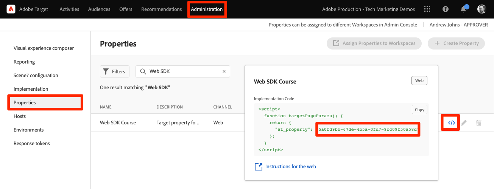

# Configuration d’Adobe Target avec Platform Web SDK

Découvrez comment implémenter Adobe Target à l’aide du SDK web d’Adobe Experience Platform. Découvrez comment diffuser des expériences et comment transmettre des paramètres supplémentaires à Target.

[Adobe Target](https://experienceleague.adobe.com/en/docs/target/using/target-home) est l’application Adobe Experience Cloud qui fournit tout ce dont vous avez besoin pour personnaliser l’expérience de vos clients afin de maximiser les recettes de vos sites web et mobiles, de vos applications et d’autres canaux numériques.


## Objectifs d’apprentissage

À la fin de cette leçon, vous êtes capable d’effectuer les opérations suivantes avec une implémentation de SDK Web de Target :

* Ajoutez le fragment de code de masquage préalable pour éviter le scintillement
* Configurer un flux de données pour activer la fonctionnalité Target
* Rendu des activités du compositeur d’expérience visuelle
* Rendu des activités du compositeur de formulaire
* Transmettre des données XDM à Target et comprendre le mappage aux paramètres de Target
* Transmettre des données personnalisées à Target telles que des paramètres de profil et d’entité
* valider une mise en œuvre de Target.
* Séparer les demandes de personnalisation des demandes Analytics

>[!TIP]
>
>Consultez notre tutoriel [Migration de Target d’at.js 2.x vers Platform Web SDK](/help/tutorial-migrate-target-websdk/introduction.md) pour obtenir un guide détaillé sur la migration de votre implémentation at.js existante.


## Conditions préalables

Pour suivre les leçons de cette section, vous devez d’abord :

* Suivez toutes les leçons relatives à la configuration initiale de Platform Web SDK, y compris la configuration des éléments de données et des règles.
* Vérifiez que vous disposez d’un [rôle d’éditeur ou d’approbateur](https://experienceleague.adobe.com/en/docs/target/using/administer/manage-users/enterprise/properties-overview#section_8C425E43E5DD4111BBFC734A2B7ABC80) dans Adobe Target.
* Installez l’extension d’assistance [Visual Experience Composer](https://experienceleague.adobe.com/en/docs/target/using/experiences/vec/troubleshoot-composer/vec-helper-browser-extension) si vous utilisez le navigateur Chrome Google.
* Savoir comment configurer des activités dans Target. Si vous avez besoin d’un rappel, les tutoriels et guides suivants sont utiles pour cette leçon :
   * [Utilisation de l’extension d’assistance du compositeur d’expérience visuelle (VEC)](https://experienceleague.adobe.com/en/docs/target/using/experiences/vec/troubleshoot-composer/vec-helper-browser-extension)
   * [Utilisation du Compositeur d’expérience visuelle](https://experienceleague.adobe.com/en/docs/target-learn/tutorials/experiences/use-the-visual-experience-composer)
   * [Utilisation du compositeur d’expérience d’après les formulaires](https://experienceleague.adobe.com/en/docs/target-learn/tutorials/experiences/use-the-form-based-experience-composer)
   * [Créer des activités de ciblage d’expérience](https://experienceleague.adobe.com/fr/docs/target-learn/tutorials/activities/create-experience-targeting-activities)

## Ajouter la gestion du scintillement

Avant de commencer, déterminez si une solution supplémentaire de gestion du scintillement est requise en fonction de la manière dont la bibliothèque de balises est chargée.

>[!NOTE]
>
>Ce tutoriel utilise le site web [Luma](https://luma.enablementadobe.com/content/luma/us/en.html){target=_blank}, qui dispose d’une implémentation asynchrone des balises et de la réduction du scintillement en place. Cette section est destinée à vous aider à comprendre comment fonctionne la réduction du scintillement avec le SDK web de Platform.


### Implémentation asynchrone

Lorsqu’une bibliothèque de balises se charge de manière asynchrone, le rendu de la page peut être terminé avant que Target ne remplace le contenu par défaut par du contenu personnalisé. Ce comportement peut entraîner un « scintillement », c’est-à-dire que le contenu par défaut s’affiche brièvement avant d’être remplacé par le contenu personnalisé. Pour éviter ce scintillement, Adobe recommande d’ajouter un fragment de code de masquage préalable spécial immédiatement avant le code intégré de balise asynchrone.

Ce fragment de code est déjà présent sur le site Luma, mais regardons de plus près ce qu’il fait :

```html
<script>
  !function(e,a,n,t){var i=e.head;if(i){
  if (a) return;
  var o=e.createElement("style");
  o.id="alloy-prehiding",o.innerText=n,i.appendChild(o),setTimeout(function(){o.parentNode&&o.parentNode.removeChild(o)},t)}}
  (document, document.location.href.indexOf("adobe_authoring_enabled") !== -1, ".personalization-container { opacity: 0 !important }", 3000);
</script>
```

Le fragment de code de masquage préalable crée une balise de style dans l’en-tête de la page avec la définition CSS de votre choix. Cette balise de style est supprimée lorsqu’une réponse de Target est reçue ou que le délai d’expiration est atteint.

Le comportement de pré-masquage est contrôlé par deux configurations à la toute fin du fragment de code.

* `body { opacity: 0 !important }` spécifie la définition CSS à utiliser pour le pré-masquage jusqu’au chargement de Target. Par défaut, la page entière est masquée. Vous pouvez mettre à jour cette définition pour les sélecteurs que vous souhaitez pré-masquer, ainsi que la manière dont vous souhaitez les masquer. Vous pouvez inclure plusieurs définitions, car cette valeur est simplement celle qui est insérée dans la balise de style de masquage préalable. Si vous disposez d’un élément de conteneur facilement identifiable qui enveloppe le contenu sous votre navigation, vous pouvez utiliser ce paramètre pour limiter le pré-masquage à cet élément de conteneur.
* `3000` indique le délai d’expiration du masquage préalable, exprimé en millisecondes. Si aucune réponse de Target n’est reçue avant la temporisation, la balise de style de masquage préalable est supprimée. Atteindre ce délai d’expiration devrait être rare.

>[!NOTE]
>
>Le fragment de code de masquage préalable pour Platform Web SDK est légèrement différent de celui utilisé avec la bibliothèque at.js de Target. Veillez à utiliser le fragment de code correct pour Platform Web SDK, car il utilise un identifiant de style différent de `alloy-prehiding`. Si le fragment de code de masquage préalable pour at.js est utilisé, il se peut qu’il ne fonctionne pas correctement.

Le fragment de code de masquage préalable est également disponible dans les balises :

1. Accédez à la section **[!UICONTROL Extensions]** des balises
1. Sélectionnez **[!UICONTROL Configurer]** pour l’extension Adobe Experience Platform Web SDK
1. Sélectionnez le bouton **[!UICONTROL Copier le fragment de code de masquage préalable dans le presse-papiers]**

   

   >[!NOTE]
   >
   >Le fragment de code de masquage préalable par défaut copié à partir de l’extension SDK web de Platform peut inclure une définition CSS qui n’existe pas sur votre site, telle que `.personalization-container { opacity: 0 !important }`. Veillez à vérifier et à modifier le fragment de code de masquage préalable de manière appropriée pour votre site.

### Implémentation synchrone

Adobe recommande d’implémenter les balises de manière asynchrone, comme illustré sur le site Luma. Cependant, si la bibliothèque de balises est chargée de manière synchrone, le fragment de code de masquage préalable n’est pas nécessaire. Au lieu de cela, le style de pré-masquage est spécifié dans les paramètres de l’extension Platform Web SDK.

Le style de pré-masquage pour les implémentations synchrones peut être configuré comme suit :

1. Accédez à la section **[!UICONTROL Extensions]** des balises
1. Sélectionnez le bouton **[!UICONTROL Configurer]** pour l’extension SDK Web Platform
1. Sélectionnez le bouton **[!UICONTROL Modifier le style de pré-masquage]**

   

1. Modifiez le CSS pour inclure les sélecteurs et les méthodes de masquage que vous souhaitez utiliser, par exemple : `body { opacity: 0 !important }` si vous souhaitez pré-masquer l’intégralité du corps de la page.
1. Enregistrer vos modifications et créer une bibliothèque

>[!NOTE]
>
>Le paramètre de style de masquage préalable est destiné uniquement aux implémentations synchrones. Ce style doit être vide ou commenté si vous utilisez une implémentation asynchrone des balises.

Pour en savoir plus sur la manière dont Platform Web SDK peut gérer le scintillement, vous pouvez vous reporter à la section du guide : [gestion du scintillement pour les expériences personnalisées](https://experienceleague.adobe.com/en/docs/experience-platform/edge/personalization/manage-flicker).


## Configurer le flux de données

Target doit être activé dans la configuration du flux de données pour que les activités Target puissent être diffusées par Platform Web SDK.

Pour configurer Target dans le flux de données :

1. Accédez à l’interface [Collecte de données](https://experience.adobe.com/#/data-collection){target="blank"}
1. Dans le volet de navigation de gauche, sélectionnez **[!UICONTROL Flux de données]**
1. Sélectionnez le flux de données `Luma Web SDK: Development Environment` créé précédemment

   

1. Sélectionnez **[!UICONTROL Ajouter un service]**
   
1. Sélectionnez **[!UICONTROL Adobe Target]** comme **[!UICONTROL Service]**
1. Saisissez éventuellement les informations facultatives relatives à votre implémentation Target, en suivant les conseils ci-dessous.
1. Sélectionnez **[!UICONTROL Enregistrer]**

   

### Jeton de propriété

Les clients Target Premium ont la possibilité de gérer les autorisations utilisateur avec les propriétés. Les propriétés de Target vous permettent d’établir des limites autour desquelles les utilisateurs et utilisatrices peuvent exécuter des activités Target. Reportez-vous à la section [Autorisations d’Enterprise](https://experienceleague.adobe.com/en/docs/target/using/administer/manage-users/enterprise/properties-overview) de la documentation de Target pour plus d’informations.

Pour configurer ou rechercher des jetons de propriété, accédez à **Adobe Target** > **[!UICONTROL Administration]** > **[!UICONTROL Propriétés]**. L’icône `</>` affiche le code d’implémentation. La valeur `at_property` est le jeton de propriété que vous utiliseriez dans votre flux de données.



<a id="advanced-pto"></a>

Un seul jeton de propriété peut être spécifié par flux de données, mais les remplacements de jeton de propriété vous permettent de spécifier des jetons de propriété alternatifs pour remplacer le jeton de propriété principal défini dans le flux de données. Une mise à jour de l’action `sendEvent` est également nécessaire pour remplacer le flux de données.


### Identifiant de l’environnement cible

[Environnements](https://experienceleague.adobe.com/en/docs/target/using/administer/environments) dans Target vous aide à gérer la mise en œuvre à toutes les étapes de développement. Ce paramètre facultatif spécifie l’environnement Target que vous allez utiliser avec chaque flux de données.

Adobe recommande de définir l’identifiant d’environnement Target différemment pour chacun de vos flux de données de développement, d’évaluation et de production afin de simplifier le processus. Vous pouvez également organiser vos environnements dans l’interface Target à l’aide de la fonctionnalité [hôtes](https://experienceleague.adobe.com/en/docs/target/using/administer/hosts).

Pour configurer ou rechercher des identifiants d’environnement, accédez à **Adobe Target** > **[!UICONTROL Administration]** > **[!UICONTROL Environnements]**.


>[!NOTE]
>
>Si aucun identifiant d’environnement cible n’est spécifié, l’environnement cible de production est supposé.

### Espace de noms de l’identifiant tiers cible

Ce paramètre facultatif vous permet de spécifier le symbole d’identité à utiliser pour l’identifiant tiers cible. Target ne prend en charge la synchronisation des profils que sur un seul espace de noms ou symbole d’identité. Pour plus d’informations, reportez-vous à la section [Synchronisation des profils en temps réel pour mbox3rdPartyId](https://experienceleague.adobe.com/en/docs/target/using/audiences/visitor-profiles/3rd-party-id) du guide de Target.

Les symboles d’identité se trouvent dans la liste des identités sous **Collecte de données** > **[!UICONTROL Client]** > **[!UICONTROL Identités]**.


Pour les besoins de ce tutoriel sur l’utilisation du site Luma, utilisez le symbole d’identité `lumaCrmId` configuré lors de la leçon sur les [identités](configure-identities.md).


## Rendu des décisions de personnalisation visuelle

Les décisions de personnalisation visuelle se rapportent aux expériences créées dans le compositeur d’expérience visuelle d’Adobe Target. Tout d’abord, vous devez comprendre la terminologie utilisée dans les interfaces Target et des balises :

* **Activité** : ensemble d’expériences ciblées sur une ou plusieurs audiences. Par exemple, un simple test A/B peut être une activité avec deux expériences.
* **Expérience** : ensemble d’actions ciblées vers un ou plusieurs emplacements, ou portées de décision.
* **Portée de décision** : emplacement où une expérience Target est diffusée. Les portées de décision sont équivalentes à des « mbox » si vous êtes familier avec l’utilisation des anciennes versions de Target.
* **Décision Personalization** : action que le serveur détermine comme devant être appliquée. Ces décisions peuvent être basées sur des critères d’audience et la hiérarchisation des activités de Target.
* **Proposition** : résultat des décisions prises par le serveur, diffusées dans la réponse de SDK Web Platform. Par exemple, il est possible de permuter une image de bannière.

### Mettez à jour l’action [!UICONTROL Envoyer l’événement]

Les décisions de personnalisation visuelle de Target sont diffusées par Platform Web SDK, si Target est activé dans le flux de données. Toutefois, _ils ne sont pas rendus automatiquement_. Vous devez mettre à jour l’action [!UICONTROL Envoyer l’événement] pour activer le rendu automatique.

1. Dans l’interface [Collecte de données](https://experience.adobe.com/#/data-collection){target="blank"}, ouvrez la propriété de balise que vous utilisez pour ce tutoriel
1. Ouvrir la règle de `all pages - library loaded - send event - 50`
1. Sélectionner l’action `Adobe Experience Platform Web SDK - Send event`
1. Activez **[!UICONTROL Rendre les décisions de personnalisation visuelle]** avec la case à cocher

   

<!--
1. In the **[!UICONTROL Datastream configuration overrides**] the **[!UICONTROL Target Property Token]** can be overridden either as a static value or with a data element. Only property tokens defined in the [**Advanced Property Token Overrides**](#advanced-pto) section in **Datastream Configuration** will return results.
   
   
   -->

1. Enregistrez vos modifications, puis créez-les dans votre bibliothèque

Le paramètre Rendre les décisions de personnalisation visuelle fait que Platform Web SDK applique automatiquement toutes les modifications qui ont été spécifiées à l’aide du compositeur d’expérience visuelle de Target ou de la « mbox globale ».

>[!NOTE]
>
>En règle générale, le paramètre [!UICONTROL Rendre les décisions de personnalisation visuelle] ne doit être activé que pour une seule action Envoyer l’événement par chargement de page complet. Si ce paramètre est activé pour plusieurs actions d’événement d’envoi, les requêtes de rendu suivantes sont ignorées.

Si vous préférez effectuer vous-même le rendu ou une action sur ces décisions à l’aide de code personnalisé, vous pouvez laisser le paramètre [!UICONTROL Rendre les décisions de personnalisation visuelle] désactivé. Platform Web SDK est flexible et offre cette fonctionnalité pour vous donner un contrôle total. Vous pouvez consulter le guide pour plus d’informations sur le rendu manuel [ contenu personnalisé ](https://experienceleague.adobe.com/en/docs/experience-platform/edge/personalization/rendering-personalization-content).


### Configuration d’une activité Target avec le compositeur d’expérience visuelle

Maintenant que la partie implémentation de base est terminée, créez une activité de ciblage d’expérience (XT) dans Target pour vérifier que tout fonctionne correctement. Si vous avez besoin d’aide, vous pouvez consulter le tutoriel Target pour [créer des activités de ciblage d’expérience](https://experienceleague.adobe.com/fr/docs/target-learn/tutorials/activities/create-experience-targeting-activities).

>[!NOTE]
>
>Si vous utilisez Google Chrome comme navigateur, l’extension d’assistance [Compositeur d’expérience visuelle (VEC)](https://experienceleague.adobe.com/en/docs/target/using/experiences/vec/troubleshoot-composer/vec-helper-browser-extension) est nécessaire pour charger correctement le site en vue de le modifier dans le VEC.

1. Accéder à l’interface d’Adobe Target
1. Créez une activité de ciblage d’expérience (XT) à l’aide de la page d’accueil Luma pour l’URL de l’activité

   

1. Modifiez la page, par exemple, modifiez le texte de la bannière principale de la page d’accueil.  Lorsque vous avez terminé, sélectionnez **[!UICONTROL Enregistrer]** puis **[!UICONTROL Suivant]**.

   

1. Mettez à jour le nom de l’événement, puis sélectionnez **[!UICONTROL Suivant]**.

   

1. Choisissez Adobe Analytics comme source de création de rapports avec la suite de rapports appropriée et la mesure Commandes comme objectif.

   

   >[!NOTE]
   >
   >Si vous n’utilisez pas Adobe Analytics, sélectionnez Target comme source de création de rapports et choisissez plutôt une autre mesure comme **Engagement > Pages vues**. Une mesure d’objectif est requise pour enregistrer et prévisualiser l’activité.

1. Enregistrement de l’activité
1. Si vos modifications vous conviennent, vous pouvez activer votre activité. Sinon, si vous souhaitez prévisualiser l’expérience sans l’activer, vous pouvez copier l’URL de prévisualisation [QA](https://experienceleague.adobe.com/en/docs/target/using/activities/activity-qa/activity-qa).
1. Chargez la page d’accueil Luma et vos modifications devraient s’appliquer
1. Au bout de quelques heures, vous devriez être en mesure d’afficher les données et les conversions de l’activité Target dans Adobe Analytics. Pour plus d’informations sur les rapports [Analytics for Target (A4T)](https://experienceleague.adobe.com/en/docs/target/using/integrate/a4t/reporting), consultez le Guide de Target .


### Validation à l’aide du débogueur

Si vous configurez une activité, le contenu doit s’afficher sur la page. Cependant, même si aucune activité n’est active, vous pouvez également consulter l’appel réseau d’envoi d’événement pour confirmer que Target est correctement configuré.

>[!CAUTION]
>
>Si vous utilisez Google Chrome et que l’extension d’assistance [Compositeur d’expérience visuelle (VEC)](https://experienceleague.adobe.com/en/docs/target/using/experiences/vec/troubleshoot-composer/vec-helper-browser-extension) est installée, assurez-vous que le paramètre **Injecter des bibliothèques cibles** est désactivé. L’activation de ce paramètre entraînera des requêtes Target supplémentaires.

1. Ouvrez l’extension de navigateur Adobe Experience Platform Debugger.
1. Accédez au [site de démonstration Luma](https://luma.enablementadobe.com/content/luma/us/en.html) et utilisez le débogueur pour [changer la propriété de balise du site en votre propre propriété de développement](validate-with-debugger.md#use-the-experience-platform-debugger-to-map-to-your-tags-property)
1. Recharger la page
1. Sélectionnez l’outil **[!UICONTROL Network]** dans le débogueur
1. Filtrer par **[!UICONTROL Experience Platform Web SDK]**
1. Sélectionnez la valeur de la ligne d’événements du premier appel

   

1. Notez qu’il existe des clés sous `query` > `personalization` et `decisionScopes` a une valeur de `__view__`. Cette portée est l’équivalent de la `target-global-mbox` . Cet appel de Platform Web SDK a demandé des décisions à Target.

   

1. Fermez le recouvrement et sélectionnez les détails de l’événement pour le deuxième appel réseau. Cet appel n’est présent que si Target a renvoyé une activité.
1. Notez qu’il existe des détails sur l’activité et l’expérience renvoyées par Target. Cet appel de Platform Web SDK envoie une notification indiquant qu’une activité Target a été générée à l’utilisateur et incrémente une impression.

   

## Configurer et générer une portée de décision personnalisée

Les portées de décision personnalisées (anciennement appelées « mbox ») peuvent être utilisées pour diffuser du contenu HTML ou JSON de manière structurée à l’aide du compositeur d’expérience basé sur les formulaires Target. Le contenu diffusé à l’une de ces étendues personnalisées n’est pas rendu automatiquement par le SDK web de Platform. Il peut être rendu à l’aide d’une action dans les balises.

### Ajoutez une portée à l’action [!UICONTROL Envoyer l’événement]

Modifiez la règle de chargement de page pour ajouter une portée de décision personnalisée :

1. Ouvrir la règle de `all pages - library loaded - send event - 50`
1. Sélectionner l’action `Adobe Experience Platform Web SDK - Send Event`
1. Ajoutez une ou plusieurs portées que vous souhaitez utiliser. Pour cet exemple, utilisez `homepage-hero`.

   

1. Enregistrer vos modifications et les créer dans votre bibliothèque

>[!TIP]
>
>Pour ce tutoriel, vous allez utiliser une seule portée définie manuellement à des fins de démonstration. Si vous décidez d’utiliser plusieurs portées de décision destinées à des pages spécifiques, vous devez envisager d’utiliser un élément de données qui renvoie un tableau de portées de manière conditionnelle en fonction du chemin d’accès à la page. Cette approche permet de garder votre implémentation simple et évolutive.

### Traiter la réponse de Target

Maintenant que vous avez configuré Platform Web SDK pour demander du contenu pour la portée `homepage-hero`, vous devez utiliser la réponse. L’extension de balise SDK Web Platform fournit un événement [!UICONTROL Envoi d’événement terminé] qui peut être utilisé pour déclencher immédiatement une nouvelle règle lorsqu’une réponse d’une action [!UICONTROL Envoi d’événement] est reçue.

1. Créez une règle appelée `homepage - send event complete - render homepage-hero`.
1. Ajoutez un événement à la règle. Utilisez l’extension **Adobe Experience Platform Web SDK** et le type d’événement **[!UICONTROL Envoi de l’événement terminé]**.
1. Ajoutez une condition pour restreindre la règle à la page d’accueil Luma (chemin sans chaîne de requête égale à `/content/luma/us/en.html`).
1. Ajoutez une action à la règle. Utilisez l’extension **Adobe Experience Platform Web SDK** et le type d’action **Appliquer les propositions**.

   

   >[!TIP]
   >
   >Donnez à vos événements, conditions et actions de règle des noms descriptifs au lieu d’utiliser les noms par défaut. Les noms robustes des composants de règle rendent les résultats de recherche beaucoup plus utiles.

1. Saisissez `%event.propositions%` dans le champ Propositions , car nous utilisons l’événement « Envoi de l’événement terminé » comme déclencheur de cette règle.
1. Dans la section « métadonnées de proposition », sélectionnez l’option **[!UICONTROL Utiliser un formulaire]**
1. Pour le **[!UICONTROL d’entrée de champ]** Portée`homepage-hero`
1. Pour le **[!UICONTROL d’entrée de champ]** Sélecteur`div.heroimage`
1. Pour **[!UICONTROL Type d’action]** sélectionnez **[!UICONTROL Définir HTML]**
1. Sélectionnez **[!UICONTROL Conserver les modifications]**

   

   En plus du rendu de l’activité, vous devez effectuer un appel supplémentaire à Target pour indiquer que l’activité basée sur les formulaires a effectué le rendu :

1. Ajoutez une autre action à la règle. Utilisez l’extension **Core** et le type d’action **[!UICONTROL Code personnalisé]** :
1. Collez le code JavaScript suivant :

   ```javascript
   var propositions = event.propositions;
   var heroProposition;
   if (propositions) {
      // Find the hero proposition, if it exists.
      for (var i = 0; i < propositions.length; i++) {
         var proposition = propositions[i];
         if (proposition.scope === "homepage-hero") {
            heroProposition = proposition;
            break;
         }
      }
   }
   // Send a "display" event
   if (heroProposition !== undefined){
      alloy("sendEvent", {
         xdm: {
            eventType: "display",
            _experience: {
               decisioning: {
                  propositions: [{
                     id: heroProposition.id,
                     scope: heroProposition.scope,
                     scopeDetails: heroProposition.scopeDetails
                  }]
               }
            }
         }
      });
   }
   ```

   

1. Sélectionnez **[!UICONTROL Conserver les modifications]**

1. Enregistrer vos modifications et les créer dans votre bibliothèque
1. Chargez plusieurs fois la page d’accueil de Luma, ce qui devrait suffire à enregistrer la nouvelle portée de décision `homepage-hero` dans l’interface de Target.


### Configurer une activité Target avec le compositeur d’expérience d’après les formulaires

Maintenant que vous disposez d’une règle permettant de générer manuellement une portée de décision personnalisée, vous pouvez créer une autre activité de ciblage d’expérience (XT) dans Target. Utilisez cette fois le compositeur d’expérience d’après les formulaires.

1. Ouvrez [Adobe Target](https://experience.adobe.com/target)
1. Désactiver l’activité utilisée pour la leçon précédente
1. Créez une activité de ciblage d’expérience (XT) à l’aide de l’option Compositeur d’expérience d’après les formulaires .

   

1. Sélectionnez l’emplacement **`homepage-hero`** dans la liste déroulante de l’emplacement et **[!UICONTROL Créer une offre HTML]** dans la liste déroulante du contenu. Si l’emplacement n’est pas disponible, vous pouvez le saisir. Target renseigne régulièrement les nouveaux noms d’emplacement après réception des requêtes relatives à cet emplacement ou à cette étendue.

   

1. Collez le code suivant dans la zone de contenu. Ce code est une bannière principale de base avec une image d’arrière-plan différente :

   ```html
   <div class="we-HeroImage jumbotron" style="background-image: url('/content/luma/us/en/women/_jcr_content/root/hero_image.coreimg.jpeg');">
      <div class="container cq-dd-image">
         <div class="we-HeroImage-wrapper">
            <p class="h3">New Luma Yoga Collection</p>
            <strong class="we-HeroImage-title h1">Be active with style&nbsp;</strong>
            <p>
               <a class="btn btn-primary btn-action" href="/content/luma/us/en/products.html" role="button">Shop Now</a>
            </p>
         </div>
      </div>
   </div>
   ```

1. À l’étape [!UICONTROL  Objectifs et paramètres ], choisissez Adobe Target comme source de création de rapports et [!UICONTROL Engagement] > [!UICONTROL Pages vues] comme objectif
1. Enregistrement de l’activité
1. Si vos modifications vous conviennent, vous pouvez activer votre activité. Sinon, si vous souhaitez prévisualiser l’expérience sans l’activer, vous pouvez copier l’URL de prévisualisation [QA](https://experienceleague.adobe.com/en/docs/target/using/activities/activity-qa/activity-qa).
1. Chargez la page d’accueil Luma et vos modifications devraient s’appliquer

>[!NOTE]
>
>L’objectif de conversion « Clic sur mbox » ne fonctionne pas automatiquement. Étant donné que Platform Web SDK n’effectue pas automatiquement le rendu des portées personnalisées, il ne suit pas les clics vers les emplacements où vous choisissez d’appliquer le contenu. Vous pouvez créer votre propre suivi des clics pour chaque portée à l’aide de l’`eventType` « clics » avec les détails de `_experience` applicables à l’aide de l’action `sendEvent`.

### Validation à l’aide du débogueur

Si vous avez activé votre activité, votre contenu doit s’afficher sur la page. Cependant, même si aucune activité n’est active, vous pouvez également consulter l’appel réseau [!UICONTROL Envoyer l’événement] pour confirmer que Target demande du contenu pour vos portées personnalisées.

1. Ouvrez l’extension de navigateur Adobe Experience Platform debugger.
1. Accédez au [site de démonstration Luma](https://luma.enablementadobe.com/content/luma/us/en.html) et utilisez le débogueur pour [changer la propriété de balise du site en votre propre propriété de développement](validate-with-debugger.md#use-the-experience-platform-debugger-to-map-to-your-tags-property)
1. Recharger la page
1. Sélectionnez l’outil **[!UICONTROL Network]** dans Debugger
1. Filtrer par **[!UICONTROL Adobe Experience Platform Web SDK]**
1. Sélectionnez la valeur de la ligne d’événements du premier appel

   

1. Notez qu’il existe des clés sous `query` > `personalization` et que `decisionScopes` a une valeur de `__view__` comme auparavant, mais qu’il y a désormais également une portée `homepage-hero` incluse. Cet appel de Platform Web SDK demandait à Target de prendre des décisions concernant les modifications apportées à l’aide du compositeur d’expérience visuelle et de l’emplacement `homepage-hero` spécifique.

   

1. Fermez le recouvrement et sélectionnez les détails de l’événement pour le deuxième appel réseau. Cet appel n’est présent que si Target a renvoyé une activité.
1. Notez qu’il existe des détails sur l’activité et l’expérience renvoyées par Target. Cet appel de Platform Web SDK envoie une notification indiquant qu’une activité Target a été générée à l’utilisateur et incrémente une impression. Il a été initié par l’action Custom Code que vous avez ajoutée précédemment.

   

## Envoyer les paramètres à Target

Dans cette section, vous allez transmettre des données spécifiques à Target et examiner de plus près la manière dont les données XDM sont mappées aux paramètres Target.

### Paramètres de page (mbox) et XDM

Tous les champs XDM sont automatiquement transmis à Target en tant que paramètres de [page](https://experienceleague.adobe.com/en/docs/target-dev/developer/implementation/methods/page-parameters) ou mbox.

Certains de ces champs XDM sont mappés à des objets spéciaux dans le serveur principal de Target. Par exemple, `web.webPageDetails.URL` sera automatiquement disponible pour créer des conditions de ciblage basées sur des URL ou comme objet de `page.url` lors de la création de scripts de profil.

Vous pouvez également ajouter des paramètres de page à l’aide de l’objet de données.

### Paramètres spéciaux et objet de données

Certains points de données pouvant être utiles à Target ne sont pas mappés à partir de l’objet XDM. Ces paramètres spécifiques à Target sont les suivants :

* [Attributs de profil](https://experienceleague.adobe.com/en/docs/target-dev/developer/implementation/methods/in-page-profile-attributes)
* [Attributs d’entité Recommendations](https://experienceleague.adobe.com/en/docs/target/using/recommendations/entities/entity-attributes)
* [Paramètres réservés Recommendations](https://experienceleague.adobe.com/en/docs/target/using/recommendations/plan-implement#pass-behavioral)
* Valeurs de catégorie pour [affinité catégorielle](https://experienceleague.adobe.com/en/docs/target/using/audiences/visitor-profiles/category-affinity)

Ces paramètres doivent être envoyés dans l’objet `data` et non dans l’objet `xdm`. En outre, les paramètres de page (ou mbox) peuvent également être inclus dans l’objet `data`.

Pour renseigner l’objet de données, créez l’élément de données suivant, en réutilisant les éléments de données créés dans la leçon [Création d’éléments de données](create-data-elements.md) :

* **`data.content`** à l’aide du code personnalisé suivant :

  ```javascript
  var data = {
     __adobe: {
        target: {
           "entity.id": _satellite.getVar("product.productInfo.sku"),
           "entity.name": _satellite.getVar("product.productInfo.title"),
           "profile.loggedIn": _satellite.getVar("user.profile.attributes.loggedIn"),
           "user.categoryId": _satellite.getVar("product.category")
        }
     }
  }
  return data;
  ```


### Mettre à jour la règle de chargement de page

La transmission de données supplémentaires pour Target en dehors de l’objet XDM nécessite la mise à jour des règles applicables. Pour cet exemple, la seule modification que vous devez apporter est d’inclure le nouvel élément de données **data.content** dans la règle de chargement de page générique et la règle d’affichage de page de produit.

1. Ouvrir la règle de `all pages - library loaded - send event - 50`
1. Sélectionner l’action `Adobe Experience Platform Web SDK - Send event`
1. Ajouter l’élément de données `data.content` au champ Données

   

1. Enregistrer vos modifications et les créer dans votre bibliothèque

>[!NOTE]
>
>L’exemple ci-dessus utilise un objet `data` qui n’est pas complètement renseigné sur tous les types de page. Les balises gèrent cette situation de manière appropriée et omettent les clés dont la valeur est indéfinie. Par exemple, `entity.id` et `entity.name` ne seront pas transmis sur d’autres pages que les détails du produit.


## Division des requêtes Personalization et Analytics

La couche de données sur le site Luma est entièrement définie avant le code d’intégration des balises. Cela nous permet d’utiliser un seul appel pour récupérer du contenu personnalisé (à partir d’Adobe Target, par exemple) et envoyer des données d’analyse (à Adobe Analytics, par exemple).

Sur de nombreux sites web, cependant, la couche de données ne peut pas être chargée suffisamment tôt ou assez rapidement pour utiliser un seul appel pour les deux applications. Dans ces situations, vous pouvez utiliser deux actions [!UICONTROL Envoyer l’événement] sur un seul chargement de page et utiliser la première pour la personnalisation et la seconde pour les analyses. Le fait de diviser les événements de cette manière permet à l’événement de personnalisation de se déclencher le plus tôt possible, tout en attendant que la couche de données se charge complètement avant d’envoyer l’événement Analytics. Ceci est similaire à de nombreuses implémentations de SDK antérieures au Web, où Adobe Target déclenchait l’`target-global-mbox` en haut de la page et Adobe Analytics déclenchait l’appel `s.t()` au bas de la page

Pour créer la requête de personnalisation sur le dessus, procédez comme suit :

1. Ouvrir la règle de `all pages - library loaded - send event - 50`
1. Ouvrez l’action **Envoyer l’événement**
1. Sélectionnez **[!UICONTROL Utiliser des événements guidés]** puis sélectionnez **[!UICONTROL Demander la personnalisation]**
1. Cela verrouille le **Type** comme **[!UICONTROL Récupération de proposition de prise de décision]**

   

Pour créer la requête Analytics-on-bottom :

1. Créez une règle appelée `all pages - page bottom - send event - 50`
1. Ajoutez un événement à la règle. Utilisez l’extension **Core** et le type d’événement **[!UICONTROL Page Bottom]**
1. Ajoutez une action à la règle. Utilisez l’extension **Adobe Experience Platform Web SDK** et le type d’action **Envoyer l’événement**
1. Sélectionnez **[!UICONTROL Utiliser des événements guidés]** puis sélectionnez **[!UICONTROL Collecter des analyses]**
1. Cela verrouille la case **[!UICONTROL Inclure les notifications d’affichage en attente]** sélectionnée afin que la notification d’affichage mise en file d’attente de la demande de prise de décision soit envoyée.


>[!TIP]
>
>Si l’événement pour lequel vous récupérez une proposition de prise de décision n’est pas suivi d’un événement Adobe Analytics, utilisez la **Style d’événement guidé** **[!UICONTROL Non guidé - Afficher tous les champs]**. Vous devez sélectionner toutes les options manuellement, mais cela déverrouille l’option permettant d’**[!UICONTROL envoyer automatiquement une notification d’affichage]** avec votre demande de récupération.


### Validation à l’aide du débogueur

Maintenant que les règles sont mises à jour, vous pouvez vérifier si les données sont correctement transmises à l’aide d’Adobe Debugger.

1. Accédez au [site de démonstration Luma](https://luma.enablementadobe.com/content/luma/us/en.html) et connectez-vous avec le `test@test.com` e-mail et le mot de passe `test`
1. Accès à la page des détails d’un produit
1. Ouvrez l’extension de navigateur Adobe Experience Platform debugger et [basculez la propriété de balise sur votre propre propriété de développement](validate-with-debugger.md#use-the-experience-platform-debugger-to-map-to-your-tags-property)
1. Recharger la page
1. Sélectionnez l’outil **Network** dans le débogueur et filtrez selon **Adobe Experience Platform Web SDK**
1. Sélectionnez la valeur de la ligne d’événements du premier appel
1. Notez qu’il existe des clés sous `data` > `__adobe` > `target` et qu’elles sont renseignées avec des informations sur le produit, la catégorie et l’état de connexion.

   

### Validation dans l’interface de Target

Ensuite, vérifiez dans l’interface de Target que les données ont été reçues et qu’elles sont disponibles pour les audiences et les activités. Les données XDM sont automatiquement mappées aux paramètres Target personnalisés. Vous pouvez vérifier que les données XDM ont été reçues par Target et sont disponibles en créant une audience.

1. Ouvrez [Adobe Target](https://experience.adobe.com/target)
1. Accédez à la section **[!UICONTROL Audiences]**
1. Créez une audience et choisissez le type d’attribut **[!UICONTROL Personnalisé]**
1. Recherchez des **[!UICONTROL dans le champ]** Paramètre`web`. Le menu déroulant doit être renseigné avec tous les champs XDM liés aux détails de la page web.

   

Vérifiez ensuite que l’attribut de profil de l’état de connexion a bien été transmis.

1. Choisissez le type d’attribut **[!UICONTROL Profil du visiteur]**
2. Recherchez `loggedIn`. Si l’attribut est disponible dans le menu déroulant, il a été correctement transmis à Target. La disponibilité des nouveaux attributs dans l’interface utilisateur de Target peut prendre plusieurs minutes.

   

Si vous disposez de Target Premium, vous pouvez également vérifier que les données d’entité ont été correctement transmises et que les données de produit ont été écrites dans le catalogue de produits Recommendations.

1. Accédez à la section **[!UICONTROL Recommendations]**
1. Sélectionnez **[!UICONTROL Recherche catalogue]** dans le volet de navigation de gauche
1. Recherchez le SKU du produit ou le nom du produit que vous avez consulté précédemment sur le site Luma. Le produit doit s’afficher dans le catalogue de produits. La recherche de nouveaux produits dans le catalogue de produits de Recommendations peut prendre plusieurs minutes.

   

### Valider avec Assurance

En outre, vous pouvez utiliser Assurance le cas échéant pour confirmer que les requêtes de prise de décision Target obtiennent les données correctes et que toutes les transformations côté serveur se produisent correctement. Vous pouvez également confirmer que les informations de campagne et d’expérience sont contenues dans les appels Adobe Analytics, même lorsque la prise de décision Target et les appels Adobe Analytics sont envoyés séparément.

1. Ouvrez [Assurance](https://experience.adobe.com/assurance)
1. Démarrez une nouvelle session d’assurance, saisissez le **[!UICONTROL nom de la session]** et l’**[!UICONTROL URL de base]** pour votre site ou toute autre page que vous testez
1. Cliquez sur **[!UICONTROL Suivant]**.

   

1. Sélectionnez votre méthode de connexion. Dans ce cas, nous utiliserons **[!UICONTROL copier le lien]**.
1. Copiez le lien et collez-le dans un nouvel onglet du navigateur
1. Cliquez sur **[!UICONTROL Terminé]**

   

1. Une fois votre session Assurance lancée, des événements sont renseignés dans l’onglet Événements .
1. Filtrer par « tnta »
1. Sélectionnez l’appel le plus récent et développez les messages pour vous assurer qu’il est correctement renseigné et notez les valeurs « tnta »

   

1. Conservez ensuite le filtre « tnta » et sélectionnez l’événement analytics.mapping qui se produit après l’événement cible que nous venons de consulter.
1. Examinez les paramètres « context.mappedQueryParams ».La valeur \&lt;yourSchemaName\> » pour confirmer qu&#39;elle contient un attribut « tnta » avec une chaîne concaténée correspondant aux valeurs « tnta » trouvées dans l&#39;événement cible précédent.

   

Cela confirme que les informations A4T qui étaient placées en file d’attente pour une transmission ultérieure lorsque nous avons effectué l’appel de prise de décision cible ont été correctement envoyées lorsque l’appel de suivi Analytics s’est déclenché ultérieurement sur la page.

Maintenant que vous avez terminé cette leçon, vous devriez disposer d’une implémentation fonctionnelle d’Adobe Target à l’aide de Platform Web SDK.

>[!NOTE]
>
>Merci d’avoir investi votre temps dans votre apprentissage de Adobe Experience Platform Web SDK. Si vous avez des questions, souhaitez partager des commentaires généraux ou avez des suggestions sur le contenu futur, veuillez les partager dans ce [article de discussion de la communauté Experience League](https://experienceleaguecommunities.adobe.com/t5/adobe-experience-platform-data/tutorial-discussion-implement-adobe-experience-cloud-with-web/td-p/444996)
