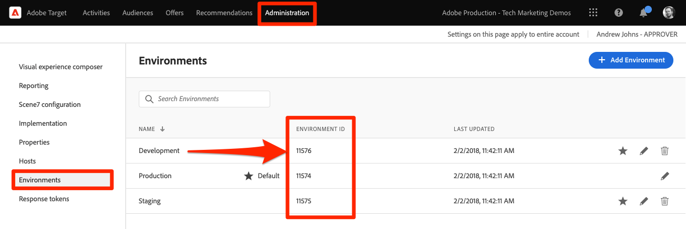

# Configuration d’Adobe Target avec le SDK Web de Platform

Découvrez comment mettre en oeuvre Adobe Target à l’aide du SDK Web Platform. Découvrez comment diffuser des expériences et comment transmettre des paramètres supplémentaires à Target.

[Adobe Target](https://docs.adobe.com/content/help/fr-FR/experience-cloud/user-guides/home.translate.html) est l’application Adobe Experience Cloud qui fournit tout ce dont vous avez besoin pour personnaliser l’expérience de vos clients afin de maximiser les recettes de vos sites web et mobiles, de vos applications et d’autres canaux numériques.

## Objectifs d&#39;apprentissage

À la fin de cette leçon, vous saurez comment :

* Découvrez comment ajouter le fragment de code de pré-masquage du SDK Web Platform pour empêcher le scintillement lors de l’utilisation de Target avec des codes intégrés de balises asynchrones
* Configuration d’un flux de données pour activer la fonctionnalité Target
* Rendre les décisions de personnalisation visuelle au chargement de la page (anciennement appelée &quot;mbox globale&quot;)
* Transmission de données XDM à Target et compréhension du mappage aux paramètres Target
* Transmission de données personnalisées à Target, telles que des paramètres de profil et d’entité
* Validation d’une mise en oeuvre Target avec le SDK Web de Platform


## Conditions préalables

Pour terminer les leçons de cette section, vous devez d’abord :

* Suivez toutes les leçons relatives à la configuration initiale du SDK Web de Platform, y compris la configuration des éléments de données et des règles.
* Vérifiez que vous disposez d’une [Rôle d’éditeur ou d’approbateur](https://experienceleague.adobe.com/docs/target/using/administer/manage-users/enterprise/properties-overview.html#section_8C425E43E5DD4111BBFC734A2B7ABC80).
* Installez le [Extension d’assistance du compositeur d’expérience visuelle](https://experienceleague.adobe.com/docs/target/using/experiences/vec/troubleshoot-composer/vec-helper-browser-extension.html) si vous utilisez le navigateur Google Chrome.
* Découvrez comment configurer des activités dans Target. Si vous avez besoin d’une actualisation, les tutoriels et guides suivants sont utiles pour cette leçon :
   * [Utilisation de l’extension d’assistance du compositeur d’expérience visuelle](https://experienceleague.adobe.com/docs/target/using/experiences/vec/troubleshoot-composer/vec-helper-browser-extension.html)
   * [Utilisation du Compositeur d’expérience visuelle](https://experienceleague.adobe.com/docs/target-learn/tutorials/experiences/use-the-visual-experience-composer.html)
   * [Utilisation du compositeur d’expérience d’après les formulaires](https://experienceleague.adobe.com/docs/target-learn/tutorials/experiences/use-the-form-based-experience-composer.html)
   * [Création d’activités de ciblage d’expérience](https://experienceleague.adobe.com/docs/target-learn/tutorials/activities/create-experience-targeting-activities.html)

## Ajout de la limitation du scintillement

Avant de commencer, déterminez si une solution de gestion du scintillement supplémentaire est nécessaire en fonction de la manière dont la bibliothèque de balises est chargée.

>[!NOTE]
>
>Ce tutoriel utilise la méthode [Site Luma](https://luma.enablementadobe.com/content/luma/us/en.html) qui dispose d’une mise en oeuvre asynchrone des balises et d’une atténuation du scintillement. Cette section sert de référence pour comprendre comment la limitation du scintillement fonctionne avec le SDK Web Platform.


### Mise en oeuvre asynchrone

Lorsqu’une bibliothèque de balises se charge de manière asynchrone, le rendu de la page peut se terminer avant que Target n’ait effectué un échange de contenu. Ce comportement peut entraîner un &quot;scintillement&quot;, dans lequel le contenu par défaut s’affiche brièvement avant d’être remplacé par le contenu personnalisé spécifié par Target. Si vous souhaitez éviter ce scintillement, Adobe recommande d’ajouter un fragment de code de masquage préalable spécial juste avant le code incorporé de balise asynchrone.

Ce fragment est déjà présent sur le site Luma, mais regardons de plus près pour comprendre ce que fait ce code :

```html
<script>
  !function(e,a,n,t){var i=e.head;if(i){
  if (a) return;
  var o=e.createElement("style");
  o.id="alloy-prehiding",o.innerText=n,i.appendChild(o),setTimeout(function(){o.parentNode&&o.parentNode.removeChild(o)},t)}}
  (document, document.location.href.indexOf("mboxEdit") !== -1, ".body { opacity: 0 !important }", 3000);
</script>
```

Le fragment de code de masquage préalable crée une balise de style dans l’en-tête de la page avec la définition CSS de votre choix. Cette balise de style est supprimée lorsqu’une réponse de Target est reçue ou que le délai d’expiration est atteint.

Le comportement de masquage préalable est contrôlé par deux configurations à la fin du fragment de code.

* `body { opacity: 0 !important }` spécifie la définition CSS à utiliser pour le masquage préalable jusqu’au chargement de Target. Par défaut, la page entière est masquée. Vous pouvez mettre à jour cette définition avec les sélecteurs que vous souhaitez pré-masquer, ainsi que la manière dont vous souhaitez les masquer. Vous pouvez inclure plusieurs définitions, car cette valeur est simplement insérée dans la balise de style de masquage préalable. Si vous disposez d’un élément de conteneur facilement identifiable encapsulant le contenu sous votre navigation, vous pouvez utiliser ce paramètre pour limiter le masquage préalable à cet élément de conteneur.
* `3000` spécifie le délai d’expiration en millisecondes pour le masquage préalable. Si aucune réponse de Target n’est reçue avant le délai d’expiration, la balise de style de masquage préalable est supprimée. Il devrait être rare d’atteindre ce délai.

>[!NOTE]
>
>Le fragment de code de prémasquage du SDK Web Platform est légèrement différent de celui utilisé avec la bibliothèque at.js de Target. Veillez à utiliser le fragment de code correct pour le SDK Web de Platform, car il utilise un ID de style différent de `alloy-prehiding`. Si le fragment de code de prémasquage d’at.js est utilisé, il se peut qu’il ne fonctionne pas correctement.

Le fragment de code de masquage préalable est également disponible dans les balises :

1. Accédez au **[!UICONTROL Extensions]** section des balises
1. Sélectionner **[!UICONTROL Configurer]** pour l’extension SDK Web Adobe Experience Platform
1. Sélectionnez la **[!UICONTROL Copie du fragment de code de masquage préalable dans le presse-papiers]** button

   

   >[!NOTE]
   >
   >Le fragment de code de prémasquage par défaut copié à partir de l’extension SDK Web Platform peut inclure une définition CSS qui n’existe pas sur votre site, telle que `.personalization-container { opacity: 0 !important }`. Veillez à vérifier et à modifier le fragment de code de pré-masquage approprié pour votre site.

### Mise en oeuvre synchrone

Adobe recommande de mettre en oeuvre les balises de manière asynchrone, comme illustré sur le site Luma. Cependant, si la bibliothèque de balises est chargée de manière synchrone, le fragment de code de masquage préalable n’est pas obligatoire. Au lieu de cela, le style de pré-masquage est spécifié dans les paramètres de l’extension du SDK Web Platform.

Le style de prémasquage pour les implémentations synchrones peut être configuré comme suit :

1. Accédez au **[!UICONTROL Extensions]** section des balises
1. Sélectionnez la **[!UICONTROL Configurer]** bouton pour l’extension SDK Web Platform
1. Sélectionnez la **[!UICONTROL Modifier le style de prémasquage]** button

   

1. Modifiez la page CSS pour inclure les sélecteurs et les méthodes de masquage que vous souhaitez utiliser, par exemple : `body { opacity: 0 !important }` si vous souhaitez pré-masquer tout le corps de la page.
1. Enregistrer vos modifications et créer une bibliothèque

>[!NOTE]
>
>Le paramètre de style de prémasquage est destiné uniquement à être utilisé pour les implémentations synchrones. Ce style doit être vide ou commenté si vous utilisez une mise en oeuvre asynchrone des balises.

Pour en savoir plus sur la façon dont le SDK Web Platform peut gérer le scintillement, consultez la section du guide : [gestion du scintillement pour les expériences personnalisées](https://experienceleague.adobe.com/docs/experience-platform/edge/personalization/manage-flicker.html).


## Configuration du flux de données

Target doit être activé dans la configuration du flux de données pour que les activités Target puissent être diffusées par le SDK Web Platform.

Pour configurer Target dans le flux de données :

1. Accédez à [Collecte de données](https://experience.adobe.com/#/data-collection)Interface de {target=&quot;blank&quot;}
1. Dans le volet de navigation de gauche, sélectionnez **[!UICONTROL Datastreams]**
1. Sélectionnez la `Luma Web SDK` datastream

   

1. Sélectionnez **[!UICONTROL Ajouter un service]**

   
1. Sélectionner **[!UICONTROL Adobe Target]** comme la propriété **[!UICONTROL Service]**
1. Si vous le souhaitez, renseignez les détails facultatifs de votre mise en oeuvre Target, en suivant les instructions ci-dessous.
1. Sélectionnez **[!UICONTROL Enregistrer]**

   

### Jeton de propriété

Les clients Target Premium ont la possibilité de gérer les autorisations d’utilisateur avec des propriétés. Les propriétés de Target vous permettent de définir des limites autour de l’emplacement où les utilisateurs peuvent exécuter des activités Target. Reportez-vous à la section [Autorisations d’entreprise](https://experienceleague.adobe.com/docs/target/using/administer/manage-users/enterprise/properties-overview.html?lang=fr) pour plus d’informations.

Pour configurer ou rechercher des jetons de propriété, accédez à **Adobe Target** > **[!UICONTROL Administration]** > **[!UICONTROL Propriétés]**. Le `</>` affiche le code d’implémentation. Le `at_property` est le jeton de propriété que vous utiliseriez dans votre flux de données.


>[!NOTE]
>
>Un seul jeton de propriété peut être spécifié par flux de données.


### Identifiant de l’environnement Target

Les [](https://experienceleague.adobe.com/docs/target/using/administer/environments.html)environnements dans Target vous permettent de gérer la mise en œuvre à toutes les étapes de développement. Ce paramètre facultatif spécifie l’environnement Target que vous allez utiliser avec chaque flux de données.

Adobe recommande de définir différemment l’identifiant de l’environnement cible pour chacun de vos flux de données de développement, d’évaluation et de production afin de garder les choses simples.

Pour configurer ou rechercher des ID d’environnement, accédez à **Adobe Target** > **[!UICONTROL Administration]** > **[!UICONTROL Environnements]**.



>[!NOTE]
>
>Si aucun identifiant d’environnement cible n’est spécifié, l’environnement cible de production est utilisé.

### Espace de noms d’ID tiers de Target

Ce paramètre facultatif vous permet de spécifier le symbole d’identité à utiliser pour l’identifiant tiers Target. Target prend uniquement en charge la synchronisation des profils sur un seul symbole d’identité ou espace de noms. Pour plus d’informations, reportez-vous à la section [Synchronisation des profils en temps réel pour mbox3rdPartyId](https://experienceleague.adobe.com/docs/target/using/audiences/visitor-profiles/3rd-party-id.html) de Target.

Les symboles d’identité se trouvent dans la liste des identités sous **Collecte de données** > **[!UICONTROL Client]** > **[!UICONTROL Identités]**.


Pour les besoins de ce tutoriel à l’aide du site Luma, utilisez le symbole d’identité. `lumaCrmId` configuré pendant la leçon sur [Identités](configure-identities.md).


## Rendu des décisions de personnalisation visuelle

Tout d’abord, vous devez comprendre la terminologie utilisée dans les interfaces de Target et de balises.

* **Activité**: Ensemble d’expériences ciblées sur une ou plusieurs audiences. Par exemple, un simple test A/B peut être une activité avec deux expériences.
* **Expérience**: Ensemble d’actions ciblées sur un ou plusieurs emplacements ou portées de décision.
* **Portée de décision**: Emplacement où une expérience Target est diffusée. Les portées de décision sont équivalentes à des &quot;mbox&quot; si vous connaissez l’utilisation d’anciennes versions de Target.
* **Décision de personnalisation**: Une action que le serveur détermine doit être appliquée. Ces décisions peuvent être basées sur les critères d’audience et la hiérarchisation des activités Target.
* **Proposition**: Résultat des décisions prises par le serveur et qui sont diffusées dans la réponse du SDK Web Platform. Par exemple, la permutation d’une image de bannière est une proposition.

### Mettre à jour la règle de chargement de page

Les décisions de personnalisation visuelle issues de Target sont diffusées par le SDK Web de Platform, si Target est activé dans le flux de données. Cependant, _ils ne sont pas rendus automatiquement_. Vous devez modifier la règle de chargement de page globale pour activer le rendu automatique.

1. Dans le [Collecte de données](https://experience.adobe.com/#/data-collection)Interface {target=&quot;blank&quot;}, ouvrez la propriété de balise que vous utilisez pour ce tutoriel.
1. Ouvrez le `all pages - library load - AA & AT` règle
1. Sélectionnez la `Adobe Experience Platform Web SDK - Send event` action
1. Activer **[!UICONTROL Rendu des décisions de personnalisation visuelle]** avec la case à cocher

   

1. Enregistrez vos modifications, puis créez-les dans votre bibliothèque.

Le paramètre de rendu des décisions de personnalisation visuelle oblige le SDK Web de Platform à appliquer automatiquement toutes les modifications spécifiées à l’aide du compositeur d’expérience visuelle de Target ou de la &quot;mbox globale&quot;.

>[!NOTE]
>
>En règle générale, la variable [!UICONTROL Rendu des décisions de personnalisation visuelle] ne doit être activé que pour une seule action Envoyer l’événement par chargement de page complet. Si ce paramètre est activé pour plusieurs actions Envoyer l’événement , les demandes de rendu suivantes sont ignorées.

Si vous préférez effectuer vous-même le rendu ou agir sur ces décisions à l’aide du code personnalisé, vous pouvez laisser la variable [!UICONTROL Rendu des décisions de personnalisation visuelle] désactivé. Le SDK Web Platform est flexible et offre cette fonctionnalité pour vous donner un contrôle total. Pour plus d’informations sur les [rendu manuel de contenu personnalisé](https://experienceleague.adobe.com/docs/experience-platform/edge/personalization/rendering-personalization-content.html).

### Configuration d’une activité Target avec le compositeur d’expérience visuelle

Maintenant que la partie de mise en oeuvre de base est terminée, créez une activité de ciblage d’expérience (XT) dans Target pour vérifier que tout fonctionne correctement. Vous pouvez vous reporter au tutoriel de Target pour [création d’activités de ciblage d’expérience](https://experienceleague.adobe.com/docs/target-learn/tutorials/activities/create-experience-targeting-activities.html) si vous avez besoin d&#39;aide.

>[!NOTE]
>
>Si vous utilisez Google Chrome comme navigateur, la variable [Extension d’assistance du Compositeur d’Expérience Visuelle (VEC)](https://experienceleague.adobe.com/docs/target/using/experiences/vec/troubleshoot-composer/vec-helper-browser-extension.html?lang=en) est requis pour charger le site correctement en vue de le modifier dans le VEC.

1. Accès à Target
1. Créez une activité de ciblage d’expérience (XT) à l’aide de la page d’accueil Luma pour l’URL d’activité.

   

1. Modifiez la page, par exemple modifiez le texte sur la bannière de page d’accueil.

   

1. Choisissez Adobe Analytics comme source de création de rapports avec la suite de rapports appropriée et la mesure Commandes comme objectif.

   >[!NOTE]
   >
   >Si vous n’utilisez pas Adobe Analytics, sélectionnez Target comme source de création de rapports et choisissez une autre mesure comme **Engagement > Pages vues** au lieu de . Une mesure d’objectif est requise pour enregistrer et prévisualiser l’activité.

1. Enregistrement de l’activité
1. Si vos modifications vous conviennent, vous pouvez activer votre activité. Sinon, si vous souhaitez prévisualiser l’expérience sans l’activer, vous pouvez copier la variable [URL d’aperçu de l’assurance qualité](https://experienceleague.adobe.com/docs/target/using/activities/activity-qa/activity-qa.html).
1. Chargez la page d’accueil de Luma et vos modifications devraient être appliquées.
1. Au bout de quelques heures, vous devriez être en mesure d’afficher les données d’activité et les conversions de Target dans Adobe Analytics. Reportez-vous au Guide de Target pour plus d’informations sur [Rapports Analytics for Target (A4T)](https://experienceleague.adobe.com/docs/target/using/integrate/a4t/reporting.html?lang=en).


### Validation avec Debugger

Si vous configurez une activité, le rendu du contenu doit s’afficher sur la page. Cependant, même si aucune activité n’est active, vous pouvez également consulter l’appel réseau Envoyer l’événement pour confirmer que Target est correctement configuré.

>[!CAUTION]
>
>Si vous utilisez Google Chrome et que vous disposez de la variable [Extension d’assistance du Compositeur d’Expérience Visuelle (VEC)](https://experienceleague.adobe.com/docs/target/using/experiences/vec/troubleshoot-composer/vec-helper-browser-extension.html?lang=en) installé, assurez-vous que la variable **Injection de bibliothèques Target** est désactivé. L’activation de ce paramètre entraîne des requêtes Target supplémentaires.

1. Ouvrez l’extension de navigateur du débogueur Adobe Experience Platform
1. Accédez au [Site de démonstration Luma](https://luma.enablementadobe.com/content/luma/us/en.html) et utilisez le débogueur pour [basculez la propriété de balise sur le site sur votre propre propriété de développement.](validate-with-debugger.md#use-the-experience-platform-debugger-to-map-to-your-tags-property)
1. Rechargez la page
1. Sélectionnez la **[!UICONTROL Réseau]** dans le débogueur
1. Filtrer par **[!UICONTROL SDK Web Adobe Experience Platform]**
1. Sélectionner la valeur de la ligne d’événements pour le premier appel

   

1. Notez qu’il existe des clés sous `query` > `personalization` et  `decisionScopes` a une valeur de `__view__`. Cette portée équivaut à la &quot;mbox globale&quot; de Target. Cet appel du SDK Web Platform a demandé des décisions à Target.

   

1. Fermez la superposition et sélectionnez les détails de l’événement pour le deuxième appel réseau. Cet appel n’est présent que si Target a renvoyé une activité.
1. Notez que des détails sur l’activité et l’expérience sont renvoyés par Target. Cet appel de SDK Web Platform envoie une notification indiquant qu’une activité Target a été rendue à l’utilisateur et incrémente une impression.

   

## Configuration et rendu d’une portée de décision personnalisée

Les portées de décision personnalisées (anciennement appelées &quot;mbox&quot;) peuvent être utilisées pour diffuser du contenu JSON ou HTML de manière structurée à l’aide du compositeur d’expérience d’après les formulaires Target. Le contenu diffusé sur l’une de ces portées personnalisées n’est pas rendu automatiquement par le SDK Web Platform.

### Ajouter une portée à la règle de chargement de page

Modifiez votre règle de chargement de page pour ajouter une portée de décision personnalisée :

1. Ouvrez le `all pages - library load - AA & AT` règle
1. Sélectionnez la `Adobe Experience Platform Web SDK - Send Event` action
1. Ajoutez une ou plusieurs portées que vous souhaitez utiliser. Pour cet exemple, utilisez `homepage-hero`.

   

1. Enregistrer vos modifications et créer dans votre bibliothèque

>[!TIP]
>
>Pour ce tutoriel, vous utiliserez une seule portée définie manuellement à des fins de démonstration. Si vous décidez d’utiliser plusieurs portées de décision destinées à des pages spécifiques, vous devez envisager d’utiliser un élément de données qui renvoie un tableau de portées de manière conditionnelle en fonction du chemin de page. Cette approche vous permet de maintenir votre mise en oeuvre simple et évolutive.

### Traitement de la réponse de Target

Maintenant que vous avez configuré le SDK Web de Platform pour demander du contenu pour le `homepage-hero` , vous devez faire quelque chose avec la réponse. L’extension de balise SDK Web Platform fournit une [!UICONTROL Envoyer l’événement terminé] qui peut être utilisé pour déclencher immédiatement une nouvelle règle lors d’une réponse d’une [!UICONTROL Envoyer un événement] action est reçue.

1. Créez une règle appelée `homepage - send event complete - render homepage-hero`.
1. Ajoutez un événement à la règle. Utilisez la variable **SDK Web Adobe Experience Platform** et l’extension **[!UICONTROL Envoyer l’événement terminé]** type d’événement.
1. Ajoutez une condition pour restreindre la règle à la page d’accueil de Luma (chemin sans chaîne de requête égal à). `/content/luma/us/en.html`).
1. Ajoutez une action à la règle. Utilisez la variable **Core** extension et **Code personnalisé** type d’action.

   

   >[!TIP]
   >
   >Attribuez à vos événements de règle, conditions et actions des noms explicites au lieu d’utiliser les noms par défaut. Des noms de composants de règle robustes rendent les résultats de recherche beaucoup plus utiles.

1. Saisissez le code personnalisé pour lire et agir sur les propositions renvoyées par la réponse du SDK Web Platform. Le code personnalisé de cet exemple utilise l’approche décrite dans le guide pour [rendu manuel de contenu personnalisé](https://experienceleague.adobe.com/docs/experience-platform/edge/personalization/rendering-personalization-content.html?lang=en#manually-rendering-content). Le code a été adapté pour la fonction `homepage-hero` Exemple de portée à l’aide d’une action de règle de balise.

   ```javascript
   var propositions = event.propositions;
   
   var heroProposition;
   if (propositions) {
      // Find the hero proposition, if it exists.
      for (var i = 0; i < propositions.length; i++) {
         var proposition = propositions[i];
         if (proposition.scope === "homepage-hero") {
            heroProposition = proposition;
            break;
         }
      }
   }
   
   var heroHtml;
   if (heroProposition) {
      // Find the item from proposition that should be rendered.
      // Rather than assuming there a single item that has HTML
      // content, find the first item whose schema indicates
      // it contains HTML content.
      for (var j = 0; j < heroProposition.items.length; j++) {
         var heroPropositionItem = heroProposition.items[j];
         if (heroPropositionItem.schema === "https://ns.adobe.com/personalization/html-content-item") {
            heroHtml = heroPropositionItem.data.content;
            break;
         }
      }
   }
   
   if (heroHtml) {
      // Hero HTML exists. Time to render it.
      var heroElement = document.querySelector(".heroimage");
      heroElement.innerHTML = heroHtml;
      // For this example, we assume there is only a signle place to update in the HTML.
   }
   
   // Send a "display" event 
   alloy("sendEvent", {
      xdm: {
         eventType: "display",
         _experience: {
            decisioning: {
               propositions: [
                  {
                     id: heroProposition.id,
                     scope: heroProposition.scope,
                     scopeDetails: heroProposition.scopeDetails
                  }
               ]
            }
         }
      }
   });
   ```

1. Enregistrer vos modifications et créer dans votre bibliothèque
1. Chargez la page d’accueil de Luma quelques fois, ce qui devrait suffire à créer la nouvelle `homepage-hero` enregistrement de la portée de décision dans l’interface de Target.

### Configuration d’une activité Target avec le compositeur d’expérience d’après les formulaires

Maintenant que vous disposez d’une règle pour effectuer le rendu manuel d’une portée de décision personnalisée, vous pouvez créer une autre activité de ciblage d’expérience (XT) dans Target. Cette fois, utilisez le compositeur d’expérience d’après les formulaires.

1. Ouvrir [Adobe Target](https://experience.adobe.com/target)
1. Désactiver l’activité utilisée pour la leçon précédente
1. Créer une activité de ciblage d’expérience (XT) à l’aide de l’option Compositeur d’expérience d’après les formulaires

   

1. Sélectionnez la **`homepage-hero`** emplacement dans la liste déroulante des emplacements et **[!UICONTROL Créer une offre de HTML]** dans la liste déroulante de contenu. Si l’emplacement n’est pas disponible, vous pouvez le saisir. Target renseigne régulièrement de nouveaux noms d’emplacement après avoir reçu des demandes pour cet emplacement ou cette portée.

   

1. Collez le code suivant dans la zone de contenu. Ce code est une bannière principale de base avec une image d’arrière-plan différente :

   ```html
   <div class="we-HeroImage jumbotron" style="background-image: url('/content/luma/us/en/women/_jcr_content/root/hero_image.coreimg.jpeg');">
      <div class="container cq-dd-image">
         <div class="we-HeroImage-wrapper">
            <p class="h3">New Luma Yoga Collection</p>
            <strong class="we-HeroImage-title h1">Be active with style&nbsp;</strong>
            <p>
               <a class="btn btn-primary btn-action" href="/content/luma/us/en/products.html" role="button">Shop Now</a>
            </p>
         </div>
      </div>
   </div>
   ```

1. Sur le [!UICONTROL Objectifs et paramètres] , choisissez Adobe Target comme source de création de rapports et [!UICONTROL Engagement] > [!UICONTROL Pages vues] comme objectif
1. Enregistrement de l’activité
1. Si vos modifications vous conviennent, vous pouvez activer votre activité. Sinon, si vous souhaitez prévisualiser l’expérience sans l’activer, vous pouvez copier la variable [URL d’aperçu de l’assurance qualité](https://experienceleague.adobe.com/docs/target/using/activities/activity-qa/activity-qa.html).
1. Chargez la page d’accueil de Luma et vos modifications devraient être appliquées.

>[!NOTE]
>
>L’objectif de conversion &quot;A cliqué sur la mbox&quot; ne fonctionne pas automatiquement. Comme le SDK Web Platform ne rend pas automatiquement les portées personnalisées, il ne suit pas les clics vers les emplacements que vous choisissez d’appliquer au contenu. Vous pouvez créer votre propre suivi des clics pour chaque portée à l’aide du &quot;clic&quot;. `eventType` avec le `_experience` détails à l’aide de `sendEvent` action.

### Validation avec Debugger

Si vous avez activé votre activité, le rendu de votre contenu doit s’afficher sur la page. Cependant, même si aucune activité n’est active, vous pouvez également consulter la variable [!UICONTROL Envoyer un événement] appel réseau pour confirmer que Target demande du contenu pour vos portées personnalisées.

1. Ouvrez l’extension de navigateur du débogueur Adobe Experience Platform
1. Accédez au [Site de démonstration Luma](https://luma.enablementadobe.com/content/luma/us/en.html) et utilisez le débogueur pour [basculez la propriété de balise sur le site sur votre propre propriété de développement.](validate-with-debugger.md#use-the-experience-platform-debugger-to-map-to-your-tags-property)
1. Rechargez la page
1. Sélectionnez la **[!UICONTROL Réseau]** dans le débogueur
1. Filtrer par **[!UICONTROL SDK Web Adobe Experience Platform]**
1. Sélectionner la valeur de la ligne d’événements pour le premier appel

   

1. Notez qu’il existe des clés sous `query` > `personalization` et  `decisionScopes` a une valeur de `__view__` comme avant, mais maintenant il y a aussi un `homepage-hero` inclus. Cet appel du SDK Web Platform a demandé des décisions à Target pour les modifications effectuées à l’aide du VEC et du `homepage-hero` emplacement.

   

1. Fermez la superposition et sélectionnez les détails de l’événement pour le deuxième appel réseau. Cet appel n’est présent que si Target a renvoyé une activité.
1. Notez que des détails sur l’activité et l’expérience sont renvoyés par Target. Cet appel de SDK Web Platform envoie une notification indiquant qu’une activité Target a été rendue à l’utilisateur et incrémente une impression.

   

## Transmission de données supplémentaires à Target

Dans cette section, vous allez transmettre des données spécifiques à Target et examiner de plus près la façon dont les données XDM sont mappées aux paramètres Target.

Certains points de données peuvent s’avérer utiles à Target qui ne sont pas mappés à partir de l’objet XDM. Ces paramètres Target spéciaux incluent :

* [Attributs de profil](https://experienceleague.adobe.com/docs/target/using/implement-target/before-implement/methods/in-page-profile-attributes.html?lang=en)
* [Attributs d’entité Recommendations](https://experienceleague.adobe.com/docs/target/using/recommendations/entities/entity-attributes.html?lang=en)
* [Paramètres réservés Recommendations](https://experienceleague.adobe.com/docs/target/using/recommendations/plan-implement.html?lang=en#pass-behavioral)
* Valeurs de catégorie pour [affinité catégorielle](https://experienceleague.adobe.com/docs/target/using/audiences/visitor-profiles/category-affinity.html?lang=en)

### Création d’éléments de données pour les paramètres Target

Tout d’abord, vous allez configurer quelques éléments de données supplémentaires pour un attribut de profil, un attribut d’entité, une valeur de catégorie, puis construire la variable `data` objet utilisé pour transmettre des données autres que XDM :

* **`target.entity.id`** mappé à `digitalData.product.0.productInfo.sku`
* **`target.entity.name`** mappé à `digitalData.product.0.productInfo.title`
* **`target.user.categoryId`** en utilisant le code personnalisé suivant pour analyser l’URL du site pour la catégorie de niveau supérieur :

   ```javascript
   var cat = location.pathname.split(/[/.]+/);
   if (cat[5] == 'products') {
      return (cat[6]);
   } else if (cat[5] != 'html') { 
      return (cat[5]);
   }
   ```

* **`data.content`** à l’aide du code personnalisé suivant :

   ```javascript
   var data = {
      __adobe: {
         target: {
            "entity.id": _satellite.getVar("target.entity.id"),
            "entity.name": _satellite.getVar("target.entity.name"),
            "profile.loggedIn": _satellite.getVar("user.profile.attributes.loggedIn"),
            "user.categoryId": _satellite.getVar("target.user.categoryId")
         }
      }
   }
   return data;
   ```

### Mettre à jour la règle de chargement de page

La transmission de données supplémentaires pour Target en dehors de l’objet XDM nécessite la mise à jour de toutes les règles applicables. Pour cet exemple, la seule modification que vous devez apporter est d’inclure la nouvelle **data.content** élément de données à la règle de chargement de page générique et à la règle de consultation de page de produit.

1. Ouvrez le `all pages - library load - AA & AT` règle
1. Sélectionnez la `Adobe Experience Platform Web SDK - Send event` action
1. Ajoutez la variable `data.content` élément de données vers le champ de données

   

1. Enregistrer vos modifications et créer dans votre bibliothèque
1. Répétez les étapes 1 à 4 pour le **consultation de produit - chargement de bibliothèque - AA** règle

>[!NOTE]
>
>L’exemple ci-dessus utilise une `data` qui n’est pas entièrement renseigné sur tous les types de page. Les balises gèrent cette situation de manière appropriée et omettent les clés dont la valeur est indéterminée. Par exemple : `entity.id` et `entity.name` ne serait transmis sur aucune page à l’exception des détails du produit.

### Validation avec le débogueur

Maintenant que les règles sont mises à jour, vous pouvez vérifier si les données sont transmises correctement à l’aide du débogueur Adobe.

1. Accédez au [Site de démonstration Luma](https://luma.enablementadobe.com/content/luma/us/en.html) et se connecter à l’aide de l’e-mail `test@adobe.com` et mot de passe `test`
1. Accédez à une page de détails de produit.
1. Ouvrez l’extension de navigateur du débogueur Adobe Experience Platform et [basculez la propriété de balise sur votre propre propriété de développement.](validate-with-debugger.md#use-the-experience-platform-debugger-to-map-to-your-tags-property)
1. Rechargez la page
1. Sélectionnez la **Réseau** dans le débogueur et filtrez par **SDK Web Adobe Experience Platform**
1. Sélectionner la valeur de la ligne d’événements pour le premier appel
1. Notez qu’il existe des clés sous `data` > `__adobe` > `target` et ils contiennent des informations sur le produit, la catégorie et l’état de connexion.

   

### Validation dans l’interface de Target

Ensuite, vérifiez dans l’interface de Target que les données ont été reçues et qu’elles peuvent être utilisées dans les audiences et les activités. Les données XDM sont automatiquement mappées aux paramètres Target personnalisés. Vous pouvez vérifier que les données XDM ont été reçues par Target et sont disponibles en créant une audience.

1. Ouvrir [Adobe Target](https://experience.adobe.com/target)
1. Accédez au **[!UICONTROL Audiences]** section
1. Créez une audience et sélectionnez l’option **[!UICONTROL Personnalisé]** type d&#39;attribut
1. Recherchez le **[!UICONTROL Paramètre]** champ pour `web`. Le menu déroulant doit être rempli avec tous les champs XDM liés aux détails de la page web.

Ensuite, vérifiez que l’attribut de profil d’état de connexion a bien été transmis.

1. Choisissez la **[!UICONTROL Profil du visiteur]** type d&#39;attribut
1. Recherchez `loggedIn`. Si l’attribut est disponible dans le menu déroulant, il a été correctement transmis à Target. Les nouveaux attributs peuvent prendre plusieurs minutes pour être disponibles dans l’interface utilisateur de Target.

Si vous disposez de Target Premium, vous pouvez également vérifier que les données d’entité ont été transmises correctement et que les données de produit ont été écrites dans le catalogue de produits Recommendations.

1. Accédez au **[!UICONTROL Recommendations]** section
1. Sélectionner **[!UICONTROL Recherche catalogue]** dans le volet de navigation de gauche
1. Recherchez le SKU du produit ou le nom du produit que vous avez visité précédemment sur le site Luma. Le produit doit apparaître dans le catalogue de produits. La recherche de nouveaux produits dans le catalogue de produits Recommendations peut prendre plusieurs minutes.

Maintenant que vous avez terminé cette leçon, vous devez disposer d’une mise en oeuvre opérationnelle d’Adobe Target à l’aide du SDK Web Platform.

[Suivant : ](setup-consent.md)

>[!NOTE]
>
>Merci d’avoir consacré du temps à l’apprentissage du SDK Web Adobe Experience Platform. Si vous avez des questions, souhaitez partager des commentaires généraux ou avez des suggestions sur le contenu futur, partagez-les à ce sujet. [Article de discussion de la communauté Experience League](https://experienceleaguecommunities.adobe.com/t5/adobe-experience-platform-launch/tutorial-discussion-implement-adobe-experience-cloud-with-web/td-p/444996)
