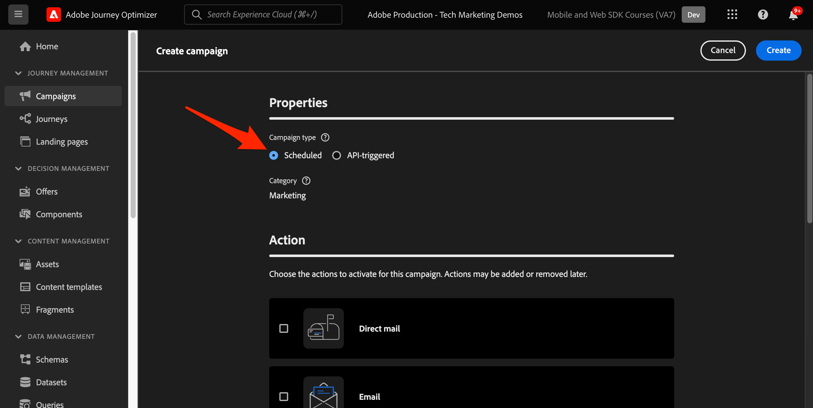
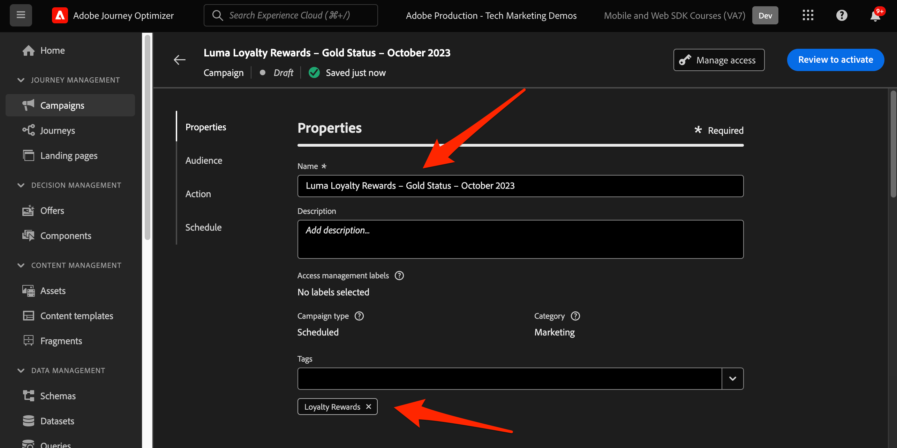

# Configuration du canal web Journey Optimizer avec le SDK web

Découvrez comment mettre en oeuvre le [canal web](https://experienceleague.adobe.com/en/docs/journey-optimizer/using/web/get-started-web) de Adobe Journey Optimizer à l’aide du SDK Web de Adobe Experience Platform. Cette leçon porte sur les conditions préalables fondamentales pour les canaux web, les étapes détaillées de configuration et une présentation approfondie d’un cas d’utilisation centré sur l’état de fidélité.

En suivant cette leçon, les utilisateurs de Journey Optimizer sont équipés pour utiliser le canal web pour une personnalisation en ligne avancée à l’aide du concepteur web de Journey Optimizer.

## Objectifs d’apprentissage

À la fin de cette leçon, vous pouvez :

* Comprendre la fonction et l’importance du SDK Web pour diffuser l’expérience du canal web.
* Découvrez le processus de création d’une campagne de canal web du début à la fin à l’aide de l’exemple de cas d’utilisation des récompenses de fidélité Luma.
* Configurez les propriétés, les actions et les plannings de campagne dans l’interface.
* Découvrez les fonctionnalités et les avantages de l’extension d’assistance pour l’édition visuelle de Adobe Experience Cloud.
* Découvrez comment modifier le contenu d’une page web, y compris les images, les en-têtes et d’autres éléments, à l’aide du concepteur web.
* Découvrez comment insérer des offres dans une page web à l’aide du composant de décision Offre.
* Familiarisez-vous avec les bonnes pratiques pour garantir la qualité et le succès d’une campagne de canal web.

## Conditions préalables

Pour terminer les leçons de cette section, vous devez d’abord :

* Suivez toutes les leçons relatives à la configuration initiale du SDK Web de Platform, y compris la configuration des éléments de données et des règles.
* Assurez-vous que la version de votre extension de balises SDK Web Adobe Experience Platform est 2.16 ou supérieure.
* Si vous utilisez le concepteur web de Journey Optimizer pour créer votre expérience de canal web, vérifiez que vous utilisez les navigateurs Google Chrome ou Microsoft® Edge.
* Assurez-vous également que vous avez téléchargé et activé l’ [extension de navigateur de l’assistant d’édition visuelle de Adobe Experience Cloud](https://chromewebstore.google.com/detail/adobe-experience-cloud-vi/kgmjjkfjacffaebgpkpcllakjifppnca).
* Assurez-vous que les cookies tiers sont autorisés dans votre navigateur. Il peut être nécessaire de désactiver également tous les bloqueurs d’annonces dans votre navigateur.

  >[!CAUTION]
  >
  > Dans le concepteur web de Journey Optimizer, certains sites web peuvent ne pas s’ouvrir de manière fiable pour l’une des raisons suivantes :
  > 
  > 1. Le site web a des politiques de sécurité rigoureuses.
  > 1. Le site web est incorporé dans un iframe.
  > 1. Le site d’assurance qualité ou d’évaluation du client n’est pas accessible en externe (il s’agit d’un site interne).

* Lors de la création d’expériences web et de l’inclusion de contenu à partir de la bibliothèque Adobe Experience Manager Assets Essentials, il est nécessaire de [configurer le sous-domaine pour publier ce contenu](https://experienceleague.adobe.com/en/docs/journey-optimizer/using/web/configure-web-channel/web-delegated-subdomains).
* Si vous utilisez la fonction d’expérimentation de contenu, assurez-vous que votre jeu de données web est également inclus dans votre configuration de création de rapports.
* Actuellement, deux types d’implémentations sont pris en charge pour activer la création et la diffusion de campagnes de canal web sur vos propriétés web :
   * Côté client uniquement : pour modifier votre site web, vous devez mettre en oeuvre le SDK Web de Adobe Experience Platform.
   * Mode hybride : vous pouvez utiliser l’API du serveur Edge Network Platform pour demander une personnalisation côté serveur. La réponse de l’API est ensuite fournie au SDK Web de Adobe Experience Platform pour le rendu des modifications côté client. Pour plus d’informations, consultez la documentation de l’API Adobe Experience Platform Edge Network Server. Vous trouverez des détails supplémentaires et des exemples de mise en oeuvre pour le mode hybride dans cet article de blog.

  >[!NOTE]
  >
  >La mise en oeuvre côté serveur uniquement n’est actuellement pas prise en charge.

## Terminologie

Tout d’abord, vous devez comprendre la terminologie utilisée dans les campagnes de canal web.

* **Canal web** : support pour la communication ou la diffusion de contenu via le web. Dans le cadre de ce guide, il fait référence au mécanisme par lequel le contenu personnalisé est diffusé aux visiteurs du site Web à l’aide du SDK Web Platform, dans Adobe Journey Optimizer.
* **Web surface** : fait référence à une propriété web identifiée par une URL où le contenu est diffusé. Elle peut englober une ou plusieurs pages web.
* **Concepteur web de Journey Optimizer** : outil ou interface spécifique au sein de Journey Optimizer dans lequel les utilisateurs peuvent concevoir leurs expériences de canal web.
* **Adobe Experience Cloud Visual Editing Helper** : extension de navigateur qui aide à la modification et à la conception visuelles d’expériences de canal web.
* **Datastream** : configuration au sein du service Adobe Experience Platform qui garantit que les expériences de canal web peuvent être diffusées.
* **Stratégie de fusion** : configuration qui garantit l’activation et la publication précises des campagnes entrantes.
* **Audience** : segment spécifique d’utilisateurs ou de visiteurs du site qui répondent à certains critères.
* **Web designer** : interface ou outil qui aide à l’édition et à la conception visuelles d’expériences web sans creuser profondément le code.
* **Éditeur d’expression** : outil au sein du concepteur web qui permet aux utilisateurs d’ajouter une personnalisation au contenu web, potentiellement en fonction d’attributs de données ou d’autres critères.
* **Composant de décision sur les offres** : composant du concepteur web qui permet de décider quelle offre est la mieux adaptée pour être affichée pour un visiteur spécifique en fonction de la gestion des décisions.
* **Expérience de contenu** : méthode permettant de tester différentes variations de contenu pour déterminer celle qui fonctionne le mieux en termes de mesure souhaitée, comme les clics entrants.
* **Traitement** : dans le cadre d’expériences de contenu, un traitement fait référence à une variation spécifique de contenu testé par rapport à un autre.
* **Simulation** : mécanisme d’aperçu permettant de visualiser l’expérience du canal web avant de l’activer pour les audiences en direct.

## Configuration du flux de données

Vous avez déjà ajouté le service Adobe Experience Platform à votre flux de données. Vous devez maintenant activer l’option Adobe Journey Optimizer pour pouvoir diffuser des expériences de canal web.

Pour configurer Adobe Journey Optimizer dans le flux de données :

1. Accédez à l’interface [Collecte de données](https://experience.adobe.com/#/data-collection){target="blank"}.
1. Dans le volet de navigation de gauche, sélectionnez **[!UICONTROL Datastreams]**.
1. Sélectionnez le flux de données SDK Web Luma créé précédemment.

   

1. Sélectionnez **[!UICONTROL Edit]** dans le service Adobe Experience Platform.

   

1. Cochez la case **[!UICONTROL Adobe Journey Optimizer]** .

   

1. Sélectionnez **[!UICONTROL Enregistrer]**.

Cela permet de s’assurer que les événements entrants pour Journey Optimizer sont correctement gérés par l’Edge Network Adobe Experience Platform.

## Configuration de la stratégie de fusion

Assurez-vous qu’une stratégie de fusion est définie avec l’option **[!UICONTROL Active-On-Edge Merge Policy]** activée. Cette option de stratégie de fusion est utilisée par les canaux entrants de Journey Optimizer pour assurer l’activation et la publication précises des campagnes entrantes sur le serveur Edge.

Pour configurer l’option dans la stratégie de fusion, procédez comme suit :

1. Accédez à la page **[!UICONTROL Client]** > **[!UICONTROL Profils]** dans l’interface de l’Experience Platform ou de Journey Optimizer.
1. Sélectionnez l’onglet **[!UICONTROL Stratégies de fusion]** .
1. Sélectionnez votre stratégie (il est généralement préférable d’utiliser la stratégie [!UICONTROL Default Timebased]) et activez l’option **[!UICONTROL Active-On-Edge Merge Policy]** à l’étape **[!UICONTROL Configurer]** .

   

## Configuration du jeu de données web pour l’expérimentation de contenu

Pour utiliser des expériences de contenu dans des campagnes de canal web, vous devez vous assurer que le jeu de données web utilisé est également inclus dans votre configuration de création de rapports. Le système de création de rapports Journey Optimizer utilise le jeu de données en lecture seule pour renseigner les rapports d’expérimentation de contenu d’usine.

[L’ajout de jeux de données pour la création de rapports d’expérience de contenu est détaillé dans cette section](https://experienceleague.adobe.com/en/docs/journey-optimizer/using/content-management/content-experiment/reporting-configuration#add-datasets).

## Présentation du cas d’utilisation - Loyalty Rewards

Dans cette leçon, un exemple de cas d’utilisation Loyalty Rewards est utilisé pour décrire en détail la mise en oeuvre d’une expérience de canal web à l’aide du SDK Web.

Ce cas pratique vous permet de mieux comprendre comment Journey Optimizer peut vous aider à offrir à vos clients les meilleures expériences entrantes, à l’aide des campagnes Journey Optimizer et du concepteur web.

Comme ce tutoriel est destiné aux implémentateurs, il est intéressant de noter que cette leçon implique un travail d’interface substantiel dans Journey Optimizer. Bien que ces tâches d’interface soient généralement gérées par les marketeurs, il peut s’avérer utile pour les implémenteurs d’obtenir des informations sur le processus, même s’ils ne sont généralement pas responsables de la création de campagnes de canal web.

### Créer une campagne de récompenses de fidélité

Maintenant que vous avez ingéré nos exemples de données de fidélité et que vous avez créé notre segment, créez la campagne du canal web Loyalty Rewards dans Adobe Journey Optimizer.

Pour créer l&#39;exemple de campagne :

1. Ouvrez l’interface [Journey Optimizer](https://experience.adobe.com/journey-optimizer/home){target="_blank"}

   >[!NOTE]
   >
   > Les schémas, les jeux de données et les audiences peuvent également être créés dans l’interface de Journey Optimizer, car il s’agit de concepts d’Experience Platform courants.

1. Accédez à **[!UICONTROL Gestion des Parcours]** > **[!UICONTROL Campagnes]** dans le volet de navigation de gauche.
1. Cliquez sur **[!UICONTROL Créer une campagne]** dans le coin supérieur droit.
1. Dans la section **[!UICONTROL Propriétés]**, indiquez quand exécuter la campagne. Pour le cas d’utilisation des Loyalty Rewards, sélectionnez **Scheduled**.

   

1. Dans la section **[!UICONTROL Actions]** , sélectionnez le **[!UICONTROL canal web]**. En tant que **[!UICONTROL surface Web]**, sélectionnez **[!UICONTROL URL de page]**.

   >[!NOTE]
   >
   >Une surface Web fait référence à une propriété Web identifiée par une URL où le contenu est diffusé. Il peut correspondre à une URL de page unique ou englober plusieurs pages, ce qui vous permet d’appliquer des modifications sur une ou plusieurs pages web.

1. Sélectionnez l’option de surface Web **[!UICONTROL URL de page]** pour déployer l’expérience sur une page pour cette campagne. Saisissez l’URL de la page Luma, `https://luma.enablementadobe.com/content/luma/us/en.html`

1. Une fois la surface web définie, sélectionnez **[!UICONTROL Créer]**.

   

1. Ajoutez maintenant des détails supplémentaires à la nouvelle campagne de canal web. Tout d’abord, nommez la campagne. Appelez-le `Luma Loyalty Rewards – Gold Status`. Vous pouvez éventuellement ajouter une description à la campagne. Ajoutez également **[!UICONTROL Balises]** pour améliorer la taxonomie globale de la campagne.

   

1. Par défaut, la campagne est active pour tous les visiteurs du site. Pour les besoins de ce cas d’utilisation, seuls les membres récompensant leur statut d’or doivent voir l’expérience. Pour activer cette fonction, cliquez sur **[!UICONTROL Sélectionner l’audience]** et choisissez l’audience `Luma Loyalty Rewards – Gold Status`.

1. Dans le champ **[!UICONTROL Identity Namespace]** , sélectionnez l’espace de noms permettant d’identifier les individus dans le segment sélectionné. Puisque vous déployez la campagne sur le site Luma, vous pouvez choisir l’espace de noms ECID. Les profils de l’audience `Luma Loyalty Rewards – Gold Status` ne disposant pas de l’espace de noms ECID parmi leurs différentes identités ne sont pas ciblés par la campagne de canal web.

   

1. Planifiez la campagne pour qu’elle commence à la date d’aujourd’hui à l’aide de l’option **[!UICONTROL Démarrage de la campagne]** et qu’elle se termine par une semaine à l’aide de l’option **[!UICONTROL Fin de la campagne]**.

   

>[!NOTE]
>
>Gardez à l’esprit que, pour les campagnes de canal web, l’expérience web s’affiche lorsque le visiteur ouvre la page. Par conséquent, contrairement aux autres types de campagnes dans Adobe Journey Optimizer, la section **[!UICONTROL Déclencheurs d’action]** ne peut pas être configurée.

### Expérience avec du contenu Loyalty Rewards

Si vous faites défiler vers le haut, dans la section **[!UICONTROL Action]**, vous pouvez éventuellement créer une expérience pour tester quel contenu fonctionne le mieux pour l’audience `Luma Loyalty Rewards – Gold Status`. Créons et testons deux traitements en tant que composant de la configuration de l&#39;opération.

Pour créer l’expérience de contenu :

1. Cliquez sur **[!UICONTROL Créer une expérience]**.

   

1. Choisissez d’abord une **[!UICONTROL mesure de succès]**. Il s’agit de la mesure permettant de déterminer l’efficacité du contenu. Sélectionnez **[!UICONTROL Clics entrants uniques]** pour voir quel traitement de contenu génère plus de clics sur l’expérience web CTA.

   

1. Lors de la configuration d’une expérience à l’aide d’un canal web et du choix des mesures **[!UICONTROL Clics entrants]**, **[!UICONTROL Clics entrants uniques]**, **[!UICONTROL Pages vues]** ou **[!UICONTROL Pages vues uniques]**, la liste déroulante **[!UICONTROL Action de clic]** vous permet de suivre et de surveiller précisément les clics et les vues sur des pages spécifiques.

1. Vous pouvez éventuellement désigner un **[!UICONTROL Holdout]** qui ne reçoit aucun des deux traitements. Laissez ceci décoché pour l’instant.

1. Vous pouvez également choisir de **[!UICONTROL Distribuer uniformément]**. Cochez cette option pour vous assurer que les divisions de traitement sont toujours égales.

[En savoir plus sur les expériences de contenu dans le canal web Adobe Journey Optimizer](https://experienceleague.adobe.com/en/docs/journey-optimizer/using/content-management/content-experiment/get-started-experiment).

### Modification de contenu à l’aide de Visual Helper

Maintenant, créons l’expérience du canal web. Pour ce faire, utilisez le **[!UICONTROL Visual Helper]** de Adobe Experience Cloud. Cet outil est une extension de navigateur compatible avec Google Chrome et Microsoft® Edge. Assurez-vous d’avoir téléchargé l’extension avant de tenter de créer vos expériences. Assurez-vous également que la page web contient le SDK Web.

1. Dans l&#39;onglet **[!UICONTROL Action]** de la campagne, cliquez sur **[!UICONTROL Modifier le contenu]**. Puisque vous avez saisi une URL de page unique comme surface, vous devriez être prêt à commencer à travailler dans le compositeur.

   

1. Cliquez maintenant sur **[!UICONTROL Modifier la page web]** pour commencer la création.

   

1. Commencez par éditer certains éléments à l&#39;aide du compositeur web. Utilisez le menu contextuel pour modifier l’en-tête de l’image à forte identification Luma. Ajustez le style du volet contextuel à droite.

   

1. Ajoutez également une personnalisation au conteneur à l’aide de l’ **[!UICONTROL éditeur d’expression]**.

   

1. Assurez-vous que l’expérience est correctement suivie pour les clics. Sélectionnez **[!UICONTROL Clic sur l’élément de suivi]** dans le menu contextuel.

   

1. Utilisez le **[!UICONTROL composant de décision d’offre]** pour insérer des offres dans la page web. Ce composant utilise **[!UICONTROL la gestion de la décision]** pour sélectionner la meilleure offre à diffuser aux visiteurs Luma.

### Modifications de la conception de l’HTML

Quelques méthodes sont disponibles si vous souhaitez apporter des modifications plus avancées ou personnalisées au site dans le cadre de la campagne Loyalty Rewards.

Utilisez le volet **[!UICONTROL Composants]** pour ajouter directement de l’HTML ou un autre contenu au site Luma.

Ajoutez un nouveau composant HTML en haut de la page. Modifiez l’HTML dans le composant à partir de l’interface de conception ou du volet **[!UICONTROL Contextuel]**.

Vous pouvez également ajouter des modifications d’HTML à partir du volet **[!UICONTROL Modifications]**. Ce volet vous permet de sélectionner un composant sur la page et de le modifier à partir de l’interface du concepteur.

Dans l’éditeur, ajoutez l’HTML pour l’audience `Luma Loyalty Rewards – Gold Status`. Sélectionnez **[!UICONTROL Valider]**.

Maintenant, passez en revue le nouveau composant d’HTML personnalisé pour l’ajustement et l’aspect.

Modifiez un composant spécifique à l’aide de la modification **[!UICONTROL CSS selector type]**.

Ajoutez un code personnalisé à l’aide de la modification de type **Page `<head>`** .

Les possibilités sont infinies à l’aide de **[!UICONTROL Visual Helper]**.

### Simulation du contenu Loyalty Rewards

Affichez un aperçu de la page web modifiée avant d’activer la campagne. Gardez à l’esprit que les profils de test doivent être configurés pour simuler les expériences de canal web.

Pour simuler l’expérience :

1. Sélectionnez **[!UICONTROL Simuler le contenu]** dans la campagne.

   

1. Sélectionnez un profil de test pour recevoir la simulation. Gardez à l’esprit que le profil de test doit se trouver dans l’audience `Luma Loyalty Rewards – Gold Status` pour recevoir le traitement approprié.

1. L&#39;aperçu s&#39;affiche pour le profil de test.

### Activation de la campagne Loyalty Rewards

Enfin, activez la campagne des canaux web.

1. Sélectionnez **Réviser pour activer**.

1. Vous êtes invité une dernière fois à confirmer les détails de la campagne. Sélectionnez **[!UICONTROL Activer]**. La mise en ligne de la campagne peut prendre jusqu’à 15 minutes.

### AQ de fidélité

Vous pouvez utiliser quelques identifiants de connexion pour simuler des utilisateurs &quot;Gold status&quot; et être admissible pour votre campagne :

1. `cleavlandeuler@emailsim.io`/`test`
1. `leftybeagen@emailsim.io`/`test`
1. `jenimartinho@emailsim.io`/`test`

Il est recommandé de surveiller l’onglet **[!UICONTROL Web]** des rapports en ligne et globaux de la campagne pour les indicateurs de performance clés spécifiques à la campagne. Pour cette campagne, surveillez les impressions de l’expérience et le taux de clics.

### Validation des canaux web à l’aide d’Adobe Experience Platform Debugger

L’extension Adobe Experience Platform Debugger, disponible pour Chrome et Firefox, analyse vos pages web afin d’identifier les problèmes liés à l’implémentation des solutions Adobe Experience Cloud.

Vous pouvez utiliser le débogueur sur le site Luma pour valider l’expérience du canal web en production. Il s’agit d’une bonne pratique une fois que le cas d’utilisation Loyalty Rewards est opérationnel, afin de s’assurer que tout est correctement configuré.

[Découvrez comment configurer le débogueur dans votre navigateur à l’aide du guide ici](https://experienceleague.adobe.com/en/docs/platform-learn/data-collection/debugger/overview).

Pour commencer la validation à l’aide du débogueur :

1. Accédez à la page web Luma avec l’expérience du canal web.
   <!--
    
    -->
1. Sur la page web, ouvrez l’ **[!UICONTROL Adobe Experience Platform Debugger]**.
   <!--
    
    -->
1. Accédez à **Summary**. Vérifiez que l’**[!UICONTROL identifiant de flux de données]** correspond au **[!UICONTROL flux de données]** de la **[!UICONTROL collecte de données d’Adobe]** pour laquelle vous avez activé Adobe Journey Optimizer.
   <!--
    
    -->
1. Vous pouvez ensuite vous connecter au site à l’aide de différents comptes de fidélité Luma et utiliser le débogueur pour valider les requêtes envoyées à l’Edge Network Adobe Experience Platform.
   <!--
    
    -->
1. Sous **[!UICONTROL Solutions]**, accédez au **[!UICONTROL SDK Web Experience Platform]**.
   <!--
    
    -->
1. Dans l’onglet **Configuration**, activez l’option **[!UICONTROL Activer le débogage]**. Cela permet la journalisation de la session dans une session **[!UICONTROL Adobe Experience Platform Assurance]**.
   <!--
    
    -->
1. Connectez-vous au site avec différents comptes de fidélité Luma et utilisez le débogueur pour valider les requêtes envoyées au **[!UICONTROL réseau Adobe Experience Platform Edge]**. Toutes ces requêtes doivent être capturées dans **[!UICONTROL Assurance]** pour le suivi des logs.
<!--
   
-->

[Suivant : ](setup-decision-management.md)

>[!NOTE]
>
>Merci d’avoir consacré du temps à l’apprentissage du SDK Web Adobe Experience Platform. Si vous avez des questions, souhaitez partager des commentaires généraux ou avez des suggestions sur le contenu à venir, partagez-les sur cet [post de discussion de la communauté Experience League](https://experienceleaguecommunities.adobe.com/t5/adobe-experience-platform-data/tutorial-discussion-implement-adobe-experience-cloud-with-web/td-p/444996)
