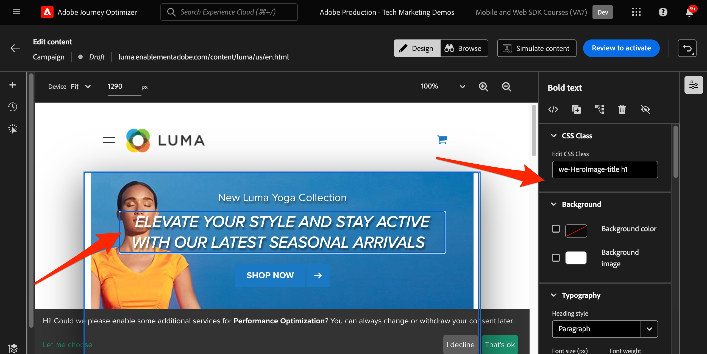
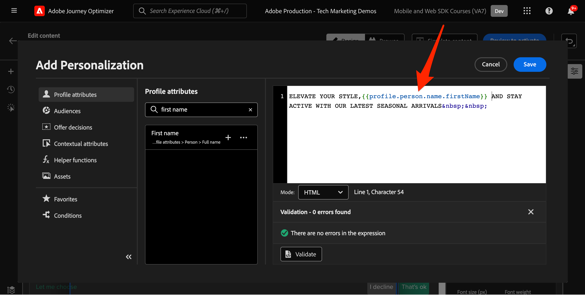
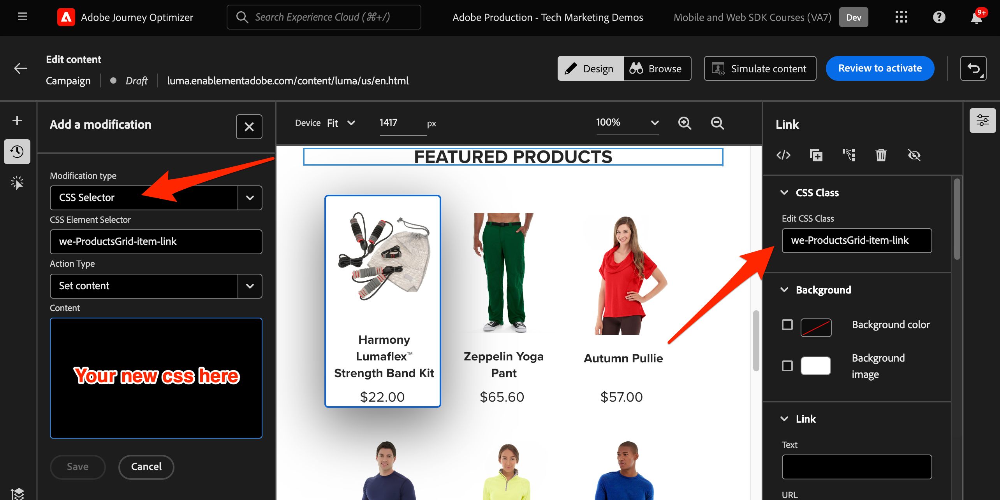

# Configuration du canal web Journey Optimizer avec Web SDK

Découvrez comment implémenter le Adobe Journey Optimizer [canal web](https://experienceleague.adobe.com/en/docs/journey-optimizer/using/web/get-started-web) à l’aide de Adobe Experience Platform Web SDK. Cette leçon couvre les conditions préalables fondamentales du canal web, les étapes détaillées de configuration et un examen approfondi d’un cas d’utilisation centré sur le statut de fidélité.

En suivant cette leçon, les utilisateurs de Journey Optimizer sont équipés pour utiliser le canal web pour une personnalisation en ligne avancée à l’aide du concepteur web de Journey Optimizer.

>[!WARNING]
>
> Le site web Luma utilisé dans ce tutoriel devrait être remplacé au cours de la semaine du 16 février 2026. Le travail effectué dans le cadre de ce tutoriel peut ne pas s’appliquer au nouveau site web.

## Objectifs d’apprentissage

À la fin de cette leçon, vous êtes capable de :

* comprendre la fonction et l’importance de Web SDK pour la diffusion de l’expérience du canal web ;
* Découvrez le processus de création d’une campagne de canal web du début à la fin à l’aide de l’exemple de cas d’utilisation de Récompenses de fidélité Luma .
* Configurez les propriétés, actions et plannings de campagne dans l’interface .
* Découvrez les fonctionnalités et les avantages de l’extension Visual Editing Helper de Adobe Experience Cloud.
* Découvrez comment modifier le contenu d’une page web, y compris des images, des en-têtes et d’autres éléments, à l’aide du concepteur web.
* Découvrez comment insérer des offres dans une page web à l’aide du composant Décision d’offre .
* Familiarisez-vous avec les bonnes pratiques pour garantir la qualité et le succès d’une campagne de canal web.

## Conditions préalables

Pour suivre les leçons de cette section, vous devez d’abord :

* Suivez toutes les leçons relatives à la configuration initiale de Platform Web SDK, y compris la configuration des éléments de données et des règles.
* Assurez-vous que votre extension de balises Adobe Experience Platform Web SDK est version 2.16 ou ultérieure.
* Si vous utilisez le concepteur web de Journey Optimizer pour créer votre expérience de canal web, assurez-vous d’utiliser les navigateurs Google Chrome ou Microsoft® Edge.
* Vérifiez également que vous avez téléchargé et activé l’extension de navigateur Visual Editing Helper de [Adobe Experience Cloud](https://chromewebstore.google.com/detail/adobe-experience-cloud-vi/kgmjjkfjacffaebgpkpcllakjifppnca).
* Assurez-vous que les cookies tiers sont autorisés dans votre navigateur. Il peut s’avérer nécessaire de désactiver tous les bloqueurs d’annonces publicitaires dans votre navigateur.

  >[!CAUTION]
  >
  > Dans le concepteur web de Journey Optimizer, certains sites web peuvent ne pas s’ouvrir de manière fiable pour l’une des raisons suivantes :
  > 
  > 1. Le site web a des politiques de sécurité strictes.
  > 1. Le site web est intégré à un iframe.
  > 1. Le site d’assurance qualité ou d’évaluation du client n’est pas accessible de l’extérieur (il s’agit d’un site interne).

* Lors de la création d’expériences web et de l’inclusion de contenu de la bibliothèque Adobe Experience Manager Assets Essentials , il est nécessaire de [configurer le sous-domaine pour publier ce contenu](https://experienceleague.adobe.com/en/docs/journey-optimizer/using/web/configure-web-channel/web-delegated-subdomains).
* Si vous utilisez la fonctionnalité d’expérimentation de contenu, assurez-vous que votre jeu de données web est également inclus dans votre configuration des rapports.
* Actuellement, deux types d’implémentation sont pris en charge pour permettre la création et la diffusion de campagnes de canal web sur vos propriétés web :
   * Côté client uniquement : pour modifier votre site web, vous devez implémenter le SDK web Adobe Experience Platform.
   * Mode hybride : vous pouvez utiliser l’API du serveur Edge Network Platform pour demander une personnalisation côté serveur. La réponse de l’API est ensuite fournie au SDK Web Adobe Experience Platform pour effectuer le rendu des modifications côté client. Pour plus d’informations, consultez la documentation de l’API du serveur Adobe Experience Platform Edge Network . Vous trouverez des détails supplémentaires et des exemples d’implémentation pour le mode hybride dans cet article de blog.

  >[!NOTE]
  >
  >L’implémentation côté serveur uniquement n’est actuellement pas prise en charge.

## Terminologie

Tout d’abord, vous devez comprendre la terminologie utilisée dans les campagnes de canal web.

* **Canal web** : moyen de communication ou de diffusion de contenu via le web. Dans le cadre de ce guide, il fait référence au mécanisme par lequel le contenu personnalisé est diffusé aux visiteurs et visiteuses du site web à l’aide de Platform Web SDK, dans Adobe Journey Optimizer.
* **Surface web** : fait référence à une propriété web identifiée par une URL où le contenu est diffusé. Il peut englober une ou plusieurs pages web.
* **Concepteur web Journey Optimizer** : outil ou interface spécifique au sein du Journey Optimizer permettant aux utilisateurs de concevoir leurs expériences de canal web.
* **Visual Editing Helper de Adobe Experience Cloud** : extension de navigateur qui aide à la modification visuelle et à la conception d’expériences de canal web.
* **Flux de données** : configuration au sein du service Adobe Experience Platform permettant de s’assurer que les expériences de canal web peuvent être diffusées.
* **Politique de fusion** : configuration qui garantit l’activation et la publication précises des campagnes entrantes.
* **Audience** : segment spécifique d’utilisateurs et d’utilisatrices ou de visiteurs et visiteuses du site qui répond à certains critères.
* **Concepteur web** : interface ou outil qui aide à la modification visuelle et à la conception d’expériences web sans se plonger dans le code.
* **Éditeur d’expression** : outil du concepteur web qui permet aux utilisateurs et utilisatrices d’ajouter une personnalisation au contenu web, potentiellement en fonction d’attributs de données ou d’autres critères.
* **Composant de décision d’offre** : composant du concepteur web qui permet de décider quelle offre est la plus adaptée pour être affichée à un visiteur spécifique en fonction de la gestion des décisions.
* **Expérience de contenu** : méthode permettant de tester différentes variations de contenu pour déterminer celle qui présente les meilleures performances en termes de mesure souhaitée, comme les clics entrants.
* **Traitement** : dans le contexte des expériences de contenu, un traitement fait référence à une variation spécifique du contenu testé par rapport à un autre.
* **Simulation** : un mécanisme de prévisualisation pour visualiser l’expérience du canal web avant de l’activer pour les audiences en direct.

## Configurer le flux de données

Vous avez déjà ajouté le service Adobe Experience Platform à votre flux de données. Vous devez maintenant activer l’option Adobe Journey Optimizer afin de pouvoir diffuser des expériences de canal web.

Pour configurer Adobe Journey Optimizer dans le flux de données :

1. Accédez à l’interface [Collecte de données](https://experience.adobe.com/#/data-collection){target="blank"}.
1. Dans le volet de navigation de gauche, sélectionnez **[!UICONTROL Flux de données]**.
1. Sélectionnez le flux de données Luma Web SDK créé précédemment.

   

1. Sélectionnez **[!UICONTROL Modifier]** dans le service Adobe Experience Platform.

   

1. Cochez la case **[!UICONTROL Adobe Journey Optimizer]**.

   

1. Sélectionnez **[!UICONTROL Enregistrer]**.

Cela permet de s’assurer que les événements entrants pour Journey Optimizer sont correctement gérés par Adobe Experience Platform Edge Network.

## Configurer la politique de fusion

Assurez-vous qu’une politique de fusion est définie avec l’option **[!UICONTROL Politique de fusion Active-On-Edge]** activée. Cette option de politique de fusion est utilisée par les canaux entrants Journey Optimizer pour garantir l’activation et la publication précises des campagnes entrantes sur Edge.

Pour configurer l’option dans la politique de fusion :

1. Accédez à la page **[!UICONTROL Client]** > **[!UICONTROL Profils]** dans l’interface Experience Platform ou Journey Optimizer.
1. Sélectionnez l’onglet **[!UICONTROL Politiques de fusion]**.
1. Sélectionnez votre politique (il est généralement préférable d’utiliser la politique [!UICONTROL basée sur la période par défaut]), puis activez l’option **[!UICONTROL Politique de fusion Active-On-Edge]** à l’étape **[!UICONTROL Configurer]**.

   

## Configurer le jeu de données web pour l’expérimentation de contenu

Pour utiliser des expériences de contenu dans des campagnes de canal web, vous devez vous assurer que le jeu de données web utilisé est également inclus dans votre configuration des rapports. Le système de rapports Journey Optimizer utilise le jeu de données en lecture seule pour renseigner les rapports d’expérimentation de contenu prêts à l’emploi.

[L’ajout de jeux de données pour le reporting d’expérience de contenu est détaillé dans cette section](https://experienceleague.adobe.com/en/docs/journey-optimizer/using/reporting/channel-report/reporting-configuration#add-datasets).

## Présentation du cas d’utilisation - Récompenses de fidélité

Dans cette leçon, un exemple de cas d’utilisation de récompenses de fidélité est utilisé pour détailler l’implémentation d’une expérience de canal web à l’aide de Web SDK.

Ce cas pratique vous permet de mieux comprendre comment Journey Optimizer peut vous aider à offrir les meilleures expériences entrantes à vos clients, à l’aide des campagnes Journey Optimizer et du concepteur web.

Comme ce tutoriel s’adresse aux personnes qui mettent en œuvre , il est intéressant de noter que cette leçon implique un travail d’interface substantiel dans Journey Optimizer. Bien que ces tâches d’interface soient généralement gérées par les spécialistes marketing, il peut être bénéfique pour les personnes en charge de la mise en œuvre d’intégrer insight au processus, même si elles ne sont généralement pas responsables de la création des campagnes de canal web.

### Créer une campagne de récompenses de fidélité

Maintenant que vous avez ingéré nos exemples de données de fidélité et que vous avez créé notre segment, créez la campagne du canal web Récompenses de fidélité dans Adobe Journey Optimizer.

Pour créer l’exemple de campagne :

1. Ouvrez l’interface de [Journey Optimizer](https://experience.adobe.com/journey-optimizer/home){target="_blank"}

   >[!NOTE]
   >
   > Les schémas, jeux de données et audiences peuvent également être créés dans l’interface Journey Optimizer, car il s’agit de concepts Experience Platform courants.

1. Accédez à **[!UICONTROL Gestion des Parcours]** > **[!UICONTROL Campagnes]** dans le volet de navigation de gauche
1. Cliquez sur **[!UICONTROL Créer une campagne]** en haut à droite.
1. Dans la section **[!UICONTROL Propriétés]**, indiquez quand exécuter la campagne. Pour le cas d’utilisation des récompenses de fidélité, choisissez **Planifié**.

   

1. Dans la section **[!UICONTROL Actions]**, choisissez le **[!UICONTROL canal web]**. Sélectionnez **[!UICONTROL Surface web]**, puis **[!UICONTROL URL de la page]**.

   >[!NOTE]
   >
   >Une surface web fait référence à une propriété web identifiée par une URL où le contenu est diffusé. Il peut correspondre à l’URL d’une seule page ou englober plusieurs pages, ce qui vous permet d’appliquer des modifications à une ou plusieurs pages web.

1. Sélectionnez l’option **[!UICONTROL URL de la page]** surface web pour déployer l’expérience sur une page pour cette campagne. Saisissez l’URL de la page Luma, `https://luma.enablementadobe.com/content/luma/us/en.html`

1. Une fois la surface web définie, sélectionnez **[!UICONTROL Créer]**.

   

1. Ajoutez maintenant des détails supplémentaires à la nouvelle campagne du canal web. Tout d’abord, nommez la campagne. Appelez-le `Luma Loyalty Rewards – Gold Status`. Vous pouvez éventuellement ajouter une description à la campagne. Ajoutez également **[!UICONTROL Balises]** pour améliorer la taxonomie globale de la campagne.

   

1. Par défaut, la campagne est active pour tous les visiteurs du site. Pour les besoins de ce cas d’utilisation, seuls les membres récompensés Gold Status doivent voir l’expérience. Pour activer cette fonction, cliquez sur **[!UICONTROL Sélectionner une audience]** et choisissez l’audience `Luma Loyalty Rewards – Gold Status`.

1. Dans le champ **[!UICONTROL Espace de noms d’identité]**, sélectionnez l’espace de noms permettant d’identifier les individus dans le segment sélectionné. Puisque vous déployez la campagne sur le site Luma, vous pouvez choisir l’espace de noms ECID. Les profils de l’audience `Luma Loyalty Rewards – Gold Status` ne disposant pas de l’espace de noms ECID parmi leurs différentes identités ne sont pas ciblés par la campagne du canal web.

   

1. Planifiez la campagne pour qu’elle commence à la date du jour à l’aide de l’option **[!UICONTROL Début de campagne]** et se termine dans une semaine à l’aide de l’option **[!UICONTROL Fin de campagne]**.

   

>[!NOTE]
>
>Gardez à l’esprit que pour les campagnes de canal web, l’expérience web s’affiche lorsque le visiteur ouvre la page. Par conséquent, contrairement aux autres types de campagnes de Adobe Journey Optimizer, la section **[!UICONTROL Déclencheurs d’action]** n’est pas configurable.

### Expérimentez le contenu des récompenses de fidélité

Si vous faites défiler l’écran vers le haut, dans la section **[!UICONTROL Action]**, vous pouvez éventuellement créer une expérience afin de tester quel contenu fonctionne le mieux pour l’audience `Luma Loyalty Rewards – Gold Status`. Créons et testons deux traitements en tant que composant de la configuration de la campagne.

Pour créer l’expérience de contenu :

1. Cliquez sur **[!UICONTROL Créer une expérience]**.

   

1. Sélectionnez d’abord une **[!UICONTROL mesure de succès]**. Il s’agit de la mesure permettant de déterminer l’efficacité du contenu. Choisissez **[!UICONTROL Clics entrants uniques]** pour voir quel traitement de contenu génère le plus de clics sur le CTA d’expérience web.

   

1. Lors de la configuration d’une expérience à l’aide du canal web et du choix des mesures **[!UICONTROL Clics entrants]**, **[!UICONTROL Clics entrants uniques]**, **[!UICONTROL Pages vues]** ou **[!UICONTROL Pages vues uniques]**, la liste déroulante **[!UICONTROL Action de clic]** vous permet d’effectuer le suivi et la surveillance précis des clics et des vues sur des pages spécifiques.

1. Vous pouvez éventuellement désigner une **[!UICONTROL Exclusion]** qui ne reçoit aucun des deux traitements. Ne cochez pas cette case pour l’instant.

1. En outre, vous pouvez également choisir **[!UICONTROL Répartir uniformément]**. Cochez cette option pour vous assurer que les divisions de traitement sont toujours réparties uniformément.

[En savoir plus sur les expériences de contenu dans le canal web Adobe Journey Optimizer](https://experienceleague.adobe.com/fr/docs/journey-optimizer/using/content-management/content-experiment/get-started-experiment).

### Modifier le contenu à l’aide de l’assistant visuel

Maintenant, créons l’expérience du canal web. Pour ce faire, utilisez l’**[!UICONTROL Visual Helper de Adobe Experience Cloud]**. Cet outil est une extension de navigateur compatible avec Google Chrome et Microsoft® Edge. Assurez-vous d’avoir téléchargé l’extension avant d’essayer de créer vos expériences. Assurez-vous également que la page web inclut le SDK web.

1. Dans l&#39;onglet **[!UICONTROL Action]** de la campagne, cliquez sur **[!UICONTROL Modifier le contenu]**. Puisque vous avez saisi une seule URL de page comme surface, vous devriez être prêt à commencer à travailler dans le compositeur.

   

1. Cliquez à présent sur **[!UICONTROL Modifier la page web]** pour commencer la création.

   

1. Commencez par modifier certains éléments à l’aide du compositeur web. Utilisez le menu contextuel pour modifier l’en-tête de l’image principale de Luma. Ajustez le style du volet contextuel à droite.

   

1. Ajoutez également une personnalisation au conteneur à l’aide de l’**[!UICONTROL éditeur d’expression]**.

   

1. Assurez-vous que l’expérience est correctement suivie pour les clics. Choisissez **[!UICONTROL Clic sur l’élément de suivi]** dans le menu contextuel.

   

1. Utilisez le composant **[!UICONTROL Décision d’offre]** pour insérer des offres dans la page web. Ce composant utilise **[!UICONTROL Gestion des décisions]** pour sélectionner la meilleure offre à proposer aux visiteurs Luma.

### Modifications de la conception d’HTML

Plusieurs méthodes sont disponibles si vous souhaitez apporter des modifications plus avancées ou personnalisées au site en tant que composant de la campagne de récompenses de fidélité.

Utilisez le volet **[!UICONTROL Composants]** pour ajouter directement du contenu HTML ou autre au site Luma.

Ajoutez un nouveau composant HTML en haut de la page. Modifiez l’HTML dans le composant à partir de l’interface de conception ou du volet **[!UICONTROL Contextuel]**.

Vous pouvez également ajouter des modifications HTML à partir du volet **[!UICONTROL Modifications]**. Ce volet vous permet de sélectionner un composant sur la page et de le modifier à partir de l’interface du concepteur.

Dans l’éditeur, ajoutez l’HTML pour l’audience `Luma Loyalty Rewards – Gold Status`. Sélectionnez **[!UICONTROL Valider]**.

Examinez maintenant le nouveau composant HTML personnalisé pour en optimiser l’ajustement.

Modifiez un composant spécifique à l’aide de la modification **[!UICONTROL type de sélecteur CSS]**.

Ajoutez du code personnalisé à l’aide de la modification **Type de `<head>` de page**.

Les possibilités sont infinies avec l’**[!UICONTROL Visual Helper]**.

### Simuler du contenu de récompenses de fidélité

Affichez un aperçu de la page web modifiée avant d’activer la campagne. Gardez à l’esprit que vous devez avoir des profils de test configurés pour simuler des expériences de canal web.

Pour simuler l’expérience :

1. Sélectionnez **[!UICONTROL Simuler du contenu]** dans la campagne.

   

1. Choisissez un profil de test pour recevoir la simulation. Gardez à l’esprit que le profil de test doit se trouver dans l’audience `Luma Loyalty Rewards – Gold Status` pour recevoir le traitement approprié.

1. L’aperçu s’affiche pour le profil de test.

### Activer la campagne de récompenses de fidélité

Enfin, activez la campagne du canal web.

1. Sélectionnez **Vérifier pour activer**.

1. Une dernière fois, vous êtes invité à confirmer les détails de la campagne. Sélectionnez **[!UICONTROL Activer]**. La mise en ligne de la campagne sur le site peut prendre jusqu’à 15 minutes.

### Assurance qualité des récompenses de fidélité

Il existe quelques connexions que vous pouvez utiliser pour simuler des utilisateurs avec un « statut or » et remplir les critères de votre campagne :

1. `cleavlandeuler@emailsim.io`/`test`
1. `leftybeagen@emailsim.io`/`test`
1. `jenimartinho@emailsim.io`/`test`

Il est recommandé de surveiller l’onglet **[!UICONTROL Web]** des rapports dynamiques et globaux de campagne pour les KPI spécifiques à la campagne. Pour cette campagne, surveillez les impressions d’expérience et le taux de clics.

### Validation des canaux web à l’aide d’Adobe Experience Platform Debugger

L’extension Adobe Experience Platform Debugger, disponible pour Chrome et Firefox, analyse vos pages web afin d’identifier les problèmes de mise en œuvre des solutions Adobe Experience Cloud.

Vous pouvez utiliser le débogueur sur le site Luma pour valider l’expérience du canal web en production. Il s’agit d’une bonne pratique une fois que le cas d’utilisation des récompenses de fidélité est opérationnel, afin de s’assurer que tout est correctement configuré.

[Découvrez comment configurer le débogueur dans votre navigateur à l’aide du guide ici](https://experienceleague.adobe.com/en/docs/platform-learn/data-collection/debugger/overview).

Pour commencer la validation à l’aide du débogueur :

1. Accédez à la page web Luma avec l’expérience du canal web.
   <!--
    
    -->
1. Sur la page web, ouvrez **[!UICONTROL Adobe Experience Platform Debugger]**.
   <!--
    
    -->
1. Accédez à **Résumé**. Vérifiez que l’ID **[!UICONTROL flux de données]** correspond au **[!UICONTROL flux de données]** dans la **[!UICONTROL collecte de données Adobe]** pour laquelle vous avez activé Adobe Journey Optimizer.
   <!--
    
    -->
1. Vous pouvez ensuite vous connecter au site avec différents comptes de fidélité Luma et utiliser le débogueur pour valider les requêtes envoyées à Adobe Experience Platform Edge Network.
   <!--
    
    -->
1. Sous **[!UICONTROL Solutions]** accédez à **[!UICONTROL Experience Platform Web SDK]**.
   <!--
    
    -->
1. Dans l’onglet **Configuration**, activez l’option **[!UICONTROL Activer le débogage]**. Cela permet la journalisation de la session dans une session **[!UICONTROL Adobe Experience Platform Assurance]**.
   <!--
    
    -->
1. Connectez-vous au site avec différents comptes de fidélité Luma et utilisez le débogueur pour valider les requêtes envoyées au réseau Adobe Experience Platform Edge ****. Toutes ces requêtes doivent être capturées dans **[!UICONTROL Assurance]** pour le suivi des journaux.
<!--
   
-->

>[!NOTE]
>
>Merci d’avoir investi votre temps dans votre apprentissage de Adobe Experience Platform Web SDK. Si vous avez des questions, souhaitez partager des commentaires généraux ou avez des suggestions sur le contenu futur, veuillez les partager dans ce [article de discussion de la communauté Experience League](https://experienceleaguecommunities.adobe.com/t5/adobe-experience-platform-data/tutorial-discussion-implement-adobe-experience-cloud-with-web/td-p/444996)
