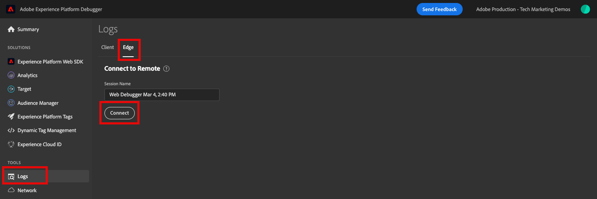

# Validation des implémentations de Web SDK avec Experience Platform Assurance

[Adobe Experience Platform Assurance](https://experienceleague.adobe.com/fr/docs/experience-platform/assurance/home) est une fonctionnalité qui vous permet d’inspecter, de tester, de simuler et de valider la manière dont vous collectez les données ou dont les expériences sont diffusées.

Comme vous l’avez appris dans la leçon [Configurer un flux de données](configure-datastream.md), Platform Web SDK envoie d’abord les données de votre propriété numérique vers Platform Edge Network. Ensuite, Platform Edge Network transfère les données vers les services activés dans votre flux de données. Vous pouvez valider les requêtes entrant et sortant de Platform Edge Network à l’aide d’Assurance.

## Objectifs d’apprentissage

À la fin de cette leçon, vous saurez comment :

* Démarrer une session Assurance
* Afficher les requêtes envoyées à et depuis Platform Edge Network

## Conditions préalables

Vous connaissez les balises de la collecte de données et le site web de démonstration [Luma](https://luma.enablementadobe.com){target="_blank"} et avez terminé les leçons précédentes du tutoriel :

* [Configuration d’un schéma XDM](configure-schemas.md)
* [Configuration d’un espace de noms d’identité](configure-identities.md)
* [Configurer un trains de données](configure-datastream.md)
* [Extension Web SDK installée dans la propriété de balise](install-web-sdk.md)
* [Création d’éléments de données](create-data-elements.md)
* [Capturer des identités](create-identities.md)
* [Création d’une règle de balise](create-tag-rule.md)
* [Validation avec Debugger](validate-with-debugger.md)

## Démarrer et afficher une session Assurance

Il existe plusieurs façons de démarrer une session Assurance.

### Activer Edge Trace dans Debugger

Pour activer Edge Trace :

1. Accédez au [site web de démonstration Luma](https://luma.enablementadobe.com) et utilisez le débogueur pour [changer la propriété de balise du site en votre propre propriété de développement](validate-with-debugger.md#use-the-experience-platform-debugger-to-map-to-your-tags-property)
1. Assurez-vous d’être connecté au débogueur en indiquant le nom de votre organisation. Si votre nom d&#39;utilisateur s&#39;affiche à la place, déconnectez-vous et essayez de vous reconnecter.
1. Dans le volet de navigation de gauche de **[!UICONTROL Experience Platform Debugger]** sélectionnez **[!UICONTROL Journaux]**
1. Sélectionnez l’onglet **[!UICONTROL Edge]**, puis sélectionnez **[!UICONTROL Se connecter]**

   

1. Il est vide pour l&#39;instant

   

1. Actualisez la page d’accueil [Luma](https://luma.enablementadobe.com/) et vérifiez à nouveau **[!UICONTROL Experience Platform Debugger]** pour voir les données qui entrent dans Platform Edge Network. Dans les prochaines leçons, vous pourrez voir les requêtes sortantes lorsque vous activerez les services dans votre flux de données.

   

   Chaque fois que vous activez Edge Trace dans Adobe Experience Platform Debugger, une session Assurance est lancée en arrière-plan. Bien que vous puissiez consulter les informations ici, vous trouverez probablement l’interface d’Assurance beaucoup plus utile.

1. Lorsque Edge Trace est activé, une icône de lien sortant s’affiche en haut. Sélectionnez l’icône pour ouvrir Assurance.

   

1. Un nouvel onglet du navigateur s’ouvre dans l’interface d’Assurance.

### Démarrer une session Assurance à partir de l’interface Assurance

1. Ouvrez l’interface [Collecte de données](https://experience.adobe.com/#/data-collection/home){target="_blank"}
1. Sélectionnez Assurance dans le volet de navigation de gauche
1. Sélectionner Créer une session
   
1. Utilisation de l’option **[!UICONTROL Connexion en lien profond]**
1. Sélectionnez **[!UICONTROL Démarrer]**
1. Attribuez un nom à la session, par exemple `Luma Web SDK validation`
1. Dans le champ **[!UICONTROL URL de base]** saisissez `https://luma.enablementadobe.com/`
   
1. Dans l’écran suivant, sélectionnez **[!UICONTROL Copier le lien]**
1. Sélectionnez l’icône pour copier le lien dans le presse-papiers
1. Collez l’URL dans votre navigateur, ce qui ouvrira le site web Luma avec un paramètre d’URL spécial `adb_validation_sessionid` et démarrera la session
1. Un message s’affiche dans l’interface d’Assurance pour indiquer que vous êtes correctement connecté à la session et vous devriez voir les événements capturés dans l’interface d’Assurance.
   

## Valider l’état actuel de votre implémentation de Web SDK

Les informations à afficher à ce stade de votre implémentation sont limitées, car nous n’avons pas encore activé de services dans le flux de données.

### Affichage des requêtes entrantes provenant de Web SDK avec `Alloy Request`

Nous pouvons afficher l’accès entrant de Web SDK tel qu’il est reçu par Edge :

1. Sélectionner la ligne de `Alloy Request`
1. Recherchez l’événement brut (ou développez les nœuds dans [!UICONTROL Payload] > `ACPExtensionEventData`) jusqu’à ce que vous trouviez votre objet XDM avec des variables familières :

   

### Afficher la réponse dans `Alloy Response Handle`

Comme vous le savez, l’Experience Cloud Id (ECID) est visible dans la réponse de Web SDK après avoir été généré sur Platform Edge Network. Recherchons-le dans la réponse telle qu’affichée dans Assurance :

1. Filtrez et sélectionnez la ligne avec l’événement appelé `Alloy Response Handle`.
1. Un menu s’affiche à droite. Sélectionnez le signe `+` en regard de `[!UICONTROL ACPExtensionEventData]`
1. Accédez à une liste déroulante en sélectionnant `[!UICONTROL payload > 0 > payload > 0 > namespace]`. L’identifiant affiché sous la dernière `0` correspond à la `ECID`. Vous le savez par la valeur qui s’affiche sous `namespace` `ECID` correspondant

   

   >[!CAUTION]
   >
   >Il se peut que vous voyiez une valeur ECID tronquée en raison de la largeur de votre fenêtre. Il vous suffit de sélectionner la barre de poignée dans l’interface et de faire glisser vers la gauche pour afficher l’ECID entier.

Dans les leçons ultérieures, vous utiliserez Assurance pour valider les payloads entièrement traitées atteignant une application Adobe activée dans votre flux de données.

Maintenant qu’un objet XDM se déclenche sur une page et que vous savez comment valider votre collecte de données, vous êtes prêt à configurer Experience Platform et les applications Adobe individuelles à l’aide de Platform Web SDK.

>[!NOTE]
>
>Merci d’avoir investi votre temps dans votre apprentissage de Adobe Experience Platform Web SDK. Si vous avez des questions, souhaitez partager des commentaires généraux ou avez des suggestions sur le contenu futur, veuillez les partager dans ce [article de discussion de la communauté Experience League](https://experienceleaguecommunities.adobe.com/adobe-experience-platform-18/tutorial-discussion-implement-adobe-experience-cloud-with-web-sdk-tutorial-248848?profile.language=fr)
