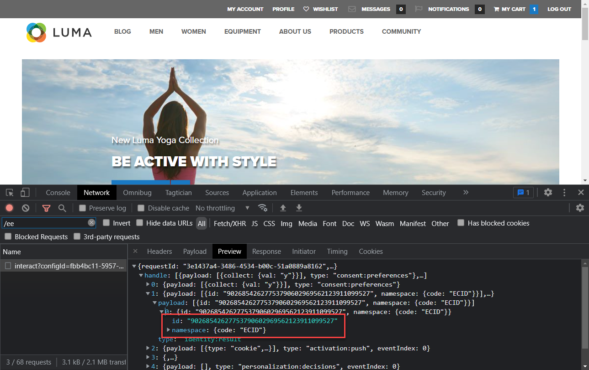

# Validation des mises en oeuvre du SDK Web avec le débogueur Experience Platform

Découvrez comment valider votre mise en oeuvre du SDK Web Platform avec Adobe Experience Platform Debugger.

Le débogueur Experience Platform est une extension disponible pour les navigateurs Chrome et Firefox qui vous permet de voir la technologie d’Adobe mise en oeuvre dans vos pages web. Téléchargez la version de votre navigateur préféré :

* [Extension Firefox](https://addons.mozilla.org/fr/firefox/addon/adobe-experience-platform-dbg/)
* [Extension Chrome](https://chrome.google.com/webstore/detail/adobe-experience-platform/bfnnokhpnncpkdmbokanobigaccjkpob)

Si vous n’avez jamais utilisé le débogueur auparavant et que celui-ci est différent de l’ancien débogueur Adobe Experience Cloud, vous pouvez regarder cette vidéo de présentation de cinq minutes :

>[!VIDEO](https://video.tv.adobe.com/v/32156?learn=on)

Dans cette leçon, vous utiliserez la variable [Extension Adobe Experience Cloud Debugger](https://chrome.google.com/webstore/detail/adobe-experience-cloud-de/ocdmogmohccmeicdhlhhgepeaijenapj) pour remplacer la propriété de balise codée en dur sur la propriété [Site de démonstration Luma](https://luma.enablementadobe.com/content/luma/us/en.html) avec votre propre propriété.

Cette technique, appelée changement d’environnement, vous sera utile ultérieurement lorsque vous utiliserez des balises sur votre propre site web. Vous pouvez charger votre site web de production dans votre navigateur, mais avec votre *development* environnement de balises. Cette fonctionnalité vous permet d’effectuer et de valider des modifications de balises en toute confiance, indépendamment de vos mises à jour de code standard. Après tout, cette séparation entre les mises à jour de balises marketing et les mises à jour de code standard est l’une des principales raisons pour lesquelles les clients utilisent des balises en premier lieu !

## Objectifs d&#39;apprentissage

À la fin de cette leçon, vous pourrez utiliser le débogueur pour :

* Chargement d’une autre bibliothèque de balises
* Validez que l’objet XDM capture et envoie des données comme prévu dans Edge Network

## Conditions préalables

Vous connaissez bien les balises de collecte de données et la variable [Site de démonstration Luma](https://luma.enablementadobe.com/content/luma/us/en.html){target="_blank"} et avoir suivi les leçons précédentes suivantes dans le tutoriel :

* [Configurer les autorisations](configure-permissions.md)
* [Configurer un schéma XDM](configure-schemas.md)
* [Configuration d’un espace de noms d’identité](configure-identities.md)
* [Configurer un trains de données](configure-datastream.md)
* [Extension SDK Web installée dans la propriété de balise](install-web-sdk.md)
* [Création d’éléments de données](create-data-elements.md)
* [Création d’une règle de balise](create-tag-rule.md)

## Chargement de bibliothèques de balises alternatives avec Debugger

Ce tutoriel utilise une version hébergée publiquement de [Site web de démonstration Luma](https://luma.enablementadobe.com/content/luma/us/en.html). Ouvrez la page d’accueil et mettez-la en signet.

Le débogueur Experience Platform dispose d’une fonctionnalité intéressante qui vous permet de remplacer une bibliothèque de balises existante par une autre. Cette technique est utile pour la validation et nous permet d’ignorer de nombreuses étapes d’implémentation dans ce tutoriel.

1. Assurez-vous que le site Luma est ouvert et sélectionnez l’icône de l’extension Debugger Experience Platform.
1. Le débogueur s’ouvre et affiche quelques détails sur l’implémentation codée en dur, qui n’est pas liée à ce tutoriel (vous devrez peut-être recharger le site Luma après avoir ouvert le débogueur).
1. Vérifiez que le débogueur est &quot;**[!UICONTROL Connexion à Luma]**&quot; comme illustré ci-dessous, puis sélectionnez &quot;**[!UICONTROL lock]**&quot; pour verrouiller le débogueur sur le site Luma.
1. Sélectionnez la variable **[!UICONTROL Se connecter]** et connectez-vous à Adobe Experience Cloud à l’aide de votre identifiant d’Adobe.
1. Accédez à **[!UICONTROL Balises Experience Platform]** dans la navigation de gauche

   

1. Sélectionnez la variable **[!UICONTROL Configuration]** tab
1. À droite de l’emplacement où il vous montre la variable **[!UICONTROL Codes d’intégration de page]**, ouvrez le **[!UICONTROL Actions]** , puis sélectionnez **[!UICONTROL Remplacer]**

   

1. Puisque vous êtes authentifié, le débogueur va extraire vos propriétés et environnements de balise disponibles. Sélectionnez votre `Web SDK Course` property
1. Sélectionnez votre `Development` environnement
1. Sélectionnez la variable **[!UICONTROL Appliquer]** button

   

1. Le site web Luma est maintenant rechargé. _avec votre propriété de balise_.

   

Au fur et à mesure que vous poursuivez le tutoriel, vous utiliserez cette technique pour mapper le site Luma sur votre propre propriété de balise afin de valider votre mise en oeuvre du SDK Web Platform. Lorsque vous commencez à utiliser des balises sur votre site web de production, vous pouvez utiliser cette même technique pour valider les modifications.

## Validation de votre mise en oeuvre dans Experience Platform Debugger

Vous pouvez utiliser Debugger pour valider votre mise en oeuvre du SDK Web Platform et afficher les données envoyées à Platform Edge Network :

1. Accédez à **[!UICONTROL Résumé]** dans le volet de navigation de gauche, pour afficher les détails de votre propriété de balise

   

1. Accédez à **[!UICONTROL SDK Web Experience Platform]** dans le volet de navigation de gauche pour afficher la variable **[!UICONTROL Requêtes réseau]**
1. Ouvrez le **[!UICONTROL events]** row (ne vous inquiétez pas si cette capture d’écran affiche plus de requêtes que la vôtre, elle inclut des requêtes issues de futures leçons et vous pouvez ignorer pour l’instant)

   

1. Notez comment nous pouvons voir la variable `web.webpagedetails.pageView` type d’événement spécifié dans notre [!UICONTROL Envoyer un événement] , ainsi que d’autres variables prêtes à l’emploi conformes à la `AEP Web SDK ExperienceEvent Mixin` format

   

1. Faites défiler l’écran vers le bas jusqu’à `web` , sélectionnez pour l’ouvrir et examinez l’objet `webPageDetails.name`, `webPageDetails.server`, et `webPageDetails.siteSection`. Ils doivent correspondre aux variables de couche de données numériquesData correspondantes sur la page d’accueil.

   

Vous pouvez également valider les détails de la carte des identités :

1. Connectez-vous au site Luma à l’aide des informations d’identification suivantes : `test@adobe.com`/`test`

1. Revenez à la [page d’accueil de Luma](https://luma.enablementadobe.com/content/luma/us/en.html).

1. Ouvrez le **[!UICONTROL SDK Web Experience Platform]** dans la navigation de gauche

   

1. Sélectionnez la variable **[!UICONTROL events]** pour ouvrir les détails dans une fenêtre contextuelle

   

1. Recherchez le **identityMap** dans la fenêtre contextuelle. Ici, vous devriez voir `lumaCrmId` avec trois clés authenticatedState, id et primary :
   

## Validation à l’aide des outils de développement de navigateur

Ces types de détails de requête sont également visibles dans les outils de développement web du navigateur. **Réseau** (en supposant que le site web charge votre bibliothèque de balises).

1. Ouvrez les outils de développement web du navigateur. **Réseau** et rechargez la page. Filtrer les appels avec `/ee` pour localiser l’appel, sélectionnez-le, puis recherchez dans le **En-têtes** et **Payload** tab

   

1. Accédez au **Réponse** et notez comment la valeur ECID est incluse dans la réponse. Copiez cette valeur, car vous l’utiliserez pour valider les informations de profil lors de l’exercice suivant.

   

   >[!NOTE]
   >
   >    Il se peut que vous ne voyiez pas le même nombre de requêtes de payload que dans la capture d’écran ci-dessus. Cette disparité est due au fait que les leçons à tirer de l&#39;avenir [configuration de Target](setup-target.md) ont été terminées au moment de la capture d’écran. Vous pouvez ignorer cette différence pour l&#39;instant.

Avec un objet XDM qui se déclenche maintenant sur une page et avec les connaissances nécessaires pour valider votre collecte de données, vous êtes prêt à configurer les applications Adobe individuelles à l’aide du SDK Web Platform.

[Suivant : ](setup-experience-platform.md)

>[!NOTE]
>
>Merci d’avoir consacré du temps à l’apprentissage du SDK Web Adobe Experience Platform. Si vous avez des questions, souhaitez partager des commentaires généraux ou avez des suggestions sur le contenu futur, partagez-les à ce sujet. [Article de discussion de la communauté Experience League](https://experienceleaguecommunities.adobe.com/t5/adobe-experience-platform-launch/tutorial-discussion-implement-adobe-experience-cloud-with-web/td-p/444996)
