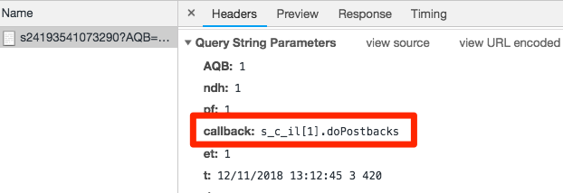

# Ajout d’Adobe Audience Manager

Cette leçon vous guidera tout au long des étapes nécessaires à l’activation d’Adobe Audience Manager à l’aide du transfert côté serveur.

[Adobe Audience Manager](https://experienceleague.adobe.com/docs/audience-manager/user-guide/aam-home.html?lang=fr) (AAM) fournit des services de pointe pour la gestion des données d’audience en ligne, dotant les publicitaires et les éditeurs en numérique des outils dont ils ont besoin pour contrôler leurs ressources de données et en tirer profit afin de stimuler leurs ventes.

>[!WARNING]
>
> Le site web Luma utilisé dans ce tutoriel devrait être remplacé au cours de la semaine du 16 février 2026. Le travail effectué dans le cadre de ce tutoriel peut ne pas s’appliquer au nouveau site web.

>[!NOTE]
>
>Adobe Experience Platform Launch est intégré à Adobe Experience Platform comme une suite de technologies destinées à la collecte de données. Plusieurs modifications terminologiques ont été déployées dans l’interface. Vous devez en être conscient lors de l’utilisation de ce contenu :
>
> * Platform Launch (côté client) est désormais **[[!DNL tags]](https://experienceleague.adobe.com/docs/experience-platform/tags/home.html?lang=fr)**
> * Platform Launch côté serveur est désormais **[[!DNL event forwarding]](https://experienceleague.adobe.com/docs/experience-platform/tags/event-forwarding/overview.html?lang=fr)**
> * Les configurations Edge sont désormais **[[!DNL datastreams]](https://experienceleague.adobe.com/docs/experience-platform/edge/fundamentals/datastreams.html?lang=fr)**

## Objectifs d’apprentissage

À la fin de cette leçon, vous saurez comment :

1. décrire les deux méthodes principales en vue de mettre en œuvre Audience Manager sur un site web ;
1. ajouter Audience Manager à l’aide du transfert côté serveur de la balise Analytics ;
1. valider la mise en œuvre d’Audience Manager.

## Conditions préalables

Pour pouvoir suivre cette leçon, vous devez :

1. avoir suivi les leçons [Configuration des balises](create-a-property.md), [Ajout d’Adobe Analytics](analytics.md) et [Ajout d’Identity Service](id-service.md) ;

1. disposer d’un accès à Adobe Analytics pour activer le transfert côté serveur pour la suite de rapports que vous utilisez pour ce tutoriel. Vous pouvez également demander à un administrateur existant de votre organisation de le faire à votre place, en suivant les instructions ci-dessous.

1. Votre « Sous-domaine Audience Manager » (également appelé « Nom de partenaire », « Identifiant de partenaire » ou « Sous-domaine de partenaire »). Si vous avez déjà mis en œuvre Audience Manager sur votre site web, la méthode la plus simple pour obtenir ce résultat consiste à accéder à votre site web et à ouvrir le débogueur. Le sous-domaine est disponible sur l’onglet Résumé, dans la section Audience Manager :

   

Si vous n’avez pas encore mis en œuvre Audience Manager, suivez ces instructions pour [obtenir votre sous-domaine Audience Manager](https://experienceleague.adobe.com/docs/audience-manager-learn/tutorials/web-implementation/how-to-identify-your-partner-id-or-subdomain.html).

## Options de mise en œuvre

Il existe deux méthodes pour mettre en œuvre Audience Manager sur un site web :

* **Transfert côté serveur (SSF) :** pour les clients avec Adobe Analytics, il s’agit de la méthode de mise en œuvre la plus simple et recommandée. Adobe Analytics transfère des données vers AAM sur le serveur principal Adobe, ce qui permet une requête de moins sur la page. Cette solution permet également de bénéficier de fonctionnalités d’intégration clés et se conforme à nos bonnes pratiques en matière de mise en œuvre et de déploiement du code Audience Manager.

* **DIL côté client :** cette approche est destinée aux clients qui ne disposent pas d’Adobe Analytics. Le code DIL (Code de bibliothèque d’intégration de données, le code de configuration JavaScript d’AAM) envoie directement les données depuis la page web vers Audience Manager.

Comme vous avez déjà déployé Adobe Analytics au cours de ce tutoriel, vous allez déployer Audience Manager à l’aide du transfert côté serveur. Pour obtenir une description complète et une liste des exigences du transfert côté serveur, consultez la [documentation](https://experienceleague.adobe.com/docs/analytics/admin/admin-tools/server-side-forwarding/ssf.html?lang=fr) de manière à vous familiariser avec son fonctionnement, les exigences et la méthode de validation.

## Activation du transfert côté serveur

Voici les deux étapes principales d’une mise en œuvre avec transfert côté serveur :

1. Cocher une case dans l’Admin Console Analytics pour transférer les données depuis Analytics vers Audience Manager *par suite de rapports*.
1. La mise en place du code, qui s’effectue par le biais des balises. Pour que cela fonctionne, vous devez avoir installé l’extension Service d’identités d’Adobe Experience Platform, ainsi que l’extension Analytics (vous *n’aurez pas* besoin de l’extension AAM, comme expliqué ci-dessous).

### Activation du transfert côté serveur dans l’Admin Console d’Analytics

Il est nécessaire d’effectuer une configuration dans l’Admin Console d’Adobe Analytics pour lancer le transfert de données d’Adobe Analytics vers Adobe Audience Manager. Effectuez cette étape en premier lieu, étant donné que jusqu’à quatre heures peuvent s’avérer nécessaires pour commencer à transférer les données.

#### Activation du transfert côté serveur dans l’Admin Console d’Analytics

1. Connectez-vous à Analytics via l’interface utilisateur d’Experience Cloud. Si vous ne disposez pas d’un accès d’administrateur à Analytics, contactez votre administrateur Experience Cloud ou Analytics pour qu’il vous octroie un accès ou qu’il effectue ces étapes pour vous.

   

1. Dans le volet de navigation supérieur d’Analytics, choisissez **[!UICONTROL Admin > Suite de rapports]**, puis, dans la liste déroulante à sélection multiple, sélectionnez la ou les suite(s) de rapports à transférer vers Audience Manager.

   

1. Dans l’écran Suites de rapports et une fois la ou les suites de rapports sélectionnées, choisissez **[!UICONTROL Modifier les paramètres > Général > Transfert côté serveur]**.

   

   >[!WARNING]
   >
   >Comme indiqué ci-dessus, vous devez disposer de droits d’administrateur pour voir cet élément de menu.

1. Une fois sur la page Transfert côté serveur, lisez les informations et cochez la case **[!UICONTROL Activer le transfert côté serveur]** pour la ou les suites de rapports.

1. Cliquez sur **[!UICONTROL Enregistrer]**.

   

>[!NOTE]
>
>Étant donné que SSF doit être activé par suite de rapports, n’oubliez pas de répéter cette étape pour vos suites de rapports réelles lorsque vous déployez SSF sur la suite de rapports réelle de votre site.
>
>De plus, si l’option Transfert côté serveur est grisée, vous devrez mapper la ou les suites de rapports à votre organisation Experience Cloud afin d’activer l’option. Cela est expliqué dans [la documentation](https://experienceleague.adobe.com/docs/analytics/admin/data-governance/gdpr-view-settings.html).

Une fois cette étape effectuée et si le service d’identités d’Adobe Experience Platform est activé, les données sont transférées d’Analytics à AAM. Cependant, pour terminer le processus afin que la réponse revienne correctement d’AAM à la page (et également à Analytics via la fonctionnalité Audience Analytics), vous devez également effectuer l’étape suivante dans les balises. C’est très facile.

### Activer le transfert côté serveur dans les balises

C’est la seconde étape de l’activation du transfert côté serveur. Vous avez déjà basculé dans Analytics Admin Console, et maintenant vous devez juste ajouter le code, ce que les balises feront pour vous si vous cochez simplement la bonne case.

>[!NOTE]
>
>Pour implémenter le transfert côté serveur des données Analytics dans AAM, nous allons modifier/configurer l’extension Analytics dans les balises, **et non** l’extension AAM. L’extension AAM est utilisée exclusivement pour les mises en œuvre DIL côté client, pour les personnes qui ne disposent pas d’Adobe Analytics. Les étapes suivantes ont été correctement réalisées lorsqu’elles vous envoient vers l’extension Analytics pour la configuration.

#### Pour activer SSF dans les balises

1. Accédez à **[!UICONTROL Extensions > Installé]** et cliquez sur pour configurer l’extension Analytics.

   

1. Développez la section `Adobe Audience Manager`.

1. Cochez la case pour **[!UICONTROL Partager automatiquement les données Analytics avec Audience Manager]**. Cette opération ajoute le « module » Audience Manager (code) à la mise en œuvre `AppMeasurement.js` d’Analytics.

1. Ajoutez votre « Sous-domaine Audience Manager » (également appelé « Nom de partenaire », « Identifiant de partenaire » ou « Sous-domaine de partenaire »). Suivez ces instructions pour [obtenir votre sous-domaine Audience Manager](https://experienceleague.adobe.com/docs/audience-manager-learn/tutorials/web-implementation/how-to-identify-your-partner-id-or-subdomain.html).

1. Cliquez sur **[!UICONTROL Enregistrer dans la bibliothèque et créer]**

   

Le code de transfert côté serveur a bien été implémenté.

### Validation du transfert côté serveur

La principale manière de vérifier que le transfert côté serveur est opérationnel consiste à examiner la réponse à l’un de vos accès à Adobe Analytics. Nous y reviendrons dans quelques instants. En attendant, penchons-nous sur ce qui peut nous aider à vérifier que tout fonctionne comme prévu.

#### Vérification du chargement correct du code

Le code que les balises installent pour gérer le transfert, et notamment la réponse d’AAM à la page, est appelé Audience Manager
« Module. » Nous pouvons utiliser l’Experience Cloud Debugger pour nous assurer qu’il a bien été chargé.

1. Ouvrez le site Luma.
1. Cliquez sur l’icône Debugger dans votre navigateur pour ouvrir Experience Cloud Debugger.
1. Toujours dans l’onglet Résumé, faites défiler l’écran jusqu’à la section Analytics.
1. Vérifiez que **AudienceManagement** est répertorié sous la section Modules.

   

#### Vérification de l’identifiant de partenaire dans le débogueur

Ensuite, nous pouvons également vérifier que le débogueur sélectionne le bon « ID de partenaire » (ou sous-domaine de partenaire AAA, etc.) dans le code.

1. Toujours dans le débogueur et toujours dans l’onglet Résumé, faites défiler l’écran jusqu’à la section Audience Manager.
1. Vérifiez votre identifiant de partenaire/sous-domaine sous « Partner ».

   

>[!WARNING]
>
>Vous remarquerez peut-être que la section Audience Manager du débogueur fait référence à « DIL », qui est le « Data Integration Library », et fait généralement référence à une mise en œuvre côté client, par opposition à l’approche côté serveur que nous avons mise en œuvre ici. Le « module » AAM (utilisé dans cette approche avec transfert côté serveur) utilise en grande partie le même code que la bibliothèque DIL côté client. C’est pourquoi ce débogueur le signale en tant que tel. Si vous avez suivi les étapes de ce tutoriel et que le reste des éléments de cette section de validation est correct, assurez-vous que le transfert côté serveur fonctionne.

#### Vérification de la requête et de la réponse Analytics

Voilà la partie la plus importante. Si vous n’effectuez pas de transfert côté serveur des données depuis Analytics vers Audience Manager, aucune réponse n’est apportée à la balise Analytics (hormis un pixel 2x2). Toutefois, si vous effectuez un transfert côté serveur, vous pouvez vérifier certains éléments dans la requête et la réponse Analytics qui vous permettent ensuite de savoir qu’elle fonctionne correctement.
Malheureusement, actuellement, le débogueur Experience Cloud ne prend pas en charge l’affichage de la réponse aux balises. Par conséquent, vous devez utiliser un autre débogueur/renifleur de paquets, comme Charles Proxy ou les outils de développement du navigateur.

1. Ouvrez les outils de développement dans votre navigateur et sélectionnez l’onglet Réseau.
1. Dans le champ de filtre, saisissez `b/ss`. Cela limite ce que vous voyez aux requêtes Adobe Analytics.
1. Pour afficher la requête Analytics, actualisez la page.

   

1. Dans la balise (requête) Analytics, recherchez un paramètre de « rappel ». Il sera défini sur quelque chose comme : `s_c_il[1].doPostbacks`.

   

1. Vous obtiendrez une réponse à la balise Analytics. Elle contiendra des références à doPostbacks, comme dans la requête et surtout, elle doit contenir un objet « stuff ». C’est là que les identifiants de segment AAM sont renvoyés au navigateur. Si vous obtenez l’objet « stuff », c’est que le transfert côté serveur fonctionne.

   

>[!WARNING]
>
>Méfiez-vous du faux « Succès ». S’il y a une réponse et que tout semble fonctionner, assurez-**vous** que vous disposez de cet objet « truc ». Dans le cas contraire, un message peut s’afficher dans la réponse et indiquer « status » : « SUCCESS ». Aussi incroyable que cela puisse paraître, c’est pourtant bien la preuve qu’il ne fonctionne **PAS** correctement. Si vous le voyez, cela signifie que vous avez terminé cette deuxième étape (le code dans les balises), mais que le transfert dans Analytics Admin Console (première étape de cette section) n’est pas encore terminé. Dans ce cas, vous devez vous assurer d’avoir activé le transfert côté serveur dans l’Admin Console d’Analytics. Si tel est le cas, mais que le délai de quatre heures n’est pas encore passé, soyez patient.

[Suite : « Intégrations Experience Cloud » >](integrations.md)
