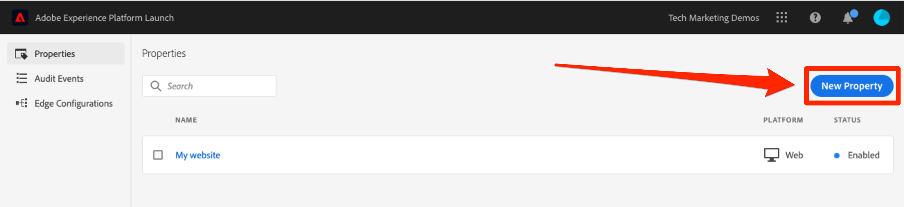

# Créer une propriété de balise

Dans cette leçon, vous allez créer votre première propriété de balise.

Une propriété est essentiellement un conteneur que vous remplissez avec des extensions, des règles, des éléments de données et des bibliothèques lorsque vous déployez des balises sur votre site.

## Conditions préalables

Pour pouvoir suivre les leçons suivantes, vous devez disposer des autorisations Develop (Développer), Approve (Approuver), Publish (), Manage Extensions (Gérer les extensions) et Manage Environments (Gérer les environnements) dans les balises. Si vous ne parvenez pas à effectuer l’une de ces étapes parce que vous n’avez pas accès aux options de l’interface utilisateur, contactez votre administrateur Experience Cloud pour demander l’accès à ces options. Pour plus d’informations sur les autorisations des utilisateurs de balises, voir [la documentation](https://experienceleague.adobe.com/docs/experience-platform/tags/admin/user-permissions.html?lang=fr).

>[!NOTE]
>
>Adobe Experience Platform Launch est intégré à Adobe Experience Platform comme une suite de technologies destinées à la collecte de données. Plusieurs modifications terminologiques ont été apportées à l’interface que vous devez connaître lors de l’utilisation de ce contenu :
>
> * Le platform launch (côté client) est désormais **[[!DNL tags]](https://experienceleague.adobe.com/docs/experience-platform/tags/home.html?lang=fr)**
> * Le platform launch côté serveur est désormais **[[!DNL event forwarding]](https://experienceleague.adobe.com/docs/experience-platform/tags/event-forwarding/overview.html?lang=fr)**
> * Les configurations Edge sont désormais **[[!DNL datastreams]](https://experienceleague.adobe.com/docs/experience-platform/edge/fundamentals/datastreams.html?lang=fr)**

## Objectifs d’apprentissage

À la fin de cette leçon, vous saurez comment :

* Connexion à l’interface utilisateur de la collecte de données
* Créer une propriété de balise
* Configuration d’une propriété de balise

## Accès à l’interface Collecte de données

**Pour accéder à la collecte de données**

1. Connectez-vous à [Adobe Experience Cloud](https://experiencecloud.adobe.com)

1. Cliquez sur l’icône  pour ouvrir le sélecteur d’applications.

1. Sélectionnez **[!UICONTROL Launch/Data Collection]** dans le menu 

L’écran `Tags Properties` devrait s’afficher (si aucune propriété n’a été créée pour ce compte, cet écran peut être vide) :

## Création d’une propriété

Une propriété est essentiellement un conteneur que vous remplissez avec des extensions, des règles, des éléments de données et des bibliothèques lorsque vous déployez des balises sur votre site. Une propriété peut être n’importe quel regroupement d’un ou de plusieurs domaines et sous-domaines. Vous pouvez gérer ces ressources et en effectuer le suivi de manière similaire. Par exemple, supposons que vous disposez de plusieurs sites web reposant sur un modèle et que vous souhaitez effectuer le suivi des mêmes ressources sur tous les sites. Vous pouvez appliquer une propriété à plusieurs domaines. Pour en savoir plus sur la création de propriétés, consultez [« Entreprises et propriétés »](https://experienceleague.adobe.com/docs/experience-platform/tags/admin/companies-and-properties.html?lang=fr) dans la documentation du produit.

**Création d’une propriété**

1. Cliquez sur le bouton **[!UICONTROL New Property]** :

   

1. Nommez votre propriété (par ex. `Luma Tutorial` ou `Luma Tutorial - Daniel`).
1. Saisissez `enablementadobe.com` comme domaine. Il s’agit du domaine sur lequel le site de démonstration Luma est hébergé. Bien que le champ &quot;Domaine&quot; soit obligatoire, la propriété de balise fonctionne sur n’importe quel domaine où elle est implémentée. La fonction principale de ce champ est de préremplir les options de menu du créateur de règles.
1. Développez la section **[!UICONTROL Options avancées]** et cochez la case **[!UICONTROL Exécuter les composants de règle en séquence]**
1. Cliquez sur le bouton **[!UICONTROL Enregistrer]**

   

Votre nouvelle propriété devrait s’afficher sur la page Propriétés. Notez que si vous cochez la case en regard du nom de la propriété, les options **[!UICONTROL Configurer]** ou **[!UICONTROL Supprimer]** de la propriété apparaissent au-dessus de la liste des propriétés. Cliquez sur le nom de la propriété (par exemple `Luma Tutorial`) pour ouvrir l’écran `Overview`.

[Suite : &quot;Ajout du code incorporé&quot; >](add-embed-code.md)
