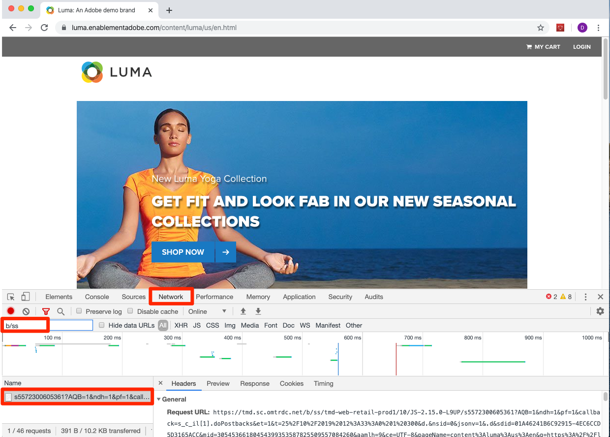

# Intégrations Experience Cloud

Dans cette leçon, vous examinerez les intégrations clés des solutions que vous venez de mettre en œuvre. La bonne nouvelle, c’est qu’en suivant les leçons précédentes, vous avez déjà mis en œuvre les aspects des intégrations en lien avec le code. Vous n’avez pas besoin d’en faire plus pour cette leçon, hormis lire et valider.

## Objectifs d’apprentissage

À la fin de cette leçon, vous saurez comment :

1. expliquer les cas d’utilisation de base pour les intégrations du partage des audiences, d’Analytics for Target (A4T) et des attributs du client ;
1. valider les aspects de base de la mise en œuvre de ces intégrations côté client.

## Conditions préalables

Vous devez suivre les leçons précédentes de ce tutoriel avant de suivre les instructions de cette leçon.

>[!NOTE]
>
>De nombreuses exigences en matière d’autorisations utilisateur, de configurations de compte et d’étapes d’approvisionnement sont requises pour utiliser pleinement ces intégrations et dépassent la portée de ce tutoriel. Si vous n’utilisez pas déjà ces intégrations dans votre mise en œuvre actuelle d’Experience Cloud, tenez compte des points suivants :
>
>* Examinez toutes les exigences relatives aux [intégrations des services principaux](https://experienceleague.adobe.com/en/docs/core-services/interface/services/getting-started).
>* Examinez toutes les exigences relatives à l’[intégration Analytics for Target](https://experienceleague.adobe.com/en/docs/target/using/integrate/a4t/before-implement).

## Audiences

[Audiences](https://experienceleague.adobe.com/fr/docs/core-services/interface/services/audiences/overview) fait partie du service principal People et vous permet de partager des audiences entre différentes solutions. Par exemple, vous pouvez créer une audience dans Audience Manager et l’utiliser pour diffuser du contenu personnalisé avec Target.

Les principales exigences pour la mise en œuvre d’A4T (ce que vous avez déjà fait) sont les suivantes :

1. La mise en œuvre du service d’identités d’Adobe Experience Platform
1. La mise en œuvre d’Audience Manager
1. La mise en œuvre d’autres solutions desquelles vous souhaitez recevoir ou créer des audiences, comme Target et Analytics

### Validation de l’intégration d’Audiences

La meilleure façon de valider l’intégration d’Audiences consiste à créer une audience, à la partager avec une autre solution, puis à l’utiliser pleinement dans l’autre solution (par exemple, en confirmant qu’un visiteur admissible pour un segment AAM peut être admissible pour une activité Target ciblée pour ce segment). Toutefois, cela va au-delà de la portée de ce tutoriel.

Ces étapes de validation portent sur la partie essentielle visible dans la mise en œuvre côté client : l’ID visiteur.

1. Ouvrez le [site Luma](https://luma.enablementadobe.com/content/luma/us/en.html).

1. Assurez-vous que le débogueur mappe la propriété de balise sur *votre* environnement de développement, comme décrit dans la leçon [ précédente](switch-environments.md)

   

1. Accédez à l’onglet Réseau du débogueur.

1. Cliquez sur **[!UICONTROL Effacer toutes les demandes]** juste pour nettoyer les choses

1. Chargez à nouveau la page Luma, en veillant à afficher les requêtes Target et Analytics dans le débogueur.

1. Chargez encore une fois la page Luma.

1. Vous devriez maintenant avoir quatre requêtes dans l’onglet Réseau du débogueur : deux pour Target et deux pour Analytics.

1. Regardez dans la ligne « Identifiant visiteur Experience Cloud ». Les ID de chaque requête pour chaque solution doivent toujours être identiques.

   

1. Les ID sont propres à chaque visiteur, ce que vous pouvez vérifier en demandant à un collègue de répéter ces étapes.

## Analytics for Target (A4T)

L’intégration [Analytics for Target (A4T)](https://experienceleague.adobe.com/docs/target/using/integrate/a4t/a4t.html) vous permet d’exploiter vos données Analytics en tant que source des mesures de création de rapports dans Target.

Les principales exigences pour la mise en œuvre d’A4T (ce que vous avez déjà fait) sont les suivantes :

1. La mise en œuvre du service d’identités d’Adobe Experience Platform
1. Le déclenchement de la requête pendant le chargement de la page Target avant celui de la balise de page vue Analytics

A4T fonctionne en assemblant une requête côté serveur de Target à Analytics avec la balise de page vue Analytics, c’est l’« assemblage d’accès ». L’assemblage d’accès nécessite que la requête Target qui envoie l’activité (ou incrémente une mesure d’objectif basée sur Target) ait un paramètre correspondant à un paramètre dans la balise de page vue Analytics. Ce paramètre est appelé ID de données supplémentaire (SDID).

### Validation de la mise en œuvre d’A4T

Le meilleur moyen de valider l’intégration A4T est de créer une activité Target à l’aide d’A4T et de valider les données de création de rapports. Toutefois, cela va au-delà de la portée de ce tutoriel. Ce tutoriel montre comment vérifier que les identifiants de données supplémentaires correspondent entre les appels de solution.

**Validation des SDID**

1. Ouvrez le [site Luma](https://luma.enablementadobe.com/content/luma/us/en.html).

1. Assurez-vous que le débogueur mappe la propriété de balise sur *votre* environnement de développement, comme décrit dans la leçon [ précédente](switch-environments.md)

   

1. Accédez à l’onglet Réseau du débogueur.

1. Cliquez sur **[!UICONTROL Effacer toutes les demandes]** juste pour nettoyer les choses

1. Chargez à nouveau la page Luma, en veillant à afficher les requêtes Target et Analytics dans le débogueur.

1. Chargez encore une fois la page Luma.

1. Vous devriez maintenant avoir quatre requêtes dans l’onglet Réseau du débogueur : deux pour Target et deux pour Analytics.

1. Regardez dans la ligne intitulée « ID de données supplémentaire ». Les identifiants du premier chargement de page doivent correspondre entre Target et Analytics. Les identifiants du second chargement de page doivent également correspondre, mais être différents par rapport au premier chargement de page.

   

Si vous effectuez d’autres requêtes Target dans le cadre d’un chargement de page (et non d’applications d’une seule page) qui font partie des activités A4T, il est conseillé de leur attribuer des noms uniques (pas target-global-mbox) afin qu’elles possèdent les mêmes SDID des requêtes Target et Analytics initiales.

## Attributs du client

Les [attributs du client](https://experienceleague.adobe.com/docs/core-services/interface/customer-attributes/attributes.html?lang=fr) font partie du service principal People qui vous permet de charger des données à partir de votre base de données de gestion de la relation client (GRC) et de les exploiter dans Adobe Analytics et Adobe Target.

Les principales exigences pour la mise en œuvre des attributs du client ce que vous avez déjà fait sont les suivantes :

1. La mise en œuvre du service d’identités d’Adobe Experience Platform
1. Définition des ID de client via le service d’ID *avant* Target et Analytics ne déclenchent leurs requêtes (ce que vous avez fait à l’aide de la fonctionnalité de tri des règles dans les balises)

### Validation de la mise en œuvre des attributs du client

Vous avez déjà vérifié que les ID de client sont transmis au service d’identités  et à Target dans les leçons précédentes. Vous pouvez également valider l’ID de client dans l’accès à Analytics.
Actuellement, l’ID de client est l’un des rares paramètres qui ne s’affichent pas dans l’Experience Cloud Debugger, vous devez donc utiliser la console JavaScript du navigateur pour l’afficher.

1. Ouvrez le site Luma.
1. Ouvrez les outils de développement de votre navigateur.
1. Accédez à l’onglet Réseau.
1. Dans le champ de filtre, saisissez `b/ss`. Cela limite ce que vous voyez aux requêtes Adobe Analytics.

   

1. Cliquez sur le lien **[!UICONTROL CONNEXION]** dans le coin supérieur droit du site

   

1. Saisissez `test@test.com` comme nom d’utilisateur.
1. Saisissez `test` comme mot de passe.
1. Cliquez sur le bouton **[!UICONTROL LOGIN]**

   

1. Cela devrait vous renvoyer à la page d’accueil et déclencher une balise visible dans les outils de développement. Si vous êtes renvoyé vers la page d’informations du compte, cliquez sur le logo WE.RETAIL pour retourner à la page d’accueil.
1. Cliquez sur la requête et sélectionnez l’onglet En-têtes.
1. Faites défiler l’écran vers le bas jusqu’à ce que certains paramètres imbriqués s’affichent :
   1. cid : le délimiteur standard pour la partie ID de client de la requête
   1. crm_id : le code d’intégration personnalisé, que vous avez spécifié dans la leçon sur le service d’identités
   1. id : la valeur d’ID de client provenant de votre élément de données `Email (Hashed)`
   1. as : l’état d’authentification, avec « 1 » signifiant connecté

   

[Suite : « Publication de votre propriété » >](publish.md)
