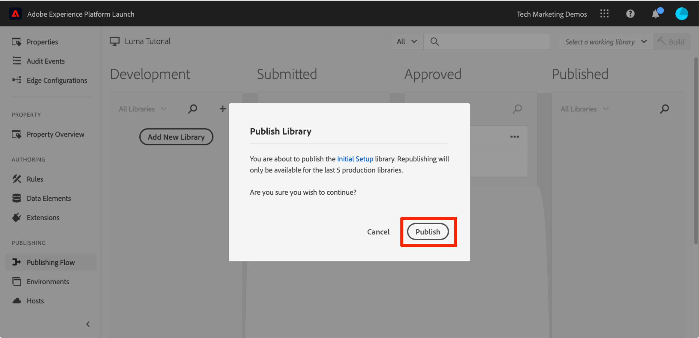

# Publication de la propriété de balise

Maintenant que vous avez mis en œuvre certaines solutions clés d’Adobe Experience Cloud dans votre environnement de développement, il est temps d’apprendre le processus de publication.

>[!NOTE]
>
>Adobe Experience Platform Launch est intégré à Adobe Experience Platform comme une suite de technologies destinées à la collecte de données. Plusieurs modifications terminologiques ont été apportées à l’interface que vous devez connaître lors de l’utilisation de ce contenu :
>
> * Le platform launch (côté client) est désormais **[[!DNL tags]](https://experienceleague.adobe.com/docs/experience-platform/tags/home.html?lang=fr)**
> * Le platform launch côté serveur est désormais **[[!DNL event forwarding]](https://experienceleague.adobe.com/docs/experience-platform/tags/event-forwarding/overview.html?lang=fr)**
> * Les configurations Edge sont désormais **[[!DNL datastreams]](https://experienceleague.adobe.com/docs/experience-platform/edge/fundamentals/datastreams.html?lang=fr)**

## Objectifs d’apprentissage

À la fin de cette leçon, vous saurez comment :

1. publier une bibliothèque de développement dans l’environnement d’évaluation ;
1. faire correspondre une bibliothèque d’évaluation à votre site web de production à l’aide du débogueur ;
1. publier une bibliothèque d’évaluation dans l’environnement de production.

## Publication dans l’environnement d’évaluation

Maintenant que vous avez créé et validé votre bibliothèque dans l’environnement de développement, il est temps de la publier dans l’environnement d’évaluation.

1. Accédez au **[!UICONTROL Flux de publication]** page

1. Dans la liste déroulante en regard de votre bibliothèque, sélectionnez **[!UICONTROL Envoyer pour approbation]**.

   

1. Cliquez sur le bouton **[!UICONTROL Envoyer]** dans la boîte de dialogue :

   

1. Votre bibliothèque apparaît désormais dans la colonne [!UICONTROL Envoyé] à l’état non créée :

1. Ouvrez la liste déroulante et sélectionnez **[!UICONTROL Créer à des fins d’évaluation]** :

   

1. Lorsque l’icône en forme de point vert s’affiche, la bibliothèque peut être prévisualisée dans l’environnement d’évaluation.

Dans un scénario réel, l’étape suivante du processus consisterait à demander aux membres de votre équipe d’assurance qualité de valider les modifications dans la bibliothèque d’évaluation. Cela est possible à l’aide du débogueur.

**Validation des modifications dans la bibliothèque d’évaluation**

1. Dans la propriété de balise, ouvrez le [!UICONTROL Environnements] page

1. Sur la ligne [!UICONTROL Évaluation], cliquez sur l’icône Installer  pour ouvrir le modal.

   

1. Cliquez sur l’icône Copier  pour copier le code incorporé dans le presse-papiers.

1. Cliquez sur **[!UICONTROL Fermer]** pour fermer le modal.

   

1. Ouvrez le [site de démonstration Luma](https://luma.enablementadobe.com/content/luma/us/en.html) dans votre navigateur Chrome.

1. Ouvrez le [Extension Experience Platform Debugger](https://chromewebstore.google.com/detail/adobe-experience-platform/bfnnokhpnncpkdmbokanobigaccjkpob) en cliquant sur le bouton  icon

   

1. Accédez à l’onglet Outils.

1. Dans le **[!UICONTROL Adobe Launch > Remplacer le code incorporé de Launch]** collez le code incorporé d’évaluation figurant dans le presse-papiers.
1. Activez l’option **[!UICONTROL Appliquez-les sur luma.enablementadobe.com]** switch

1. Cliquez sur l’icône de disquette pour enregistrer.

   

1. Actualisez et consultez l’onglet Résumé du débogueur. Sous la section Launch, vous devriez constater que votre propriété d’évaluation est mise en oeuvre, en indiquant le nom de votre propriété (c’est-à-dire &quot;Tutoriel sur les balises&quot; ou tout autre élément que vous avez appelé votre propriété).

   

En situation réelle, une fois que l’équipe d’assurance qualité a examiné et validé les modifications dans l’environnement d’évaluation, il est temps de publier la propriété dans l’environnement de production.

## Publication dans l’environnement de production

1. Accédez à la page [!UICONTROL Publication].

1. Dans la liste déroulante, cliquez sur **[!UICONTROL Approuver pour publication]** :

   

1. Cliquez sur le bouton **[!UICONTROL Approuver]** dans la boîte de dialogue :

   

1. La bibliothèque apparaît désormais dans la colonne [!UICONTROL Approuvé] à l’état non créée (point jaune) :

1. Dans la liste déroulante, sélectionnez **[!UICONTROL Créer et publier dans l’environnement de production]** :

   

1. Cliquez sur **[!UICONTROL Publier]** dans la boîte de dialogue :

   

1. La bibliothèque s’affiche désormais dans la colonne [!UICONTROL Publié] :

   

Vous avez terminé. Vous avez terminé le tutoriel et publié votre première propriété dans les balises !
