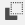
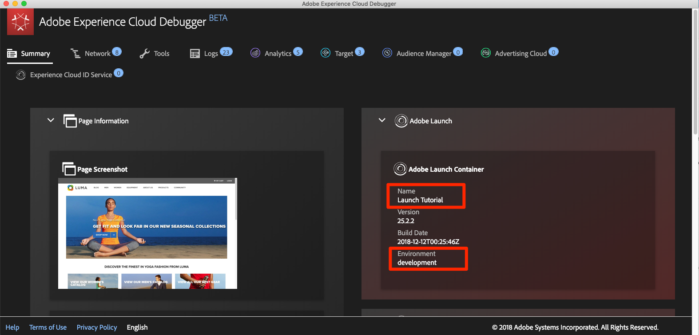

# Changement d’environnements de balises avec l’Experience Cloud Debugger

Dans cette leçon, vous allez utiliser l’extension [Adobe Experience Platform Debugger](https://chromewebstore.google.com/detail/adobe-experience-platform/bfnnokhpnncpkdmbokanobigaccjkpob) pour remplacer la propriété de balise codée en dur sur le site de démonstration [Luma](https://luma.enablementadobe.com/content/luma/us/en.html) par votre propre propriété.

>[!WARNING]
>
> Ce tutoriel et les exercices de son site web Luma ne sont plus conservés et reposent sur d’anciennes bibliothèques JavaScript. Pour connaître les bonnes pratiques en vigueur, suivez le tutoriel [Implémentation de Adobe Experience Cloud avec Web SDK](https://experienceleague.adobe.com/fr/docs/platform-learn/implement-web-sdk/overview).

Cette technique, appelée commutation d’environnement, s’avérera utile ultérieurement, lorsque vous utiliserez les balises sur votre propre site web. Vous pourrez charger votre site web de production dans votre navigateur, mais avec votre environnement de balises *de développement*. Vous pouvez ainsi apporter et valider en toute confiance des modifications aux balises, indépendamment des versions de code standard.  Après tout, cette séparation entre les versions de balises marketing et les versions de code standard est l’une des principales raisons pour lesquelles les clients utilisent les balises.

## Objectifs d’apprentissage

À la fin de cette leçon, vous saurez comment :

* Utiliser Debugger pour charger un autre environnement de balises
* Utilisez Debugger pour vérifier que vous avez chargé un autre environnement de balises

## Obtention de l’URL de votre environnement de développement

1. Dans la propriété de balise, ouvrez la page de `Environments`

1. Dans la ligne **[!UICONTROL Développement]**, cliquez sur l’icône Installer  pour ouvrir la boîte de dialogue modale

1. Cliquez sur l’icône Copier  pour copier le code intégré dans le presse-papiers.

1. Cliquez sur **[!UICONTROL Fermer]** pour fermer la fenêtre modale

   

## Remplacez l’URL de balise sur le site de démonstration de Luma.

1. Ouvrez le [site de démonstration Luma](https://luma.enablementadobe.com/content/luma/us/en.html) dans votre navigateur Chrome.

1. Ouvrez l’extension [Experience Platform Debugger](https://chromewebstore.google.com/detail/adobe-experience-platform/bfnnokhpnncpkdmbokanobigaccjkpob) en cliquant sur l’icône 

   

1. Notez que la propriété de balise actuellement implémentée s’affiche dans l’onglet Résumé .

   

1. Accédez à l’onglet Outils.
1. Faites défiler jusqu’à la section **[!UICONTROL Remplacer le code intégré de Launch]**
1. Assurez-vous que le focus se trouve sur l’onglet Chrome avec le site Luma derrière le débogueur (et non sur l’onglet avec ce tutoriel ou sur l’onglet avec l’interface de collecte de données).  Collez le code intégré présent dans le presse-papiers dans le champ de saisie.
1. Activez la fonction « Appliquer à travers luma.enablementadobe.com » pour que toutes les pages du site Luma soient mappées à votre propriété de balise.
1. Cliquez sur le bouton **[!UICONTROL Enregistrer]**

   

1. Chargez à nouveau le site Luma et vérifiez l’onglet Résumé du débogueur. Sous la section Launch, vous devriez constater que votre propriété de développement est en cours d’utilisation. Vérifiez que le nom de la propriété correspond à celui de la vôtre et que l’environnement indique « development ».

   

>[!NOTE]
>
>Le débogueur enregistre cette configuration et remplace les codes incorporés de balise à chaque fois que vous revenez sur le site Luma. Cela n’a aucune incidence sur les autres sites que vous visitez dans les autres onglets ouverts. Pour empêcher le débogueur de remplacer le code incorporé, cliquez sur le bouton **[!UICONTROL Supprimer]** en regard du code incorporé dans l’onglet Outils du débogueur.

Au fur et à mesure que vous poursuivrez le tutoriel, vous utiliserez cette technique de mappage du site Luma à votre propre propriété de balise pour valider votre implémentation de balise. Lorsque vous commencez à utiliser des balises sur votre site web de production, vous pouvez utiliser cette même technique pour valider les modifications.

[Suite : « Ajout du service Adobe Experience Platform Identity » >](id-service.md)
